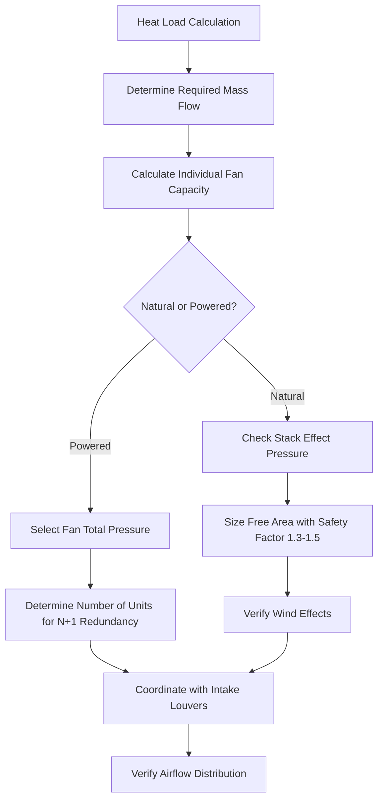

## Physics of Roof-Mounted Heat Removal

Roof ventilators provide the critical upper boundary condition for turbine hall ventilation systems, exhausting the substantial heat loads that accumulate at high elevations due to thermal stratification. The selection between gravity (natural) and powered (mechanical) ventilators fundamentally depends on the balance between available thermal buoyancy forces and required volumetric flow rates.

## Stack Effect Fundamentals

The driving force for natural ventilation in tall turbine halls arises from the density difference between hot indoor air and cooler outdoor air. The available pressure differential follows the hydrostatic relationship:

$$\Delta P = \rho_o g H - \rho_i g H = g H (\rho_o - \rho_i)$$

Where:
- $\Delta P$ = available static pressure (Pa)
- $g$ = gravitational acceleration (9.81 m/s²)
- $H$ = vertical distance from intake to exhaust (m)
- $\rho_o$ = outdoor air density (kg/m³)
- $\rho_i$ = indoor air density at exhaust level (kg/m³)

Expressing density as a function of temperature using the ideal gas law ($\rho = P/(R T)$):

$$\Delta P = \frac{P g H}{R} \left(\frac{1}{T_o} - \frac{1}{T_i}\right)$$

For typical turbine halls with $H$ = 40-60 m and temperature differences of 10-20°C, available pressures range from 40-120 Pa, sufficient to overcome system resistance when properly designed.

## Gravity Roof Ventilator Design

Natural ventilators operate without mechanical assistance, relying entirely on buoyancy forces. Key performance factors include:

**Aerodynamic Efficiency**
- Wind-driven turbine ventilators: discharge coefficient $C_d$ = 0.50-0.65
- Stationary hood designs: $C_d$ = 0.40-0.55
- Open ridge ventilators: $C_d$ = 0.35-0.50

The achievable flow rate through a gravity ventilator follows:

$$Q = C_d A \sqrt{\frac{2 \Delta P}{\rho}}$$

Where $A$ is the free area of the ventilator opening. For a 60 m tall turbine hall with 15°C temperature difference and ventilators with $C_d$ = 0.55 and total area of 50 m²:

$$\Delta P \approx 80 \text{ Pa}, \quad Q = 0.55 \times 50 \times \sqrt{\frac{2 \times 80}{1.2}} \approx 3180 \text{ m}^3/\text{s}$$

### Wind Effects on Natural Ventilation

Wind introduces both beneficial and detrimental effects on gravity ventilator performance:

| Wind Condition | Effect on Ventilator | Pressure Contribution |
|---|---|---|
| Windward side (positive pressure) | Opposes exhaust if at roof | -0.5 to -0.8 × $\rho v^2/2$ |
| Leeward side (negative pressure) | Assists exhaust | +0.3 to +0.6 × $\rho v^2/2$ |
| Wind-driven turbine rotation | Enhances discharge coefficient | +10% to +25% to baseline $C_d$ |

Wind pressure coefficient: $P_{wind} = C_p \frac{\rho v^2}{2}$

For reliable natural ventilation design, windward pressure effects must be accommodated. Position ventilators on leeward roof sections or at ridge lines where suction pressures dominate.

## Powered Roof Exhaust Systems

Mechanical roof ventilators employ axial or centrifugal fans to achieve precise control over exhaust rates independent of thermal conditions. Critical design parameters:

**Fan Selection Criteria**
- Total static pressure: 100-250 Pa (including system resistance)
- Volume flow: sized for 8-15 air changes per hour in upper zone
- Motor class: TEFC, Class F insulation minimum for high ambient temperatures
- Materials: corrosion-resistant for outdoor exposure

**Sizing Methodology**

Total heat load to be removed:

$$Q_{total} = Q_{turbine} + Q_{generator} + Q_{solar} + Q_{lighting}$$

Required mass flow rate:

$$\dot{m} = \frac{Q_{total}}{c_p \Delta T_{allowable}}$$

For a turbine hall with 8 MW heat load and allowable 12°C temperature rise:

$$\dot{m} = \frac{8 \times 10^6}{1005 \times 12} = 663 \text{ kg/s} = 553 \text{ m}^3/\text{s}$$

This requires multiple ventilator units for redundancy and staged control.

## Intake Louver Coordination

The pressure drop through inlet louvers directly reduces the available driving force for natural ventilation or increases fan energy consumption. Design principles:

**Pressure Drop Relationship**

$$\Delta P_{louver} = K \frac{\rho v^2}{2}$$

Where $K$ = loss coefficient (typically 1.5-3.0 for weather louvers). To maintain effective natural ventilation:

$$\Delta P_{louver} < 0.3 \times \Delta P_{stack}$$

This constraint limits inlet face velocity to 2-3 m/s for natural systems.

**Airflow Balance**

Intake area must equal or exceed exhaust area when accounting for relative coefficients:

$$A_{intake} \geq A_{exhaust} \times \frac{C_{d,exhaust}}{C_{d,intake}} \times 1.15$$

The 1.15 factor ensures slight negative pressure to prevent air leakage through unintended openings.

## Comparison: Gravity vs. Powered Ventilators

| Parameter | Gravity Ventilators | Powered Ventilators |
|---|---|---|
| Energy consumption | Zero | 15-30 kW per unit (typical) |
| Reliability | No mechanical failure modes | Fan bearing/motor failures possible |
| Flow control | Varies with temperature | Precise VFD control |
| Initial cost | $200-400/m² of throat area | $15,000-40,000 per unit |
| Maintenance | Minimal (inspection only) | Annual bearing service required |
| Winter operation | May require dampers | Easily modulated |
| Response to load changes | Slow (thermal lag) | Fast (< 60 seconds) |

## Redundancy Requirements for Continuous Operation

Power generation facilities demand uninterrupted ventilation to prevent equipment damage from elevated temperatures. NFPA 850 and turbine manufacturer specifications typically require:

**Design Redundancy Strategy**
- N+1 configuration minimum for powered systems (all units at 60-70% capacity)
- N+2 for critical installations or extreme climates
- Emergency backup power for 100% of ventilation capacity
- Redundant control systems with automatic failover

**Natural Ventilation Redundancy**

Gravity systems achieve inherent redundancy through distributed area—partial blockage of individual units does not eliminate flow. However, motorized dampers (when used) require:
- Fail-open actuators with battery backup
- Manual override capability
- Dual power sources for control systems

## Hybrid Systems

Modern turbine halls increasingly employ hybrid approaches combining gravity ventilators for base load with powered units for peak conditions:

**Operating Logic**
1. Summer/high load: all powered units operating, gravity units open
2. Moderate conditions: powered units modulated, gravity provides partial flow
3. Cool ambient: gravity only with powered units off, inlet dampers modulated

This approach minimizes energy consumption while maintaining reliability, typically reducing annual fan energy by 40-60% compared to fully powered systems.

## Performance Verification

ASHRAE Standard 111 provides testing protocols for ventilator capacity verification. Key measurements:

- Volumetric flow: pitot tube traverse or anemometer grid at throat
- Temperature stratification: vertical temperature profile at multiple locations
- Static pressure: differential between indoor (at ceiling) and outdoor
- Intake-exhaust balance: tracer gas dilution testing

Acceptance criteria: measured flow ≥ 90% of design, maximum temperature at equipment level within specification (typically 40-45°C).

## References

- ASHRAE Handbook—HVAC Applications, Chapter 28: Power Plants
- NFPA 850: Recommended Practice for Fire Protection for Electric Generating Plants
- AMCA Publication 500: Laboratory Methods of Testing Dampers for Rating
- ISO 5167: Measurement of Fluid Flow by Means of Pressure Differential Devices
