Paper curl represents one of the most persistent quality defects in printing operations, arising from moisture content differentials that induce asymmetric dimensional changes through paper thickness. Curl disrupts feeding mechanisms, degrades registration accuracy, and creates handling difficulties. Understanding curl mechanics from fundamental fiber hygroscopic behavior enables effective HVAC-based prevention strategies.

## Curl Formation Mechanics

Paper curl originates from differential expansion or contraction between paper surfaces, creating internal stress gradients that bend the sheet. Cellulose fibers exhibit pronounced hygroscopic behavior—they absorb moisture from high-humidity air and release moisture to low-humidity environments.

### Fiber Swelling Physics

Cellulose fiber dimensional change follows predictable moisture-content relationships. When fibers absorb water molecules, hydrogen bonding sites between cellulose chains are disrupted and replaced with cellulose-water bonds. This molecular insertion forces fiber expansion, predominantly in the transverse (cross-grain) direction.

Fiber swelling follows:

$$
\frac{\Delta L}{L_0} = \alpha \cdot \Delta MC
$$

Where:
- $\Delta L/L_0$ = fractional dimensional change
- $\alpha$ = hygroscopic expansion coefficient (0.15-0.25 for cross-grain, 0.015-0.025 for grain direction)
- $\Delta MC$ = moisture content change (%)

A 2% moisture content increase produces approximately 0.3-0.5% cross-grain expansion but only 0.03-0.05% grain-direction expansion—a 10:1 anisotropy ratio.

### Through-Thickness Moisture Gradients

Curl intensity depends on the moisture content differential between paper surfaces. When one surface is exposed to higher relative humidity than the opposite surface, moisture diffuses through paper thickness following Fick's second law:

$$
\frac{\partial C}{\partial t} = D \frac{\partial^2 C}{\partial z^2}
$$

Where:
- $C$ = moisture concentration (g/m³)
- $t$ = time (s)
- $D$ = moisture diffusion coefficient (m²/s)
- $z$ = position through thickness (m)

Paper diffusion coefficients range from 1×10⁻¹⁰ to 5×10⁻¹⁰ m²/s depending on basis weight and coating. A 0.005-inch (127 μm) sheet requires 20-60 minutes to reach moisture equilibrium, while a 0.012-inch (305 μm) sheet requires 120-240 minutes.

### Curl Radius Calculation

The radius of curvature resulting from moisture differential can be approximated:

$$
R = \frac{h}{6 \alpha \Delta MC_{diff}}
$$

Where:
- $R$ = radius of curvature (mm)
- $h$ = paper thickness (mm)
- $\alpha$ = hygroscopic expansion coefficient
- $\Delta MC_{diff}$ = moisture content difference between surfaces (%)

A 0.005-inch (0.127 mm) sheet with 1% moisture differential between surfaces produces a curl radius of approximately 30-50 mm—severe curl visible as pronounced sheet warping.

```mermaid
graph TB
    subgraph "Curl Formation Process"
        A[Uniform Paper Sheet<br/>Equilibrium Moisture Content] --> B{Humidity Exposure<br/>Differential}
        B --> C[Top Surface: High RH<br/>Moisture Absorption]
        B --> D[Bottom Surface: Low RH<br/>Moisture Desorption]
        C --> E[Top Surface Expansion<br/>Fiber Swelling]
        D --> F[Bottom Surface Contraction<br/>Fiber Shrinkage]
        E --> G[Internal Stress Development<br/>Asymmetric Strain]
        F --> G
        G --> H[Sheet Bending<br/>Curl Toward Dry Surface]
    end

    subgraph "Moisture Diffusion Through Thickness"
        I[Surface 1: High RH] -->|Absorption| J[Moisture Gradient<br/>Through Paper]
        J -->|Diffusion| K[Surface 2: Low RH]
        J --> L[Time-Dependent<br/>Equilibration]
    end

    subgraph "Curl Prevention Strategy"
        M[Uniform Environment<br/>±2% RH Control] --> N[Eliminate Surface<br/>RH Differential]
        N --> O[Uniform Through-Thickness<br/>Moisture Content]
        O --> P[Zero Curl<br/>Sheet Flatness Maintained]
    end

    style H fill:#ff9999
    style P fill:#99ff99
```

## Curl Type Classification

Different environmental conditions and material handling practices produce distinct curl patterns, each requiring specific control approaches.

### Curl Type Comparison

| Curl Type | Mechanism | Time Scale | Severity | Reversibility | Primary Control Method |
|-----------|-----------|------------|----------|---------------|------------------------|
| **Moisture differential curl** | Surface RH difference creates expansion gradient | 15-60 minutes | Moderate to severe | Fully reversible | Uniform RH throughout space |
| **Edge curl** | Exposed sheet edges equilibrate faster than interior | 30-120 minutes | Moderate | Partially reversible | Edge protection, rapid use after unwrapping |
| **Coating-side curl** | Coated surface has different hygroscopic response | 20-90 minutes | Mild to moderate | Partially reversible | Two-sided humidity exposure |
| **Hysteresis curl** | Absorption/desorption path difference | Hours to days | Mild | Not reversible | Prevent RH cycling |
| **Manufacturing curl** | Built-in stress from production | Permanent | Mild | Not reversible | Paper selection, proper conditioning |
| **Thermal curl** | Temperature differential induces moisture migration | 10-45 minutes | Mild to moderate | Reversible upon cooling | Uniform temperature distribution |

### Moisture Differential Curl

The most common curl type in printing operations results from exposing paper surfaces to different relative humidity conditions. This occurs when:

- Top of stack exposed to different RH than bottom (vertical humidity gradients)
- One side faces conditioned space while other faces unconditioned area
- Printing process applies moisture to one surface (fountain solution in lithography)
- Heated rollers or dryers create temperature differentials

Paper curls toward the drier surface because the wetter surface expands more, creating convex curvature on the high-moisture side.

**Moisture differential magnitude:**

$$
\Delta MC = k (RH_1 - RH_2)
$$

Where:
- $k$ = moisture sensitivity coefficient (typically 0.10-0.15% MC per % RH)
- $RH_1, RH_2$ = relative humidity at surfaces 1 and 2 (%)

A 10% RH difference between surfaces produces approximately 1.0-1.5% moisture content differential, creating noticeable curl in sheets thinner than 0.010 inch.

### Edge Curl

Sheet edges equilibrate with ambient conditions much faster than interior areas due to higher surface-area-to-volume ratio. When paper is unwrapped, edges absorb or desorb moisture within minutes while the sheet center requires hours to equilibrate.

Edge curl severity increases with:
- Higher ambient RH deviation from paper equilibrium condition
- Thinner paper (faster edge equilibration)
- Longer exposure time between unwrapping and use
- Greater difference between storage and use environment

**Edge equilibration time:**

$$
t_{edge} \approx \frac{w^2}{4D}
$$

Where:
- $t_{edge}$ = time to reach 63% equilibration (s)
- $w$ = edge width dimension (m)
- $D$ = moisture diffusion coefficient (m²/s)

A 1-inch (25 mm) edge width equilibrates in approximately 20-40 minutes, while the sheet center may require 4-8 hours.

### Coating-Side Curl

Coated papers exhibit different moisture response between coated and uncoated sides. Clay or polymer coatings reduce moisture penetration rate and alter hygroscopic expansion coefficient. This creates asymmetric response even under uniform environmental exposure.

One-side coated papers inherently curl toward the coating side when exposed to high humidity (coating restrains fiber expansion) and toward the uncoated side when exposed to low humidity (coating prevents moisture loss).

## Curl Prevention Strategies

Effective curl control requires eliminating the moisture differentials that drive curl formation. HVAC system design and operational practices provide primary control.

### Environmental Uniformity

Maintaining uniform relative humidity throughout paper storage, conditioning, and printing areas eliminates the driving force for moisture differential curl.

**Critical uniformity requirements:**

**Spatial uniformity:** ±2% RH maximum variation between any two locations in paper handling area. This requires:
- Adequate air mixing to eliminate stratification
- Multiple humidification/dehumidification points for large spaces
- Elimination of unconditioned air infiltration
- Temperature uniformity to prevent RH variation at constant absolute humidity

**Vertical uniformity:** Floor-to-ceiling RH gradient must not exceed 3-5% RH. Natural buoyancy creates warm, dry air at ceiling and cool, moist air at floor. Paper stacks experience different RH conditions at top versus bottom, inducing curl even in "conditioned" spaces with poor mixing.

**Temporal uniformity:** RH variation throughout day/night cycles should remain within ±3% RH. Night setback strategies that save energy by allowing wider temperature/RH swings create curl in stored paper that persists through subsequent printing.

### Paper Handling Protocols

Operational practices minimize moisture differential exposure:

**Minimize unwrapped exposure time:** Paper should remain wrapped until immediately before use. Each hour of unwrapped exposure allows 2-5% edge moisture content change in typical printing environments.

**Two-sided exposure:** When conditioning is required, ensure both paper surfaces experience identical RH exposure. This requires:
- Spacing between stacks for air circulation (minimum 12 inches)
- Periodic stack rotation to equalize exposure
- Avoiding placement against walls or other barriers that prevent airflow

**Rapid press-to-use transfer:** Minimize time between paper conditioning and press feeding. Each hour of delay allows 0.1-0.3% moisture content drift if environmental conditions differ.

**Partial skid coverage:** When partial skids remain overnight, cover exposed sheets with polyethylene film to prevent surface moisture exchange. Uncovered sheets develop 0.5-1.5% surface moisture differential within 8-12 hours.

### Press-Side Humidity Control

Maintaining stable press room conditions prevents curl development during printing:

**Target conditions:** 50% RH ±3%, 72°F ±2°F represents industry standard. This provides:
- Stable paper dimensions during multi-pass printing
- Acceptable ink drying characteristics
- Comfortable operator conditions
- Reasonable humidification energy consumption

**Localized humidity control:** Large press rooms benefit from zone control allowing ±2% RH near active presses while maintaining ±5% RH in storage areas. This focuses tighter control where curl has immediate impact.

**Fountain solution management:** Lithographic printing applies water-based fountain solution to paper surface, creating moisture differential. Control requires:
- Minimum fountain solution application consistent with print quality
- Rapid drying between color stations
- Temperature control of fountain solution (50-60°F)
- RH adjustment to compensate for moisture addition

### Material Selection

Curl sensitivity varies substantially between paper types:

**Coated versus uncoated:** Coated papers exhibit 30-50% less curl than uncoated grades due to coating restraint of fiber swelling. Specify coated papers for applications sensitive to curl.

**Fiber orientation:** Paper manufactured with random fiber orientation (low grain prominence) shows more uniform dimensional response and reduced curl tendency compared to highly oriented sheets.

**Basis weight:** Heavier papers (higher caliper) develop less curl for equivalent moisture differential because thickness $h$ appears in denominator of curl radius equation. Curl radius increases proportionally with thickness.

**Moisture resistance:** Papers manufactured with sizing treatments that reduce moisture absorption show lower curl sensitivity. Hygroscopic expansion coefficient decreases 20-40% with proper internal sizing.

## Sheet Flatness Requirements

Different printing processes and end-use applications impose varying flatness tolerances that determine acceptable curl limits.

### Flatness Measurement

Sheet flatness quantification uses curl height measurement:

**Curl height:** Place sheet on flat surface and measure maximum vertical deviation from plane at sheet corners or edges. Acceptable curl height depends on application:

| Application | Maximum Curl Height | Equivalent Curl Radius | RH Control Required |
|-------------|---------------------|------------------------|---------------------|
| Sheetfed offset feeding | 0.25 inch (6 mm) | >500 mm | ±5% RH |
| High-quality commercial printing | 0.12 inch (3 mm) | >1000 mm | ±3% RH |
| Laser printer feeding | 0.10 inch (2.5 mm) | >1200 mm | ±3% RH |
| Photographic printing | 0.06 inch (1.5 mm) | >2000 mm | ±2% RH |
| Packaging lamination | 0.08 inch (2 mm) | >1500 mm | ±3% RH |

**Curl severity classification:**

- **Mild curl:** Curl height <0.12 inch (3 mm). Acceptable for most commercial printing. Develops from 0.3-0.5% moisture differential.
- **Moderate curl:** Curl height 0.12-0.25 inch (3-6 mm). Causes feeding difficulties. Results from 0.5-1.0% moisture differential.
- **Severe curl:** Curl height >0.25 inch (6 mm). Prevents automated feeding. Requires >1.0% moisture differential.

### Flatness Recovery

Curl reversibility depends on mechanism:

**Moisture differential curl:** Fully reversible. Exposing curled sheets to uniform conditions allows moisture redistribution and stress relaxation. Recovery time equals 2-3 times the curl development time.

**Hysteresis curl:** Partially reversible. Paper exhibits different dimensional response during moisture absorption versus desorption due to cellulose microstructure changes. Residual curl of 20-40% original magnitude persists after humidity cycling.

**Mechanical flattening:** Pressing curled sheets flat while at equilibrium moisture content can reduce curl 50-70%, but residual stress remains unless moisture uniformity is achieved.

## HVAC System Design for Curl Prevention

HVAC system configuration directly impacts curl control capability through humidity distribution uniformity and response speed.

### Air Distribution Design

Uniform humidity delivery requires careful air distribution:

**Mixing effectiveness:** Calculate air change effectiveness (ACE) to verify mixing:

$$
ACE = \frac{C_{supply} - C_{exhaust}}{C_{supply} - C_{occupied}}
$$

Where:
- $C$ represents humidity ratio at indicated location
- Target ACE >0.9 for excellent mixing
- ACE <0.7 indicates poor mixing with stratification risk

**Diffuser selection:** Low-velocity ceiling diffusers with high induction ratios provide superior mixing. Target discharge velocity <500 fpm with throw reaching 75% of distance to opposite wall or nearest obstruction.

**Return air placement:** Position returns to create circulation patterns that sweep entire space. Avoid short-circuiting between supply and return that leaves dead zones.

### Humidification System Integration

Humidification delivery method affects uniformity:

**Distributed humidification:** Multiple humidification points throughout space provide faster response and better uniformity than single central humidifier. Use one humidifier per 5,000-10,000 ft² floor area.

**In-duct versus space humidification:** In-duct humidification (in air handler or supply duct) provides better distribution but slower response. Space humidification offers rapid local control but risks non-uniform distribution.

**Absorption distance requirement:** Water vapor from humidifiers requires 10-15 feet of airflow travel distance to fully evaporate and mix with airstream. Shorter distances risk condensation and local over-humidification.

### Control Strategy

Humidity control precision determines curl prevention effectiveness:

**Sensor placement:** Install humidity sensors in representative locations avoiding:
- Direct sunlight exposure that creates measurement error
- Near humidifiers where local humidity exceeds space average
- Dead zones with poor air circulation

**Control algorithm:** Proportional-integral-derivative (PID) control provides superior performance over simple on-off control. Properly tuned PID maintains ±2% RH under load changes.

**Dew point versus RH control:** Dew point control measures absolute moisture content independent of temperature variations. This prevents RH fluctuations when temperature varies ±2-3°F during normal operation.

### Monitoring and Verification

Verify HVAC system performance through comprehensive monitoring:

**Multiple sensor deployment:** Install sensors at multiple heights and locations to map humidity distribution. Minimum one sensor per 3,000 ft² floor area plus vertical array to detect stratification.

**Data logging:** Continuous recording of temperature and humidity at 5-15 minute intervals reveals patterns invisible to instantaneous readings. Identify daily cycles, setback recovery issues, and equipment malfunctions.

**Paper moisture content verification:** Direct measurement of paper moisture content using calibrated moisture meters provides ground truth verification that HVAC control achieves intended paper conditioning.

## Troubleshooting Curl Problems

Systematic diagnosis identifies curl root causes:

**Step 1: Verify environmental uniformity**
- Measure RH at multiple locations and heights
- Identify gradients exceeding ±3% RH
- Check for infiltration sources (loading doors, unconditioned adjacent spaces)

**Step 2: Assess temporal stability**
- Review logged data for RH variations during previous 48-72 hours
- Identify setback periods or equipment cycling
- Evaluate outdoor condition impacts

**Step 3: Examine paper handling**
- Determine time between unwrapping and use
- Verify conditioning time adequacy
- Check storage area conditions versus press room conditions

**Step 4: Measure paper moisture content**
- Measure moisture content of curled sheets
- Compare to target equilibrium moisture content
- Identify surface-to-surface or edge-to-center differentials

**Step 5: Evaluate material properties**
- Review paper specifications for curl resistance
- Consider grain direction effects
- Assess coating influence

This systematic approach isolates controllable environmental factors from material or process limitations, enabling targeted corrective action.

Curl control through precise humidity management represents essential HVAC system performance in printing operations. Understanding moisture-driven fiber mechanics and implementing uniform environmental control eliminates curl as a quality defect source while supporting consistent printing registration and handling efficiency.
