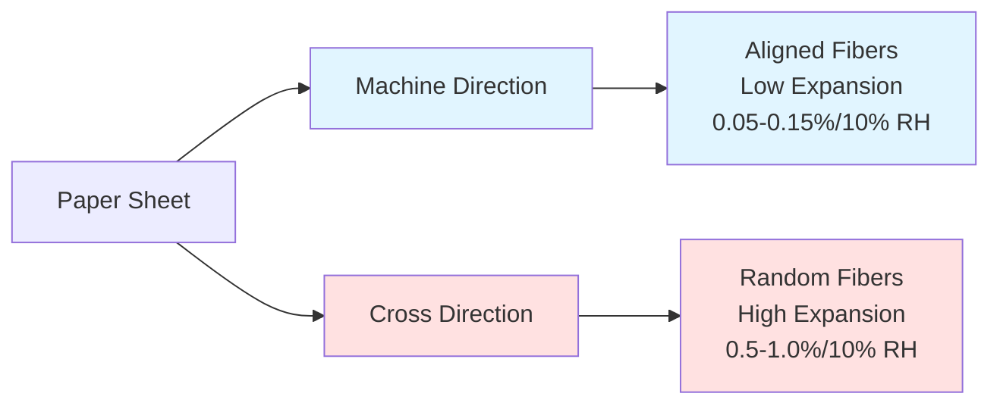
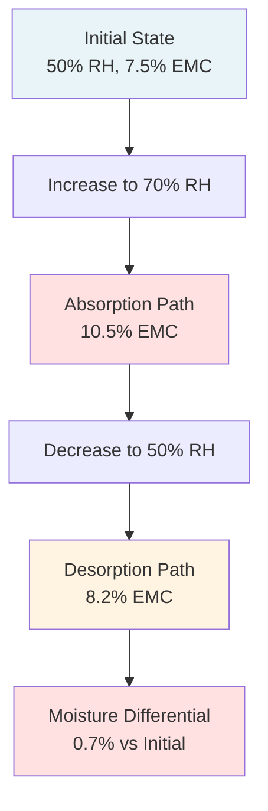

Paper dimensional stability represents the foundational requirement for multi-color printing registration accuracy. Cellulose fiber hygroscopicity causes predictable dimensional changes with environmental moisture variations, directly affecting print quality in precision applications. Understanding moisture-dimension physics enables proper environmental control design to maintain the tight tolerances required for modern printing processes.

## Hygroscopic Behavior of Paper

Paper consists of cellulose fibers that exhibit hygroscopic behavior—the ability to absorb or desorb moisture in response to ambient humidity changes. This molecular-level moisture exchange drives macroscopic dimensional changes.

### Molecular Mechanisms

Cellulose fiber moisture absorption occurs through three mechanisms:

**Monomolecular adsorption:** Water molecules form hydrogen bonds with hydroxyl groups on cellulose surfaces at low RH (<20%). Contributes 2-3% moisture content with minimal dimensional change.

**Multimolecular adsorption:** Additional water layers build on initial monomolecular layer at moderate RH (20-60%). Fiber diameter increases as water molecules separate cellulose chains. Produces 4-8% moisture content with measurable dimensional change.

**Capillary condensation:** Water fills microscopic voids between fibers at high RH (>60%). Generates 8-12% moisture content with maximum swelling.

The sorption isotherm describes this relationship:

$$EMC = A + B \cdot \ln(1 - RH/100)$$

Where:
- $EMC$ = equilibrium moisture content (%)
- $A, B$ = empirical constants for paper type
- $RH$ = relative humidity (%)

Typical coated offset paper: $A = 18.2$, $B = -4.8$

### Fiber Orientation Effects

Paper manufacturing creates preferential fiber alignment in the machine direction (MD), producing anisotropic dimensional behavior. Cross-machine direction (CD) contains more randomly oriented fibers that respond more dramatically to moisture changes.

The expansion ratio between CD and MD typically ranges from 6:1 to 10:1, depending on paper formation and calendering.

## Hygroexpansion Coefficient

The hygroexpansion coefficient quantifies dimensional change per unit RH change, analogous to thermal expansion coefficients.

### Definition and Measurement

Hygroexpansion coefficient $\alpha_H$ relates dimensional change to moisture change:

$$\frac{\Delta L}{L_0} = \alpha_H \cdot \Delta RH$$

Where:
- $\Delta L$ = dimensional change (inch)
- $L_0$ = original dimension (inch)
- $\alpha_H$ = hygroexpansion coefficient (%/% RH)
- $\Delta RH$ = relative humidity change (%)

Standard measurement follows TAPPI T 464 at controlled temperature (73°F ± 2°F).

### Typical Coefficient Values

Hygroexpansion coefficients vary significantly with paper grade and fiber orientation:

| Paper Grade | Cross-Direction $\alpha_{H,CD}$ | Machine Direction $\alpha_{H,MD}$ | CD/MD Ratio |
|-------------|--------------------------------|----------------------------------|-------------|
| Coated offset | 0.08-0.12 %/% RH | 0.010-0.015 %/% RH | 8:1 |
| Uncoated offset | 0.10-0.15 %/% RH | 0.012-0.020 %/% RH | 7.5:1 |
| Newsprint | 0.12-0.18 %/% RH | 0.015-0.025 %/% RH | 7:1 |
| Coated label stock | 0.06-0.09 %/% RH | 0.008-0.012 %/% RH | 8.5:1 |
| Paperboard | 0.15-0.25 %/% RH | 0.020-0.035 %/% RH | 7:1 |

Heavier coating weight reduces hygroexpansion by limiting moisture penetration into the paper structure.

### Temperature Dependency

Hygroexpansion coefficients increase with temperature due to enhanced molecular mobility:

$$\alpha_H(T) = \alpha_{H,ref} \cdot [1 + \beta(T - T_{ref})]$$

Where:
- $\alpha_{H,ref}$ = coefficient at reference temperature
- $\beta$ = temperature correction factor (typically 0.015-0.025 /°F)
- $T$ = operating temperature (°F)
- $T_{ref}$ = reference temperature (73°F)

A 10°F temperature increase raises the hygroexpansion coefficient by approximately 15-25%, compounding humidity-induced dimensional variations.

## Dimensional Change Calculations

Precise dimensional change prediction enables tolerance analysis for tight-registration printing processes.

### Single-Axis Expansion

For a paper sheet with dimension $L_0$ exposed to RH change $\Delta RH$:

$$L_{final} = L_0 \cdot (1 + \alpha_H \cdot \Delta RH)$$

$$\Delta L = L_0 \cdot \alpha_H \cdot \Delta RH$$

**Example calculation:**
- Sheet width (CD): $L_0 = 24.000$ inches
- RH change: $\Delta RH = 15\%$ (from 50% to 65% RH)
- Hygroexpansion coefficient: $\alpha_{H,CD} = 0.10\%/\%$ RH

$$\Delta L = 24.000 \times 0.001 \times 15 = 0.360 \text{ inches}$$

This 0.360-inch expansion far exceeds typical registration tolerances of ±0.005 to ±0.010 inches.

### Bi-Directional Analysis

Complete dimensional analysis requires both CD and MD components:

$$\Delta L_{CD} = L_{CD,0} \cdot \alpha_{H,CD} \cdot \Delta RH$$

$$\Delta L_{MD} = L_{MD,0} \cdot \alpha_{H,MD} \cdot \Delta RH$$

The diagonal dimension change for rectangular sheets:

$$\Delta L_{diagonal} = \sqrt{(\Delta L_{CD})^2 + (\Delta L_{MD})^2}$$

### Time-Dependent Moisture Equilibration

Dimensional change follows moisture diffusion kinetics. Fick's second law describes moisture transport through paper thickness:

$$\frac{\partial M}{\partial t} = D \frac{\partial^2 M}{\partial x^2}$$

Where:
- $M$ = local moisture content
- $D$ = moisture diffusivity (typically $1 \times 10^{-6}$ to $5 \times 10^{-6}$ ft²/hr for paper)
- $x$ = thickness coordinate
- $t$ = time

The characteristic equilibration time:

$$\tau = \frac{h^2}{4D}$$

Where $h$ = paper thickness (ft)

For 0.004-inch (0.00033 ft) coated paper with $D = 2 \times 10^{-6}$ ft²/hr:

$$\tau = \frac{(0.00033)^2}{4 \times 2 \times 10^{-6}} = 0.014 \text{ hours} = 50 \text{ seconds}$$

Surface layers equilibrate within minutes, but complete through-thickness equilibration requires hours, creating temporary moisture gradients that induce curl.

## Moisture Content vs RH Relationship

Paper equilibrium moisture content (EMC) follows a sigmoidal relationship with relative humidity, described by sorption isotherms.

### Sorption Isotherm Models

The Guggenheim-Anderson-de Boer (GAB) model provides accurate EMC prediction:

$$EMC = \frac{M_0 \cdot C \cdot K \cdot (RH/100)}{[1 - K \cdot (RH/100)][1 + (C-1) \cdot K \cdot (RH/100)]}$$

Where:
- $M_0$ = monolayer moisture content (typically 4-6%)
- $C$ = sorption energy constant (5-15)
- $K$ = multilayer constant (0.7-0.95)

Simplified linear approximation for operational range (30-70% RH):

$$EMC \approx 0.10 \cdot RH + 2.5$$

### Practical EMC Values

Equilibrium moisture content for typical printing papers:

| Relative Humidity | EMC (Coated Paper) | EMC (Uncoated Paper) | Dimensional State |
|-------------------|-------------------|---------------------|-------------------|
| 20% RH | 4.0% | 4.8% | Contracted |
| 30% RH | 5.5% | 6.2% | Slightly contracted |
| 40% RH | 6.5% | 7.4% | Nominal |
| 50% RH | 7.5% | 8.5% | Reference |
| 60% RH | 9.0% | 10.0% | Slightly expanded |
| 70% RH | 10.5% | 11.8% | Expanded |
| 80% RH | 12.5% | 14.0% | Highly expanded |

Standard reference conditions (73°F, 50% RH) establish baseline dimensions for specification purposes per ANSI/NPES HR 3.1.

### Hysteresis Effects

Paper exhibits sorption hysteresis—different moisture content during absorption versus desorption at identical RH. This occurs due to structural rearrangement of cellulose chains during moisture cycling.

Hysteresis magnitude ranges from 0.5-1.5% moisture content, producing 0.05-0.15% residual dimensional change. This effect necessitates stable environmental conditions rather than cyclic variations.

## Tight Tolerance Requirements

Modern multi-color printing processes demand registration accuracy that requires correspondingly tight environmental control.

### Registration Error Budget

Total registration error derives from multiple sources:

$$\epsilon_{total} = \sqrt{\epsilon_{paper}^2 + \epsilon_{press}^2 + \epsilon_{alignment}^2 + \epsilon_{stretch}^2}$$

Where:
- $\epsilon_{paper}$ = paper dimensional variation
- $\epsilon_{press}$ = press mechanical tolerance
- $\epsilon_{alignment}$ = plate/blanket alignment error
- $\epsilon_{stretch}$ = web/sheet tension effects

Paper dimensional variation typically contributes 40-60% of total registration error budget.

### Process-Specific Tolerances

Different printing processes require specific dimensional stability:

| Printing Process | Registration Tolerance | Allowable Paper Change | Required RH Control |
|------------------|----------------------|----------------------|---------------------|
| Precision sheetfed offset | ±0.005 inch | <0.020% | ±2% RH |
| Commercial sheetfed offset | ±0.010 inch | <0.040% | ±3% RH |
| Heatset web offset | ±0.015 inch | <0.060% | ±5% RH |
| Publication gravure | ±0.008 inch | <0.035% | ±3% RH |
| Packaging flexography | ±0.020 inch | <0.080% | ±5% RH |
| Security printing | ±0.003 inch | <0.012% | ±1% RH |

### Calculating RH Tolerance from Registration Requirements

For a given registration tolerance $\epsilon_{allow}$ and sheet dimension $L$:

$$\alpha_H \cdot \Delta RH_{max} \leq \frac{\epsilon_{allow}}{L}$$

$$\Delta RH_{max} \leq \frac{\epsilon_{allow}}{L \cdot \alpha_H}$$

**Example for 24-inch precision printing:**
- Registration tolerance: $\epsilon_{allow} = ±0.005$ inch
- Sheet width: $L = 24$ inches
- Hygroexpansion coefficient: $\alpha_H = 0.10\%/\%$ RH = 0.001/% RH

$$\Delta RH_{max} \leq \frac{0.005}{24 \times 0.001} = 2.1\% \text{ RH}$$

This analysis indicates ±2% RH control requirement for dimensional stability alone, tightening to ±1.5% RH when combined with other error sources.

## Environmental Conditioning Strategies

Maintaining dimensional stability requires comprehensive environmental control throughout the paper handling chain.

### Pre-Press Conditioning

Paper requires 24-72 hours conditioning to reach moisture equilibrium with press room conditions:

**Storage-to-press conditioning protocol:**
1. Verify paper delivery conditions (typically 35-45% RH in winter, 60-70% RH in summer)
2. Calculate required conditioning time: $t = 2\tau \cdot \ln(10)$ for 90% equilibration
3. Expose paper edges by removing outer wrap 24+ hours before use
4. Maintain conditioning space at press room setpoint ±2°F, ±2% RH
5. Monitor paper moisture content with handheld meter (target ±0.5% of press room EMC)

**Conditioning time by paper thickness:**
- 0.003-inch paper: 24 hours minimum
- 0.004-0.006-inch paper: 36-48 hours
- 0.007-0.010-inch paperboard: 48-72 hours
- >0.010-inch board: 72+ hours

### Press Room Control

Operational dimensional stability requires continuous environmental maintenance:

**Control setpoints for precision printing:**
- Temperature: 72-74°F ±1.5°F
- Relative humidity: 50% ±2% RH
- Dew point: 52-54°F ±1.5°F (preferred control method)
- Air velocity at paper storage: <50 fpm

**Spatial uniformity requirements:**
- Horizontal RH variation: <3% RH across press floor
- Vertical RH gradient: <2% RH from floor to 10 feet elevation
- Temperature stratification: <2°F floor to ceiling

### Real-Time Monitoring

Continuous monitoring enables proactive dimensional control:

**Sensor placement:**
- 1 temperature/humidity sensor per 3,000-5,000 ft² press floor area
- Additional sensors at paper storage locations
- Reference sensor in conditioning room
- Outdoor sensor for system compensation

**Monitoring parameters:**
- Log data at 5-15 minute intervals
- Alert on ±2% RH deviation from setpoint
- Track daily maximum RH swing (<5% for precision work)
- Calculate dew point for absolute moisture trending

**Corrective actions:**
- RH below setpoint: Increase humidification output
- RH above setpoint: Increase cooling/dehumidification or reduce humidification
- Excessive RH swing: Verify HVAC system capacity and control tuning
- Spatial non-uniformity: Evaluate air distribution and adjust diffusers

## Dimensional Stability Verification

Periodic verification confirms environmental control effectiveness in maintaining dimensional stability.

### Paper Dimension Testing

Direct measurement of paper dimensional response:

**Test protocol:**
1. Condition test sheets at 50% RH, 73°F for 24 hours
2. Mark precise measurement points with registration marks
3. Measure dimensions with coordinate measuring system (±0.001 inch accuracy)
4. Expose to process RH variation (±10% RH cycle)
5. Re-measure dimensions at equilibrium
6. Calculate hygroexpansion coefficient from data

**Acceptance criteria:**
- Measured $\alpha_H$ within ±15% of specification value
- CD/MD expansion ratio within expected range (6:1 to 10:1)
- Maximum dimensional change <50% of registration tolerance

### Environmental Performance Validation

HVAC system validation for dimensional stability support:

**Validation tests:**
- 7-day continuous RH recording during production
- Maximum deviation from setpoint: <±2% RH for precision work
- Maximum 24-hour RH swing: <5% RH
- Recovery time from upset: <2 hours to ±1% RH
- Spatial survey: RH variation <3% RH across press floor

**Seasonal verification:**
- Winter testing during peak heating load (January-February)
- Summer testing during peak cooling load (July-August)
- Transition season spot checks (April, October)

Dimensional stability verification provides quantitative evidence of environmental control adequacy for printing quality requirements.

## References and Standards

Industry standards establishing dimensional stability requirements:

**ANSI/NPES HR 3.1-2010:** Standard printing conditions—73°F ±2°F, 50% RH ±5% RH for dimensional reference.

**ISO 12634-1:** Graphic technology—Determination of dimensional stability of printing papers and boards under various conditioning and test atmospheres.

**TAPPI T 402:** Standard conditioning and testing atmospheres for paper, board, and corrugated fiberboard—23°C ±1°C (73.4°F), 50% ±2% RH.

**TAPPI T 464:** Moisture expansion coefficient of paper and paperboard—test method for hygroexpansion measurement.

**GRACoL (General Requirements for Applications in Commercial Offset Lithography):** Specifications including environmental control for dimensional stability in commercial printing.

These standards provide unified dimensional stability criteria across printing operations, enabling consistent quality achievement through proper environmental control design and operation.
