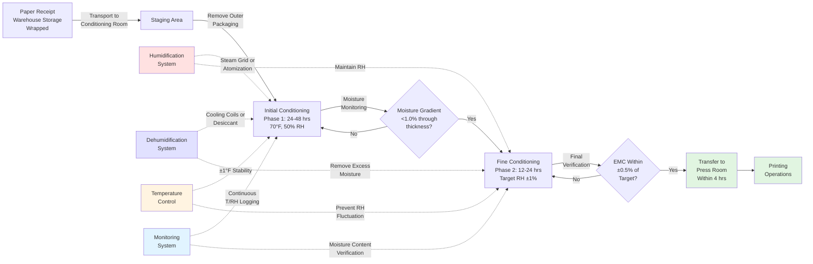

Paper conditioning establishes moisture equilibrium between paper stock and the printing environment before press operation. This process eliminates dimensional changes during printing that compromise registration accuracy, prevent curl formation, and ensure consistent ink transfer. Proper conditioning requires controlled temperature and humidity maintained for sufficient duration to achieve uniform moisture distribution throughout the paper thickness.

## Moisture Equilibrium Physics

Paper reaches equilibrium moisture content when the vapor pressure at the paper surface equals the partial pressure of water vapor in the surrounding air. This equilibrium state follows thermodynamic principles of phase equilibrium.

### Sorption Isotherm Relationship

The equilibrium moisture content (EMC) of paper relates to relative humidity through the sorption isotherm. For cellulose-based papers, the Modified Henderson equation describes this relationship:

$$\text{EMC} = \left[\frac{-\ln(1 - \phi)}{A \cdot T}\right]^{1/B}$$

where:
- EMC = equilibrium moisture content (decimal, dry basis)
- $\phi$ = relative humidity (decimal)
- $T$ = absolute temperature (K)
- $A$ = material constant (1.8 × 10⁻⁵ K⁻¹ for printing papers)
- $B$ = material constant (2.0 for most printing papers)

For practical printing applications, the simplified empirical relationship provides adequate accuracy:

$$\text{EMC} = \frac{K \cdot \phi}{1 - K \cdot \phi}$$

where $K$ is the hygroscopic coefficient (0.08-0.12 for coated papers, 0.12-0.16 for uncoated papers).

At standard printing conditions (70°F, 50% RH):
- Coated offset paper: 5.5-6.5% moisture content
- Uncoated offset paper: 6.5-7.5% moisture content
- Newsprint: 7.5-8.5% moisture content

### Moisture Diffusion Kinetics

Moisture transport through paper thickness follows Fick's second law of diffusion:

$$\frac{\partial M}{\partial t} = D \frac{\partial^2 M}{\partial x^2}$$

where:
- $M$ = local moisture content (%)
- $t$ = time (hours)
- $D$ = moisture diffusivity (cm²/hr)
- $x$ = distance through thickness (cm)

For a paper sheet of thickness $h$ exposed to step change in ambient humidity, the time to reach 95% equilibration is:

$$t_{95} = \frac{0.95 h^2}{\pi^2 D}$$

Typical moisture diffusivity values:
- Coated paper: $D$ = 0.0008-0.0015 cm²/hr
- Uncoated paper: $D$ = 0.0020-0.0040 cm²/hr

A 0.15 mm (0.006 inch) coated sheet requires approximately 12-24 hours to reach 95% equilibrium. Heavier stocks proportionally increase conditioning time by the square of thickness ratio.

## Conditioning Methods and Equipment

Different conditioning approaches suit various production scales and quality requirements. Method selection depends on throughput, space availability, and registration tolerance specifications.

### Conditioning Method Comparison

| Method | Temperature Control | Humidity Control | Conditioning Time | Capital Cost | Suitable Applications |
|--------|---------------------|------------------|-------------------|--------------|----------------------|
| **Dedicated Conditioning Room** | ±1°F | ±2% RH | 48-72 hrs | High ($$$) | High-quality multicolor, tight registration requirements |
| **In-Line Conditioning Chamber** | ±2°F | ±3% RH | 24-48 hrs | Medium ($$) | Commercial printing, moderate volume |
| **Warehouse Conditioning** | ±3°F | ±5% RH | 72-96 hrs | Low ($) | Long-run work, relaxed tolerances |
| **Rapid Conditioning Cabinet** | ±0.5°F | ±1% RH | 12-24 hrs | Very High ($$$$) | Emergency reconditioning, critical jobs |
| **Press-Side Humidification** | Ambient | ±4% RH | Ongoing | Low ($) | Web offset, continuous feeding |

### Conditioning Equipment Specifications

**Dedicated Conditioning Room:**
- Floor area: 0.15-0.25 ft² per lb daily paper throughput
- Ceiling height: 12-16 feet minimum for skid stacking
- HVAC capacity: 1 ton cooling per 300-400 ft² floor area
- Humidification capacity: 5-8 lb/hr per 10,000 CFM ventilation
- Air changes: 15-25 per hour for uniform distribution
- Insulation: R-19 minimum walls, R-30 ceiling to maintain stability

**In-Line Conditioning Chamber:**
- Enclosed tunnel with controlled atmosphere
- Residence time: 30-90 minutes at elevated humidity (65-75% RH)
- Heat input: 20-40 BTU/lb paper for accelerated equilibration
- Exit equilibration zone: 10-15 minutes at target conditions
- Dimensional monitoring: laser micrometers for real-time feedback

**Rapid Conditioning Cabinet:**
- Pressurized chamber (0.5-1.0 psig) for faster diffusion
- Precise humidity generation via atomization or steam
- Forced air circulation: 100-200 FPM across paper surfaces
- Temperature control: ±0.5°F via modulating cooling/heating
- Batch capacity: 500-2000 lb typical

## Conditioning Room Design

Effective conditioning room design creates uniform environmental conditions throughout the occupied volume while minimizing operating costs.

### Environmental Control Specifications

**Temperature Control:**
- Setpoint: 70-73°F (industry standard per TAPPI T402)
- Tolerance: ±1°F for precision work, ±2°F for commercial work
- Vertical gradient: <1°F floor to ceiling
- Control method: Modulating cooling with reheat for independent T/RH control

**Relative Humidity Control:**
- Setpoint: 48-52% RH (prevents both curl and brittleness)
- Tolerance: ±2% RH for precision work, ±3% RH for commercial work
- Spatial uniformity: ±3% RH maximum variation within space
- Response time: <30 minutes to correct 5% RH deviation

**Air Distribution:**
- Velocity over paper: 30-50 FPM (prevents surface drying)
- Air changes per hour: 15-25 (ensures uniform mixing)
- Diffuser type: Perforated ceiling panels or low-velocity displacement
- Return air: Floor-level or low-wall returns for thermal stratification control

### Conditioning Chamber Workflow

The conditioning process follows a systematic sequence to ensure complete moisture equilibration:

### Skid Arrangement and Airflow

Proper skid placement within the conditioning room ensures uniform air exposure to all paper surfaces:

**Skid Spacing:**
- Minimum 18 inches between skids for air circulation
- 36 inches from walls to prevent edge effects
- 24 inches from humidification discharge points
- Stagger arrangement to prevent air shadowing

**Stack Configuration:**
- Maximum stack height: 6-8 feet for air penetration
- Rotation schedule: Reposition skids daily for uniform exposure
- Edge exposure: Orient stacks with maximum cross-grain dimension exposed
- Wrapper removal: Progressive unwrapping based on equilibration progress

**Air Circulation Pattern:**
- Overhead supply diffusers with downward laminar flow
- Floor-level returns at room perimeter
- Ceiling fans (optional) for gentle mixing without high local velocities
- Baffles to direct airflow around obstacles and equipment

## Paper Quality and Print Quality Relationships

Proper conditioning directly impacts multiple print quality parameters through moisture content control.

### Dimensional Stability and Registration

Paper dimensional change with moisture content follows the hygroscopic expansion coefficient:

$$\Delta L = L_0 \cdot \alpha_h \cdot \Delta M$$

where:
- $\Delta L$ = dimensional change
- $L_0$ = original dimension
- $\alpha_h$ = hygroscopic expansion coefficient
  - Cross-grain direction: 0.012-0.018 per % moisture change
  - Grain direction: 0.002-0.003 per % moisture change
- $\Delta M$ = moisture content change (%)

For a 24-inch cross-grain dimension with $\alpha_h$ = 0.015:

| Moisture Content Change | Dimensional Change | Registration Impact |
|-------------------------|-------------------|---------------------|
| ±0.5% | ±0.009 inch | Acceptable for most commercial work |
| ±1.0% | ±0.018 inch | Marginal for 4-color work |
| ±2.0% | ±0.036 inch | Unacceptable for multicolor |
| ±3.0% | ±0.054 inch | Severe registration failure |

High-quality 6-color printing requiring ±0.010 inch registration tolerance limits allowable moisture variation to ±0.6%, demanding ±2% RH control in conditioning and press areas.

### Curl Prevention Through Conditioning

Curl results from moisture content differential between paper surfaces. The curl radius relates to moisture gradient:

$$\frac{1}{R} = \frac{6 \alpha_h \Delta M}{h}$$

where:
- $R$ = curl radius
- $h$ = paper thickness
- $\Delta M$ = moisture difference between surfaces

A 0.15 mm thick sheet with 2% moisture differential (top vs. bottom surface) produces a curl radius of 0.4 meters—severe enough to cause feeding problems and registration errors.

**Conditioning prevents curl by:**
- Equalizing moisture content through entire thickness
- Removing moisture gradients inherited from manufacturing or storage
- Stabilizing paper in the same environment as printing operations
- Allowing hysteresis effects to equilibrate before press loading

### Surface Properties and Ink Reception

Paper moisture content affects ink-paper interaction through:

**Surface pH Changes:** Moisture content influences surface pH through dissolution of sizing agents and fillers. Optimal moisture content maintains pH 5.5-7.5 for stable ink setting.

**Surface Energy:** Hygroscopic swelling alters surface roughness and wettability. Properly conditioned paper exhibits contact angles of 75-95° for offset ink, supporting proper dot formation.

**Ink Absorption Rate:** Moisture content controls fiber swelling state, affecting capillary structure and ink penetration. Over-dry paper (<4% moisture) causes excessive dot gain through rapid absorption. Over-moist paper (>9% moisture) prevents proper ink setting, causing set-off.

**Static Charge Accumulation:** Moisture content below 5% elevates surface resistivity above 10¹² ohms, enabling static charge buildup that causes feeding problems and ink transfer defects. Proper conditioning maintains surface resistivity of 10⁹-10¹¹ ohms through adsorbed moisture films.

## Conditioning Verification Methods

Multiple techniques verify conditioning completion before press release:

### Moisture Content Measurement

**Resistance-Type Meters:**
- Principle: Electrical resistance correlates with moisture content
- Range: 4-15% moisture content
- Accuracy: ±0.5% moisture content
- Measurement depth: 0.5-1.0 mm from surface
- Application: Quick field verification

**Capacitance-Type Meters:**
- Principle: Dielectric constant changes with moisture
- Range: 2-20% moisture content
- Accuracy: ±0.3% moisture content
- Measurement depth: Through full thickness (non-contact)
- Application: Continuous monitoring systems

**Gravimetric Verification:**
- Principle: Direct weight measurement before/after oven drying
- Standard: TAPPI T412 (103°C for 3 hours)
- Accuracy: ±0.1% moisture content
- Application: Laboratory reference method

### Dimensional Stability Testing

**Hygroexpansivity Measurement:**
Test sample dimensional response to controlled humidity cycling:
1. Stabilize sample at 50% RH, 73°F for 24 hours
2. Expose to 35% RH for 6 hours, measure dimension
3. Expose to 65% RH for 6 hours, measure dimension
4. Calculate dimensional change per % RH: should be <0.15%

**Curl Evaluation:**
Place 8×8 inch sample on flat surface under standard conditions. Measure maximum vertical deviation of corners from surface:
- Excellent: <2 mm deviation
- Acceptable: 2-5 mm deviation
- Poor: >5 mm deviation (requires reconditioning)

### Environmental Monitoring Documentation

Maintain continuous records demonstrating conditioning compliance:
- Temperature: 15-minute logging intervals
- Relative humidity: 15-minute logging intervals
- Dew point: Calculated from T and RH for absolute moisture verification
- Conditioning duration: Date/time stamps for each skid
- Location mapping: Which sensor zone corresponds to each skid position

Documentation provides quality assurance traceability and enables process optimization through statistical analysis of conditioning effectiveness versus print quality outcomes.

## Seasonal Conditioning Challenges

External climate variations impose different conditioning requirements throughout the year.

### Winter Operations

**Challenge:** Low outdoor humidity requires maximum humidification capacity.

Outdoor air at 0°F and 50% RH contains 0.0004 lb moisture/lb dry air. Heating to 70°F without humidification produces 4% RH—far below paper requirements.

**Required humidification capacity:**

$$\dot{m}_w = \frac{60 Q (\omega_{\text{target}} - \omega_{\text{outdoor}})}{v_{\text{specific}}}$$

where:
- $\dot{m}_w$ = moisture addition rate (lb/hr)
- $Q$ = outdoor air flow rate (CFM)
- $\omega$ = humidity ratio (lb/lb dry air)
- $v_{\text{specific}}$ = specific volume (ft³/lb)

For 10,000 CFM outdoor air ventilation:
- Target conditions: 70°F, 50% RH ($\omega$ = 0.0078)
- Outdoor: 0°F, 50% RH ($\omega$ = 0.0004)
- Required capacity: 56 lb/hr moisture addition

**Winter strategies:**
- Maximize air recirculation (reduce outdoor air to code minimum)
- Preheat outdoor air before humidification for better absorption
- Use steam grid humidifiers for reliable capacity
- Increase conditioning time 25-50% for paper entering from cold storage

### Summer Operations

**Challenge:** High outdoor humidity requires dehumidification to maintain control.

Outdoor air at 90°F and 70% RH contains 0.0196 lb moisture/lb dry air. Cooling to 70°F produces 82% RH—above paper storage limits.

**Required dehumidification:**
- Cooling coil approach: Cool to 50-55°F dew point (removes 0.0090 lb/lb)
- Reheat to 70°F: Achieves 50% RH target
- Energy penalty: ~30% increase in cooling energy consumption

**Summer strategies:**
- Use economizer when outdoor conditions favorable (<60°F, <60% RH)
- Consider desiccant dehumidification for lower energy consumption
- Reduce outdoor air during peak humidity periods
- Monitor for condensation on cold water pipes in conditioning spaces

## Industry Standards and Best Practices

**TAPPI T402:** Standard Conditioning and Testing Atmospheres for Paper, Board, Pulp Handsheets, and Related Products
- Conditioning atmosphere: 73°F ± 2°F, 50% RH ± 2%
- Conditioning time: Minimum 24 hours, until successive weighings differ by <0.25%

**ISO 187:** Paper, Board and Pulps—Standard Atmosphere for Conditioning and Testing
- Standard atmosphere: 23°C ± 1°C, 50% RH ± 2%
- Alternative atmosphere: 23°C ± 1°C, 65% RH ± 2% (tropical conditions)

**ANSI/NPES HR 3.1:** Graphic Technology—Printing Conditions
- Recommends 73°F ± 4°F, 50% RH ± 5% for general printing
- Tighter tolerances (±2°F, ±2% RH) for high-quality multicolor work

**GATF Press Room Guidelines:**
- Maintain same conditions in storage, conditioning, and press areas
- Transfer conditioned paper to press within 4 hours of conditioning completion
- Re-condition paper if exposed to off-spec conditions for >8 hours

These standards provide consistent baseline requirements across different facilities, enabling quality control and supplier-customer agreement on material handling procedures.
