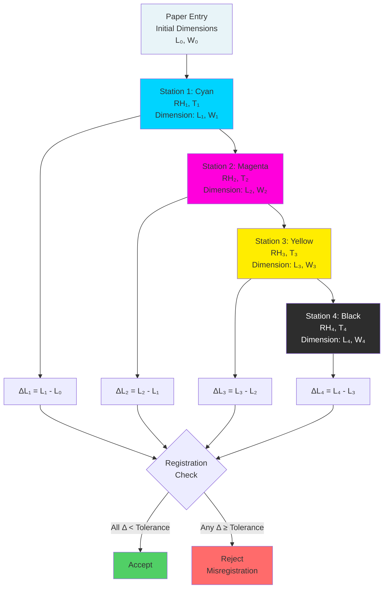

Registration accuracy represents the most demanding requirement in multi-color printing operations. Each successive color impression must align precisely with previous colors to produce sharp, clear images without visible misregistration. Paper dimensional changes from humidity variations constitute the dominant source of registration error, requiring tight environmental control to achieve modern printing quality standards.

## Multi-Color Registration Physics

Multi-color printing processes apply successive ink layers that must align within tolerances of 0.003 to 0.020 inches depending on process and quality requirements. Paper dimensional instability between color impressions creates misregistration visible as color fringing, blurred edges, or incomplete coverage.

### Registration Error Mechanics

Registration error accumulates from multiple independent sources following root-sum-square combination:

$$\epsilon_{total} = \sqrt{\epsilon_{paper}^2 + \epsilon_{press}^2 + \epsilon_{plate}^2 + \epsilon_{tension}^2}$$

Where:
- $\epsilon_{total}$ = total registration error (inch)
- $\epsilon_{paper}$ = paper dimensional variation (inch)
- $\epsilon_{press}$ = mechanical press tolerance (inch)
- $\epsilon_{plate}$ = plate positioning error (inch)
- $\epsilon_{tension}$ = web/sheet tension effects (inch)

Paper dimensional variation from humidity changes typically contributes 50-70% of the total registration error budget in environmentally uncontrolled facilities.

### Color-to-Color Alignment Sequence

Process color printing applies four successive impressions (cyan, magenta, yellow, black) that must register precisely. For a 4-color process:

**First color (cyan):** Establishes baseline dimensional state
**Second color (magenta):** Must align with cyan within tolerance
**Third color (yellow):** Must align with both previous colors
**Fourth color (black):** Must align with all three previous colors

Environmental variation between print stations causes progressive dimensional change, with maximum misregistration occurring between first and last color impressions.

### Paper Dimensional Change Between Stations

The dimensional change between any two print stations follows hygroexpansion mechanics:

$$\Delta L_{i \to j} = L_0 \cdot \alpha_H \cdot (RH_j - RH_i)$$

Where:
- $\Delta L_{i \to j}$ = dimensional change from station $i$ to station $j$ (inch)
- $L_0$ = original sheet dimension (inch)
- $\alpha_H$ = hygroexpansion coefficient (%/% RH)
- $RH_j - RH_i$ = relative humidity difference between stations (%)

For a 24-inch wide sheet (cross-grain direction) with typical coated offset paper ($\alpha_H = 0.10\%/\%$ RH):

**Case 1: 3% RH variation between stations**

$$\Delta L = 24.000 \times 0.001 \times 3 = 0.072 \text{ inches}$$

This exceeds commercial registration tolerance of ±0.010 inch by factor of 7.

**Case 2: 1% RH variation between stations**

$$\Delta L = 24.000 \times 0.001 \times 1 = 0.024 \text{ inches}$$

Still exceeds precision registration tolerance of ±0.005 inch by factor of 5.

**Case 3: 0.5% RH variation (tight control)**

$$\Delta L = 24.000 \times 0.001 \times 0.5 = 0.012 \text{ inches}$$

Approaches acceptable range for commercial work but marginal for precision applications.

## Registration Tolerance Standards

Different printing processes and quality levels demand specific registration accuracies, directly determining required environmental control precision.

### Process-Specific Registration Requirements

| Printing Process | Registration Tolerance | Paper Contribution | Maximum RH Variation* | Typical RH Control |
|------------------|----------------------|-------------------|---------------------|-------------------|
| Security printing | ±0.003 inch | ±0.002 inch | ±0.8% RH | ±1% RH |
| Precision sheetfed offset | ±0.005 inch | ±0.003 inch | ±1.2% RH | ±2% RH |
| Fine art reproduction | ±0.006 inch | ±0.004 inch | ±1.7% RH | ±2% RH |
| Premium commercial printing | ±0.008 inch | ±0.005 inch | ±2.1% RH | ±3% RH |
| Standard commercial offset | ±0.010 inch | ±0.006 inch | ±2.5% RH | ±3% RH |
| Publication gravure | ±0.008 inch | ±0.005 inch | ±2.1% RH | ±3% RH |
| Heatset web offset | ±0.015 inch | ±0.010 inch | ±4.2% RH | ±5% RH |
| Packaging flexography | ±0.020 inch | ±0.012 inch | ±5.0% RH | ±5% RH |

*Calculated for 24-inch sheet width, $\alpha_H = 0.10\%/\%$ RH, assuming paper contributes 60% of total error budget.

### Tolerance Calculation Methodology

For a given registration tolerance requirement $\epsilon_{allow}$, the allowable paper dimensional change allocates typically 50-60% of total tolerance:

$$\epsilon_{paper,max} = 0.5 \text{ to } 0.6 \times \epsilon_{allow}$$

Converting to maximum RH variation for dimension $L$:

$$\Delta RH_{max} = \frac{\epsilon_{paper,max}}{L \cdot \alpha_H}$$

**Example: Precision offset printing, 24-inch sheet**
- Registration tolerance: $\epsilon_{allow} = ±0.005$ inch
- Paper allocation: $\epsilon_{paper,max} = 0.6 \times 0.005 = 0.003$ inch
- Hygroexpansion: $\alpha_H = 0.10\%/\%$ RH = 0.001/% RH
- Sheet width: $L = 24$ inches

$$\Delta RH_{max} = \frac{0.003}{24 \times 0.001} = 1.25\% \text{ RH}$$

This analysis establishes ±1.25% RH maximum variation, typically specified as ±2% RH control with safety factor.

## Humidity-Induced Registration Errors

Paper dimensional changes from environmental humidity variations manifest as specific registration error patterns recognizable during production.

### Common Registration Error Patterns

| Error Pattern | Visual Appearance | Primary Cause | Typical Magnitude | Humidity Relationship |
|---------------|------------------|---------------|-------------------|---------------------|
| Uniform misregistration | All edges equally offset | Overall dimensional change | 0.010-0.100 inch | Linear with RH change |
| Cross-grain expansion | Misregistration perpendicular to grain | CD hygroexpansion | 5-10× MD error | $\propto \alpha_{H,CD} \cdot \Delta RH$ |
| Machine-grain shift | Misregistration parallel to grain | MD hygroexpansion | 0.5-1.5× CD error | $\propto \alpha_{H,MD} \cdot \Delta RH$ |
| Progressive drift | Increasing error through job | Gradual RH change | 0.005-0.050 inch | Time-dependent moisture absorption |
| Diagonal distortion | Both axes misaligned | Non-uniform RH field | Vector sum of CD/MD | Spatial RH gradient |
| Edge vs center variation | Perimeter tight, center loose | Moisture gradient | 0.020-0.080 inch | Through-thickness RH differential |
| Fan-out | Edges expand more than center | Leading edge exposure | 0.010-0.060 inch | Air velocity at sheet edge |

### Mathematical Description of Fan-Out

Fan-out occurs when sheet edges absorb moisture faster than the center, creating non-uniform expansion:

$$\Delta L(x) = L_0 \cdot \alpha_H \cdot \Delta RH(x)$$

Where $\Delta RH(x)$ varies with position $x$ from sheet center:

$$\Delta RH(x) = \Delta RH_{edge} \cdot e^{-x/\lambda}$$

$\lambda$ = penetration depth (typically 2-4 inches from edge)

For a 24-inch wide sheet with edge RH elevated 5% above center:

**Edge expansion (x = 0):**
$$\Delta L_{edge} = 24.000 \times 0.001 \times 5 = 0.120 \text{ inches}$$

**4 inches from edge:**
$$\Delta RH(4) = 5 \times e^{-4/3} = 1.34\% \text{ RH}$$
$$\Delta L(4) = 24.000 \times 0.001 \times 1.34 = 0.032 \text{ inches}$$

This creates 0.088-inch differential expansion producing severe registration distortion.

### Time-Dependent Registration Drift

Registration error changes during production runs due to progressive moisture absorption:

$$\epsilon(t) = \epsilon_{final} \cdot [1 - e^{-t/\tau}]$$

Where:
- $\epsilon(t)$ = registration error at time $t$
- $\epsilon_{final}$ = equilibrium registration error
- $\tau$ = time constant (typically 15-45 minutes for sheet exposure)

For a 10,000-sheet run at 10,000 sheets/hour with ±0.010-inch final error:

**At 15 minutes (2,500 sheets):**
$$\epsilon(15) = 0.010 \times [1 - e^{-15/30}] = 0.0039 \text{ inches}$$

**At 30 minutes (5,000 sheets):**
$$\epsilon(30) = 0.010 \times [1 - e^{-30/30}] = 0.0063 \text{ inches}$$

**At 60 minutes (10,000 sheets):**
$$\epsilon(60) = 0.010 \times [1 - e^{-60/30}] = 0.0086 \text{ inches}$$

This progressive drift causes first sheets to register acceptably while later sheets exceed tolerance, resulting in 50-70% yield loss without environmental stability.

## Tight Environmental Control Requirements

Achieving precision registration demands comprehensive environmental control throughout the printing facility, from paper storage through final delivery.

### Press Area Environmental Specifications

Tight-tolerance printing requires environmental conditions more stringent than general comfort HVAC:

**Temperature control:**
- Setpoint: 72-74°F (security/precision work), 70-75°F (commercial)
- Tolerance: ±1.5°F (precision), ±2.0°F (commercial)
- Maximum rate of change: 2°F/hour
- Spatial uniformity: ±2°F across press floor

**Relative humidity control:**
- Setpoint: 50% RH (standard per ANSI/NPES HR 3.1)
- Tolerance: ±2% RH (precision), ±3% RH (commercial), ±5% RH (standard)
- Maximum rate of change: 3% RH/hour
- Spatial uniformity: ±3% RH across press floor

**Dew point control (preferred method):**
- Setpoint: 52-54°F dew point (equivalent to 50% RH at 73°F)
- Tolerance: ±1.5°F dew point
- Advantage: Absolute moisture measurement independent of temperature fluctuation

### Multi-Pass Press Environmental Challenges

Multi-color presses with separated printing stations create unique environmental control challenges. Each station operates in slightly different thermal conditions due to:

**Heat sources:**
- Electric motors: 1,000-5,000 watts per station
- Bearing friction: 200-800 watts per station
- Ink drying lamps (UV/IR): 5,000-20,000 watts per station
- Blanket wash systems: evaporative cooling effect

**Local environmental gradients:**

Temperature rise from station to station:
$$\Delta T_{station} = \frac{Q_{heat}}{\.{m} \cdot c_p}$$

Where:
- $Q_{heat}$ = heat generation per station (Btu/hr)
- $\.{m}$ = air mass flow rate (lb/hr)
- $c_p$ = air specific heat (0.24 Btu/lb·°F)

For a typical 6-color press with 10,000 watts total heat generation and 5,000 CFM ventilation:

$$Q_{heat} = 10,000 \times 3.412 = 34,120 \text{ Btu/hr}$$

$$\.{m} = 5,000 \times 60 \times 0.075 = 22,500 \text{ lb/hr}$$

$$\Delta T = \frac{34,120}{22,500 \times 0.24} = 6.3°F$$

This 6.3°F temperature rise, if unconditioned, reduces RH by approximately 12% absolute at constant moisture content, causing severe dimensional variation between first and last printing stations.

### Control System Design for Registration Stability

Effective environmental control for registration accuracy requires:

**Zoned conditioning:**
- Separate HVAC zones for each print station or press section
- Individual temperature control per zone (±1°F)
- Coordinated humidity control across zones (±2% RH maximum variation)

**High-velocity air distribution:**
- 6-12 air changes per hour press floor ventilation
- Overhead supply diffusers positioned between press units
- Low-velocity (<200 fpm) discharge to prevent paper disturbance
- Return air grilles at floor level to capture stratified heat

**Precision humidification:**
- Steam grid or atomizing humidification systems
- Dew point control sensors (±0.5°F accuracy)
- Response time <5 minutes from setpoint deviation to correction
- Capacity: 1.0-2.0 lb moisture/hr per 1,000 CFM outdoor air

**Dehumidification capacity:**
- Dedicated dehumidification during summer months
- Desiccant systems for extreme humidity conditions (>70% RH outdoor)
- Subcooling and reheat for conventional air conditioning dehumidification

**Monitoring and alarming:**
- Temperature/RH sensors at each press station (±0.5°F, ±2% RH accuracy)
- Data logging at 5-minute intervals
- Automated alarms for ±2% RH deviation from setpoint
- Trending analysis to identify gradual drift before registration issues occur

### Paper Conditioning Protocol for Registration

Pre-press paper conditioning represents the first critical step in registration control:

**Conditioning room requirements:**
- Match press room conditions exactly (72-74°F, 50% RH ±2%)
- Conditioning time: 24-72 hours depending on paper thickness
- Air circulation: uniform, low-velocity (<50 fpm) to prevent localized drying
- Stack spacing: 12-18 inches between skids for air access

**Conditioning verification:**
- Moisture meter measurement of paper EMC (target: press room equilibrium ±0.5%)
- Temperature equilibration (paper temperature within 2°F of room temperature)
- Dimensional stability check on test sheets (measure before/after 24-hour exposure)

**Transport and staging:**
- Minimize time between conditioning room and press (<2 hours ideal)
- Cover conditioned paper during transport if crossing unconditioned spaces
- Stage paper near press 2-4 hours before loading to equalize with local conditions

### Seasonal Control Challenges

Winter and summer seasons create opposite environmental control challenges:

**Winter (heating season):**
- Outdoor air at 0°F, 50% RH contains 0.0004 lb H₂O/lb dry air
- Heated to 73°F without humidification: 3-4% RH
- Required humidification: 1.5-2.5 lb H₂O/hr per 1,000 CFM outdoor air
- Challenge: Maintaining uniform RH with high humidification rate

**Summer (cooling season):**
- Outdoor air at 90°F, 70% RH contains 0.0185 lb H₂O/lb dry air
- Cooled to 73°F without dehumidification: 80-85% RH
- Required dehumidification: 1.0-1.5 lb H₂O/hr per 1,000 CFM outdoor air
- Challenge: Preventing RH overshoot during cooling cycles

**Optimal system design:**
- Oversized cooling coils for latent load removal (SHR = 0.60-0.70)
- Reheat capability to maintain temperature during dehumidification
- Humidification capacity 150% of calculated winter requirement
- Mixed outdoor/return air control to minimize humidification/dehumidification energy

## Registration Measurement and Verification

Quantitative registration measurement enables correlation with environmental conditions, supporting continuous improvement in environmental control effectiveness.

### Registration Measurement Techniques

**Visual inspection:**
- Loupe magnification (10-20×) examining registration marks
- Acceptable for ±0.010 inch or larger tolerances
- Subject to operator interpretation variability

**Mechanical measurement:**
- Micrometer measurement of registration marks to reference edges
- Accuracy: ±0.001 inch
- Time-consuming for production monitoring

**Optical measurement:**
- Automated camera systems measuring registration mark positions
- Accuracy: ±0.0005 inch
- Real-time feedback during production
- Integration with press control systems for automatic compensation

**Densitometric analysis:**
- Measures overprint density to detect misregistration
- Sensitivity: detects 0.003-inch misregistration in process color work
- Non-contact measurement suitable for wet ink

### Registration-Environmental Correlation

Establishing quantitative correlation between environmental conditions and registration error:

**Data collection:**
- Continuous RH and temperature logging at each press station
- Registration measurements every 100-500 sheets
- Record time stamps for correlation analysis

**Correlation analysis:**

$$\epsilon_{registration} = A + B \cdot \Delta RH + C \cdot \Delta T + D \cdot \frac{d(RH)}{dt}$$

Where:
- $A$ = baseline mechanical registration error
- $B$ = humidity sensitivity coefficient
- $C$ = temperature sensitivity coefficient
- $D$ = rate-of-change sensitivity coefficient
- $\Delta RH$ = deviation from setpoint RH
- $\Delta T$ = deviation from setpoint temperature

Typical coefficient values for 24-inch commercial offset:
- $B = 0.040$ inch/% RH
- $C = 0.005$ inch/°F
- $D = 0.010$ inch/(% RH/hr)

**Example prediction:**
Current conditions: RH = 53% (setpoint 50%), T = 74°F (setpoint 73°F), dRH/dt = 2%/hr

$$\epsilon = 0.003 + (0.040 \times 3) + (0.005 \times 1) + (0.010 \times 2)$$
$$\epsilon = 0.003 + 0.120 + 0.005 + 0.020 = 0.148 \text{ inches}$$

This prediction indicates registration will exceed tolerance, requiring environmental correction before proceeding.

### Process Control Using Environmental Data

Environmental monitoring enables proactive registration management:

**Statistical process control (SPC):**
- Control charts tracking RH deviation from setpoint
- Control limits: ±2% RH (warning), ±3% RH (action)
- Capability index: $C_p \geq 1.33$ for acceptable environmental control

**Predictive correction:**
- Compensate plate positioning based on predicted paper dimensional change
- Calculate compensation: $\Delta_{comp} = L \cdot \alpha_H \cdot \Delta RH$
- Apply compensation through press register controls before misregistration occurs

**Environmental feedback control:**
- Tighten RH setpoint tolerance when critical jobs scheduled
- Increase monitoring frequency during challenging environmental conditions
- Pre-condition HVAC system to tight control 4-8 hours before precision work

## Industry Standards and Best Practices

**ANSI/NPES HR 3.1-2010:** Standard printing conditions—73°F ±2°F, 50% RH ±5% RH. Establishes common reference for dimensional specifications and tolerances.

**ISO 12647 (Process Standard Offset):** Specifies environmental conditions for process control including temperature and humidity requirements for consistent color reproduction and registration.

**GRACoL (General Requirements for Applications in Commercial Offset Lithography):** Commercial printing specifications including environmental control recommendations for registration accuracy.

**G7 Process Control:** Methodology for achieving visual color match through process control, including environmental stability requirements supporting registration accuracy.

Adherence to these standards ensures consistent registration performance and provides specification baseline for quality assurance programs. Environmental control represents the foundational requirement enabling mechanical press capabilities to achieve their designed registration accuracy potential.
