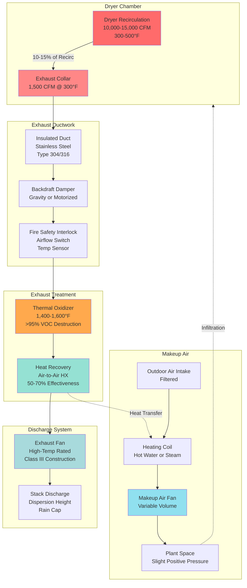

Exhaust system design for printing dryers requires precise calculation of volumetric flow rates to maintain safe operation while preventing excessive energy loss. The fundamental challenge lies in removing solvent vapors and combustion products at concentrations below flammable limits while maintaining thermal efficiency through minimal air infiltration. Three governing principles dictate exhaust requirements: dilution of solvent vapors below 25% of lower explosive limit (LEL), removal of thermal energy to prevent overheating, and pressure balancing to ensure proper dryer operation without affecting building ventilation.

## Exhaust Volume Calculations

The required exhaust flow rate derives from mass balance of solvent evaporation and safety dilution requirements. For heat-set dryers, solvent vapor concentration must remain below the safe operating threshold.

### Solvent Dilution Method

The primary calculation establishes exhaust volume based on solvent mass flow and allowable concentration:

$$Q_{exhaust} = \frac{\dot{m}_{solvent} \times 387}{MW_{solvent} \times C_{max}}$$

Where:
- $Q_{exhaust}$ = exhaust flow rate (CFM at standard conditions)
- $\dot{m}_{solvent}$ = solvent evaporation rate (lb/hr)
- $387$ = conversion factor (ft³·lb/lbmol·°R at 60°F)
- $MW_{solvent}$ = molecular weight of solvent (lb/lbmol)
- $C_{max}$ = maximum allowable concentration (typically 0.0025 for 25% LEL)

For mineral spirits (MW ≈ 145 lb/lbmol, LEL = 0.8-1.0% by volume) evaporating at 120 lb/hr:

$$Q_{exhaust} = \frac{120 \times 387}{145 \times 0.0025} = 128,165 \text{ CFM}$$

This represents the theoretical minimum. Practical systems apply a safety factor of 1.5-2.0, yielding 192,000-256,000 CFM for this solvent load.

### Recirculation-Based Method

An alternative approach calculates exhaust as a percentage of dryer recirculation flow:

$$Q_{exhaust} = Q_{recirc} \times f_{exhaust}$$

Where:
- $Q_{recirc}$ = dryer recirculation air volume (8,000-15,000 CFM typical)
- $f_{exhaust}$ = exhaust fraction (0.10-0.15 for heat-set dryers)

For a dryer operating at 12,000 CFM recirculation with 12% exhaust:

$$Q_{exhaust} = 12,000 \times 0.12 = 1,440 \text{ CFM}$$

This method ensures continuous purge of the dryer atmosphere regardless of momentary solvent load variations.

### Temperature-Corrected Volume

Exhaust calculations at standard conditions must be corrected for actual operating temperature:

$$Q_{actual} = Q_{standard} \times \frac{T_{actual}}{T_{standard}}$$

Where temperatures are in absolute units (°R = °F + 460).

At 300°F exhaust temperature:

$$Q_{actual} = 1,440 \times \frac{760}{520} = 2,104 \text{ CFM}$$

The expanded volume at elevated temperature increases duct velocities and fan power requirements proportionally.

## Makeup Air Requirements

Exhaust removal creates negative pressure that must be offset by conditioned makeup air to prevent:

- Infiltration through building envelope causing uncontrolled humidity
- Backdrafting of dryer combustion products
- Destabilization of web tension through pressure fluctuations
- Excessive heating/cooling loads from unconditioned infiltration

### Makeup Air Volume Balance

The makeup air quantity equals total exhaust plus controlled infiltration allowance:

$$Q_{makeup} = Q_{exhaust} + Q_{infiltration} - Q_{process}$$

Where:
- $Q_{makeup}$ = required makeup air volume (CFM)
- $Q_{exhaust}$ = total mechanical exhaust from dryers and hoods (CFM)
- $Q_{infiltration}$ = design infiltration rate (typically 0.05-0.10 building volumes/hr)
- $Q_{process}$ = air consumed in combustion or absorbed into product (CFM)

For a 200,000 ft³ printing plant with 5,000 CFM dryer exhaust and 0.08 building volumes/hr infiltration:

$$Q_{makeup} = 5,000 + \left(\frac{200,000 \times 0.08}{60}\right) - 0 = 5,267 \text{ CFM}$$

### Makeup Air Heating Load

The thermal energy required to condition makeup air from outdoor to supply temperature:

$$Q_{heating} = Q_{makeup} \times 1.08 \times (T_{supply} - T_{outdoor})$$

Where $Q_{heating}$ is in BTU/hr and temperatures in °F.

During winter operation with makeup air heated from 0°F to 70°F:

$$Q_{heating} = 5,267 \times 1.08 \times (70 - 0) = 398,353 \text{ BTU/hr}$$

This represents significant operating cost, making heat recovery from dryer exhaust economically attractive.

## Exhaust System Configuration by Dryer Type

Different drying technologies require distinct exhaust approaches based on temperature, contaminant type, and process safety:

| Dryer Type | Exhaust Volume | Temperature | Primary Contaminants | Safety Considerations |
|-----------|---------------|-------------|---------------------|----------------------|
| Heat-Set Web Offset | 10-15% of recirc (1,200-2,200 CFM per dryer) | 250-350°F | Mineral spirits vapor, combustion products | Maintain <25% LEL; afterburner required |
| UV Curing (Mercury) | 500-1,500 CFM per lamp | 150-200°F | Ozone, trace acrylate vapor | Ozone destruction filters; positive pressure isolation |
| UV Curing (LED) | 200-600 CFM per lamp | 100-130°F | Minimal ozone, heat only | Reduced exhaust; lamp cooling priority |
| Electron Beam | 300-800 CFM per unit | 90-110°F | X-ray shielding ventilation | Radiation safety interlocks |
| Infrared Dryers | 8-12% of recirc (800-1,500 CFM) | 200-300°F | Water vapor, minor VOCs | Lower LEL concern; moisture removal |
| Hot Air Dryers | 15-20% of recirc (1,500-3,000 CFM) | 180-250°F | Water vapor, oxidation byproducts | Humidity control; condensation prevention |

### Configuration Selection Criteria

Heat-set dryers with petroleum-based inks require the highest exhaust volumes due to LEL safety constraints. The solvent concentration drives design more than thermal removal needs.

UV systems prioritize cooling efficiency over vapor removal. Mercury lamp systems generate substantial ozone (O₃) requiring catalytic destruction or activated carbon filtration before discharge. LED UV systems reduce exhaust by 60-70% through lower thermal output.

## Fire Safety and Explosion Prevention

Dryer exhaust systems handle flammable vapors at elevated temperatures, requiring multiple safety layers per NFPA 86.

### Lower Explosive Limit Monitoring

Continuous monitoring of solvent concentration prevents approach to flammable conditions:

$$\text{Safe Operating Limit} = 0.25 \times LEL$$

For mineral spirits with LEL of 0.9% by volume, maximum operating concentration is 0.225% (2,250 ppm). Most systems target 1,500-1,800 ppm maximum with alarm at 2,000 ppm and automatic shutdown at 2,250 ppm.

### Minimum Exhaust Flow Verification

Airflow proving switches confirm exhaust fan operation before dryer burner ignition. The interlock sequence:

1. Exhaust fan energized and purge cycle initiated (4-5 air changes minimum)
2. Airflow switch closes confirming minimum 80% design flow
3. Purge timer completes (60-120 seconds typical)
4. Burner ignition permitted

Loss of exhaust airflow during operation triggers immediate fuel shutoff and alarm.

### Temperature Limits

Exhaust temperature monitoring prevents autoignition of solvent vapors:

| Solvent Type | Autoignition Temperature | Maximum Exhaust Temp | Safety Margin |
|-------------|------------------------|---------------------|---------------|
| Mineral Spirits | 475-550°F | 350°F | 125-200°F |
| Toluene | 896°F | 400°F | 496°F |
| Ethyl Acetate | 800°F | 375°F | 425°F |
| Water (IR dryers) | N/A | 250°F | Condensation control |

High-limit thermostats interrupt burner operation at 375-400°F depending on solvent type.

### Explosion Relief Venting

Dryer chambers exceeding 500 ft³ or handling >25% LEL vapors require pressure relief per NFPA 68:

$$A_{vent} = \frac{V_{chamber}}{C_{vent}}$$

Where:
- $A_{vent}$ = vent area (ft²)
- $V_{chamber}$ = dryer chamber volume (ft³)
- $C_{vent}$ = vent constant (15-25 ft³/ft² for low-strength enclosures)

A 1,000 ft³ dryer chamber with light construction:

$$A_{vent} = \frac{1,000}{15} = 66.7 \text{ ft}^2$$

Relief panels discharge to safe exterior locations, typically roof-mounted with 45° upward orientation.

## Exhaust System Design

The physical exhaust system must convey high-temperature, potentially contaminated air without condensation or fire propagation.

### Ductwork Material Selection

Exhaust duct materials must withstand temperature and resist corrosion from solvent condensate:

- **Stainless Steel 304/316**: Preferred for all heat-set dryer exhaust; resists corrosion from acidic condensate
- **Aluminized Steel Type 2**: Cost-effective for lower-temperature sections (<200°F)
- **Galvanized Steel**: Acceptable only for UV dryer exhaust and downstream of thermal oxidizers
- **Insulation**: 2-inch minimum thickness fiberglass or mineral wool to maintain temperature above dewpoint

### Duct Velocity and Sizing

Exhaust duct velocity balances pressure drop against condensation prevention:

$$V_{duct} = \frac{Q \times 144}{A_{duct}}$$

Where:
- $V_{duct}$ = duct velocity (FPM)
- $Q$ = volumetric flow rate (CFM)
- $A_{duct}$ = duct cross-sectional area (in²)

Target velocities:
- Main exhaust ducts: 2,000-3,000 FPM (prevents settling, maintains turbulence)
- Vertical risers: 2,500-3,500 FPM (overcomes buoyancy effects)
- Final discharge: 1,500-2,000 FPM (reduces noise, fan power)

### Fan Selection and Construction

High-temperature exhaust fans require special construction:

- **Wheel Type**: Backward-inclined or airfoil for efficiency; radial blade for particulate
- **Temperature Rating**: Minimum 350°F continuous, 400°F for 2-hour emergency
- **Bearing Cooling**: External pedestal bearings with ambient cooling or water jackets
- **Motor Location**: Outside airstream with belt drive or shaft coupling through insulated bearing housing
- **Materials**: Stainless steel wheel and housing for corrosion resistance

Static pressure requirements typically range 4-8 inches w.c. depending on duct length, heat recovery equipment, and treatment devices.

## Air Balance and Pressure Control

The interaction between dryer exhaust and building pressure requires careful coordination.

### Pressure Cascade Strategy

Optimal pressure relationships:

1. **Dryer chamber**: -0.05 to -0.15 inches w.c. relative to plant (prevents vapor escape)
2. **Plant space**: +0.02 to +0.05 inches w.c. relative to outdoors (prevents infiltration)
3. **Makeup air plenum**: +0.10 to +0.20 inches w.c. (ensures distribution)

### Variable Volume Control

Modern systems modulate makeup air to maintain space pressure:

$$Q_{makeup,var} = Q_{exhaust,total} + \Delta Q_{control}$$

Where $\Delta Q_{control}$ adjusts based on space pressure sensor feedback, typically ±10-15% of design flow.

Building pressure controller maintains setpoint through:
- VFD control of makeup air fan
- Modulating dampers on makeup air distribution
- Bypass damper to relieve excess pressure

## Exhaust Treatment Requirements

Environmental regulations mandate VOC control for heat-set printing operations.

### Thermal Oxidation

High-efficiency destruction of VOCs through combustion:

**Destruction Efficiency** = $\frac{C_{in} - C_{out}}{C_{in}} \times 100\%$

Regenerative thermal oxidizers (RTO) achieve >98% destruction at:
- Operating temperature: 1,450-1,600°F
- Residence time: 0.5-1.0 seconds
- Ceramic bed regeneration: 90-97% heat recovery

**Supplemental Fuel Requirement**:

$$Q_{fuel} = Q_{exhaust} \times \rho \times c_p \times (T_{oxidation} - T_{exhaust}) - \dot{m}_{VOC} \times HHV$$

Where VOC heating value (HHV) offsets fuel need. At >5% LEL inlet concentration, systems often achieve autogenous operation (zero supplemental fuel).

### Alternative Treatment Methods

| Technology | Destruction/Removal Efficiency | Operating Cost | Capital Cost | Application |
|-----------|-------------------------------|----------------|--------------|-------------|
| Thermal Oxidizer (Direct) | 95-99% | High (fuel) | Low | High VOC concentration |
| Regenerative Thermal Oxidizer | 97-99% | Low (fuel) | High | Medium-high VOC, continuous operation |
| Catalytic Oxidizer | 90-98% | Medium | Medium | Lower temperature operation |
| Carbon Adsorption | 85-95% removal | Medium (regeneration) | Medium-high | Intermittent operation, VOC recovery |
| Rotor Concentrator + RTO | 95-99% | Low (concentrates dilute stream) | Very high | Large volume, low concentration |

## Code Compliance and Standards

Exhaust system design must satisfy multiple regulatory frameworks:

### NFPA 86: Ovens and Furnaces

Key requirements:
- Classification of dryer as Class A (flammable vapor processing)
- Minimum purge of 4 air changes before ignition
- Airflow interlocks preventing operation below 80% design flow
- High-temperature limit controls
- Emergency shutdown capabilities

### IMC Chapter 5: Exhaust Systems

- Minimum 500 FPM duct velocity for vapor-laden exhaust
- Duct construction per SMACNA with sealed joints
- Access doors every 20 feet for inspection
- Clearances from combustible construction: 18 inches minimum or insulated to limit surface temperature to 90°F above ambient

### NFPA 91: Vapor Exhaust Systems

- Electrical classification per NEC Article 500 for Class I, Division 2 locations within 5 feet of exhaust openings
- Spark-resistant fan construction (aluminum, bronze, stainless steel)
- Grounding and bonding of all ductwork to prevent static accumulation
- Explosion relief venting where required

### EPA Regulations

Maximum Achievable Control Technology (MACT) standards for printing operations typically require:
- 90-95% VOC capture efficiency
- 95% control device destruction/removal efficiency
- Continuous monitoring of exhaust flow and temperature
- Recordkeeping of solvent usage and emissions

## Design Integration Checklist

Successful exhaust system implementation requires coordination across multiple disciplines:

**Process Requirements**:
- Dryer manufacturer exhaust collar size and temperature
- Solvent type, usage rate, and vapor pressure
- Production schedule and load variations

**Structural Coordination**:
- Stack support and lateral wind loading
- Equipment loads (fans, oxidizers) on roof structure
- Seismic bracing per ASCE 7

**Electrical Systems**:
- Fan motor power and control wiring
- Interlock integration with press controls
- Emergency shutdown circuits
- Hazardous location wiring methods

**Fire Protection**:
- Sprinkler coordination around high-temperature ductwork
- Fusible link dampers if required
- Fire alarm integration

**Energy Management**:
- Heat recovery equipment sizing and integration
- Economizer lockouts during dryer operation
- Makeup air preheating strategy

The exhaust system represents a critical safety component that must maintain operation continuously during press runs. Redundancy through dual fans or emergency backup power ensures production continuity while protecting personnel and equipment from fire and explosion hazards.
