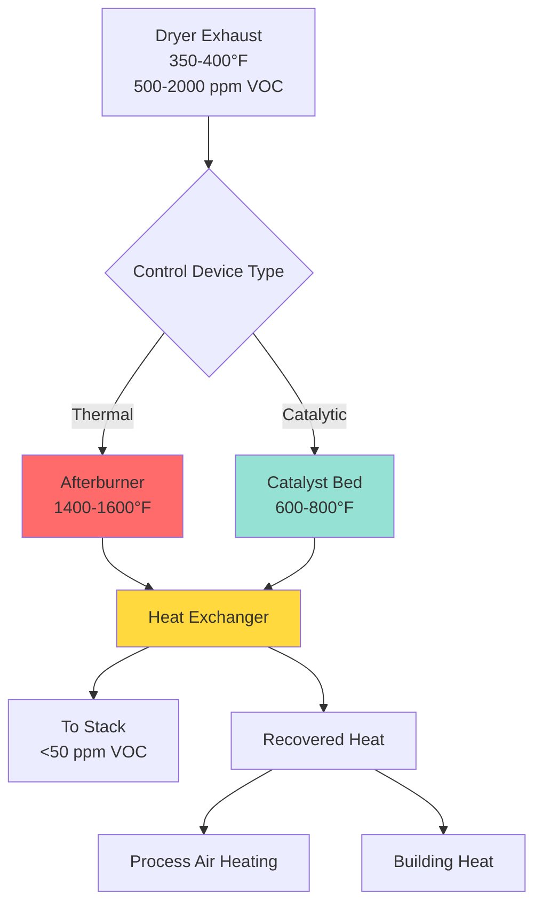

Heat-set dryers represent critical thermal processing equipment in web offset printing operations, where rapid solvent evaporation and ink curing occur at elevated temperatures. These systems must balance precise temperature control, efficient VOC management, and energy recovery to maintain product quality while meeting environmental regulations.

## Drying Process Physics

Heat-set ink drying involves two simultaneous mechanisms: solvent evaporation and oxidative polymerization. The printed web enters the dryer at ambient conditions and experiences rapid heating to temperatures between 350°F and 400°F (177°C to 204°C).

The heat transfer rate to the web follows:

$$Q = h \cdot A \cdot (T_{air} - T_{web})$$

Where $Q$ is the heat transfer rate (BTU/hr), $h$ is the convective heat transfer coefficient (BTU/hr·ft²·°F), $A$ is the web surface area (ft²), and $T_{air}$ and $T_{web}$ are the air and web temperatures respectively.

The convective coefficient typically ranges from 10 to 25 BTU/hr·ft²·°F depending on air velocity and turbulence levels. Higher velocities increase $h$ but also increase fan power consumption.

## Dryer Zone Configuration

Heat-set dryers employ multiple temperature zones to control the drying profile. The initial zone preheats the web to prevent thermal shock and paper wrinkling. Primary drying zones operate at peak temperatures where maximum solvent evaporation occurs.

| Zone | Temperature Range | Function | Residence Time |
|------|------------------|----------|----------------|
| Preheat | 200-250°F | Gradual warm-up | 0.5-1.0 sec |
| Primary Dry | 350-400°F | Peak evaporation | 1.5-2.5 sec |
| Secondary Dry | 300-350°F | Complete cure | 1.0-1.5 sec |
| Cooling (Chill) | 80-100°F | Web stabilization | 2.0-3.0 sec |

The residence time in each zone depends on web speed and dryer length. Typical web speeds range from 800 to 1,500 feet per minute (fpm) for commercial printing operations.

## Solvent Evaporation Kinetics

The evaporation rate of petroleum-based solvents in heat-set inks follows first-order kinetics:

$$\frac{dm}{dt} = -k \cdot m$$

Where $m$ is the remaining solvent mass and $k$ is the rate constant that increases exponentially with temperature according to the Arrhenius equation:

$$k = A \cdot e^{-E_a/(R \cdot T)}$$

The activation energy $E_a$ for typical heat-set solvents ranges from 10,000 to 15,000 BTU/lb-mol. This temperature dependence explains why dryer temperature control within ±5°F is essential for consistent drying performance.

At 375°F, approximately 95% of solvents evaporate within 2 seconds of residence time. The latent heat of vaporization for petroleum distillates averages 140 BTU/lb, representing a significant portion of the total energy requirement.

## VOC Emission Control

Solvent-laden exhaust from heat-set dryers contains volatile organic compounds (VOCs) that require thermal or catalytic oxidation before atmospheric discharge. Typical exhaust concentrations range from 500 to 2,000 ppm (as propane equivalent).

### Afterburner Systems

Thermal afterburners combust VOCs at temperatures between 1,400°F and 1,600°F with residence times of 0.5 to 0.75 seconds. The combustion efficiency follows:

$$\eta_{combustion} = \frac{VOC_{in} - VOC_{out}}{VOC_{in}} \times 100\%$$

Properly designed afterburners achieve 95-99% destruction efficiency. The fuel consumption depends on the exhaust temperature entering the afterburner and the VOC concentration, which provides supplemental heating value.

### Catalytic Oxidizers

Catalytic systems use precious metal catalysts (platinum or palladium) to reduce the oxidation temperature to 600-800°F. The lower temperature reduces fuel consumption but requires careful control to prevent catalyst poisoning from silicon compounds or heavy metals in the ink formulations.

## Energy Recovery Strategies

Heat-set dryer systems consume 15,000 to 40,000 BTU per 1,000 impressions, making energy recovery economically attractive. The high-temperature exhaust from oxidizers contains substantial recoverable energy.

**Common recovery methods:**

- **Air-to-air heat exchangers**: Preheat incoming combustion air or dryer supply air, recovering 40-60% of exhaust energy
- **Recuperative burners**: Integrate heat exchange into the burner assembly for 70-80% thermal efficiency
- **Process integration**: Use recovered heat for building heating, reducing facility energy consumption by 20-30%

The recovered heat $Q_{recovered}$ can be calculated from:

$$Q_{recovered} = \dot{m} \cdot c_p \cdot (T_{exhaust} - T_{final}) \cdot \eta_{HX}$$

Where $\dot{m}$ is the exhaust mass flow rate, $c_p$ is the specific heat (0.24 BTU/lb·°F for air), and $\eta_{HX}$ is the heat exchanger effectiveness (typically 0.50-0.70).

## Chill Roll Cooling

After exiting the dryer, the web temperature reaches 300-350°F and requires rapid cooling to prevent offset on downstream equipment. Chill rolls use internally circulated chilled water (45-55°F) to reduce web temperature to 80-100°F.

The cooling load on chill rolls includes:

1. Sensible heat removal from the paper substrate
2. Completing ink oxidation (exothermic reaction adds 5-10% to cooling load)
3. Residual solvent condensation

Total cooling capacity typically ranges from 50 to 200 tons of refrigeration depending on press width and speed. The heat removal rate must match the dryer output to maintain stable web temperature and prevent moisture condensation.

## Design Considerations

**ASHRAE Handbook - HVAC Applications** provides guidance on industrial drying processes, emphasizing the importance of:

- Maintaining 25% Lower Explosive Limit (LEL) or less in dryer exhaust for safety
- Providing adequate makeup air to replace exhausted volumes (typically 8,000-15,000 cfm per dryer)
- Controlling building pressurization to prevent VOC migration into occupied spaces
- Sizing ductwork for 2,500-3,500 fpm velocity to minimize pressure drop while preventing solvent condensation

Fire detection and suppression systems must integrate with the dryer controls to immediately shut down heat input and purge the dryer volume with fresh air in the event of ignition.

## Performance Optimization

Optimizing heat-set dryer performance requires balancing multiple variables:

- **Temperature uniformity**: Maintain ±10°F across web width to prevent differential drying
- **Air velocity distribution**: 1,500-2,500 fpm at the web surface for uniform heat transfer
- **Exhaust flow control**: Match solvent loading to oxidizer capacity for stable combustion
- **Energy recovery**: Maximize heat recuperation without compromising process temperature control

Modern systems employ zone-specific temperature control, variable frequency drives on circulation fans, and real-time VOC monitoring to optimize energy consumption while maintaining regulatory compliance and product quality.
