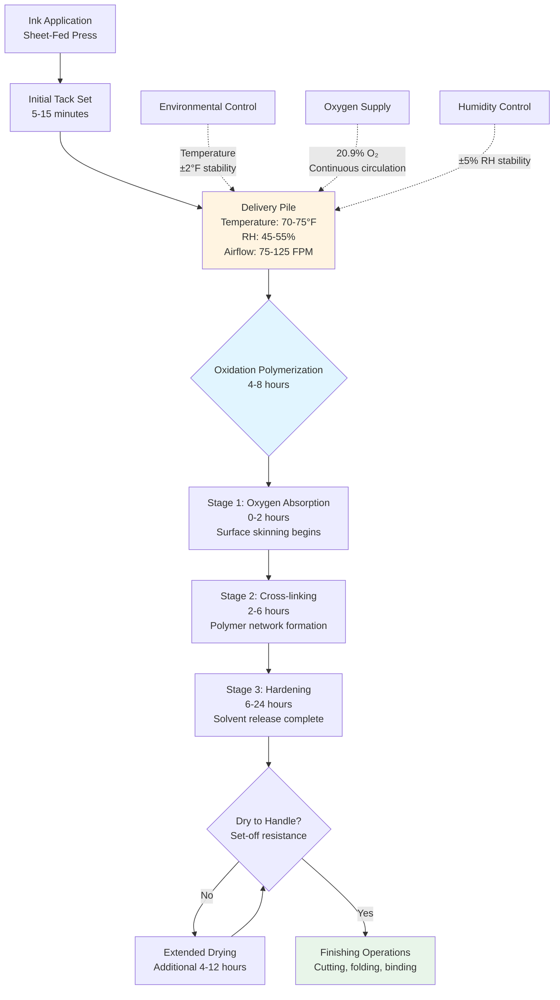

Oxidation drying represents a fundamentally different ink curing mechanism from heat-set or UV processes. Rather than relying on solvent evaporation or photopolymerization, oxidation drying occurs through autoxidative polymerization where atmospheric oxygen chemically reacts with unsaturated fatty acids in the ink vehicle, forming cross-linked polymer networks. This process dominates sheet-fed offset lithography, letterpress, and screen printing operations. The HVAC system must establish environmental conditions that optimize reaction kinetics while preventing premature skinning, tack retention issues, and set-off contamination.

## Autoxidative Polymerization Chemistry

Oxidation drying proceeds through free-radical chain reactions initiated by atmospheric oxygen. The ink vehicle typically contains linseed oil, tung oil, or synthetic alkyd resins—all featuring carbon-carbon double bonds susceptible to oxygen attack.

### Reaction Mechanism

The polymerization sequence follows three stages:

1. **Initiation**: Oxygen abstracts hydrogen from allylic positions adjacent to double bonds, forming hydroperoxide radicals
2. **Propagation**: Free radicals attack adjacent molecules, creating peroxide cross-links
3. **Termination**: Radical coupling forms stable polymer networks

The overall rate equation for autoxidative polymerization:

$$r_{ox} = k_0 \cdot [\text{RH}] \cdot [O_2]^{0.5} \cdot e^{-E_a/(RT)}$$

Where:
- $r_{ox}$ = oxidation rate (mol/L·s)
- $k_0$ = pre-exponential factor (material-dependent)
- $[\text{RH}]$ = concentration of oxidizable substrate
- $[O_2]$ = oxygen partial pressure
- $E_a$ = activation energy (typically 60-80 kJ/mol for drying oils)
- $R$ = universal gas constant (8.314 J/mol·K)
- $T$ = absolute temperature (K)

### Temperature Dependence

The Arrhenius relationship governs temperature sensitivity. For typical alkyd-based inks with $E_a = 70$ kJ/mol, the relative rate increase:

$$\frac{r_{T_2}}{r_{T_1}} = e^{\frac{E_a}{R}\left(\frac{1}{T_1} - \frac{1}{T_2}\right)}$$

Converting to practical terms with temperatures in Fahrenheit:

$$\frac{r_{T_2}}{r_{T_1}} \approx 2^{\frac{(T_2 - T_1)}{18°F}}$$

This approximation yields a doubling of oxidation rate per 18°F temperature increase, or equivalently, 10-12 percent rate increase per 10°F within the typical 65-85°F operating range.

## Environmental Control Requirements

Oxidation drying rates respond to temperature, humidity, oxygen availability, and air velocity. The HVAC system must balance these factors to achieve optimal cure without compromising print quality.

### Temperature Control

| Temperature Range | Drying Rate Impact | Operational Considerations |
|-------------------|--------------------|-----------------------------|
| 65-70°F | Baseline rate | Slower drying, extended delivery time |
| 70-75°F | 1.1-1.25× baseline | Standard operating range |
| 75-80°F | 1.3-1.5× baseline | Accelerated drying, optimal for heavy coverage |
| 80-85°F | 1.6-2.0× baseline | Risk of skinning, tack issues |
| >85°F | >2.0× baseline | Premature surface cure, trapping issues |

The optimal temperature range of 70-75°F balances reasonable drying times (4-8 hours to handling dry) against print quality risks. Higher temperatures accelerate surface oxidation faster than bulk cure, creating hard skins over tacky interiors that cause picking and set-off problems during stacking and handling.

### Humidity Effects

Relative humidity influences oxidation drying through multiple mechanisms:

**Competitive Adsorption**: Water vapor competes with oxygen for surface sites on pigment particles and substrate fibers, reducing effective oxygen concentration at reaction interfaces.

**Hygroscopic Interference**: Paper substrates absorb moisture, expanding fibers and potentially disrupting freshly-formed ink-substrate bonds during the critical initial cure phase.

**Metal Dryer Activity**: Cobalt, manganese, and zirconium driers (catalysts) show reduced activity at elevated humidity due to hydration of metal coordination sites.

| Relative Humidity | Drying Time Factor | Quality Issues |
|-------------------|-----------------------|----------------|
| 30-40% | 0.9-1.0× baseline | Acceptable, risk of static buildup |
| 40-50% | 1.0× baseline | Optimal range |
| 50-60% | 1.05-1.15× baseline | Slightly slower, good quality |
| 60-70% | 1.2-1.4× baseline | Extended drying, web expansion |
| >70% | >1.5× baseline | Significantly delayed cure |

Target humidity of 45-55 percent RH provides optimal conditions while maintaining paper dimensional stability and minimizing static electricity accumulation.

## Oxygen Transport and Air Circulation

Oxidation drying is oxygen-limited at the ink surface. As polymerization consumes available oxygen, the reaction rate depends on diffusive and convective transport of fresh oxygen to the interface.

### Mass Transfer Analysis

The oxygen flux to the ink surface follows Fick's law:

$$J_{O_2} = h_m \cdot (C_{O_2,\infty} - C_{O_2,s})$$

Where:
- $J_{O_2}$ = oxygen mass flux (mol/m²·s)
- $h_m$ = mass transfer coefficient (m/s)
- $C_{O_2,\infty}$ = bulk air oxygen concentration (≈8.9 mol/m³ at STP)
- $C_{O_2,s}$ = surface oxygen concentration (≈0 for fast reaction)

The mass transfer coefficient relates to air velocity through the Sherwood number correlation:

$$Sh = \frac{h_m \cdot L}{D_{O_2}} = 0.664 \cdot Re^{0.5} \cdot Sc^{0.33}$$

For forced convection over flat sheets, where $Re = \frac{\rho \cdot v \cdot L}{\mu}$ (Reynolds number) and $Sc = \frac{\mu}{\rho \cdot D_{O_2}}$ (Schmidt number ≈0.83 for oxygen in air).

This yields the practical result that doubling air velocity increases oxygen transfer by approximately 40 percent ($\sqrt{2} \approx 1.41$).

### Air Velocity Requirements

| Air Velocity | Oxygen Transfer | Application |
|--------------|-----------------|-------------|
| <25 FPM | Insufficient | Stagnant conditions, slow cure |
| 25-50 FPM | 0.7-0.85× optimal | Minimum circulation |
| 50-100 FPM | 0.85-1.0× optimal | Standard delivery area |
| 100-150 FPM | 1.0-1.15× optimal | Optimal range for heavy ink films |
| 150-200 FPM | 1.15-1.25× optimal | Maximum practical velocity |
| >200 FPM | 1.25× optimal | Diminishing returns, dust issues |

Excessive air velocities above 200 FPM provide minimal additional oxygen transfer while increasing dust deposition on wet ink surfaces and creating handling difficulties. Typical delivery stackers operate with 75-125 FPM cross-flow ventilation.

## Ink Formulation Variables

Different ink chemistries exhibit vastly different oxidation drying characteristics, requiring adjusted environmental conditions.

### Ink Vehicle Comparison

| Ink Type | Primary Vehicle | Drying Time (70°F, 50% RH) | Temperature Sensitivity | Optimal Conditions |
|----------|-----------------|----------------------------|-------------------------|---------------------|
| Standard process | Linseed/alkyd blend | 6-10 hours | Moderate (1.2×/10°F) | 70-75°F, 45-55% RH |
| Quick-set | Modified alkyd | 3-6 hours | High (1.4×/10°F) | 70-75°F, 40-50% RH |
| High-gloss | Phenolic resin | 8-12 hours | Low (1.1×/10°F) | 72-78°F, 45-50% RH |
| UV/oxidation hybrid | Acrylate/alkyd | 4-8 hours | Moderate (1.3×/10°F) | 70-75°F, 40-50% RH |
| Metallic | Varnish base | 10-16 hours | Low (1.1×/10°F) | 72-80°F, 40-50% RH |

Quick-set inks use low-viscosity vehicles that penetrate rapidly into paper fibers, leaving resin-rich surface layers that oxidize faster. Conversely, high-gloss formulations require extended cure times to develop full hardness and resistance properties.

### Drier Concentration Effects

Metal driers catalyze oxidation through coordination with hydroperoxide intermediates. Typical concentrations:

- **Cobalt driers**: 0.02-0.10% (primary surface drier)
- **Manganese driers**: 0.05-0.20% (through-cure catalyst)
- **Zirconium driers**: 0.10-0.30% (auxiliary hardness drier)

Excessive drier concentrations accelerate skinning but compromise final film integrity, while insufficient drier levels extend cure times beyond practical production requirements. Environmental temperature directly affects optimal drier balance—higher temperatures require reduced cobalt levels to prevent premature surface cure.

## Oxidation Drying Process Flow

## HVAC System Design Considerations

Delivery and finishing areas require dedicated environmental control to maintain oxidation drying conditions.

### Ventilation Requirements

Calculate minimum airflow based on space volume and air change rate:

$$\text{CFM} = \frac{V \cdot \text{ACH}}{60}$$

Where:
- $V$ = space volume (ft³)
- ACH = air changes per hour (0.5-1.5 for oxidation drying areas)

For a 10,000 ft² delivery area with 16-foot ceilings (160,000 ft³), 1.0 ACH requires:

$$\text{CFM} = \frac{160,000 \times 1.0}{60} = 2,667 \text{ CFM}$$

This provides bulk air circulation; local cross-flow fans supplement this with directed velocities of 75-125 FPM across stacked sheets.

### Temperature Control Strategy

Maintain delivery area temperatures within ±2°F of setpoint. Given the 10-12 percent rate change per 10°F, a ±2°F swing creates ±2-2.4 percent variation in drying rate—acceptable for production tolerance.

Cooling loads consist of:

- Press heat rejection: 50-150 BTU/hr per impression cylinder HP
- Lighting: 1.0-1.5 watts/ft² for LED systems
- Occupant sensible load: 250 BTU/hr per person
- Envelope gains: Calculated per ASHRAE fundamentals

Heating loads during winter operation must overcome infiltration and envelope losses while maintaining precise setpoints. Modulating gas-fired or hot water heating with PI control provides adequate response.

### Humidity Control Equipment

Maintain 45-55 percent RH through:

**Humidification** (winter): Steam grid or ultrasonic atomizers add moisture at controlled rates:

$$\dot{m}_w = \frac{\text{CFM} \cdot \rho_{air} \cdot (W_2 - W_1)}{60}$$

Where $W$ = humidity ratio (lb water/lb dry air).

**Dehumidification** (summer): Cooling coils with reheat or desiccant dehumidifiers remove excess moisture. Overcooling below dewpoint followed by sensible reheat provides independent temperature and humidity control.

### Air Distribution

Low-velocity displacement ventilation works well for delivery areas:

- Supply air at 65-68°F from floor-level diffusers
- Upward convective flow from warm sheet piles (72-75°F)
- Exhaust at ceiling level removes heat and minor VOCs
- Minimizes drafts across stacked sheets while providing oxygen circulation

Alternatively, overhead low-velocity diffusers (400-600 FPM terminal velocity) with wide throw patterns distribute conditioned air uniformly without creating excessive surface velocities.

## Monitoring and Control

Continuous monitoring ensures environmental stability:

- **Temperature sensors**: ±0.5°F accuracy, located at press delivery height (3-5 feet above floor)
- **RH transmitters**: ±2% RH accuracy, calibrated quarterly against NIST-traceable standards
- **Airflow stations**: Verify minimum circulation rates, alarm on fan failure
- **Drying time tracking**: Sample sheets from production runs, measure tack at intervals

Automated controls sequence heating, cooling, humidification, and dehumidification to maintain setpoints while minimizing energy consumption and equipment cycling.

## Quality Assurance Considerations

Insufficient environmental control manifests as print quality defects:

- **Set-off**: Incomplete cure allows ink transfer from sheet to sheet in stacked piles
- **Blocking**: Sheets adhere permanently due to excessive tack retention
- **Chalking**: Surface oxidation without substrate adhesion causes powdery appearance
- **Crystallization**: Extended cure at low temperature creates brittle, crack-prone films
- **Show-through**: Excessive penetration from low-viscosity vehicles at elevated temperature

Regular measurement of ink drying using IGT or Inkometer tack values at 2, 4, 6, and 8-hour intervals validates environmental control effectiveness. Target tack reduction to 20-30 percent of initial wet values within 6 hours indicates proper oxidation progression.

## Standards and References

Printing industry environmental recommendations derive from:

- **GATF/PIA**: Graphic Arts Technical Foundation specifications for sheet-fed environments
- **FOGRA**: European printing research association standards
- **NAPIM**: National Association of Printing Ink Manufacturers formulation guidelines
- **ASHRAE Applications Handbook**: Chapter on printing plants

While no single code mandates specific oxidation drying conditions, process quality requirements drive practical HVAC design parameters toward the 70-75°F, 45-55 percent RH target range with adequate circulation.

---

Oxidation drying HVAC systems emphasize precision environmental control over active drying energy input. The autoxidative polymerization mechanism responds predictably to temperature, humidity, and oxygen availability through well-established chemical kinetics. Successful system design maintains stable conditions throughout the multi-hour cure cycle while integrating with broader printing plant environmental requirements for paper conditioning, static control, and worker comfort.
