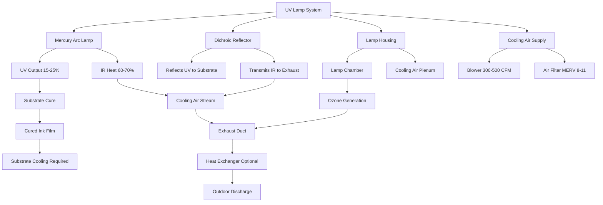

Ultraviolet curing systems polymerize printing inks through photochemical reaction rather than thermal evaporation, eliminating solvent emissions while introducing substantial cooling challenges from radiant energy conversion. UV lamps convert 60-70% of electrical input to infrared heat rather than useful UV radiation, generating cooling loads of 200-400 watts per linear inch of web width. The HVAC design must remove this heat from lamp chambers, prevent substrate temperature rise that degrades print quality, exhaust ozone generated by wavelengths below 240 nm, and maintain lamp operating temperatures within 600-900°F for optimal UV output. Mercury arc and LED systems present radically different thermal profiles requiring distinct cooling strategies.

## Photochemical Curing Fundamentals

### UV Polymerization Mechanism

UV inks contain photoinitiators that absorb ultraviolet radiation and decompose into free radicals, initiating polymerization of monomers and oligomers into solid polymer films. The process requires specific UV wavelengths and energy densities:

**UV wavelength regions:**

| Region | Wavelength | Energy | Application |
|--------|------------|--------|-------------|
| UV-A | 315-400 nm | 3.1-3.9 eV | Standard ink cure |
| UV-B | 280-315 nm | 3.9-4.4 eV | Specialized coatings |
| UV-C | 200-280 nm | 4.4-6.2 eV | Germicidal (unwanted) |
| UV-V | 395-445 nm | 2.8-3.1 eV | LED UV systems |

**Energy conversion relationship:**

$$E_{photon} = \frac{h \times c}{\lambda}$$

Where:
- $E_{photon}$ = Photon energy (J)
- $h$ = Planck's constant (6.626 × 10⁻³⁴ J·s)
- $c$ = Speed of light (3 × 10⁸ m/s)
- $\lambda$ = Wavelength (m)

For 365 nm (peak mercury lamp output):

$$E_{photon} = \frac{6.626 \times 10^{-34} \times 3 \times 10^8}{365 \times 10^{-9}} = 5.45 \times 10^{-19} \text{ J} = 3.40 \text{ eV}$$

This energy drives photoinitiator cleavage and initiates polymerization without requiring substrate heating.

### Cure Energy Requirements

**UV dose calculation:**

$$D_{UV} = I \times t$$

Where:
- $D_{UV}$ = UV dose (mJ/cm²)
- $I$ = UV intensity (mW/cm²)
- $t$ = Exposure time (s)

**Exposure time at web speed:**

$$t = \frac{L_{lamp}}{v_{web}}$$

Where:
- $L_{lamp}$ = Effective lamp length (exposure zone width, cm)
- $v_{web}$ = Web speed (cm/s)

**Required intensity:**

$$I = \frac{D_{UV} \times v_{web}}{L_{lamp}}$$

**Typical cure requirements:**

| Ink System | Required Dose | Lamp Length | Web Speed | Required Intensity |
|------------|---------------|-------------|-----------|-------------------|
| Clear coating | 300-500 mJ/cm² | 10 cm | 100 m/min | 50-83 mW/cm² |
| White ink | 600-1000 mJ/cm² | 10 cm | 100 m/min | 100-167 mW/cm² |
| Heavy pigment | 800-1500 mJ/cm² | 10 cm | 100 m/min | 133-250 mW/cm² |
| Adhesives | 400-800 mJ/cm² | 10 cm | 50 m/min | 33-67 mW/cm² |

Higher web speeds or thicker ink films require proportionally higher UV intensity, driving electrical power consumption and consequent heat generation.

## Mercury Arc Lamp Systems

### Lamp Operating Characteristics

Medium-pressure mercury arc lamps operate at internal pressures of 2-10 atmospheres, producing intense UV radiation from mercury vapor excitation. The arc temperature reaches 5,000-6,000 K, generating broad-spectrum output with characteristic mercury emission lines.

**Spectral output distribution:**

- UV radiation (200-400 nm): 15-25% of electrical input
- Visible light (400-700 nm): 10-15% of electrical input
- Infrared heat (> 700 nm): 60-70% of electrical input
- Convective/conductive losses: 5-10% of electrical input

This energy distribution drives the fundamental cooling challenge: removing 60-70% of lamp power as waste heat.

**Electrical and thermal specifications:**

| Parameter | Mercury Arc Lamp | Notes |
|-----------|------------------|-------|
| Power density | 200-400 W/inch | Web width basis |
| Arc temperature | 5,000-6,000 K | Internal plasma |
| Bulb temperature | 600-900°F | External surface |
| UV conversion efficiency | 15-25% | Useful output |
| Infrared output | 60-70% | Waste heat |
| Lamp life | 1,000-2,000 hours | Degradation curve |
| Warm-up time | 3-5 minutes | Thermal stabilization |

**Heat load calculation:**

For a 60-inch web with 300 W/inch lamp power:

$$Q_{total} = 60 \text{ in} \times 300 \text{ W/in} = 18,000 \text{ W} = 18 \text{ kW}$$

$$Q_{heat} = 18 \text{ kW} \times 0.65 = 11.7 \text{ kW} = 39,900 \text{ BTU/hr}$$

This represents the radiant and convective heat that must be removed by the cooling system.

### Lamp Cooling Requirements

**Air cooling systems:**

Mercury lamps require forced air cooling to maintain bulb temperature within 600-900°F operating range:

**Cooling airflow calculation:**

$$Q_{air} = \frac{Q_{heat}}{1.08 \times \Delta T}$$

Where:
- $Q_{air}$ = Cooling airflow (CFM)
- $Q_{heat}$ = Heat load (BTU/hr)
- $\Delta T$ = Temperature rise (°F)

For 18 kW lamp system (39,900 BTU/hr) with 80°F inlet air and 250°F exhaust:

$$Q_{air} = \frac{39,900}{1.08 \times (250-80)} = \frac{39,900}{183.6} = 217 \text{ CFM}$$

**Practical design:** Use 300-400 CFM to account for:
- Non-uniform heat distribution
- Reflector cooling requirements
- Safety margin for lamp temperature limits

**Cooling air delivery methods:**

1. **Transverse flow:** Air flows perpendicular to lamp axis
   - Distribution: Uniform along lamp length
   - Velocity: 200-400 FPM at lamp surface
   - Ducting: Plenum with multiple outlets

2. **Axial flow:** Air flows parallel to lamp axis
   - Distribution: End-entry with longitudinal flow
   - Velocity: 500-800 FPM in annular gap
   - Ducting: Simpler, single-entry design

3. **Impingement cooling:** High-velocity jets directed at lamp
   - Distribution: Multiple nozzles along lamp
   - Velocity: 1,000-2,000 FPM impact
   - Ducting: Manifold with precision nozzles

**Water cooling systems:**

High-power lamps (> 400 W/inch) may use water-cooled reflectors:

$$Q_{water} = \frac{Q_{heat}}{500 \times \Delta T}$$

For 18 kW load with 20°F water temperature rise:

$$Q_{water} = \frac{39,900}{500 \times 20} = 3.99 \text{ GPM}$$

Water circulates through channels in the reflector housing, removing heat before it reaches the substrate.

### Reflector and Housing Design

**Reflector thermal management:**

Dichroic or cold mirrors reflect UV while transmitting infrared:

- UV reflectance: 85-95% (200-400 nm)
- IR transmittance: 70-85% (> 700 nm)
- Heat rejection: 50-60% of lamp infrared passes through reflector
- Cooling: Forced air or water cooling prevents reflector distortion

**Housing considerations:**

The housing must isolate the lamp chamber from the press environment while allowing UV transmission through quartz windows and exhausting heated cooling air.

## LED UV Curing Systems

### LED Technology Advantages

Light-emitting diode UV systems emit narrow-bandwidth radiation at specific wavelengths (365, 385, 395, 405 nm) matched to photoinitiator absorption spectra. The fundamental difference: LEDs convert 25-40% of electrical input to UV light versus 15-25% for mercury lamps.

**LED UV characteristics:**

| Parameter | LED UV | Mercury Lamp | Improvement |
|-----------|--------|--------------|-------------|
| UV efficiency | 25-40% | 15-25% | 1.3-2× higher |
| Heat generation | 60-75% | 70-85% | 15-25% less |
| Power density | 5-20 W/cm² | 80-150 W/inch | 50-70% reduction |
| Instant on/off | < 1 second | 3-5 minutes | No warm-up |
| Service life | 20,000-40,000 h | 1,000-2,000 h | 15-25× longer |
| Cooling requirement | Air only | Air or water | Simpler system |

**Heat load comparison:**

For 60-inch web width achieving equivalent cure energy:

**Mercury lamp:**
- Power: 60 in × 300 W/in = 18 kW
- Heat: 18 kW × 0.65 = 11.7 kW

**LED UV:**
- Power: 60 in × 2.54 cm/in × 10 W/cm² = 15.2 kW
- Heat: 15.2 kW × 0.65 = 9.9 kW

LED systems reduce heat generation by 15-20% while providing equivalent cure at comparable total power consumption.

### LED Cooling Design

**Air cooling sufficiency:**

LED arrays operate at junction temperatures of 80-120°C (176-248°F), far below mercury lamp temperatures:

**Cooling airflow for LED system:**

For 15.2 kW LED system (51,900 BTU/hr heat) with 75°F inlet and 150°F exhaust:

$$Q_{air} = \frac{51,900}{1.08 \times (150-75)} = \frac{51,900}{81} = 641 \text{ CFM}$$

**Design allocation:** 800-1,000 CFM provides adequate cooling margin.

**Cooling architecture:**

1. **Finned heat sinks:** Aluminum extrusions increase surface area
   - Fin density: 8-12 fins per inch
   - Thermal resistance: 0.2-0.5 °C/W
   - Material: 6063 aluminum alloy

2. **Forced convection:** Fans drive air through heat sink channels
   - Velocity: 300-600 FPM
   - Static pressure: 0.2-0.5 in w.c.
   - Fan type: Axial or centrifugal

3. **Temperature monitoring:** Thermistors or RTDs at LED junction
   - Set point: 100°C typical
   - Safety shutdown: 130°C maximum
   - Control: PWM dimming to reduce heat at low speeds

**Thermal management benefits:**

- Lower exhaust temperature reduces building cooling load
- Eliminates water cooling infrastructure and maintenance
- Reduces fire hazard from hot surfaces
- Enables modular array expansion without major HVAC upgrades

## Substrate Temperature Management

### Radiant Heat Absorption

Despite lamp cooling, infrared radiation transmitted through reflectors heats the substrate:

**Substrate temperature rise:**

$$\Delta T_{substrate} = \frac{q_{rad} \times t_{exposure}}{\rho \times c_p \times h}$$

Where:
- $q_{rad}$ = Incident radiant flux (W/m²)
- $t_{exposure}$ = Exposure time (s)
- $\rho$ = Substrate density (kg/m³)
- $c_p$ = Specific heat (J/kg·K)
- $h$ = Substrate thickness (m)

**Example for paper substrate:**

- Radiant flux: 15,000 W/m² (typical under mercury lamp)
- Exposure time: 0.2 s (100 m/min web speed, 10 cm lamp length)
- Paper density: 700 kg/m³
- Specific heat: 1,400 J/kg·K
- Thickness: 0.0001 m (100 μm, 100 gsm paper)

$$\Delta T_{substrate} = \frac{15,000 \times 0.2}{700 \times 1,400 \times 0.0001} = \frac{3,000}{98} = 30.6 \text{ K} = 30.6°C = 55°F$$

This temperature rise can cause:
- Paper dimensional changes (curl, wrinkle)
- Heat-sensitive substrate damage (plastics, films)
- Ink flow defects from excessive temperature
- Downstream handling issues from hot webs

### Chill Rolls and Cooling Stations

**Post-cure cooling:**

Chill rolls remove heat immediately after UV exposure:

**Cooling capacity required:**

$$Q_{cool} = \dot{m}_{web} \times c_p \times \Delta T$$

For 100 m/min web speed, 1.5 m width, 100 gsm paper, 30°C temperature drop:

$$\dot{m}_{web} = 100 \text{ m/min} \times 1.5 \text{ m} \times 0.1 \text{ kg/m}^2 = 15 \text{ kg/min} = 0.25 \text{ kg/s}$$

$$Q_{cool} = 0.25 \times 1,400 \times 30 = 10,500 \text{ W} = 3.0 \text{ tons refrigeration}$$

**Chill roll design:**

- Roll diameter: 8-16 inches (larger = more contact time)
- Surface: Chrome-plated steel (thermal conductivity, wear resistance)
- Coolant: Chilled water 45-55°F or glycol solution
- Flow rate: 5-15 GPM per roll
- Contact angle: 90-180° wrap (adjustable with idler rolls)

**Thermal conductance:**

$$U_{roll} = \frac{1}{\frac{1}{h_{water}} + \frac{t_{wall}}{k_{steel}} + \frac{1}{h_{contact}}}$$

Where:
- $h_{water}$ = Internal convection coefficient (500-1,500 W/m²·K)
- $t_{wall}$ = Roll wall thickness (5-10 mm)
- $k_{steel}$ = Steel thermal conductivity (45 W/m·K)
- $h_{contact}$ = Contact coefficient with substrate (50-200 W/m²·K)

Contact resistance dominates the thermal path, limiting heat transfer effectiveness to 60-80% of theoretical maximum.

### Air Knives and Convective Cooling

**Air impingement cooling:**

High-velocity air knives can supplement or replace chill rolls:

**Convective heat transfer:**

$$Q_{conv} = h \times A \times \Delta T$$

$$h = 0.0128 \times \frac{k}{D} \times Re^{0.8} \times Pr^{0.33}$$

For air knife at 5,000 FPM (25 m/s) velocity, 0.25 mm gap:

- Reynolds number: Re = 40,000 (turbulent)
- Convection coefficient: h = 150-250 W/m²·K
- Cooling effectiveness: Lower than chill rolls but simpler, no water system

**Application:**

Air knives work best for thin films and low temperature rise (< 20°C), while chill rolls handle heavy substrates and high thermal loads.

## Ozone Generation and Control

### UV-Generated Ozone

Ultraviolet radiation below 240 nm wavelength dissociates oxygen molecules, producing ozone:

$$O_2 + h\nu_{<240nm} \rightarrow 2O^*$$

$$O^* + O_2 + M \rightarrow O_3 + M$$

Where M represents a third-body collision partner (N₂ or O₂).

**Ozone production rate:**

$$\dot{m}_{O_3} = \Phi \times I_{<240nm} \times A \times \eta$$

Where:
- $\Phi$ = Quantum yield (0.2-0.5 O₃ per photon)
- $I_{<240nm}$ = UV-C intensity (W/m²)
- $A$ = Irradiated air volume exposed area (m²)
- $\eta$ = Conversion efficiency (depends on residence time, humidity)

**Mercury lamps:** Produce significant UV-C output, generating 50-200 ppm O₃ in lamp chamber

**LED lamps:** Emit negligible UV-C (> 365 nm), producing < 1 ppm O₃

### Health and Safety Limits

**Regulatory standards:**

| Regulation | Limit | Averaging Time | Application |
|------------|-------|----------------|-------------|
| OSHA PEL | 0.10 ppm | 8-hour TWA | Workplace exposure |
| NIOSH REL | 0.10 ppm | 8-hour TWA | Recommended limit |
| ACGIH TLV | 0.05 ppm | 8-hour TWA | Heavy work |
| EPA NAAQS | 0.07 ppm | 8-hour | Ambient air quality |

**Symptoms of ozone exposure:**

- 0.1-0.3 ppm: Odor detection, eye irritation
- 0.3-0.5 ppm: Throat irritation, coughing
- 0.5-1.0 ppm: Chest discomfort, breathing difficulty
- > 1.0 ppm: Severe respiratory symptoms, pulmonary edema

### Ozone Exhaust Systems

**Lamp chamber exhaust:**

Direct exhaust of UV lamp cooling air prevents ozone migration to press area:

**Exhaust flow requirement:**

For 500 CFM lamp cooling air producing 100 ppm O₃:

$$C_{diluted} = \frac{C_{source} \times Q_{source}}{Q_{source} + Q_{dilution}}$$

To achieve 0.05 ppm in press area (assuming leak rate of 10% or 50 CFM):

$$0.05 = \frac{100 \times 50}{50 + Q_{dilution}}$$

$$Q_{dilution} = \frac{100 \times 50}{0.05} - 50 = 99,950 \text{ CFM}$$

**Practical solution:** Prevent leakage entirely through sealed lamp housings with dedicated exhaust ducting.

**Exhaust system design:**

1. **Positive exhaust:** Maintain lamp chamber at -0.05 to -0.10 in w.c. relative to press area
2. **Ducting materials:** Stainless steel or coated steel (ozone degrades organic materials)
3. **Discharge location:** Minimum 10 feet above roof, away from air intakes
4. **Monitoring:** Fixed O₃ sensors in press area (alarm at 0.05 ppm)

**Ozone destruction:**

Catalytic or thermal destruction converts O₃ to O₂:

- **Catalytic:** Manganese dioxide catalyst at ambient temperature, 95-99% destruction
- **Thermal:** Heating to 400-600°F, complete destruction
- **Carbon filtration:** Activated carbon adsorbs O₃, requires periodic replacement

## UV Lamp Type Comparison

### Performance and Cooling Requirements

| Parameter | Mercury Arc | Metal Halide | LED UV | Microwave UV |
|-----------|-------------|--------------|--------|--------------|
| **Electrical** |
| Power density | 200-400 W/in | 150-300 W/in | 5-20 W/cm² | 100-200 W/in |
| UV efficiency | 15-25% | 18-28% | 25-40% | 20-30% |
| Spectrum | Broad, multi-peak | Broad, tunable | Narrow, monochromatic | Broad, mercury lines |
| **Thermal** |
| Heat output | 60-70% | 60-65% | 60-65% | 55-65% |
| Bulb temperature | 600-900°F | 500-800°F | 175-250°F | 400-700°F |
| Cooling method | Air or water | Air or water | Air only | Air |
| Cooling CFM/kW | 25-35 | 20-30 | 50-70 | 30-40 |
| **Operational** |
| Warm-up time | 3-5 min | 2-4 min | Instant | 1-2 min |
| Service life | 1,000-2,000 h | 2,000-4,000 h | 20,000-40,000 h | 5,000-10,000 h |
| Instant restart | No | No | Yes | Limited |
| Dimming capability | No | Limited | Yes (0-100%) | No |
| **Ozone** |
| UV-C output | Significant | Moderate | Negligible | Significant |
| O₃ generation | 50-200 ppm | 20-100 ppm | < 1 ppm | 30-150 ppm |
| Exhaust required | Yes, dedicated | Yes, dedicated | Minimal | Yes, dedicated |
| **HVAC Impact** |
| Heat load per 60" web | 11.7 kW | 9.8 kW | 9.9 kW | 8.5 kW |
| Cooling airflow | 350-450 CFM | 280-350 CFM | 600-800 CFM | 300-400 CFM |
| Exhaust temperature | 250-350°F | 200-300°F | 130-180°F | 180-280°F |
| Water cooling | Optional | Optional | Not required | Not required |
| Building AC impact | High | Moderate | Moderate-Low | Moderate |

**Selection criteria:**

- **Mercury arc:** Highest power density, lowest capital cost, established technology
- **Metal halide:** Improved spectrum control, longer life, moderate cost
- **LED UV:** Lowest operating cost, longest life, instant control, highest capital cost
- **Microwave:** No electrodes (longer life), uniform output, moderate cost

## System Integration and Control

### Building HVAC Coordination

**Heat load allocation:**

UV curing systems contribute to building cooling requirements:

$$Q_{building} = Q_{lamps} + Q_{substrate} + Q_{press} + Q_{ambient}$$

For typical 6-color press with UV coating:
- Lamp heat: 12 kW × 6 units = 72 kW
- Substrate cooling: 3 tons × 6 = 18 tons
- Press drives: 30 kW
- Ambient loads: 50 tons

Total cooling: 18 tons + 25 tons + 50 tons = 93 tons refrigeration

**Ventilation strategy:**

- Lamp chamber exhaust: 2,500 CFM (dedicated outdoor discharge)
- Press area ventilation: 0.5 ACH (general building system)
- Makeup air: Heated/cooled to 70°F, 50% RH (offset exhaust)

**Seasonal considerations:**

- **Winter:** Lamp exhaust heat wasted, makeup air heating required
- **Summer:** Lamp exhaust adds to building heat rejection, full AC operation
- **Heat recovery:** Air-to-air heat exchanger can preheat makeup air (50-70% effectiveness)

### Temperature and Intensity Control

**Lamp temperature monitoring:**

Maintain bulb temperature in optimal range for UV output:

$$I_{UV} = I_{max} \times f(T_{bulb})$$

Where output peaks at design temperature (typically 800°F for mercury lamps).

**Control strategy:**

1. **Temperature sensors:** Thermocouples or IR sensors at lamp surface
2. **Cooling fan speed:** VFD modulation based on temperature feedback
3. **Power modulation:** Reduce lamp power if cooling insufficient (LED only)
4. **Alarm conditions:** High temperature shutdown at 950°F (mercury) or 280°F (LED)

**Intensity measurement:**

UV radiometers measure actual cure energy delivered:

- **Location:** At substrate plane, between lamp passes
- **Measurement:** mW/cm² intensity and mJ/cm² dose
- **Feedback:** Adjust web speed or lamp power to maintain target cure
- **Calibration:** Monthly verification against reference standard

### Energy Recovery Opportunities

**Exhaust heat utilization:**

UV lamp exhaust at 200-350°F offers recovery potential:

**Heat exchanger effectiveness:**

$$\varepsilon = \frac{Q_{actual}}{Q_{max}} = \frac{T_{makeup,out} - T_{makeup,in}}{T_{exhaust,in} - T_{makeup,in}}$$

For plate heat exchanger with 2,500 CFM exhaust at 300°F, makeup air at 40°F:

**Theoretical maximum:**
$$Q_{max} = 2,500 \times 1.08 \times (300-40) = 702,000 \text{ BTU/hr}$$

**Actual recovery at 60% effectiveness:**
$$Q_{recovered} = 702,000 \times 0.60 = 421,200 \text{ BTU/hr} = 35.1 \text{ MBH}$$

**Annual energy savings (6,000 operating hours, $8/MMBTU gas):**
$$\text{Savings} = \frac{421,200 \times 6,000}{10^6} \times 8 = \$20,220/\text{year}$$

**Payback analysis:**

- Heat exchanger cost: $15,000-25,000 installed
- Annual savings: $20,000
- Simple payback: 0.75-1.25 years

**Implementation considerations:**

- Ozone in exhaust stream degrades conventional heat exchanger materials
- Catalytic O₃ destruction upstream extends exchanger life
- LED systems with lower exhaust temperature reduce recovery potential
- Integration with building heating system required for full utilization

## Design Best Practices

**UV system HVAC design checklist:**

1. **Lamp cooling adequacy**
   - Calculate heat load from manufacturer specifications
   - Size cooling airflow for 30-50°F temperature rise
   - Provide VFD control for fan speed modulation
   - Install temperature monitoring and high-limit shutdown

2. **Substrate temperature control**
   - Estimate radiant heating from lamp IR output
   - Design chill roll capacity for worst-case thermal load
   - Consider air knife supplementation for sensitive substrates
   - Monitor web temperature post-cure

3. **Ozone management**
   - Seal lamp chambers with gaskets and interlocks
   - Exhaust lamp cooling air directly outdoors
   - Install fixed O₃ monitors in press area
   - Use stainless steel or coated ductwork
   - Provide makeup air to replace exhaust

4. **Energy efficiency**
   - Evaluate LED UV for new installations (70% energy reduction)
   - Design heat recovery for mercury lamp exhaust
   - Integrate with building automation for optimized control
   - Consider modular lamp arrays to match production demand

5. **Safety systems**
   - Interlock UV lamps with press operation
   - Provide shutter systems to block UV when web stops
   - Install UV exposure sensors in operator areas
   - Emergency shutdown accessible from all stations

**Maintenance access:**

- Lamp replacement: Monthly to quarterly (mercury) or multi-year (LED)
- Reflector cleaning: Weekly to monthly (maintains 90%+ reflectance)
- Cooling system filters: Monthly inspection, quarterly replacement
- Ozone sensors: Annual calibration, 2-year replacement

**Future trends:**

- LED UV adoption accelerating (50% of new installations by 2025)
- Higher-power LED arrays enabling higher web speeds
- Improved thermal management reducing cooling requirements
- Integration of UV cure monitoring with press quality control
- Water-cooled LED systems for ultra-high-power applications

The transition from mercury to LED UV technology fundamentally changes HVAC requirements, reducing peak temperatures from 900°F to 250°F and eliminating ozone concerns while enabling instant on/off control that minimizes waste heat during production stops. Designing for both current mercury systems and future LED retrofits requires flexible ductwork, oversized cooling capacity, and modular exhaust arrangements that accommodate either technology without major reconstruction.
