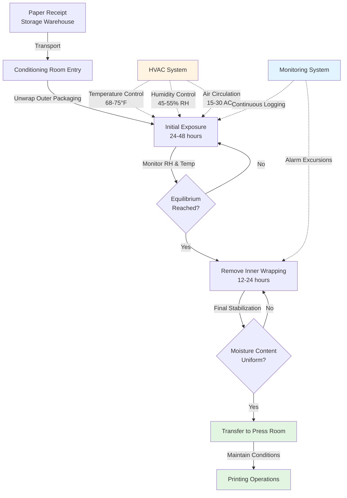

## Hygroscopic Behavior of Paper

Paper is a hygroscopic material that continuously exchanges moisture with surrounding air until equilibrium is reached. This moisture exchange directly affects dimensional stability, print registration, and surface properties.

The equilibrium moisture content (EMC) of paper follows an adsorption-desorption relationship governed by ambient conditions. At equilibrium, the rate of moisture absorption equals the rate of moisture desorption:

$$\frac{dM}{dt} = 0$$

where $M$ represents the moisture content of the paper (% by weight).

The moisture content at equilibrium relates to relative humidity through the sorption isotherm, approximated by the Henderson equation:

$$\text{RH} = 100 \left[1 - e^{-k_1 T (M)^{k_2}}\right]$$

where:
- RH = relative humidity (%)
- $T$ = absolute temperature (K)
- $M$ = equilibrium moisture content (decimal)
- $k_1$, $k_2$ = material-specific constants

For typical printing papers, moisture content varies with relative humidity according to:

$$M = \frac{18 \cdot K \cdot \text{RH}}{(100 - \text{RH}) + K \cdot \text{RH}}$$

where $K$ is the paper's hygroscopic coefficient (typically 0.8-1.2 for printing papers).

## Paper Conditioning Process

Paper must acclimate to printing room conditions for 24-72 hours before use to prevent dimensional changes during printing. The conditioning process follows a defined sequence:

## Dimensional Stability Requirements

Paper dimensions change with moisture content according to the hygroscopic expansion coefficient:

$$\Delta L = L_0 \cdot \alpha_h \cdot \Delta M$$

where:
- $\Delta L$ = dimensional change (mm)
- $L_0$ = original dimension (mm)
- $\alpha_h$ = hygroscopic expansion coefficient (0.01-0.015 per % moisture change)
- $\Delta M$ = moisture content change (%)

For multi-color printing requiring registration within ±0.1 mm, the allowable moisture content variation is:

$$\Delta M_{\text{max}} = \frac{\Delta L_{\text{tol}}}{L \cdot \alpha_h} = \frac{0.1}{L \cdot 0.012}$$

For a 1000 mm web width, this limits moisture variation to ±0.8%, requiring tight humidity control (±3% RH).

## Conditioning Requirements by Paper Type

Different paper grades require specific environmental conditions for optimal dimensional stability and print quality:

| Paper Type | Target RH (%) | RH Tolerance (±%) | Target Temp (°F) | Conditioning Time (hrs) | Target Moisture Content (%) |
|------------|---------------|-------------------|------------------|-------------------------|----------------------------|
| Coated Offset | 50-55 | 2-3 | 70-75 | 48-72 | 5.5-6.5 |
| Uncoated Offset | 45-50 | 3-4 | 68-73 | 36-48 | 6.0-7.0 |
| Newsprint | 45-50 | 4-5 | 68-72 | 24-36 | 7.0-8.0 |
| Coated Book | 48-52 | 2 | 70-74 | 48-72 | 5.0-6.0 |
| Label Stock | 50-55 | 2 | 72-75 | 48-96 | 5.5-6.5 |
| Bond/Writing | 45-50 | 3 | 68-73 | 24-48 | 5.5-6.5 |
| Corrugated | 50-60 | 5 | 70-80 | 24-48 | 8.0-10.0 |

## HVAC System Design Considerations

### Temperature Control

Maintain stable temperature within ±2°F to prevent relative humidity fluctuations. The relationship between temperature change and RH deviation at constant absolute humidity is:

$$\frac{\Delta \text{RH}}{\text{RH}} \approx -\frac{\Delta T}{T} \cdot \left(5 - \frac{T_{\text{dp}}}{T}\right)$$

where $T_{\text{dp}}$ is the dew point temperature.

A 5°F temperature drop at 70°F and 50% RH causes RH to increase by approximately 10%, potentially causing paper to absorb excess moisture.

### Humidity Control

Active humidification and dehumidification systems maintain target RH. Required moisture addition rate:

$$\dot{m}_w = \frac{\rho \cdot Q \cdot (\omega_{\text{set}} - \omega_{\text{in}})}{60}$$

where:
- $\dot{m}_w$ = moisture addition rate (lb/hr)
- $\rho$ = air density (lb/ft³)
- $Q$ = airflow rate (CFM)
- $\omega$ = humidity ratio (lb moisture/lb dry air)

### Air Distribution

Uniform air distribution prevents localized moisture gradients. Air velocity over paper stacks should not exceed 50 FPM to avoid surface drying while maintaining adequate mixing (15-30 air changes per hour).

## Industry Standards

**GATF (Graphic Arts Technical Foundation)** recommends 68-72°F and 45-55% RH for most printing operations.

**TAPPI T402** specifies standard conditioning at 73°F ± 2°F and 50% ± 2% RH for paper testing.

**ISO 187** defines conditioning at 23°C ± 1°C and 50% ± 2% RH as the international standard atmosphere for paper testing.

## Monitoring and Control

Implement continuous monitoring with sensors distributed throughout the conditioning space (minimum one sensor per 2,000 sq ft). Data logging intervals should not exceed 15 minutes to capture transient conditions that affect paper quality.

Critical alarm thresholds typically set at:
- High RH: +5% above setpoint
- Low RH: -5% below setpoint
- High Temperature: +3°F above setpoint
- Low Temperature: -3°F below setpoint

These thresholds balance operational flexibility with paper quality requirements, preventing conditions that cause dimensional instability while avoiding nuisance alarms.
