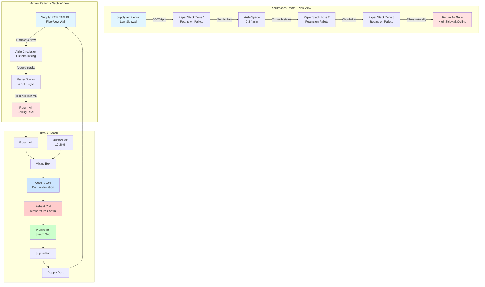

# Paper Acclimation for Print Production

Paper acclimation is the controlled process of bringing paper stock to moisture equilibrium with the press room environment before printing. This critical step prevents dimensional changes during printing that would cause registration errors, web breaks, and quality defects. The process is governed by diffusion physics, with equilibration times ranging from 24 hours for lightweight sheets to 72+ hours for heavy board stock, depending on stack thickness, permeability, and environmental conditions.

## Diffusion Fundamentals

### Moisture Transport Mechanism

Moisture movement through paper follows Fick's second law of diffusion:

$$\frac{\partial C}{\partial t} = D \frac{\partial^2 C}{\partial x^2}$$

Where:
- $C$ = Moisture concentration (lb water/lb dry fiber)
- $t$ = Time (hours)
- $D$ = Diffusion coefficient (in²/h)
- $x$ = Distance through paper thickness (in)

**Physical interpretation:** Moisture concentration gradients drive water molecules from high to low concentration regions through the porous fiber network. The diffusion coefficient $D$ depends on paper porosity, fiber structure, and temperature.

**Typical diffusion coefficients:**

| Paper Type | Porosity | D (in²/h) | Relative Rate |
|------------|----------|-----------|---------------|
| Newsprint | High (60-70%) | 0.015-0.025 | Fast |
| Uncoated offset | Medium (50-60%) | 0.008-0.015 | Moderate |
| Coated gloss | Low (30-40%) | 0.003-0.008 | Slow |
| Paperboard | Low (25-35%) | 0.002-0.005 | Very slow |

**Critical observation:** Coating layers significantly reduce diffusion rates by sealing fiber surfaces and reducing permeability. Two-sided coated stocks require 2-3× longer acclimation than uncoated papers of similar basis weight.

### Temperature Effects on Diffusion

Diffusion coefficient increases exponentially with temperature (Arrhenius relationship):

$$D(T) = D_0 \times e^{-E_a/(RT)}$$

Where:
- $D_0$ = Pre-exponential factor (in²/h)
- $E_a$ = Activation energy (Btu/lb-mol)
- $R$ = Gas constant (1.986 Btu/lb-mol·°R)
- $T$ = Absolute temperature (°R)

**Practical impact:**

Increasing storage temperature from 65°F to 75°F:
- Temperature ratio: (75+460)/(65+460) = 1.019
- Diffusion rate increase: ~15-20%
- Acclimation time reduction: 12-16 hours → 10-14 hours

**Design recommendation:** Maintain acclimation rooms at 70-75°F to accelerate equilibration while avoiding thermal damage or excessive energy consumption above 80°F.

## Acclimation Time Calculations

### Simplified Estimation Method

For paper stacks where moisture must diffuse through multiple sheets, the characteristic acclimation time is:

$$t_{acclim} = \frac{L^2}{4D}$$

Where:
- $t_{acclim}$ = Time to reach 95% equilibrium (hours)
- $L$ = Half-thickness of stack (in)
- $D$ = Diffusion coefficient (in²/h)

**Example calculation:**

Skid of coated offset stock:
- Stack height: 36 in
- Half-thickness: $L = 18$ in
- Diffusion coefficient: $D = 0.006$ in²/h

$$t_{acclim} = \frac{(18)^2}{4 \times 0.006} = \frac{324}{0.024} = 13,500 \text{ hours} = 563 \text{ days}$$

**Critical insight:** This calculation reveals why full-skid acclimation is impractical. Pallet wrapping must be removed and stacks broken down to enable edge diffusion from all sides.

### Stack Configuration Optimization

**Ream-level acclimation (recommended approach):**

Individual reams (500 sheets) stacked with air gaps:
- Ream thickness: ~2 in
- Half-thickness: $L = 1$ in
- Diffusion coefficient: $D = 0.006$ in²/h

$$t_{acclim} = \frac{(1)^2}{4 \times 0.006} = \frac{1}{0.024} = 41.7 \text{ hours} \approx 42 \text{ hours}$$

**Standard practice:** Allow 48-72 hours for ream-level acclimation to ensure complete equilibration through stack centerline.

### Detailed Acclimation Time by Paper Weight

The following table provides acclimation times for paper stacks configured as individual reams with 1-2 in air gaps for edge diffusion:

| Basis Weight | Paper Type | Ream Thickness | D (in²/h) | 95% Equilibrium | Recommended |
|--------------|------------|----------------|-----------|-----------------|-------------|
| 20 lb text | Uncoated bond | 1.5 in | 0.012 | 24 hours | 30 hours |
| 50 lb text | Uncoated offset | 2.0 in | 0.010 | 34 hours | 40 hours |
| 60 lb text | Coated gloss | 2.2 in | 0.006 | 56 hours | 65 hours |
| 80 lb text | Coated gloss | 2.8 in | 0.006 | 90 hours | 96 hours |
| 100 lb cover | Coated cover | 1.8 in | 0.005 | 70 hours | 78 hours |
| 12 pt board | SBS board | 1.2 in | 0.004 | 82 hours | 90 hours |

**Design considerations:**
- Times assume reams unwrapped or in perforated packaging
- Solid polyethylene wrapping blocks moisture transfer (remove 24+ hours before use)
- Air circulation around stacks reduces boundary layer resistance
- Higher environmental RH accelerates equilibration slightly (surface moisture increases diffusion)

## Acclimation Room Design

### Environmental Control Specifications

**Target conditions (per TAPPI T402):**

| Parameter | Specification | Tolerance | Control Method |
|-----------|---------------|-----------|----------------|
| Temperature | 73°F ± 2°F (23°C ± 1°C) | ±2°F | Precision HVAC |
| Relative humidity | 50% ± 2% RH | ±2% RH | Humidification/dehumidification |
| Air velocity | 25-75 fpm | Gentle circulation | Low-velocity distribution |
| Uniformity (spatial) | ±1°F, ±1% RH | Room-wide | Multiple supply points |

**TAPPI standard conditioning:** 73°F and 50% RH represents "standard atmosphere" for testing and quality control. Many commercial facilities use 70-75°F and 45-55% RH as acceptable working range.

**Critical design requirements:**
- Temperature stability prevents cycling that drives moisture in/out of paper
- RH precision ensures consistent equilibrium moisture content (EMC)
- Low air velocity avoids surface drying that creates moisture gradients
- Spatial uniformity eliminates variation between different storage locations

### Room Layout and Airflow Strategy

**Design approach:**

1. **Supply air distribution:** Low-sidewall grilles or floor-mounted diffusers deliver conditioned air horizontally across room at 50-75 fpm velocity
2. **Stack arrangement:** Pallets arranged in rows with 2-3 ft aisles between for airflow penetration
3. **Return air location:** High sidewall or ceiling return captures air after circulation through storage area
4. **Air changes:** 4-8 ACH provides adequate mixing without excessive velocity

### Storage Configuration Best Practices

**Pallet stacking:**
- Remove solid plastic wrapping (blocks moisture transfer)
- Separate reams with 1-2 in spacers (wood strips, plastic grid)
- Maintain 6-12 in clearance between pallet rows (airflow access)
- Limit stack height to 4-5 ft (stability and airflow)

**Room capacity:**
- Allow 25-30 ft² floor area per pallet (including aisles)
- Typical room: 2,000 ft² stores 60-80 pallets
- Production rate drives required capacity (3-7 days inventory)

**FIFO management:**
- Mark pallets with receipt date and acclimation start time
- Use oldest stock first (first-in, first-out)
- Minimum 48-hour acclimation before release to press room
- Electronic tracking system prevents premature use

## TAPPI Conditioning Standards

### TAPPI T402 Standard Conditioning

**Purpose:** Establish uniform moisture content for testing and quality control procedures.

**Standard atmosphere:**
- Temperature: 73°F ± 2°F (23.0°C ± 1.0°C)
- Relative humidity: 50% ± 2% RH
- Equilibration time: Minimum 24 hours, or until successive weighings 1 hour apart differ by < 0.25%

**Test specimen conditioning:**

For laboratory testing (tensile strength, tear resistance, dimensional stability):
1. Place specimens in conditioning room at standard atmosphere
2. Allow unrestricted air circulation around specimens
3. Monitor weight change until equilibrium (<0.1% change per hour)
4. Typical equilibration: 4-24 hours depending on specimen thickness

**Equilibrium moisture content (EMC) at 73°F, 50% RH:**

| Paper Type | EMC (%) | Basis |
|------------|---------|-------|
| Newsprint | 7.5-8.5% | % moisture/dry weight |
| Uncoated offset | 6.5-7.5% | % moisture/dry weight |
| Coated gloss | 5.0-6.0% | % moisture/dry weight |
| Paperboard | 6.0-7.0% | % moisture/dry weight |

**Quality control application:** Maintain paper at EMC corresponding to press room conditions prevents dimensional change during printing.

### TAPPI T410 Moisture Content Measurement

**Oven-dry method (standard reference):**

1. Weigh conditioned specimen to nearest 0.001 g
2. Dry in forced-air oven at 105°C ± 2°C for 4 hours minimum
3. Cool in desiccator to room temperature
4. Weigh oven-dry specimen
5. Calculate moisture content:

$$MC = \frac{W_{wet} - W_{dry}}{W_{dry}} \times 100\%$$

**Field verification method (microwave moisture analyzer):**

Rapid measurement (3-5 minutes) using:
- Precision balance (0.001 g resolution)
- Halogen heating element (150°C typical)
- Real-time weight monitoring
- Automatic shutoff at weight stability

**Acceptance criteria:**
- Press room paper: MC within ±1% of target EMC
- Example: 50% RH target (EMC = 7.0%) → acceptable range 6.5-7.5%
- Out-of-spec material requires additional acclimation time

## Troubleshooting Acclimation Issues

### Inadequate Equilibration Time

**Symptom:** Paper exhibits dimensional change during printing despite acclimation period.

**Root causes:**
- Insufficient time for diffusion through stack center
- Plastic wrapping not removed (blocks moisture transfer)
- Stack configuration too dense (no air gaps between reams)

**Diagnostic test:**

Measure moisture content of outer vs. inner sheets in ream:
- Acceptable: < 0.5% MC difference
- Problem: > 1.0% MC difference indicates incomplete equilibration

**Correction:**
- Extend acclimation period by 24-48 hours
- Break down large stacks into smaller units with air gaps
- Verify packaging removed and air circulation adequate

### Environmental Variation

**Symptom:** Paper moisture content varies between different storage locations in acclimation room.

**Root causes:**
- Temperature stratification (warm ceiling, cool floor)
- RH variation (inadequate mixing, local humidification)
- Dead zones (insufficient air circulation)

**Measurement protocol:**

Survey room conditions at multiple locations:
- 9-point grid (3×3 pattern at pallet height)
- Measure T and RH at each point
- Acceptable variation: ±1°F, ±2% RH
- Problematic variation: >±2°F, >±3% RH

**Correction:**
- Increase air circulation (higher CFM or ceiling fans)
- Add supply diffusers to eliminate dead zones
- Relocate return grilles for better air patterns
- Install humidifier distribution manifold (multiple injection points)

### Press Room Mismatch

**Symptom:** Paper equilibrated to acclimation room conditions changes dimensions when transferred to press room.

**Root cause:** Acclimation room conditions differ from press room environment.

**Example scenario:**
- Acclimation room: 73°F, 50% RH (EMC = 7.0%)
- Press room: 70°F, 55% RH (EMC = 7.5%)
- Dimensional change: 0.3-0.5% expansion after transfer

**Solution:**

Match acclimation room to press room conditions:
1. Survey actual press room T and RH over production cycle
2. Calculate time-weighted average conditions
3. Set acclimation room to match press room average (±1°F, ±1% RH)
4. Verify with moisture content measurements before printing

**Alternative approach:** Condition to press room conditions ±1% RH buffer to account for daily variations without exceeding registration tolerances.

## System Integration with Press Operations

### Workflow Timing

**Production scheduling considerations:**

Minimum elapsed time from receiving to press:
- Paper delivery and inspection: 4 hours
- Pallet breakdown and acclimation setup: 2 hours
- Acclimation period: 48-72 hours (paper dependent)
- Transfer to press room and press prep: 2-4 hours
- **Total lead time: 60-80 hours (2.5-3.5 days)**

**Inventory management:** Maintain 5-7 days acclimated stock for continuous production without emergency rush jobs using non-equilibrated paper.

### Quality Verification Protocol

**Pre-press checklist:**

1. **Visual inspection:**
   - No visible moisture (condensation, wetness)
   - No edge curl or waviness (moisture gradient indicators)
   - Consistent appearance across all reams

2. **Moisture content verification:**
   - Sample 3-5 reams from different pallet locations
   - Measure MC using microwave analyzer or oven method
   - Acceptance: All samples within ±0.5% of target EMC

3. **Dimensional stability test (critical jobs):**
   - Condition test sheet to press room atmosphere (4 hours minimum)
   - Measure dimensions with precision scale (0.001 in resolution)
   - Transfer to different RH environment (+10% RH)
   - Remeasure after 1 hour exposure
   - Acceptable change: < 0.010 in per 40 in dimension

**Documentation:** Record acclimation start/end times, environmental conditions, moisture content measurements, and approval signature before releasing stock to production.

---

*Paper acclimation is a diffusion-limited process requiring 48-72 hours for moisture equilibration through ream-thickness stacks under controlled temperature and humidity conditions matching the press room environment, with acclimation time proportional to the square of stack thickness and inversely proportional to diffusion coefficient, making proper storage configuration and environmental control essential for maintaining dimensional stability during high-quality printing operations.*
