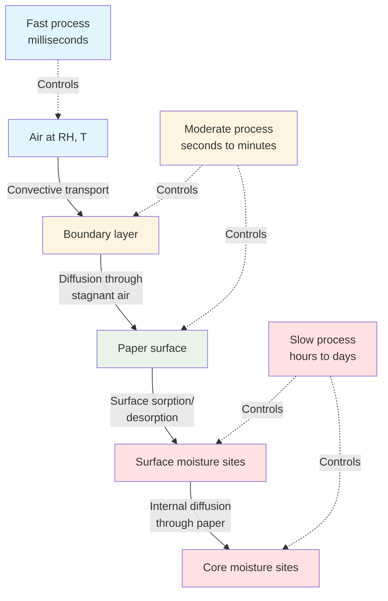

Moisture equilibrium between paper and surrounding air governs dimensional stability, electrical properties, and print quality in commercial printing operations. Understanding equilibrium moisture content (EMC) thermodynamics and diffusion kinetics enables precise environmental control design for paper conditioning systems. This physics-based approach ensures paper reaches stable moisture content before entering the press, preventing registration errors, curl, and static electricity problems.

## Fundamentals of Hygroscopic Equilibrium

Paper behaves as a hygroscopic material—continuously exchanging moisture with surrounding air until thermodynamic equilibrium establishes between vapor pressure in air and vapor pressure within the paper structure.

### Vapor Pressure Equilibrium

Moisture equilibrium occurs when the partial pressure of water vapor in air equals the vapor pressure at the paper surface:

$$p_{air} = p_{surface}$$

At equilibrium:

$$p_{air} = RH \cdot p_{sat}(T)$$

$$p_{surface} = a_w \cdot p_{sat}(T)$$

Where:
- $p_{air}$ = partial pressure of water vapor in air (psia)
- $p_{surface}$ = vapor pressure at paper surface (psia)
- $RH$ = relative humidity (decimal, 0-1)
- $a_w$ = water activity in paper (decimal, 0-1)
- $p_{sat}(T)$ = saturation vapor pressure at temperature $T$ (psia)

Therefore, at equilibrium: $a_w = RH$

This fundamental relationship connects air relative humidity to paper moisture content through the sorption isotherm.

### Cellulose Fiber Moisture Sites

Cellulose molecular structure provides three distinct moisture binding mechanisms:

**Primary hydroxyl sites:** Hydroxyl groups (-OH) on cellulose molecules form hydrogen bonds with individual water molecules. These sites fill first at low RH (0-20%), creating a tightly bound monomolecular water layer. Binding energy: 10-12 kcal/mol.

**Secondary hydroxyl sites:** Additional hydroxyl groups become accessible as initial water molecules slightly separate cellulose chains. Fill at moderate RH (20-50%). Binding energy: 6-8 kcal/mol.

**Capillary spaces:** Microscopic voids between fibers and fiber cell wall layers fill through capillary condensation at high RH (50-95%). Water exists in liquid state within these spaces. Binding energy approaches heat of vaporization: 10.5 kcal/mol at 73°F.

The distribution across these three categories determines the shape of the sorption isotherm and the hygroexpansion response.

### Water Activity and EMC

Water activity $a_w$ quantifies the availability of moisture within paper structure:

$$a_w = \frac{p_{surface}}{p_{sat}(T)}$$

At equilibrium, water activity equals relative humidity:

$$a_w = RH$$

This relationship enables calculation of equilibrium moisture content from relative humidity using empirically determined sorption isotherms specific to each paper grade.

## Sorption Isotherm Models

Sorption isotherms mathematically describe the relationship between equilibrium moisture content and relative humidity at constant temperature. Multiple models exist with varying accuracy and complexity.

### Guggenheim-Anderson-de Boer (GAB) Model

The GAB equation provides the most accurate EMC prediction across the full RH range (0-95%):

$$EMC = \frac{M_0 \cdot C \cdot K \cdot a_w}{(1 - K \cdot a_w)[1 + (C - 1) \cdot K \cdot a_w]}$$

Where:
- $EMC$ = equilibrium moisture content (% dry basis)
- $M_0$ = monolayer moisture content (%)
- $C$ = Guggenheim constant related to monolayer sorption energy
- $K$ = factor related to multilayer sorption properties
- $a_w$ = water activity = $RH/100$ (decimal)

**Typical parameter values for printing papers:**

| Paper Type | $M_0$ (%) | $C$ | $K$ | Valid RH Range |
|------------|-----------|-----|-----|----------------|
| Coated offset | 4.2-4.8 | 8-12 | 0.80-0.88 | 10-90% RH |
| Uncoated offset | 5.0-6.0 | 6-10 | 0.82-0.92 | 10-90% RH |
| Coated label stock | 3.8-4.5 | 10-15 | 0.78-0.85 | 10-90% RH |
| Newsprint | 5.5-6.5 | 5-8 | 0.85-0.94 | 10-90% RH |

The monolayer moisture content $M_0$ represents the moisture level at which a complete single layer of water molecules covers all available cellulose hydroxyl sites—typically occurring at 20-25% RH.

### Henderson Equation

The Henderson equation offers simpler two-parameter fitting with good accuracy in the operational range (30-70% RH):

$$EMC = \left[-\frac{\ln(1 - RH/100)}{A}\right]^{1/B}$$

Where $A$ and $B$ are empirical constants.

For typical coated offset paper: $A = 0.00085$, $B = 1.45$

This model proves particularly useful for HVAC control system calculations where computational simplicity matters.

### Linear Approximation

Within the narrow operational range common in printing plants (45-55% RH), a linear approximation provides adequate accuracy:

$$EMC \approx m \cdot RH + b$$

For coated paper at 73°F:
- $m = 0.095$ to 0.105 (%/% RH)
- $b = 2.8$ to 3.2 (%)

**Example calculation:**
At 50% RH: $EMC = 0.10 \times 50 + 3.0 = 8.0\%$

This simplified relationship enables rapid estimation of moisture content changes from RH variations.

### Temperature Effects on Sorption

Temperature significantly affects the sorption isotherm through both thermodynamic and kinetic mechanisms. Higher temperature reduces EMC at constant RH due to increased molecular energy overcoming hydrogen bonding.

The modified GAB equation incorporates temperature dependence:

$$M_0(T) = M_{0,ref} \cdot \exp\left[\frac{\Delta H_m}{R}\left(\frac{1}{T} - \frac{1}{T_{ref}}\right)\right]$$

$$C(T) = C_{ref} \cdot \exp\left[\frac{\Delta H_C}{R}\left(\frac{1}{T} - \frac{1}{T_{ref}}\right)\right]$$

Where:
- $\Delta H_m$ = enthalpy of monolayer sorption (typically 2000-3000 cal/mol)
- $\Delta H_C$ = differential enthalpy (typically 1500-2500 cal/mol)
- $R$ = universal gas constant (1.987 cal/mol·K)
- $T$ = absolute temperature (K)
- $T_{ref}$ = reference temperature (typically 296 K = 73°F)

Practical impact: A 10°F temperature increase reduces EMC by approximately 0.3-0.5% at 50% RH.

## Equilibrium Moisture Content at Operating Conditions

Printing plants typically operate within a narrow environmental window. Understanding EMC values across this range enables precise moisture control.

### EMC Table for Typical Printing Conditions

Equilibrium moisture content for standard coated offset paper (GAB parameters: $M_0 = 4.5\%$, $C = 10$, $K = 0.84$):

| RH (%) | EMC at 70°F (%) | EMC at 73°F (%) | EMC at 76°F (%) | $\Delta EMC/°F$ (%/°F) |
|--------|----------------|----------------|----------------|---------------------|
| 35 | 6.2 | 6.0 | 5.8 | -0.04 |
| 40 | 6.8 | 6.6 | 6.4 | -0.04 |
| 45 | 7.4 | 7.2 | 7.0 | -0.04 |
| 50 | 8.1 | 7.9 | 7.6 | -0.05 |
| 55 | 8.9 | 8.6 | 8.3 | -0.06 |
| 60 | 9.7 | 9.4 | 9.1 | -0.06 |
| 65 | 10.7 | 10.3 | 10.0 | -0.07 |
| 70 | 11.8 | 11.4 | 11.0 | -0.08 |

Standard reference conditions per TAPPI T 402: 73°F (23°C), 50% RH → EMC = 7.9%

### Sensitivity Analysis

The rate of EMC change with RH determines required environmental control precision:

$$\frac{dEMC}{dRH} = \frac{M_0 \cdot C \cdot K \cdot [1 + (C-1)K]}{[1 - K \cdot a_w]^2 \cdot [1 + (C-1) \cdot K \cdot a_w]^2}$$

At operational conditions (50% RH, 73°F) for coated offset paper:

$$\frac{dEMC}{dRH} \approx 0.12 \text{ %moisture per %RH}$$

This indicates:
- 1% RH change → 0.12% moisture content change
- 5% RH swing → 0.60% moisture content variation
- 10% RH deviation → 1.2% moisture content shift

Since hygroexpansion coefficient for paper cross-direction is typically 0.08-0.12%/% moisture, a 5% RH swing produces approximately 0.05-0.07% dimensional change—often exceeding tight registration tolerances.

## Moisture Diffusion Kinetics

Reaching equilibrium requires time for moisture to diffuse through paper thickness. Understanding diffusion kinetics enables proper conditioning time calculation.

### Fick's Second Law for Transient Diffusion

Moisture transport through paper follows Fick's second law:

$$\frac{\partial M}{\partial t} = D \frac{\partial^2 M}{\partial z^2}$$

Where:
- $M$ = local moisture content (%, function of position $z$ and time $t$)
- $D$ = moisture diffusivity (ft²/hr or cm²/s)
- $z$ = thickness coordinate (ft or cm)
- $t$ = time (hr or s)

For paper exposed to sudden RH change, the solution for average moisture content versus time:

$$\frac{M(t) - M_0}{M_{eq} - M_0} = 1 - \frac{8}{\pi^2} \sum_{n=0}^{\infty} \frac{1}{(2n+1)^2} \exp\left[-\frac{(2n+1)^2 \pi^2 D t}{h^2}\right]$$

Where:
- $M(t)$ = average moisture content at time $t$ (%)
- $M_0$ = initial moisture content (%)
- $M_{eq}$ = equilibrium moisture content (%)
- $h$ = paper thickness (ft or cm)

For practical calculations, the first term dominates:

$$\frac{M(t) - M_0}{M_{eq} - M_0} \approx 1 - \frac{8}{\pi^2} \exp\left[-\frac{\pi^2 D t}{h^2}\right]$$

### Moisture Diffusivity Values

Moisture diffusivity varies with paper grade, moisture content, and temperature:

| Paper Type | Diffusivity $D$ at 50% RH (cm²/s) | Diffusivity $D$ at 50% RH (ft²/hr) |
|------------|----------------------------------|----------------------------------|
| Coated offset (lightweight) | $2.5 \times 10^{-7}$ to $4.0 \times 10^{-7}$ | $0.97 \times 10^{-6}$ to $1.55 \times 10^{-6}$ |
| Coated offset (heavyweight) | $1.5 \times 10^{-7}$ to $2.5 \times 10^{-7}$ | $0.58 \times 10^{-6}$ to $0.97 \times 10^{-6}$ |
| Uncoated offset | $3.5 \times 10^{-7}$ to $5.5 \times 10^{-7}$ | $1.36 \times 10^{-6}$ to $2.13 \times 10^{-6}$ |
| Newsprint | $4.5 \times 10^{-7}$ to $7.0 \times 10^{-7}$ | $1.74 \times 10^{-6}$ to $2.71 \times 10^{-6}$ |
| Coated paperboard | $0.8 \times 10^{-7}$ to $1.5 \times 10^{-7}$ | $0.31 \times 10^{-6}$ to $0.58 \times 10^{-6}$ |

Diffusivity increases with moisture content (higher RH) and temperature. Coating reduces diffusivity by creating a barrier layer.

### Equilibration Time Constant

The characteristic time for moisture equilibration:

$$\tau = \frac{h^2}{\pi^2 D}$$

At time $t = \tau$, moisture content reaches approximately 92% of equilibrium value.

**Example calculation for 0.004-inch coated paper:**
- Thickness: $h = 0.004$ inch = $0.000333$ ft = $0.0102$ cm
- Diffusivity: $D = 2.5 \times 10^{-7}$ cm²/s = $0.97 \times 10^{-6}$ ft²/hr

$$\tau = \frac{(0.0102)^2}{\pi^2 \times 2.5 \times 10^{-7}} = 0.0042 \text{ seconds} = 4.2 \text{ milliseconds}$$

Wait—this extremely short time constant applies only to through-thickness diffusion for thin paper. The limiting factor in practical conditioning is actually edge-to-center diffusion in rolls and stacks.

### Roll and Stack Conditioning Time

Paper delivered in rolls or stacks requires moisture diffusion from exposed edges toward the center. This lateral diffusion path, measured in inches rather than thousandths of inches, dominates conditioning time.

For a roll of diameter $D_{roll}$ exposed to ambient RH:

$$\tau_{roll} = \frac{D_{roll}^2}{4\pi^2 D}$$

**Example for 40-inch diameter roll:**
- Roll diameter: $D_{roll} = 40$ inches = $3.33$ ft = $102$ cm
- Effective diffusivity: $D = 2.5 \times 10^{-7}$ cm²/s = $2.5 \times 10^{-7} \times 3600 = 9.0 \times 10^{-4}$ cm²/hr

$$\tau_{roll} = \frac{(102)^2}{4\pi^2 \times 9.0 \times 10^{-4}} = \frac{10404}{0.0355} = 293,000 \text{ hours}$$

This unrealistic value demonstrates that intact rolls cannot equilibrate through diffusion alone. Successful conditioning requires:

1. **Removing outer wrapping** to expose paper edges
2. **Separating sheets** in stacks to increase surface area
3. **Extended conditioning time** for center material to equilibrate

Practical conditioning time for unwrapped rolls: 48-120 hours depending on roll diameter and RH differential.

## Moisture Exchange Between Paper and Air

Understanding the physical processes governing moisture exchange enables optimization of conditioning room design and operation.

### Mass Transfer Resistance Network

Total resistance to moisture equilibration consists of three components in series:

$$\frac{1}{k_{overall}} = \frac{1}{k_{convection}} + \frac{1}{k_{surface}} + \frac{1}{k_{diffusion}}$$

Where:
- $k_{convection}$ = convective mass transfer coefficient (ft/hr)
- $k_{surface}$ = surface sorption rate coefficient (ft/hr)
- $k_{diffusion}$ = internal diffusion coefficient (ft/hr)

For typical conditioning room conditions (air velocity 50-100 fpm):
- Convective resistance: 5-10% of total
- Surface sorption resistance: 10-20% of total
- Internal diffusion resistance: 70-85% of total

This analysis confirms that internal diffusion limits overall equilibration rate, justifying focus on minimizing diffusion path length through proper paper handling.

### Moisture Flux Calculation

Moisture transfer rate from air to paper surface:

$$\dot{m} = h_m \cdot A \cdot \rho_{air} \cdot (W_{air} - W_{surface})$$

Where:
- $\dot{m}$ = moisture transfer rate (lb/hr)
- $h_m$ = mass transfer coefficient (ft/hr)
- $A$ = exposed surface area (ft²)
- $\rho_{air}$ = air density (lb/ft³)
- $W_{air}$ = air humidity ratio (lb water/lb dry air)
- $W_{surface}$ = surface equilibrium humidity ratio (lb water/lb dry air)

The mass transfer coefficient relates to convective heat transfer coefficient through the Lewis relation:

$$h_m = \frac{h_c}{\rho_{air} \cdot c_{p,air} \cdot Le^{2/3}}$$

Where $Le$ = Lewis number $\approx 1.0$ for air-water vapor.

For free convection around paper stacks: $h_m \approx 3-5$ ft/hr
For forced convection (100 fpm air velocity): $h_m \approx 15-25$ ft/hr

This demonstrates the benefit of gentle air circulation in conditioning rooms—increasing air velocity from stagnant to 100 fpm reduces surface mass transfer resistance by factor of 5-8.

## HVAC Control Strategies for Equilibrium

Maintaining paper at equilibrium moisture content requires precise environmental control throughout storage and conditioning areas.

### Dew Point Control vs RH Control

Two fundamental control strategies exist:

**Relative humidity control:** Maintains constant RH setpoint regardless of temperature variations. Since EMC depends on RH, this approach theoretically maintains constant paper moisture content.

**Challenge:** RH varies with temperature even at constant absolute moisture. A 2°F temperature swing at 50% RH produces approximately ±3.5% RH change, causing 0.4% EMC variation.

**Dew point control:** Maintains constant absolute moisture content (dew point) in air. Combined with tight temperature control, this produces stable RH.

**Advantage:** Dew point-controlled systems respond to actual moisture content rather than the RH symptom, providing superior stability during temperature transients.

For precision printing operations requiring ±2% RH control, dew point control offers significant advantages:
- Temperature control: ±1.5°F combined with dew point control: ±0.05°F produces ±1.5% RH variation
- Temperature control: ±1.5°F with RH control produces ±3.0% RH variation during temperature swings

### Conditioning Room Design Parameters

Optimal conditioning room environmental parameters:

| Parameter | Setpoint | Tolerance | Control Method |
|-----------|----------|-----------|----------------|
| Temperature | 72-74°F | ±1.5°F | Direct expansion or chilled water cooling with reheat |
| Relative humidity | 50% RH | ±2% RH | Dew point control with steam or evaporative humidification |
| Dew point | 52-54°F | ±1.0°F | Preferred control parameter |
| Air velocity | 50-100 fpm | Gentle circulation | Low-velocity displacement ventilation |
| Air changes | 4-6 ACH | Minimum | Based on volume and moisture load |

### Seasonal Operational Challenges

Maintaining equilibrium conditions year-round requires addressing seasonal variations:

**Winter operation (outdoor 0-30°F, 20-40% RH):**
- Challenge: Heating incoming ventilation air from 30°F/40% RH to 73°F produces 8% RH, requiring massive humidification
- Strategy: Minimize outdoor air to code minimum (typically 0.05-0.10 cfm/ft²), maximize recirculation
- Humidification load: $\dot{m}_{humid} = \rho \cdot Q \cdot (W_{setpoint} - W_{outdoor})$ can reach 50-150 lb/hr per 10,000 ft² floor area

**Summer operation (outdoor 85-95°F, 60-80% RH):**
- Challenge: Dehumidification required to maintain 50% RH setpoint
- Strategy: Cooling below dew point followed by reheat to maintain temperature setpoint
- Dehumidification load: Can reach 75-200 lb/hr per 10,000 ft² floor area in humid climates

**Transition seasons:**
- Challenge: Rapid outdoor condition swings require agile system response
- Strategy: Predictive control algorithms anticipating outdoor condition changes

### Monitoring and Verification

Confirming that paper reaches equilibrium requires systematic monitoring:

**Air-side monitoring:**
- Temperature/RH sensors: ±1.0°F, ±2% RH accuracy, calibrated semi-annually
- Dew point sensors: ±1.0°F dew point accuracy for direct moisture control
- Placement: 1 sensor per 3,000-5,000 ft², positioned at paper storage height (3-5 feet elevation)

**Paper-side monitoring:**
- Handheld moisture meters: Capacitance or resistance-based, ±0.3% accuracy
- Measurement frequency: Daily for incoming paper, spot checks on conditioned paper
- Target: Paper moisture content within ±0.5% of calculated EMC from ambient RH

**Equilibrium verification:**
Paper reaches equilibrium when moisture content change <0.1% over 12-hour period.

## Practical Conditioning Protocols

Systematic conditioning protocols ensure paper reaches moisture equilibrium before printing.

### Incoming Paper Assessment

Upon delivery:

1. **Measure shipping conditions:** Record truck interior temperature and RH if possible
2. **Document packaging condition:** Note moisture barriers, wrapping integrity, exposure to weather
3. **Measure initial paper moisture:** Sample sheets from outer, middle, and core of roll/skid
4. **Calculate moisture differential:** Compare measured moisture to target EMC at press room conditions

**Decision criteria:**
- Moisture differential <1.0%: 24-hour minimum conditioning
- Moisture differential 1.0-2.0%: 48-hour conditioning
- Moisture differential >2.0%: 72-hour conditioning or reject if excessive

### Unwrapping and Exposure Protocol

Maximize exposed surface area while maintaining cleanliness:

**For rolls:**
1. Remove moisture barrier wrap 48+ hours before use
2. Remove outer 2-3 wraps if visibly different condition than core
3. Position rolls vertically on end to expose maximum circumferential area
4. Maintain 6-12 inch spacing between rolls for air circulation

**For skids:**
1. Remove shrink wrap and moisture barriers 48+ hours before use
2. Separate top 20-30% of stack with spacers (every 6-12 inches) to allow air penetration
3. Rotate stock FIFO (first in, first out) to ensure adequate conditioning time

### Time-Temperature-Humidity Integration

Conditioning effectiveness depends on exposure time at proper conditions. A time-temperature-humidity index quantifies accumulated conditioning:

$$CTI = \int_0^t \left(1 - \left|\frac{RH_{actual} - RH_{target}}{RH_{target}}\right|\right) \cdot \left(1 - \left|\frac{T_{actual} - T_{target}}{T_{target}}\right|\right) dt$$

Where $CTI$ = conditioning time index (hours).

Effective conditioning achieved when $CTI$ exceeds minimum threshold (typically 36-72 hours at target conditions).

This approach accounts for periods when conditioning room strays from setpoint, requiring extended conditioning time to compensate.

## Troubleshooting Equilibrium Problems

Common moisture equilibrium issues and corrective actions:

**Problem: Paper moisture content varies ±1-2% despite stable conditioning room RH**

*Root cause:* Incomplete equilibration due to insufficient conditioning time or inadequate air circulation

*Correction:*
- Extend conditioning time by 24-48 hours
- Increase air circulation velocity to 75-100 fpm
- Improve separation of sheets/rolls to reduce diffusion path

**Problem: Conditioned paper gains/loses moisture rapidly when moved to press**

*Root cause:* Significant RH differential between conditioning room and press floor

*Correction:*
- Verify press floor RH matches conditioning setpoint within ±3% RH
- Identify and seal outdoor air infiltration paths at press floor
- Balance HVAC system to achieve uniform conditions

**Problem: Seasonal variation in paper performance despite constant conditioning**

*Root cause:* Sorption hysteresis—paper conditioned from high moisture (summer) retains different properties than paper conditioned from low moisture (winter) even at identical final RH

*Correction:*
- Standardize supplier storage conditions year-round
- Implement receiving inspection rejecting paper outside ±2% moisture specification
- Consider pre-conditioning protocol: dry to 40% RH, then humidify to 50% RH to reset hysteresis regardless of incoming condition

Moisture equilibrium fundamentals provide the physical basis for maintaining dimensional stability and print quality through environmental control. Proper application of sorption thermodynamics, diffusion kinetics, and systematic conditioning protocols ensures paper enters the press at optimal moisture content for trouble-free operation.
