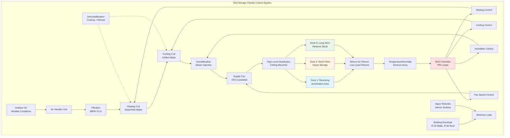

Paper roll storage areas require precise environmental control to ensure paper reaches thermal and moisture equilibrium before printing operations. The storage environment directly affects paper dimensional stability, moisture content, and print quality through heat and mass transfer processes between the roll and surrounding air.

## Thermal Equilibration Physics

Paper rolls delivered from outdoor conditions or different storage environments must equilibrate to press room conditions before use. The time required for temperature equalization depends on roll geometry, paper thermal properties, and convective heat transfer at the roll surface.

### Temperature Equalization Time

The characteristic time for a paper roll to reach thermal equilibrium follows transient heat conduction principles. For a cylindrical roll, the Fourier number determines the equalization rate:

$$\text{Fo} = \frac{\alpha t}{r^2}$$

Where:
- α = thermal diffusivity of paper (m²/s)
- t = time (s)
- r = roll radius (m)

The temperature at the roll center as a function of time can be approximated using the first term of the infinite series solution for radial heat conduction in a cylinder:

$$\frac{T(0,t) - T_\infty}{T_i - T_\infty} = A_1 e^{-\lambda_1^2 \text{Fo}}$$

For practical storage applications, the time to reach 95% equalization (where the core temperature is within 5% of ambient) is:

$$t_{95} = \frac{3.0 \cdot r^2}{\alpha}$$

For typical newsprint with α ≈ 1.5 × 10⁻⁷ m²/s and a 0.6 m diameter roll:

$$t_{95} = \frac{3.0 \times (0.3)^2}{1.5 \times 10^{-7}} = 1.8 \times 10^6 \text{ s} \approx 21 \text{ days}$$

This demonstrates why adequate storage time before printing is critical for dimensional stability.

## Moisture Equilibration

Paper is hygroscopic and exchanges moisture with surrounding air until reaching equilibrium moisture content (EMC). The relationship between relative humidity and EMC follows sorption isotherms specific to each paper grade. The mass transfer rate is governed by:

$$\frac{dm}{dt} = h_m A \rho_\text{air} (w_\text{surface} - w_\infty)$$

Where:
- h_m = mass transfer coefficient (m/s)
- A = surface area (m²)
- ρ_air = air density (kg/m³)
- w = humidity ratio (kg water/kg dry air)

Moisture equilibration typically occurs faster than thermal equilibration due to higher moisture diffusivity at paper surfaces. However, moisture gradients within thick rolls can persist for weeks.

## Storage Environment Requirements

The storage area must maintain conditions that match the target press room environment to prevent moisture cycling and dimensional changes during equilibration.

### Standard Storage Conditions by Paper Grade

| Paper Grade | Temperature | Relative Humidity | EMC Target | Critical Factors |
|-------------|-------------|-------------------|------------|------------------|
| Newsprint | 70-75°F (21-24°C) | 45-55% | 5-7% | Minimize cockling, curl |
| Coated Magazine | 72-77°F (22-25°C) | 40-50% | 4-6% | Prevent coating defects |
| Fine Writing | 68-72°F (20-22°C) | 50-60% | 6-8% | Dimensional stability |
| Label Stock | 70-75°F (21-24°C) | 40-50% | 4-6% | Adhesive performance |
| Lightweight Coated | 72-77°F (22-25°C) | 45-55% | 5-7% | Curl control |
| Uncoated Offset | 68-75°F (20-24°C) | 45-60% | 5-8% | Moisture uniformity |
| Specialty Grades | 70-75°F (21-24°C) | 35-65% | Varies | Per manufacturer specs |

Temperature tolerances: ±2°F (±1°C)
Humidity tolerances: ±5% RH

## Storage Area HVAC Design

## HVAC System Design Criteria

**Air Distribution**
- Supply air temperature offset: Maximum 10°F (5.5°C) above or below space setpoint
- Air change rate: 2-4 ACH typical for good mixing
- Supply air velocity at roll surface: Less than 100 fpm (0.5 m/s) to prevent surface drying
- Diffuser placement: High-level supply with low-level return for stratification control

**Humidity Control Strategy**
- Dehumidification: Cooling below dew point with reheat to maintain temperature
- Humidification: Clean steam injection for precise control and contamination prevention
- Control deadband: ±2% RH maximum to prevent hunting
- Sensor placement: Multiple locations at roll height, away from direct airflow

**Temperature Control**
- Heating: Modulating hot water or steam coils with face and bypass control
- Cooling: Chilled water coils with capacity for dehumidification duty
- Thermal mass consideration: Large paper inventory provides significant thermal capacitance
- Recovery time: System must handle 20°F (11°C) swing in 4-6 hours for rapid recovery

## Storage Best Practices

**Roll Handling Procedures**
- Allow minimum 48 hours acclimation for rolls from different temperature zones
- Store rolls on end to allow radial heat/moisture transfer from all surfaces
- Maintain 12-18 inch (0.3-0.45 m) spacing between rolls for air circulation
- Use first-in-first-out (FIFO) inventory rotation to ensure adequate conditioning time
- Protect rolls with polyethylene wrap until 24 hours before use
- Monitor core temperature with infrared thermometry before releasing to production

**Environmental Monitoring**
- Temperature sensors: ±0.5°F (±0.3°C) accuracy, calibrated annually
- Humidity sensors: ±2% RH accuracy, calibrated semi-annually
- Data logging: 15-minute intervals minimum for trend analysis
- Alarm setpoints: ±3°F (±1.7°C) and ±7% RH from setpoint

**Zoning Strategies**
- Receiving/acclimation zone: Transitional conditions for new deliveries
- Active storage: Conditioned to match press room exactly
- Long-term storage: May operate at broader tolerances for energy efficiency
- Separate zones for specialty papers with different requirements

## Energy Optimization

Paper storage areas represent significant HVAC energy consumption due to continuous conditioning requirements and large volumes. Energy optimization strategies include:

- Building envelope improvements: Minimize infiltration and conductive loads
- Heat recovery: Sensible and latent heat recovery from exhaust air
- Economizer operation: Free cooling when outdoor conditions permit
- Night setback: Limited application due to recovery time and moisture cycling concerns
- Demand-based ventilation: Reduce outdoor air during low-occupancy periods
- LED lighting with reduced heat gain compared to high-intensity discharge fixtures

The thermal mass of stored paper rolls dampens temperature swings, allowing some HVAC cycling without excessive environmental drift. However, humidity control must remain continuous to prevent moisture migration.

## System Performance Verification

Commission storage area HVAC systems with the following verification:

- Temperature uniformity survey: Less than 3°F (1.7°C) variation throughout space
- Humidity uniformity: Less than 5% RH variation at roll locations
- Air velocity measurement: Confirm low-velocity distribution at roll surfaces
- Control loop tuning: Verify stable control without hunting or excessive cycling
- Sensor calibration: Verify accuracy against reference standards
- Sequence of operations testing: Confirm proper staging and integration

Proper storage area conditioning prevents costly paper waste, press downtime, and print quality defects by ensuring paper arrives at the press in equilibrium with production environment conditions.
