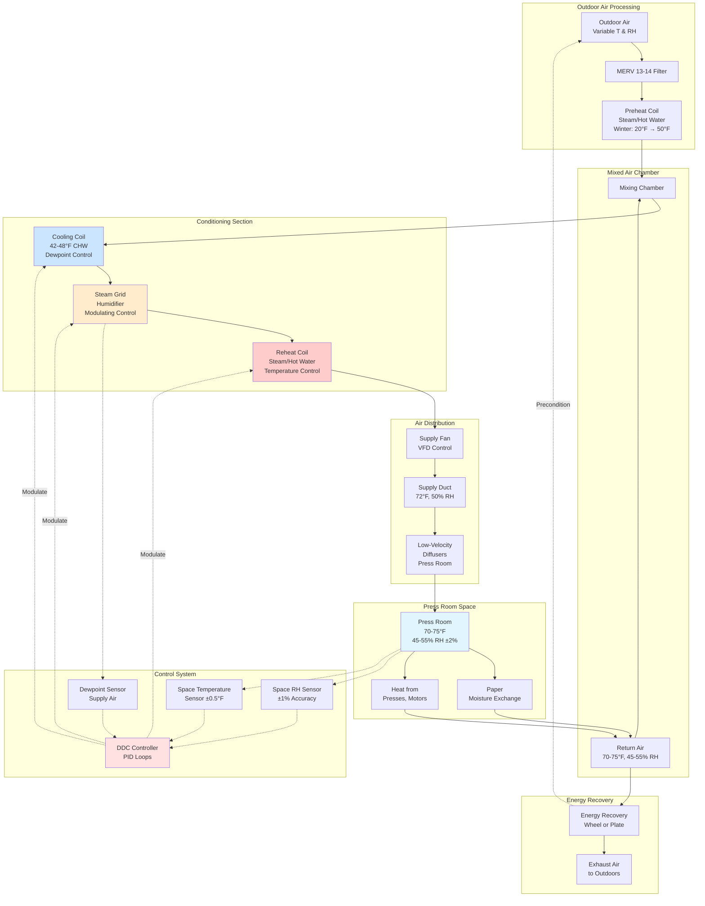

Paper dimensional stability in sheet-fed lithographic printing depends directly on precise humidity control. Paper fibers are hygroscopic cellulose structures that absorb or release moisture to equilibrate with ambient relative humidity. This moisture exchange causes dimensional changes in the cross-grain direction that range from 0.3% to 0.8% per 10% RH change, easily exceeding the ±0.010 to ±0.020 inch registration tolerances required for multi-color process printing on typical 25 × 38 inch sheets.

## Paper Moisture Physics

### Hygroscopic Behavior of Cellulose

Paper consists of cellulose fibers containing hydroxyl (-OH) groups along the polymer chains. These polar groups form hydrogen bonds with water molecules, allowing paper to absorb moisture from humid air or release moisture to dry air until reaching equilibrium moisture content (EMC).

The equilibrium moisture content follows the sorption isotherm relationship, which describes the nonlinear correlation between relative humidity and paper moisture content:

$$EMC = \frac{1800}{M_w} \times \frac{C \times \phi}{(1 - K \times \phi)(1 + (C-1) \times K \times \phi)}$$

Where:
- $EMC$ = Equilibrium moisture content (% dry basis)
- $M_w$ = Molecular weight of water (18 g/mol)
- $\phi$ = Relative humidity (decimal, 0-1)
- $C$, $K$ = Material constants for specific paper type
- Typical EMC range: 5-9% at 40-60% RH

The moisture distribution within paper fibers occurs through three mechanisms:

1. **Surface adsorption**: Water molecules form monolayer coverage on fiber surfaces at low RH (< 30%)
2. **Multilayer adsorption**: Additional water layers build up at moderate RH (30-70%)
3. **Capillary condensation**: Liquid water fills fiber pores at high RH (> 70%)

### Fiber Swelling Mechanics

Water molecules penetrate cellulose fiber cell walls, inserting between cellulose chains and forcing them apart. This molecular-scale separation manifests as macroscopic fiber swelling.

Fiber diameter increases approximately 30% when going from bone-dry to saturated conditions, while fiber length changes less than 1%. This anisotropic swelling behavior creates directional dimensional changes in paper sheets:

**Cross-grain direction**: Fibers aligned perpendicular to measurement direction. Diameter swelling accumulates across multiple fibers, producing large dimensional changes (0.015-0.025% per 1% RH change).

**Machine direction**: Fibers aligned parallel to measurement direction. Length changes are minimal, resulting in smaller dimensional changes (0.004-0.008% per 1% RH change).

The swelling process is partially reversible, exhibiting hysteresis where paper dimensions differ slightly between adsorption (increasing humidity) and desorption (decreasing humidity) paths.

## Dimensional Change Calculations

### Hygroexpansion Coefficient

Paper dimensional change with humidity variation follows a linear relationship over the normal operating range of 35-65% RH:

$$\Delta L = L_0 \times \alpha_{hx} \times \Delta RH$$

Where:
- $\Delta L$ = Dimensional change (inches)
- $L_0$ = Original dimension at reference humidity (inches)
- $\alpha_{hx}$ = Hygroexpansion coefficient (% per %RH)
- $\Delta RH$ = Relative humidity change (%RH)

The hygroexpansion coefficient depends on paper composition, coating, and fiber orientation. Converting to decimal form:

$$\alpha_{hx} = \frac{\text{Hygroexpansion coefficient (%/\%RH)}}{100}$$

**Example calculation**:

For a 28-inch dimension (cross-grain) on coated offset paper with $\alpha_{hx}$ = 0.018% per %RH, experiencing a 5% RH increase:

$$\Delta L = 28 \times 0.00018 \times 5 = 0.0252 \text{ inches}$$

This 0.025-inch expansion exceeds typical registration tolerances, demonstrating why precise humidity control is critical.

### Registration Tolerance Analysis

Four-color process printing requires each separation (cyan, magenta, yellow, black) to align within specified tolerances. Commercial quality standards typically specify ±0.010 inch maximum misregistration, while premium work requires ±0.005 inch.

For a sheet dimension $L_0$ with registration tolerance $T_{reg}$, the maximum allowable dimensional change is:

$$\Delta L_{max} = T_{reg}$$

The corresponding maximum RH variation becomes:

$$\Delta RH_{max} = \frac{\Delta L_{max}}{L_0 \times \alpha_{hx}}$$

**Practical example**:

Sheet size: 40 inches (cross-grain direction)
Registration tolerance: ±0.010 inches
Paper type: Uncoated offset, $\alpha_{hx}$ = 0.020% per %RH = 0.0002 per %RH

$$\Delta RH_{max} = \frac{0.010}{40 \times 0.0002} = \frac{0.010}{0.008} = 1.25\% \text{RH}$$

This calculation reveals that maintaining registration within ±0.010 inch requires humidity control within ±1.25% RH on uncoated paper. Tighter tolerances or larger sheet sizes demand even stricter humidity control.

### Temperature-Humidity Interaction

Paper dimensions also change with temperature due to thermal expansion, though this effect is typically smaller than hygroscopic expansion:

$$\Delta L_{total} = L_0 \times (\alpha_{hx} \times \Delta RH + \alpha_T \times \Delta T)$$

Where:
- $\alpha_T$ = Thermal expansion coefficient (typically 0.0001 per °F for paper)
- $\Delta T$ = Temperature change (°F)

The thermal expansion coefficient for paper (0.0001 per °F) is approximately 5-10 times smaller than the hygroexpansion coefficient (0.00015-0.00025 per %RH), making humidity control the dominant concern for dimensional stability.

However, temperature affects the relative humidity that paper experiences. Maintaining constant absolute humidity (dewpoint) while temperature fluctuates causes RH changes according to:

$$\frac{d(RH)}{dT} \approx -\frac{RH}{30} \text{ per °F}$$

At 70°F and 50% RH, a 3°F temperature rise decreases RH by approximately 5%, causing significant dimensional changes. This interaction requires coordinated temperature and humidity control.

## Paper Type Comparison

Different paper grades exhibit varying sensitivity to humidity changes based on fiber composition, refining, coatings, and additives.

| Paper Type | Cross-Grain α (%/%RH) | Machine-Direction α (%/%RH) | Dimensional Ratio | EMC at 50% RH |
|------------|------------------------|------------------------------|-------------------|----------------|
| Newsprint | 0.022-0.028 | 0.006-0.009 | 3.5:1 | 7.5-8.5% |
| Uncoated offset | 0.018-0.024 | 0.005-0.008 | 3.5:1 | 6.5-7.5% |
| Coated offset (#1-#3) | 0.014-0.020 | 0.004-0.006 | 3.8:1 | 5.5-6.5% |
| Coated gloss (#5) | 0.010-0.016 | 0.003-0.005 | 4.0:1 | 5.0-6.0% |
| Synthetic paper | 0.002-0.006 | 0.001-0.003 | 2.5:1 | 0.5-1.5% |
| Label stock (uncoated) | 0.016-0.022 | 0.004-0.007 | 4.0:1 | 6.0-7.0% |
| Bristol board | 0.012-0.018 | 0.003-0.006 | 4.5:1 | 5.5-6.5% |
| Kraft paper | 0.020-0.026 | 0.005-0.008 | 4.2:1 | 7.0-8.0% |

**Key observations**:

1. **Coating reduces hygroexpansion**: Clay and polymer coatings constrain fiber swelling, reducing dimensional sensitivity. Heavily coated gloss papers show 30-40% lower expansion coefficients than uncoated grades.

2. **Newsprint is most sensitive**: High mechanical pulp content and minimal refining create porous structure with maximum hygroscopic response. Newsprint exhibits 50-80% higher dimensional change than coated papers.

3. **Synthetic papers are stable**: Polypropylene and polyester-based synthetic papers contain no hygroscopic fibers, showing minimal dimensional change with humidity. These materials are preferred for applications requiring extreme dimensional stability.

4. **Cross-grain dominates**: All cellulose-based papers show 3-4× greater dimensional change in the cross-grain direction compared to machine direction, emphasizing the importance of grain direction in press sheet layout.

## Optimal RH Ranges

### Standard Recommendations

Industry standards specify relative humidity ranges for sheet-fed printing based on extensive research correlating environmental conditions with print quality metrics:

**TAPPI T402 and ISO 187 Standard Atmosphere**:
- Temperature: 23°C ± 1°C (73.4°F ± 1.8°F)
- Relative humidity: 50% ± 2% RH

**GATF (Graphic Arts Technical Foundation) Recommendations**:
- Press room: 70-75°F, 45-55% RH
- Paper storage: 70-75°F, 45-55% RH
- Maximum variation during press run: ±2% RH

**Printing Industries of America Guidelines**:
- Commercial printing: 50% RH ± 3% RH
- High-quality color: 50% RH ± 2% RH
- Premium/packaging: 50% RH ± 1% RH

The 45-55% RH range represents an optimal balance among multiple factors:

1. **Dimensional stability**: Mid-range humidity minimizes dimensional drift in either direction
2. **Static control**: Surface conductivity above 45% RH dissipates static charges within seconds
3. **Paper handling**: Sheets neither too dry (brittle, static) nor too moist (tacky, wavy)
4. **EMC matching**: Most paper arrives at 5-7% moisture content, corresponding to 45-55% RH
5. **Energy efficiency**: Mid-range setpoint reduces humidification (winter) and dehumidification (summer) loads

### Seasonal Adjustment Strategies

Some facilities adjust the RH setpoint seasonally to reduce energy consumption while maintaining adequate dimensional stability:

**Winter operation** (outdoor conditions < 30°F, < 40% RH):
- Setpoint: 45-48% RH
- Rationale: Reduce humidification load, paper stable at lower end of range
- Caution: Monitor static electricity, may require ionization below 45% RH

**Summer operation** (outdoor conditions > 80°F, > 60% RH):
- Setpoint: 52-55% RH
- Rationale: Reduce dehumidification/cooling energy, paper stable at upper end
- Caution: Watch for wavy edges, curl on coated stocks above 55% RH

**Transition periods** (spring/fall):
- Setpoint: 50% RH
- Economizer operation maximizes free cooling/dehumidification

This approach can reduce HVAC energy consumption by 15-25% compared to year-round 50% RH operation, provided paper inventory is gradually conditioned and press crews understand the seasonal variation.

### Tighter Control Requirements

Certain printing applications demand RH control tighter than the standard ±2-3% tolerance:

**Security printing** (currency, documents):
- Specification: 50% RH ± 1% RH
- Justification: Registration tolerances ±0.003-0.005 inches, micro-printing details

**Pharmaceutical packaging**:
- Specification: 48% RH ± 1.5% RH
- Justification: Regulatory documentation requirements, serialization registration

**Premium commercial** (annual reports, art reproductions):
- Specification: 50% RH ± 1.5% RH
- Justification: Client quality expectations, large sheet sizes (40 × 60 inches)

**Holographic substrates**:
- Specification: 45% RH ± 2% RH (lower setpoint)
- Justification: Metallized films less tolerant of moisture, delamination risk

Achieving ±1% RH control requires:
- Dedicated precision HVAC systems with dewpoint sensors
- Modulating steam humidifiers with fast response
- Cooling-based dehumidification with tight leaving air dewpoint control
- Minimal outdoor air infiltration (airlocks, positive pressurization)
- Continuous monitoring and trending of temperature, RH, dewpoint

## Humidity Control System Design

A precision humidity control system for sheet-fed press environments integrates humidification, dehumidification, and control components to maintain the narrow tolerances required for dimensional stability.

### Humidification System

**Steam grid humidifiers** provide the modulating capacity and response speed required for precision control:

**Design parameters**:
- Steam pressure: 15-50 psig (reduced from building supply)
- Grid configuration: Multiple injection points across duct width
- Control valve: Equal percentage characteristic, 50:1 turndown ratio
- Absorption distance: Minimum 10-15 feet before supply air discharge
- Condensate drainage: Pitched drain legs prevent water accumulation

**Capacity calculation**:

Required humidification rate for 100% outdoor air system, 20,000 CFM, winter design 10°F outdoor to 72°F/50% RH:

From psychrometric analysis:
- Outdoor condition: 10°F, saturated = 0.0008 lb H₂O/lb dry air
- Target condition: 72°F, 50% RH = 0.0081 lb H₂O/lb dry air
- Required moisture addition: 0.0073 lb/lb

$$\dot{m}_{steam} = Q_{air} \times \rho_{air} \times \Delta W = 20{,}000 \times 0.075 \times 0.0073 = 10.95 \text{ lb/h}$$

With 20% safety factor: 13.2 lb/h steam capacity required.

**Alternative technologies**:

**Evaporative media humidifiers**: Lower operating cost (use facility water instead of steam), but require:
- Extended absorption distance (15-25 feet minimum)
- Regular media replacement (annual) to prevent biological growth
- Water treatment to prevent mineral scaling
- Slower response compared to steam injection

**Ultrasonic/atomizing humidifiers**: Very fine droplets for rapid evaporation, but sensitive to water quality (demineralized water required) and high maintenance.

### Dehumidification System

**Cooling coil dehumidification** with reheat provides cost-effective moisture removal for most climates:

**Design approach**:

1. **Cool below dewpoint**: Chilled water coil (42-48°F supply water) reduces air temperature below target dewpoint, condensing excess moisture
2. **Control leaving air dewpoint**: Modulate chilled water valve to maintain 48-52°F leaving air dewpoint
3. **Reheat to setpoint**: Steam or hot water reheat coil raises supply air to 72°F without adding moisture

**Summer design calculation**:

100% outdoor air, 20,000 CFM, 85°F/65% RH outdoor to 72°F/50% RH supply:

From psychrometric chart:
- Outdoor condition: 85°F, 65% RH = 68°F dewpoint, 0.0162 lb/lb humidity ratio
- Target supply: 72°F, 50% RH = 55°F dewpoint, 0.0081 lb/lb humidity ratio
- Cooling coil leaving: 50°F dewpoint = 52°F dry-bulb (saturated)

**Sensible cooling load**:
$$Q_{sensible} = 1.08 \times CFM \times \Delta T = 1.08 \times 20{,}000 \times (85-52) = 712{,}800 \text{ Btu/h}$$

**Latent cooling load**:
$$Q_{latent} = 0.68 \times CFM \times \Delta W \times 1060 = 0.68 \times 20{,}000 \times 0.0081 \times 1060 = 116{,}870 \text{ Btu/h}$$

**Total cooling**: 830 MBH = 69 tons refrigeration

**Reheat load**:
$$Q_{reheat} = 1.08 \times 20{,}000 \times (72-52) = 432{,}000 \text{ Btu/h}$$

The simultaneous cooling and reheat represents an energy penalty inherent in dehumidification. Heat recovery from cooling coil condensate or energy recovery ventilators can offset this penalty.

**Desiccant dehumidification**:

For applications requiring < 40% RH or more energy-efficient operation in humid climates:

- Rotary desiccant wheel (silica gel impregnated media)
- Process air stream: Passes through wheel, moisture absorbed, dry air to space
- Regeneration stream: Heated air (180-250°F) drives moisture from wheel
- Energy source: Natural gas burner, steam, or waste heat from press dryers

Desiccant systems eliminate the cooling-reheat penalty but require thermal energy for regeneration.

### Control Strategy

**Dual-loop PID control** maintains independent temperature and humidity regulation:

**Temperature control loop**:
- Sensor: Resistance temperature detector (RTD), ±0.5°F accuracy
- Setpoint: 72°F (adjustable 70-75°F)
- Throttling range: ±1°F
- Output: Modulates reheat coil valve (heating) or cooling coil valve (cooling)
- Reset schedule: Supply air temperature reset based on space load

**Humidity control loop**:
- Sensor: Capacitive RH sensor, ±1-2% accuracy, temperature-compensated
- Setpoint: 50% RH (adjustable 45-55% RH)
- Throttling range: ±2% RH
- Output: Modulates steam humidifier valve (humidification) or cooling coil valve via dewpoint setpoint (dehumidification)
- Discrimination logic: Prevents simultaneous humidification and dehumidification

**Dewpoint-based control enhancement**:

Adding a dewpoint sensor in the supply air stream provides absolute humidity measurement independent of temperature fluctuations:

- Dewpoint setpoint calculated from space temperature and RH setpoint
- Example: 72°F, 50% RH corresponds to 55°F dewpoint
- Cooling coil modulates to maintain 48-52°F leaving air dewpoint
- Steam humidifier adds moisture if dewpoint falls below 52°F

This approach prevents the temperature-humidity interaction that can cause control oscillations in RH-only control systems.

### Sensor Placement and Calibration

Accurate humidity control depends on proper sensor selection, location, and maintenance:

**Space sensors**:
- Location: Representative of press deck conditions (4-5 feet above floor)
- Avoid: Direct airflow from diffusers, proximity to doors/windows, heat sources
- Quantity: Multiple sensors averaged in large press rooms (> 5,000 ft²)
- Type: Thin-film capacitive, ±1-2% RH accuracy, 5-95% RH range

**Supply air sensors**:
- Location: Downstream of final conditioning (post-humidifier)
- Protection: Aspirated shield prevents radiation errors
- Type: Dewpoint sensor (chilled mirror or capacitive), ±2°F dewpoint accuracy

**Calibration schedule**:
- Quarterly verification against certified reference (salt solutions or transfer standard)
- Annual factory recalibration for critical applications
- Drift typically < 2% RH per year for quality sensors

**Maintenance**:
- Monthly inspection for dust accumulation (affects response time)
- Filter replacement in sensor housing (if equipped)
- Check wiring connections (corrosion from humidity exposure)

## Practical Implementation

Successful humidity control in sheet-fed press environments requires integration of HVAC system design, operational procedures, and paper handling practices.

**System commissioning**:
- 72-hour stability test at setpoint conditions before production release
- Verify ±2% RH control during simulated load variations
- Trend temperature, RH, dewpoint at 5-minute intervals
- Test recovery time after door infiltration events (< 30 minutes)

**Paper conditioning protocol**:
- Receive paper at least 48-72 hours before press date
- Unwrap skids and separate into smaller lots for faster equilibration
- Position paper in press room or controlled storage at production conditions
- Allow 24-48 hours minimum conditioning time before printing

**Operational monitoring**:
- Display real-time temperature and RH at press operator stations
- Log hourly values for quality control documentation
- Alert press supervisor if conditions exceed ±3% RH from setpoint
- Correlate environmental excursions with registration defects in production data

**Troubleshooting common issues**:

**Registration errors despite stable environment**: Check paper grain direction, verify paper was properly conditioned, examine press mechanical tolerances.

**Humidity control oscillation**: Adjust PID tuning parameters, verify sensor calibration, check for simultaneous heating/cooling commands.

**Static electricity despite 45-55% RH**: Inspect ionizing bars, verify uniform humidity distribution, check for localized dry zones near outdoor air infiltration.

The physics of paper-moisture interaction establishes fundamental limits on dimensional stability that cannot be overcome through press adjustments alone. Precision humidity control within ±1-2% RH represents the most effective strategy for maintaining registration tolerances in demanding sheet-fed lithographic applications.
