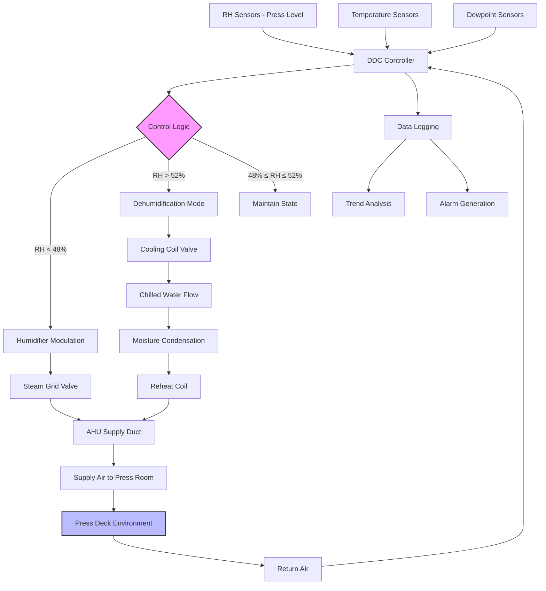

The 45-55% relative humidity specification for sheet-fed press environments represents the optimal control band for balancing paper dimensional stability, static electricity dissipation, and operational comfort. This range minimizes hygroexpansive dimensional changes in cellulose-based substrates while maintaining adequate surface conductivity to prevent electrostatic charge accumulation. Deviations outside this band produce measurable quality defects, with excursions below 40% RH causing static-related feeding errors and paper shrinkage, while conditions above 60% RH induce moisture absorption, sheet expansion, wavy edges, and registration drift exceeding acceptable tolerances.

## Physical Basis for 45-55% RH Standard

### Paper Hygroexpansion Characteristics

Paper fibers exhibit hygroscopic behavior through hydrogen bonding between atmospheric water molecules and cellulose hydroxyl groups in the fiber cell walls. The equilibrium moisture content (EMC) of paper correlates directly with ambient relative humidity according to the sorption isotherm relationship.

**Dimensional change relationship:**

$$\Delta L = L_0 \cdot \alpha_{hygro} \cdot \Delta RH$$

Where:
- $\Delta L$ = Dimensional change (in)
- $L_0$ = Original dimension (in)
- $\alpha_{hygro}$ = Hygroexpansion coefficient (%/% RH)
- $\Delta RH$ = Relative humidity change (% RH)

**Typical hygroexpansion coefficients:**

| Paper Type | Cross-Grain α | Machine Direction α | Anisotropy Ratio |
|------------|---------------|---------------------|------------------|
| Coated gloss 80 lb | 0.015-0.018%/% RH | 0.004-0.005%/% RH | 3.6:1 |
| Uncoated offset 70 lb | 0.018-0.022%/% RH | 0.005-0.007%/% RH | 3.4:1 |
| Coated matte 100 lb | 0.013-0.016%/% RH | 0.003-0.005%/% RH | 3.8:1 |
| Premium text 80 lb | 0.016-0.020%/% RH | 0.005-0.006%/% RH | 3.3:1 |

The cross-grain direction exhibits 3-4 times greater dimensional change than the machine direction due to preferential fiber alignment during papermaking. This anisotropic behavior necessitates careful consideration of paper grain direction relative to critical image dimensions.

### Registration Tolerance Analysis

Four-color lithographic printing demands registration accuracy of ±0.010 in to ±0.020 in depending on image complexity and quality requirements. Environmental-induced dimensional changes readily exceed these tolerances under uncontrolled conditions.

**Registration tolerance calculation for 25 × 38 in sheet:**

Maximum allowable dimensional change:
$$\Delta L_{max} = \pm 0.015 \text{ in (typical specification)}$$

Corresponding dimensional variation fraction:
$$\frac{\Delta L_{max}}{L_0} = \frac{0.015}{25} = 0.0006 = 0.06\%$$

For coated stock with $\alpha_{hygro} = 0.017\%$ per % RH:
$$\Delta RH_{allowable} = \frac{0.06\%}{0.017\%} = 3.5\% \text{ RH}$$

**Conclusion:** Maximum RH variation during a multi-color press run must remain within ±3% RH to maintain acceptable registration. Premium work requiring ±0.010 in tolerance restricts allowable RH variation to ±2% RH or tighter.

The 45-55% RH specification provides:
- 10% RH total control band
- ±5% RH from midpoint (50% RH)
- Adequate margin for control system response
- Accommodation of minor infiltration and seasonal loads

### Moisture Content Equilibrium

Paper moisture content at 50% RH and 70°F typically ranges from 6-8% by weight. This equilibrium matches common paper manufacturing and storage conditions, minimizing dimensional change when paper enters the press environment.

**Sorption isotherm relationship (simplified empirical model):**

$$EMC = \frac{a \cdot b \cdot RH}{(1 - b \cdot RH)(1 - b \cdot RH + a \cdot b \cdot RH)}$$

Where typical coefficients for uncoated paper yield:
- 20% RH → 4.5% moisture content
- 50% RH → 7.0% moisture content
- 80% RH → 14.5% moisture content

The 45-55% RH band maintains moisture content variation within ±0.7 percentage points, corresponding to dimensional stability of ±0.12% for typical uncoated offset stock.

## Static Electricity Control Mechanism

### Surface Resistivity-Humidity Relationship

Paper surface resistivity decreases exponentially with increasing relative humidity according to the empirical relationship:

$$\rho_{surface}(RH) = \rho_0 \cdot e^{-k \cdot RH/100}$$

Where:
- $\rho_{surface}$ = Surface resistivity (Ω/square)
- $\rho_0$ = Resistivity at 0% RH (typically 10¹⁵ Ω/sq)
- $k$ = Material constant (7-9 for paper)
- $RH$ = Relative humidity (%)

**Measured surface resistivity values:**

| Relative Humidity | Surface Resistivity | Charge Decay Time Constant |
|-------------------|---------------------|----------------------------|
| 25% RH | 3 × 10¹² Ω/sq | 90-120 seconds |
| 40% RH | 8 × 10¹⁰ Ω/sq | 15-25 seconds |
| 50% RH | 2 × 10¹⁰ Ω/sq | 3-8 seconds |
| 60% RH | 6 × 10⁹ Ω/sq | < 2 seconds |
| 75% RH | 4 × 10⁸ Ω/sq | < 0.5 seconds |

At 50% RH, paper surface resistivity decreases by approximately three orders of magnitude compared to 25% RH conditions. This reduction provides adequate charge dissipation to prevent static-related feeding errors, dust attraction, and operator shock hazards.

### Critical Static Threshold

Static-related problems in sheet-fed operations manifest at the following voltage thresholds:

**Static voltage impact:**

| Surface Voltage | Observable Effect | Production Impact |
|----------------|-------------------|-------------------|
| 2-3 kV | Sheet sticking/separation issues | Feeding malfunctions begin |
| 3-5 kV | Dust particle attraction | Print quality defects |
| 5-8 kV | Operator shock perception | Safety concern, reduced productivity |
| 8-12 kV | Severe feeding disruption | Production stoppage required |

Maintaining 45-55% RH prevents voltage accumulation above 3 kV under normal press operating conditions (speeds < 15,000 sheets/hour). Higher-speed presses or synthetic substrates may require supplemental ionization systems even within the specified RH range.

### Moisture Film Conductivity

The adsorbed moisture layer on paper fibers at 50% RH creates a continuous conductive pathway for charge dissipation. This physisorbed water layer is approximately 2-4 molecular layers thick, sufficient to provide surface conductivity without inducing bulk moisture absorption that would cause dimensional instability.

The moisture film dissipates electrostatic charges through ionic conduction, with charge decay time inversely proportional to surface conductivity:

$$\tau_{decay} = \rho_{surface} \cdot \varepsilon_0 \cdot \varepsilon_r$$

Where:
- $\tau_{decay}$ = Charge decay time constant (seconds)
- $\varepsilon_0$ = Permittivity of free space (8.85 × 10⁻¹² F/m)
- $\varepsilon_r$ = Relative permittivity of paper (2.5-3.5)

At 50% RH with surface resistivity of 2 × 10¹⁰ Ω/sq, charge decay time is approximately 5 seconds, adequate for continuous charge dissipation during press operation.

## RH Control System Design

### Control Band Specification

**Operating setpoint:** 50% RH (midpoint of 45-55% range)

**Control tolerance during production:**
- Normal operation: ±2% RH (48-52% RH)
- Acceptable excursion: ±3% RH (47-53% RH)
- Maximum deviation: ±5% RH (45-55% RH band limits)

**Control algorithm:**

$$RH_{control} = RH_{setpoint} \pm \Delta RH_{tolerance}$$

Where control action initiates when measured RH deviates beyond tolerance band:

```
IF RH_measured < (RH_setpoint - ΔRH_tolerance) THEN
    Activate humidification
ELSE IF RH_measured > (RH_setpoint + ΔRH_tolerance) THEN
    Activate dehumidification
ELSE
    Maintain current state (deadband)
END IF
```

### Control System Architecture



### Sensor Placement and Accuracy

**RH sensor specifications:**
- Accuracy: ±2% RH over 40-60% RH range
- Response time: < 60 seconds to 90% of step change
- Calibration interval: 6-12 months
- Technology: Thin-film capacitive or chilled-mirror dewpoint

**Installation locations:**
- Primary control: Press deck level, 36-48 in above floor
- Verification: Multiple zones in large press rooms (1 per 5,000 ft²)
- Return air: Duct-mounted for system monitoring
- Supply air: Post-humidification for injection verification

Avoid sensor placement:
- Direct sunlight exposure
- High air velocity zones (> 400 fpm)
- Near exterior doors or loading docks
- Adjacent to heat-generating equipment

### Control Loop Tuning

**Proportional-integral control parameters:**

Humidification loop:
$$u_{humid}(t) = K_p \cdot e(t) + K_i \int e(t) dt$$

Where:
- $u_{humid}$ = Humidifier valve position (0-100%)
- $e(t)$ = Error signal = $RH_{setpoint} - RH_{measured}$
- $K_p$ = Proportional gain (typically 3-5)
- $K_i$ = Integral time constant (typically 120-180 seconds)

**Tuning objectives:**
- Minimize overshoot (< 1% RH)
- Settle time < 15 minutes for 5% RH disturbance
- Eliminate steady-state error through integral action
- Prevent valve hunting through adequate deadband (±0.5% RH)

Dehumidification typically exhibits slower response due to thermal mass of cooling coils and reheat elements. Use longer integral time constants (300-600 seconds) to prevent oscillation.

## Humidification Equipment Comparison

### Equipment Selection Criteria

| Equipment Type | Capacity Range | Response Time | Control Precision | Capital Cost | Operating Cost | Maintenance |
|----------------|----------------|---------------|-------------------|--------------|----------------|-------------|
| **Steam Grid** | 50-5000 lb/h | Fast (30-90 sec) | Excellent (±1% RH) | Medium | Medium-High | Low |
| **Steam-to-Steam** | 10-500 lb/h | Fast (20-60 sec) | Excellent (±1% RH) | Medium-High | Medium-High | Low |
| **Electrode Boiler** | 5-200 lb/h | Medium (60-120 sec) | Good (±1.5% RH) | Medium | High (electric) | Medium |
| **Evaporative Media** | 20-2000 lb/h | Slow (120-300 sec) | Fair (±2% RH) | Low-Medium | Low | High |
| **Ultrasonic Atomizer** | 5-500 lb/h | Medium (60-180 sec) | Good (±1.5% RH) | High | Medium | Medium-High |
| **Compressed Air Atomizer** | 10-1000 lb/h | Fast (30-90 sec) | Good (±1.5% RH) | Medium-High | Medium | Medium |

### Steam Grid Systems (Recommended)

Steam grid humidifiers inject low-pressure steam (5-15 psig) directly into the air handling unit supply duct through a distributed manifold with multiple injection points.

**Performance characteristics:**
- Absorption distance: 4-6 ft per lb/h capacity
- Turndown ratio: 20:1 with modulating control valve
- Steam quality requirement: > 97% dry steam
- Dispersion tube spacing: 12-18 in on center

**Sizing calculation:**

Required steam capacity for makeup air humidification:
$$\dot{m}_{steam} = \frac{Q_{OA} \cdot \rho_{air} \cdot (W_{supply} - W_{OA})}{60}$$

Where:
- $\dot{m}_{steam}$ = Steam flow rate (lb/h)
- $Q_{OA}$ = Outdoor air flow rate (CFM)
- $\rho_{air}$ = Air density (0.075 lb/ft³ standard)
- $W_{supply}$ = Supply air humidity ratio (lb water/lb dry air)
- $W_{OA}$ = Outdoor air humidity ratio (lb water/lb dry air)

**Design example:**

Press room serving 50,000 ft² at 6 ACH:
- Air flow: 50,000 ft² × 12 ft ceiling / 60 min × 6 ACH = 60,000 CFM
- Outdoor air fraction: 20% = 12,000 CFM
- Winter design: 10°F, 70% RH outdoor ($W_{OA}$ = 0.0010 lb/lb)
- Supply: 70°F, 50% RH ($W_{supply}$ = 0.0078 lb/lb)

$$\dot{m}_{steam} = \frac{12,000 \times 0.075 \times (0.0078 - 0.0010)}{60} = 0.102 \text{ lb/min} = 6.1 \text{ lb/h}$$

Add 25% safety factor: 6.1 × 1.25 = 7.6 lb/h → **Select 10 lb/h steam grid humidifier**

### Evaporative Media Systems

Wetted media humidifiers pass air through water-saturated cellulose or synthetic media, adding moisture through evaporative cooling.

**Advantages:**
- No visible steam discharge
- Self-limiting (cannot over-humidify)
- Lower operating cost (uses facility water)
- Simple maintenance (media replacement)

**Disadvantages:**
- Slow response time (large thermal mass)
- Evaporative cooling effect (2-4°F temperature drop)
- Biological growth potential (requires water treatment)
- Limited turndown capability (typically 3:1)

**Application:** Suitable for base-load humidification in recirculation systems with low dynamic load variation. Not recommended for primary control in high-precision applications requiring rapid response.

### Electrode Steam Generators

Electrode boilers generate steam by passing electric current through mineral-enriched water between submerged electrodes.

**Characteristics:**
- Self-contained steam generation (no central boiler required)
- Modulating capacity control (8:1 turndown)
- High electrical operating cost
- Requires water conductivity control (200-1500 μS/cm)

**Application:** Facilities without central steam systems or where steam distribution is impractical. Operating cost typically 2-3× higher than steam grid systems due to electric resistance heating efficiency.

## Dehumidification Approaches

### Cooling-Based Dehumidification

Air passes over chilled water cooling coil (42-48°F supply water temperature) to condense moisture, then reheats to supply temperature setpoint.

**Process sequence:**
1. Cool outdoor or mixed air to 50-54°F dewpoint
2. Condense excess moisture on coil surface
3. Reheat to 68-72°F supply temperature
4. Deliver to space at 45-55% RH

**Energy penalty calculation:**

Summer dehumidification load (90°F, 70% RH outdoor → 70°F, 50% RH supply):

Sensible cooling:
$$Q_{sensible} = \dot{m}_{air} \cdot c_p \cdot (T_{OA} - T_{coil\\_leaving})$$

Latent cooling (dehumidification):
$$Q_{latent} = \dot{m}_{air} \cdot (W_{OA} - W_{supply}) \cdot h_{fg}$$

Reheat requirement:
$$Q_{reheat} = \dot{m}_{air} \cdot c_p \cdot (T_{supply} - T_{coil\\_leaving})$$

For 12,000 CFM outdoor air (same example as humidification):
- Outdoor: 90°F, 70% RH ($W_{OA}$ = 0.0193 lb/lb)
- Coil leaving: 54°F, 95% RH ($W$ = 0.0078 lb/lb)
- Supply: 70°F, 50% RH ($W$ = 0.0078 lb/lb)

Cooling load: 12,000 CFM × 60 min/h × 0.075 lb/ft³ × [(0.24 Btu/lb·°F × 36°F) + (0.0115 lb/lb × 1050 Btu/lb)]
= 233,280 Btu/h = 19.4 tons cooling

Reheat load: 12,000 CFM × 60 min/h × 0.075 lb/ft³ × 0.24 Btu/lb·°F × 16°F
= 165,888 Btu/h = 166 MBH

**System efficiency:** Cooling-based dehumidification with reheat exhibits coefficient of performance (COP) of 1.5-2.5, accounting for simultaneous cooling and heating energy consumption.

### Desiccant Dehumidification

Rotary desiccant wheels adsorb moisture from process air stream, regenerating the desiccant material using heated air (180-250°F) in a separate regeneration sector.

**Advantages:**
- Independent temperature and humidity control
- Deep dehumidification capability (< 40% RH achievable)
- No condensate drainage required
- Effective at low outdoor temperatures

**Disadvantages:**
- High regeneration energy requirement
- Sensible heat addition to process air (requires cooling)
- Higher capital cost than cooling-based systems
- Periodic wheel replacement (8-12 years)

**Application:** Facilities requiring RH control below 40% RH or in climates where cooling-based dehumidification proves ineffective (low outdoor temperatures with high RH).

## Seasonal Operating Strategies

### Winter Humidification Mode

**Design conditions:** 10°F outdoor, 30% RH → 70°F, 50% RH indoor

Control sequence:
1. Preheat outdoor air to 55-60°F (prevent coil freezing)
2. Mix with return air to achieve 60-65°F
3. Inject steam to achieve 50% RH at mixed air temperature
4. Final heat to 70°F supply temperature
5. Deliver to space, maintaining 48-52% RH setpoint

**Critical considerations:**
- Prevent condensation in ductwork (maintain duct surface temperature > dewpoint)
- Ensure adequate absorption distance before discharge (4-6 ft minimum)
- Monitor supply air dewpoint (should equal space dewpoint ± 2°F)

### Summer Dehumidification Mode

**Design conditions:** 90°F outdoor, 70% RH → 70°F, 50% RH indoor

Control sequence:
1. Precool outdoor air to 52-54°F (below desired dewpoint)
2. Condense excess moisture on cooling coil
3. Reheat to 68-70°F supply temperature
4. Deliver to space at controlled RH

**Optimization strategies:**
- Use economizer mode when outdoor conditions permit (outdoor dewpoint < 54°F)
- Implement dewpoint reset based on space latent load
- Minimize reheat energy through supply temperature optimization

### Shoulder Season Transition

Spring and fall conditions create challenges with frequent mode transitions between humidification and dehumidification.

**Control logic:**

```
IF Outdoor_Dewpoint < (Space_Dewpoint - 5°F) THEN
    Humidification mode enabled
    Dehumidification mode disabled
ELSE IF Outdoor_Dewpoint > (Space_Dewpoint + 3°F) THEN
    Dehumidification mode enabled
    Humidification mode disabled
ELSE
    Monitor space RH, activate appropriate mode as needed
    Implement wide deadband (±3% RH) to prevent short-cycling
END IF
```

Provide sufficient deadband between mode transitions to prevent equipment cycling and energy waste from simultaneous heating/cooling or humidification/dehumidification.

## Operational Verification and Commissioning

### Acceptance Testing

**Control stability test:**
1. Establish 50% RH setpoint with ±2% RH tolerance
2. Monitor RH continuously for 8-hour production period
3. Record maximum excursion, settling time after disturbances
4. Verify RH remains within 48-52% RH for > 95% of time

**Response testing:**
1. Introduce 10% RH step change in setpoint
2. Measure time to achieve 90% of new setpoint
3. Verify overshoot < 2% RH
4. Confirm stable control within ±1% RH of new setpoint

**Spatial uniformity:**
1. Measure RH at 6-10 locations throughout press room
2. Verify maximum variation < 3% RH between locations
3. Identify stratification or dead zones requiring airflow adjustment

### Ongoing Performance Monitoring

**Key performance indicators:**

| Parameter | Target | Acceptable Range | Action Required |
|-----------|--------|------------------|-----------------|
| Average RH | 50% | 48-52% | Review setpoint accuracy |
| RH standard deviation | < 1.5% | < 2.5% | Tune control loops if exceeded |
| Time within ±2% band | > 95% | > 90% | Investigate if < 90% |
| Sensor drift | < 1% per year | < 2% per year | Calibrate/replace sensors |

**Trend analysis:**
- Graph RH, temperature, dewpoint over 24-hour periods
- Identify cyclic patterns indicating control issues
- Correlate outdoor conditions with system performance
- Track seasonal humidification/dehumidification loads

**Preventive maintenance:**
- Calibrate RH sensors semi-annually
- Clean steam dispersion tubes quarterly
- Inspect evaporative media monthly (if applicable)
- Verify control valve operation monthly
- Test dewpoint sensors annually against reference

## Economic and Quality Impact

### Registration Quality Benefits

Maintaining 45-55% RH reduces paper dimensional variation by 60-80% compared to uncontrolled environments (typical 30-70% RH swing).

**Waste reduction:**
- Misregistration waste: 2-5% of production → < 0.5% with tight RH control
- Static-related feeding errors: 1-3% waste → < 0.2% with RH > 45%
- Paper conditioning time: Reduced 30-50% when press room matches storage conditions

For a commercial printer producing $5M annual revenue:
- Typical waste rate: 4% = $200,000/year
- Controlled environment waste: 0.7% = $35,000/year
- Annual savings: $165,000/year

### Energy Consumption Analysis

**Typical annual energy use (50,000 ft² press room, 60,000 CFM):**

| Season | Humidification | Dehumidification | Heating | Cooling | Total |
|--------|----------------|------------------|---------|---------|-------|
| Winter (Dec-Feb) | 18,000 kWh | 0 kWh | 145,000 kWh | 22,000 kWh | 185,000 kWh |
| Spring (Mar-May) | 8,000 kWh | 5,000 kWh | 65,000 kWh | 45,000 kWh | 123,000 kWh |
| Summer (Jun-Aug) | 0 kWh | 12,000 kWh | 5,000 kWh | 95,000 kWh | 112,000 kWh |
| Fall (Sep-Nov) | 6,000 kWh | 7,000 kWh | 55,000 kWh | 50,000 kWh | 118,000 kWh |
| **Annual Total** | **32,000 kWh** | **24,000 kWh** | **270,000 kWh** | **212,000 kWh** | **538,000 kWh** |

At $0.12/kWh average blended rate: **$64,560/year operating cost**

Humidity control (humidification + dehumidification) represents approximately 10% of total HVAC energy consumption, justified by waste reduction and quality improvement benefits.

---

*The 45-55% RH specification for sheet-fed press environments provides the optimal balance between dimensional stability control, static electricity dissipation, and system energy efficiency, established through decades of industry experience and quantified through hygroexpansion mechanics, surface resistivity relationships, and registration tolerance analysis that demonstrate the critical importance of precise humidity control in achieving consistent lithographic print quality.*
