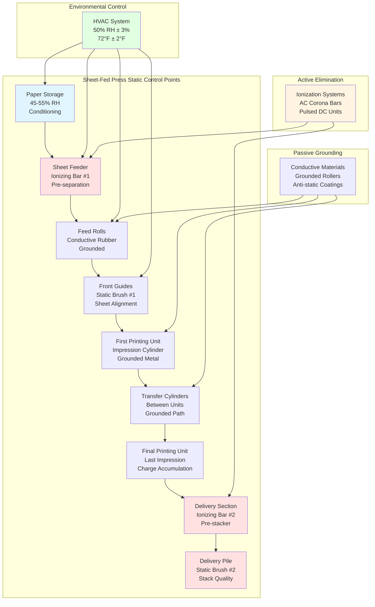

Static electricity generation in sheet-fed printing presses disrupts production through feeding errors, registration defects, dust attraction, operator shocks, and in extreme cases, fire hazards in solvent-containing environments. Understanding the physics of charge generation, accumulation, and dissipation enables effective environmental and equipment-based control strategies that maintain surface voltages below the 3-5 kV threshold where operational problems begin.

## Triboelectric Charge Generation

### Contact Electrification Fundamentals

Paper moving through sheet feeders, transfer cylinders, and delivery systems generates static charge through the triboelectric effect. When dissimilar materials contact and separate, electrons transfer between surfaces based on their position in the triboelectric series. Paper typically loses electrons to metal and rubber press components, acquiring a positive surface charge.

The charge density accumulated during contact-separation events follows:

$$\sigma = \frac{Q}{A} = \epsilon_0 \epsilon_r E_s$$

Where:
- $\sigma$ = Surface charge density (C/m²)
- $Q$ = Total charge accumulated (C)
- $A$ = Contact area (m²)
- $\epsilon_0$ = Permittivity of free space (8.85×10⁻¹² F/m)
- $\epsilon_r$ = Relative permittivity of paper (2.5-4.0)
- $E_s$ = Surface electric field (V/m)

**Physical interpretation:** Each contact-separation event transfers a characteristic charge density dependent on material work function differences. Paper against steel rollers generates 10-100 nC/m² per contact under dry conditions.

### Surface Voltage Development

Accumulated charge creates a surface potential that increases with continued friction:

$$V_{surface} = \frac{Q}{C} = \frac{\sigma \cdot t}{\epsilon_0 \epsilon_r}$$

Where:
- $V_{surface}$ = Surface potential (V)
- $t$ = Paper thickness (m)
- $C$ = Capacitance per unit area (F/m²)

**For typical offset paper:**
- Thickness: 0.1 mm = 1×10⁻⁴ m
- Relative permittivity: 3.0
- Charge density after multiple contacts: 50 nC/m²

$$V_{surface} = \frac{50 \times 10^{-9} \times 1 \times 10^{-4}}{8.85 \times 10^{-12} \times 3.0} = 188 \text{ V}$$

Multiple contact cycles in high-speed feeders rapidly escalate voltage to problematic levels (3-15 kV) within seconds.

### Charge Generation Rate

The rate of charge accumulation correlates with press speed and contact frequency:

$$\frac{dQ}{dt} = n_c \cdot A_c \cdot \sigma_c \cdot f_{sep}$$

Where:
- $\frac{dQ}{dt}$ = Charge accumulation rate (C/s)
- $n_c$ = Number of contact points
- $A_c$ = Contact area per point (m²)
- $\sigma_c$ = Charge density per contact (C/m²)
- $f_{sep}$ = Separation frequency (contacts/s)

**Sheet feeder example:**
- Press speed: 10,000 sheets/hour = 2.78 sheets/s
- Contact points: 12 (feed rolls, guides, grippers)
- Contact area: 0.01 m² per point
- Charge per contact: 30 nC/m²

$$\frac{dQ}{dt} = 12 \times 0.01 \times 30 \times 10^{-9} \times 2.78 = 1.0 \times 10^{-8} \text{ C/s}$$

Per sheet charge accumulation: $Q_{sheet} = 3.6 \times 10^{-9}$ C = 3.6 nC

This cumulative charging produces 5-10 kV surface voltages on individual sheets exiting the delivery section.

## Humidity-Dependent Charge Dissipation

### Surface Conductivity Mechanism

Water molecules adsorbed on paper fibers create a conductive surface layer enabling charge dissipation through ionic conduction. Surface resistivity decreases exponentially with increasing relative humidity:

$$\rho_s(RH) = \rho_{s,0} \cdot e^{-k \cdot RH}$$

Where:
- $\rho_s$ = Surface resistivity (Ω/square)
- $\rho_{s,0}$ = Resistivity at 0% RH (typically 10¹⁵-10¹⁶ Ω/sq)
- $k$ = Humidity coefficient (0.12-0.18 per %RH for paper)
- $RH$ = Relative humidity (%)

**Measured resistivity values:**

| RH (%) | Surface Resistivity (Ω/sq) | Classification |
|--------|---------------------------|----------------|
| 15 | 5×10¹³ | Highly insulating |
| 25 | 8×10¹² | Insulating |
| 35 | 2×10¹¹ | Moderate insulating |
| 45 | 5×10⁹ | Dissipative |
| 55 | 1×10⁹ | Dissipative |
| 65 | 3×10⁸ | Conductive |

**Critical observation:** Resistivity decreases by approximately one order of magnitude per 10% RH increase in the 30-60% RH range. This exponential relationship explains why static problems intensify rapidly below 40% RH.

### Charge Decay Time Constant

The time required for static charge to dissipate through surface conduction follows:

$$\tau = \rho_s \cdot \epsilon_0 \cdot \epsilon_r$$

Where:
- $\tau$ = Time constant for charge decay (s)
- $\rho_s$ = Surface resistivity (Ω/sq)
- $\epsilon_0 \epsilon_r$ = Effective permittivity (F/m)

**Decay time vs. humidity:**

| RH (%) | Resistivity (Ω/sq) | Decay Time (s) | 90% Dissipation (s) |
|--------|-------------------|----------------|---------------------|
| 20 | 1×10¹³ | 266 | 612 |
| 30 | 5×10¹² | 133 | 306 |
| 40 | 1×10¹¹ | 2.7 | 6.2 |
| 50 | 5×10⁹ | 0.13 | 0.30 |
| 60 | 1×10⁹ | 0.027 | 0.062 |

**Design implication:** At 50% RH, charges dissipate in under 0.5 seconds—faster than typical sheet transfer times (1-3 seconds between feeder and first printing unit). Below 40% RH, dissipation time exceeds sheet handling duration, causing charge accumulation.

### Moisture Monolayer Adsorption

The physical mechanism underlying humidity-based static control involves water molecule adsorption on cellulose fiber surfaces. The number of adsorbed monolayers correlates with relative humidity through the BET isotherm:

$$\frac{W}{W_m} = \frac{C \cdot RH}{(1-RH)[1+(C-1)RH]}$$

Where:
- $W$ = Water content (g H₂O/g dry paper)
- $W_m$ = Monolayer capacity (typically 0.05-0.07)
- $C$ = BET constant (5-20 for cellulose)
- $RH$ = Relative humidity (fraction)

**At 50% RH:** Paper contains approximately 2-3 molecular layers of adsorbed water, sufficient to create continuous ionic conduction pathways across fiber surfaces. Below 35% RH, incomplete monolayer coverage creates isolated water clusters with poor connectivity, dramatically increasing surface resistivity.

## Static-Related Production Problems

### Sheet Feeding Defects

Electrostatic forces between charged sheets cause sticking (when adjacent sheets have opposite polarity) or repulsion (same polarity), both disrupting feeder operation.

The electrostatic pressure between sheets separated by air gap $d$ follows:

$$P_{static} = \frac{\epsilon_0 E^2}{2} = \frac{\sigma^2}{2\epsilon_0}$$

Where:
- $P_{static}$ = Electrostatic pressure (Pa or N/m²)
- $E$ = Electric field between sheets (V/m)
- $\sigma$ = Surface charge density (C/m²)

**Example calculation:**

Sheet with 5 kV surface voltage over 0.1 mm thickness:
- Electric field: $E = V/t = 5000/(1×10^{-4}) = 5×10^7$ V/m
- Electrostatic pressure: $P = (8.85×10^{-12})(5×10^7)^2/2 = 11$ Pa = 0.0016 psi

**Comparison to sheet weight:**
- 80 lb text stock: 0.004 psi per sheet self-weight
- Static pressure: 40% of sheet weight

This magnitude explains feeding double-sheets (static attraction overcomes separator mechanisms) and mis-feeds (static repulsion prevents proper sheet pickup).

### Dust and Fiber Attraction

Charged paper surfaces attract airborne particles through electrostatic forces:

$$F_{attract} = q \cdot E = q \cdot \frac{\sigma}{\epsilon_0}$$

Where:
- $F_{attract}$ = Attractive force on particle (N)
- $q$ = Particle charge (C)
- $E$ = Electric field from paper surface (V/m)

Dust particles (0.1-10 μm diameter) carrying typical atmospheric charges (10-1000 elementary charges) experience forces 100-10,000× gravitational force when near a 5 kV charged sheet. This explains:

- Lint attraction to delivery pile causing print defects
- Paper dust accumulation on impression cylinders
- Ink misting adhesion to non-image areas

### Registration and Sheet Positioning Errors

Electrostatic repulsion between paper and grounded metal guides/cylinders causes sheet positioning deviations:

$$\delta_{position} = \frac{F_{repulsion} \cdot t^2}{2m}$$

Where:
- $\delta_{position}$ = Positioning error (m)
- $F_{repulsion}$ = Electrostatic force (N)
- $t$ = Time in flight between guides (s)
- $m$ = Sheet mass (kg)

For a 28" × 40" sheet (0.15 kg) with 8 kV charge passing through a grounded roller guide at 300 sheets/hour:
- Force: ~0.05 N (perpendicular to sheet)
- Flight time: 0.2 s between gripper release and next contact
- Position error: 0.3 mm

This exceeds typical registration tolerances (±0.25 mm), causing color-to-color misregistration.

## Static Control Strategies

### Environmental Humidity Control

Maintaining 45-55% RH provides passive static dissipation through enhanced surface conductivity. This primary control method operates continuously without maintenance requirements or operator intervention.

**Humidity control requirements:**
- Target: 50% RH ± 3% during production
- Response time: Correct 5% RH deviation within 30 minutes
- Seasonal adjustment: May reduce to 45% RH (winter) or increase to 55% RH (summer) to minimize HVAC energy
- Monitoring: Continuous RH sensors at press deck elevation (36-48" above floor)

**Economic justification:** Humidity control capital cost ($50,000-200,000 for press room humidification/dehumidification) prevents static-related waste typically costing $500-2000 per week in mid-size commercial printing operations.

### Active Ionization Systems

AC corona discharge ionizers generate balanced positive and negative ions that neutralize surface charges when ambient humidity proves insufficient or when handling synthetic substrates with inherently high resistivity.

**Corona discharge mechanism:**

High voltage (4-7 kV AC) applied to sharp electrode points creates localized air ionization:

$$J_{ion} = \mu \cdot n \cdot E$$

Where:
- $J_{ion}$ = Ion current density (A/m²)
- $\mu$ = Ion mobility (1.4×10⁻⁴ m²/V·s for air)
- $n$ = Ion concentration (ions/m³)
- $E$ = Electric field (V/m)

**Ionizing bar placement strategy:**

| Location | Purpose | Typical Spacing |
|----------|---------|-----------------|
| Pre-feeder | Eliminate storage static before separation | 4-8 inches from sheet pile |
| Post-feeder | Neutralize feeder-induced charges | 12-18 inches after last feed roll |
| Pre-delivery | Prepare sheets for stacking | 6-12 inches before delivery pile |
| Post-delivery | Maintain pile stability | 12-24 inches above delivery |

**Performance specifications:**
- Discharge time to ±100V: < 3 seconds
- Ion balance: ±50V residual voltage
- Coverage width: 36-48 inches per ionizing bar
- Power consumption: 15-30 W per bar

**Maintenance requirements:**
- Clean emitter points weekly (dust accumulation reduces ion generation by 50-80% within 2 weeks)
- Verify high voltage output monthly (4-7 kV AC)
- Replace emitter cartridges annually or per manufacturer specification
- Monitor with electrostatic fieldmeter during PM checks

### Conductive and Dissipative Materials

Press components using conductive or static-dissipative materials provide continuous charge dissipation through grounded paths.

**Material selection:**

| Component | Standard Material | Resistivity | Static-Control Alternative | Resistivity |
|-----------|-------------------|-------------|---------------------------|-------------|
| Feed rolls | Natural rubber | 10¹³-10¹⁵ Ω·cm | Conductive rubber | 10⁴-10⁶ Ω·cm |
| Gripper bars | Anodized aluminum | Insulating coating | Bare aluminum, grounded | < 10³ Ω·cm |
| Transfer drums | Coated steel | Variable | Conductive coating | 10⁵-10⁷ Ω·cm |
| Delivery guides | Plastic | 10¹⁴-10¹⁶ Ω·cm | Carbon-filled plastic | 10⁷-10⁹ Ω·cm |

**Grounding requirements:**
- Resistance to ground: < 10⁶ Ω for conductive components
- Verification: Quarterly testing with megohmmeter
- Bonding jumpers: Across bearing points and mechanical joints
- Static ground strap: Main press frame to building ground system

### Static-Dissipative Coating Treatments

Anti-static sprays and coatings applied to paper surfaces temporarily reduce resistivity through hygroscopic or ionic additives:

**Mechanism:** Hygroscopic compounds (glycols, quaternary ammonium salts) attract atmospheric moisture to paper surface, creating conductive layer independent of ambient RH.

**Application methods:**
- Spray application: Manual or automatic during paper receipt
- In-line coating: During previous printing operation
- Built-in additives: Paper manufacturer incorporates during production

**Limitations:**
- Temporary effect: 2-7 days duration depending on formulation
- Potential print quality impact: Some coatings affect ink adhesion or drying
- Cost: $0.02-0.10 per sheet for spray applications
- Inconsistency: Manual application yields variable results

### Static-Eliminating Brushes and Tinsel

Conductive brushes with grounded bristles provide charge dissipation through contact:

**Brush types:**
- **Carbon fiber**: Resistivity 10³-10⁵ Ω·cm, excellent durability
- **Conductive tinsel**: Thin metal strips, > 99% contact coverage
- **Ionized air nozzles**: Combines brush contact with localized ionization

**Optimal placement:**
- Just before delivery grippers (prevents charge transfer to pile)
- At sheet calming/smoothing bars (contacts entire sheet width)
- Pre-stacker alignment (ensures flat delivery)

**Design requirements:**
- Brush contact pressure: 0.5-2 oz/linear inch
- Bristle material: Conductive (< 10⁶ Ω resistance to ground)
- Coverage: Spans full sheet width plus 2 inches
- Grounding: Verified < 1 MΩ to press ground

## Delivery and Stacking Static Issues

### Charge Accumulation in Delivery Pile

Successive sheets depositing on delivery pile transfer charge to previously stacked sheets. Without dissipation, pile potential escalates:

$$V_{pile}(n) = V_{sheet} \cdot n \cdot (1-e^{-t/\tau})$$

Where:
- $V_{pile}$ = Pile surface voltage (V)
- $V_{sheet}$ = Individual sheet voltage (V)
- $n$ = Number of sheets delivered
- $t$ = Time between sheets (s)
- $\tau$ = Discharge time constant (s)

**Example scenario:**
- Sheet voltage: 6 kV
- Delivery rate: 8,000 sheets/hour (2.22 sheets/s)
- Time between sheets: 0.45 s
- Discharge time constant at 35% RH: 5 s

After 100 sheets:
$$V_{pile}(100) = 6000 \cdot 100 \cdot (1-e^{-0.45/5}) = 51,400 \text{ V}$$

This voltage creates:
- Operator shock hazard when touching pile
- Sheet-to-sheet repulsion causing uneven stacking
- Dust attraction to top sheets
- Potential arcing to grounded press components

### Sheet Sticking and Blocking

Opposite polarity charges on adjacent sheets create attractive forces causing blocking (sheets resist separation during subsequent finishing operations):

$$F_{adhesion} = \frac{\sigma_1 \sigma_2 A}{2\epsilon_0}$$

Where:
- $F_{adhesion}$ = Adhesive force between sheets (N)
- $\sigma_1, \sigma_2$ = Charge densities on adjacent sheets (C/m²)
- $A$ = Contact area (m²)

For 28" × 40" sheets with ±3 kV opposite charges:
- Charge density: ±27 nC/m² (assuming 0.1 mm thickness)
- Contact area: 0.72 m²
- Adhesive force: 0.28 N = 1 oz

This force, distributed across the sheet, causes adhesion sufficient to damage coating during separation or misfeeds in finishing equipment.

### Static Control in Delivery Section

**Pre-delivery ionization:** Ionizing bar positioned 6-12 inches before delivery grippers neutralizes charge accumulated during printing:

- Reduces sheet voltage from 8-12 kV to < 500 V
- Prevents charge transfer to delivery pile
- Minimizes operator shock exposure

**Pile grounding:** Conductive delivery pile supports with verified ground connection (< 1 MΩ resistance) provide dissipation path for residual charge.

**Anti-static spray application:** Inline spray systems apply dissipative coating immediately post-printing:

- Reduces delivery pile voltage by 70-90%
- Improves pile stability (reduced sheet movement)
- Facilitates subsequent finishing operations

**Pile height optimization:** Limiting delivery pile height to 12-18 inches reduces cumulative charge accumulation and improves accessibility for charge dissipation mechanisms.

## Static Problem Diagnosis and Solutions

| Problem Symptom | Probable Cause | Verification Method | Solution |
|----------------|----------------|---------------------|----------|
| Double-sheet feeding | Sheets electrostatically adhered | Electrostatic fieldmeter: > 5 kV | Increase RH to 50%, install pre-feeder ionizer |
| Mis-feeds, sheet skew | Electrostatic repulsion | Surface voltage measurement during feeding | Check ionizer function, verify RH > 45% |
| Dust on printed sheets | Charged surface attracting particles | Visual inspection + voltage check | Ionizing bar pre-delivery, improve filtration |
| Uneven delivery pile | Sheet-to-sheet repulsion | Pile voltage measurement: > 3 kV | Post-delivery ionizer, anti-static spray |
| Operator shocks | High pile voltage | Handheld fieldmeter: > 5 kV pile | Verify grounding, increase humidity, ionization |
| Registration drift | Static deflection between guides | Progressive registration error pattern | Improve humidity control stability, add mid-press ionizer |
| Sheet blocking in pile | Opposite polarity adhesion | Separation force test, voltage polarity check | Balance ionizer output, ensure AC (not DC) corona |
| Ink misting/spatter | High voltage near ink train | Voltage measurement at impression cylinder | Humidity control, ground all rollers, reduce press speed |
| Web breaks (sheeter) | Accumulated charge at cutting point | Voltage spike during cutting cycle | Ionizer before sheeter knife, increase RH |
| Fire/explosion risk | Solvent vapor + static discharge | Atmosphere monitoring + voltage check | Critical: Ionization, humidity, proper ventilation |

## Measurement and Monitoring

### Electrostatic Fieldmeters

Non-contact fieldmeters measure surface voltage from 4-12 inches distance:

**Specifications:**
- Range: 0-20 kV typical for printing applications
- Accuracy: ±5% of reading ±3 digits
- Response time: < 1 second
- Measurement distance: Calibrated at specific spacing (typically 1 inch)

**Measurement protocol:**
- Measure at feeder exit, between printing units, delivery entrance, and pile top
- Record maximum and average voltages during production run
- Establish baseline at optimal humidity (50% RH)
- Investigate when voltages exceed 2× baseline

### Resistivity Testing

Surface resistivity measurements verify paper conductivity and material selection:

**Method:** Apply concentric ring electrodes, measure resistance at 10V or 100V applied potential per ASTM D257.

**Interpretation:**
- < 10⁵ Ω/sq: Conductive (static not an issue)
- 10⁵-10¹¹ Ω/sq: Static dissipative (acceptable with grounding)
- 10¹¹-10¹³ Ω/sq: Insulating (requires humidity control + ionization)
- > 10¹³ Ω/sq: Highly insulating (severe static expected)

### Continuous Monitoring Systems

Automated static monitoring systems provide real-time voltage tracking:

**Components:**
- Fixed fieldmeters at critical control points
- Data logger with trend analysis
- Alarm outputs when voltage exceeds thresholds
- Integration with press control system

**Benefits:**
- Early detection of humidity control failures
- Ionizer malfunction identification
- Production quality correlation analysis
- Maintenance scheduling optimization

---

*Static electricity control in sheet-fed printing combines passive environmental management through precise humidity regulation (45-55% RH) with active ionization systems and conductive materials to maintain surface voltages below the 3-5 kV threshold that causes feeding defects, registration errors, dust attraction, and operator safety concerns, requiring integrated design of HVAC systems and press components to achieve consistent charge dissipation throughout the paper path from feeder to delivery pile.*
