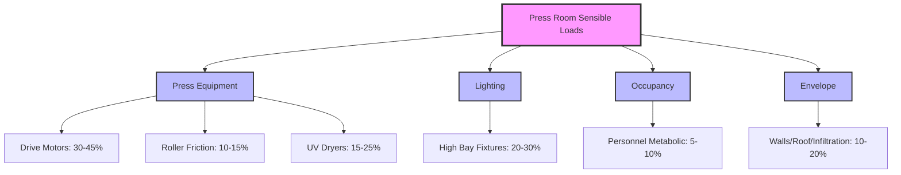
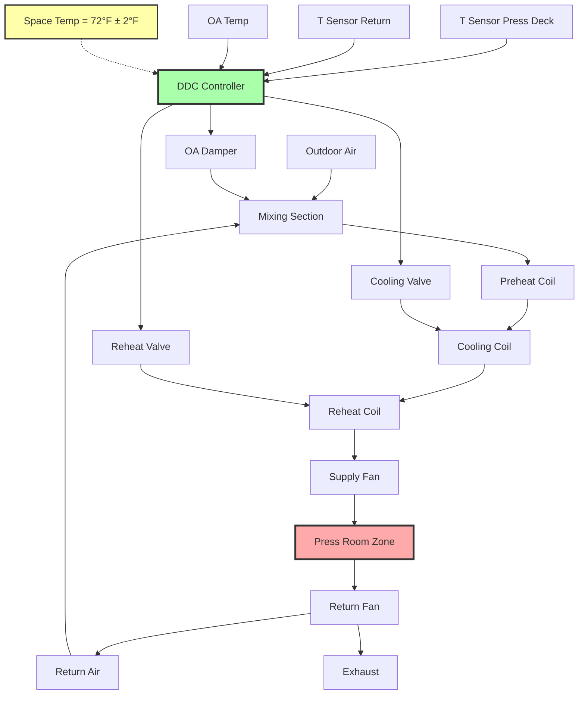

# Temperature Control 70-75°F for Sheet-Fed Printing

Sheet-fed lithographic printing requires precise temperature control within the 70-75°F (21.1-23.9°C) range to maintain ink rheological properties, ensure dimensional stability of press components, and provide consistent print quality across extended production runs. Temperature variations directly affect ink viscosity, tack, and transfer characteristics, while thermal expansion of precision mechanical components impacts registration accuracy.

The industry-standard 70-75°F specification represents an engineering compromise balancing multiple physical constraints: ink formulation requirements, paper conditioning equilibrium, press component thermal expansion, operator comfort, and energy efficiency.

## Physical Basis for Temperature Specification

### Ink Viscosity Temperature Dependence

Lithographic inks exhibit strong temperature-dependent rheological behavior governed by the Arrhenius relationship. Dynamic viscosity decreases exponentially with increasing temperature according to:

$$\mu(T) = A \cdot e^{E_a/(R \cdot T)}$$

Where:
- $\mu$ = Dynamic viscosity (Pa·s)
- $T$ = Absolute temperature (K)
- $A$ = Pre-exponential factor (material constant)
- $E_a$ = Activation energy for viscous flow (J/mol)
- $R$ = Universal gas constant (8.314 J/mol·K)

**Practical linearization** for small temperature ranges yields:

$$\frac{\mu_2}{\mu_1} = e^{-\beta(T_2 - T_1)}$$

Where $\beta$ is the temperature coefficient of viscosity, typically 0.020-0.035 K⁻¹ for offset lithographic inks.

**Example calculation** for process cyan ink:

At reference temperature $T_1 = 72°F$ (295.4 K), $\mu_1 = 45$ Pa·s

Temperature coefficient: $\beta = 0.028$ K⁻¹

Temperature increases to $T_2 = 77°F$ (298.2 K):

$$\mu_2 = 45 \times e^{-0.028 \times (298.2 - 295.4)} = 45 \times e^{-0.078} = 45 \times 0.925 = 41.6 \text{ Pa·s}$$

**Result:** A 5°F temperature increase reduces ink viscosity by 7.5%, significantly affecting ink transfer, dot gain, and color density.

### Temperature Effects on Ink Tack

Ink tack (adhesive resistance during splitting between rollers and substrate) follows similar temperature dependence:

$$\text{Tack}(T) = \text{Tack}_0 \cdot e^{-\alpha(T - T_0)}$$

Where $\alpha = 0.015-0.025$ K⁻¹ for typical lithographic inks.

**Consequences of tack variation:**

| Temperature Change | Tack Change | Print Quality Impact |
|-------------------|-------------|----------------------|
| +3°F (+1.7°C) | -4 to -6% | Reduced ink transfer, lighter density |
| +5°F (+2.8°C) | -7 to -11% | Poor trapping, picking tendency reduced |
| +10°F (+5.6°C) | -14 to -22% | Excessive ink film thickness required, misting |
| -3°F (-1.7°C) | +4 to +6% | Increased picking, blanket piling |
| -5°F (-2.8°C) | +7 to +11% | Severe picking on coated stocks |

### Thermal Expansion of Press Components

Precision lithographic presses maintain registration tolerances of ±0.003-0.010 inches (0.076-0.254 mm). Thermal expansion of press components affects these tolerances:

$$\Delta L = L_0 \cdot \alpha_L \cdot \Delta T$$

Where:
- $\Delta L$ = Length change
- $L_0$ = Original dimension
- $\alpha_L$ = Linear thermal expansion coefficient
- $\Delta T$ = Temperature change

**Material expansion coefficients:**

| Material | Coefficient (10⁻⁶/°F) | Application |
|----------|----------------------|-------------|
| Steel (press frame) | 6.5 | Main structure, cylinders |
| Aluminum (ink rollers) | 13.0 | Roller cores, lightweight components |
| Cast iron (cylinders) | 5.8 | Plate, blanket, impression cylinders |
| Rubber (blanket) | 80-120 | Blanket dimensional change |

**Example:** 40-inch wide steel impression cylinder experiencing 10°F temperature swing:

$$\Delta L = 40 \text{ in} \times 6.5 \times 10^{-6} \text{/°F} \times 10°F = 0.0026 \text{ in}$$

This 0.0026-inch expansion approaches the registration tolerance, demonstrating the need for tight temperature control.

## Temperature Impact on Print Quality

### Dot Gain Variation

Halftone dot gain (physical expansion beyond nominal dot size) correlates strongly with ink viscosity and tack:

$$\text{Dot Gain} = k_1 \cdot \frac{P^2}{\mu \cdot v}$$

Where:
- $P$ = Printing pressure
- $\mu$ = Ink viscosity
- $v$ = Press speed
- $k_1$ = Proportionality constant

Lower viscosity (higher temperature) increases dot gain, darkening midtones and shadows.

| Parameter | 68°F (20°C) | 72°F (22°C) | 76°F (24°C) | Impact |
|-----------|-------------|-------------|-------------|--------|
| Ink viscosity (Pa·s) | 48.5 | 45.0 | 41.8 | Reference |
| Dot gain @ 50% (%) | 14 | 16 | 18 | Midtone darkening |
| Color density (D) | 1.42 | 1.38 | 1.34 | Solid density reduction |
| First-down trap (%) | 78 | 80 | 82 | Improved trapping |
| Picking tendency | High | Moderate | Low | Stock-dependent |

### Color Consistency Requirements

Process color printing demands color density variation within ±0.05 density units to maintain acceptable color consistency. Temperature-induced viscosity changes directly affect density:

$$\Delta D = k_2 \cdot \frac{\Delta \mu}{\mu}$$

Where $k_2 \approx 0.3-0.4$ for typical lithographic conditions.

**Example:** 5°F temperature increase causing 7.5% viscosity reduction:

$$\Delta D = 0.35 \times 0.075 = 0.026 \text{ density units}$$

This represents 52% of the allowable ±0.05 tolerance, leaving minimal margin for other process variables.

## Rationale for 70-75°F Operating Range

### Lower Bound (70°F) Justification

**Ink performance:** Below 70°F, ink viscosity increases to levels causing:
- Increased picking on coated stocks (ink tack exceeds paper surface strength)
- Poor ink flow and metering in fountain systems
- Excessive roller friction and heat generation
- Reduced trapping efficiency in multi-color printing

**Energy considerations:** Lower setpoints increase heating energy consumption without corresponding print quality benefits.

**Operator comfort:** Below 68°F, operator productivity declines during extended shifts at manual feed and inspection stations.

### Upper Bound (75°F) Justification

**Ink performance:** Above 75°F, reduced viscosity causes:
- Excessive ink emulsification (water pickup in lithographic systems)
- Increased ink misting and spray on high-speed presses
- Poor transfer characteristics requiring heavier ink films
- Scumming tendency due to inadequate water-ink balance

**Paper conditioning:** Temperatures above 75°F accelerate moisture loss from conditioned paper stocks, particularly when combined with moderate humidity levels (45-55% RH).

**Equipment considerations:** Higher temperatures increase cooling requirements for press drive motors and hydraulic systems.

## HVAC System Design Requirements

### Temperature Control Tolerance

Maintain press room dry-bulb temperature at 72°F ±2°F (22.2°C ±1.1°C) during production:

**Spatial uniformity:** ±1.5°F maximum horizontal temperature variation across press room floor area at 48-inch elevation (press deck height).

**Temporal stability:** ±2°F maximum deviation from setpoint over any 4-hour production period.

**Vertical stratification:** ≤3°F between 6-inch and 72-inch elevations to prevent paper conditioning variations between storage and press deck.

### Load Characteristics

**Sensible heat gains** dominate press room thermal loads:

**Typical press room sensible load breakdown:**
- Sheet-fed lithographic press (40-inch, 15,000 IPH): 120,000-180,000 Btu/h
- Lighting (2.0 W/ft² × 10,000 ft²): 68,200 Btu/h
- Occupancy (8 operators × 450 Btu/h): 3,600 Btu/h
- Envelope and infiltration: Variable, 20,000-60,000 Btu/h

**Total cooling load:** 210,000-310,000 Btu/h (17.5-25.8 tons)

### Control System Strategy

**Control sequence:**

1. **Primary cooling control:** Modulate chilled water valve to maintain 72°F at press deck sensor
2. **Economizer mode:** When OA temperature < 65°F and humidity suitable, increase OA damper to 100% for free cooling
3. **Reheat trimming:** Fine-tune discharge temperature using hot water reheat coil during economizer operation
4. **Night setback:** Maintain 68°F during non-production hours to reduce recovery time (vs. deeper setback)

### Air Distribution Design

**Displacement ventilation approach** for press rooms:

- Supply air temperature: 60-65°F (ΔT = 7-12°F)
- Supply air velocity at diffuser: 100-200 fpm
- Velocity at press deck (48 inches): <50 fpm (prevents paper disturbance)
- Air change rate: 4-6 ACH for temperature control, 8-12 ACH if solvent usage present

**Supply diffuser locations:**
- Low sidewall grilles (12-24 inches above floor)
- Underfloor displacement plenums (where feasible)
- Overhead diffusers with discharge baffles directing air upward initially

**Return air strategy:**
- High sidewall or ceiling returns to capture thermal plume
- Location above heat sources (UV dryers, drive motors)
- Avoid return air placement creating short-circuiting with supply air

### Equipment Specifications

**Air handling unit sizing:**

For 10,000 ft² press room, 12-foot ceiling height:

**Cooling capacity:** 25 tons (300,000 Btu/h) at ARI conditions

**Airflow:**
- Minimum: 0.6 CFM/ft² × 10,000 ft² = 6,000 CFM
- Design: 8,000 CFM (provides turndown for variable loads)

**Chilled water coil:**
- Entering air: 75°F DB, 62°F WB (return air mixed with OA)
- Leaving air: 55°F DB, 54°F WB
- Water temperature: 45°F entering, 55°F leaving
- 6 rows, 10 FPI for tight leaving temperature control

**Reheat coil:**
- Capacity: 75,000-100,000 Btu/h
- Hot water: 140°F supply, 120°F return
- 2 rows, 8 FPI for fast response

**Supply fan:**
- Type: Plenum or housed backward-inclined centrifugal
- Motor: Variable frequency drive for economizer mode optimization
- Static pressure: 3.5-4.5 inches w.c. (distribution ductwork + filtration)

## Temperature Monitoring and Verification

### Sensor Placement

**Critical monitoring locations:**

1. **Press deck sensor (primary control):** 48 inches above finished floor, within 10 feet of press operator station, shielded from direct heat sources
2. **Return air sensor (verification):** Main return duct, 10 duct diameters downstream of return grille
3. **Supply air sensor (diagnostic):** Supply duct after reheat coil, verifies discharge temperature
4. **Outdoor air sensor:** North-facing wall location, radiation-shielded

**Sensor specifications:**
- Type: Resistance temperature detector (RTD), Pt1000 or Pt100
- Accuracy: ±0.5°F (±0.3°C) or better
- Response time: <60 seconds to 63.2% of step change
- Calibration: Annual verification against NIST-traceable standard

### Temperature Mapping

**Spatial verification procedure:**

Conduct temperature mapping quarterly during production conditions:

1. Establish 20-foot grid across press room floor area
2. Measure temperature at each grid point at 48-inch elevation
3. Record continuously for minimum 4-hour period
4. Calculate spatial standard deviation (target: σ < 1.0°F)
5. Identify and correct zones exceeding ±1.5°F from setpoint

**Temporal trending:**

Monitor and log press deck temperature at 1-minute intervals:
- Daily maximum deviation from setpoint
- Standard deviation over 8-hour shift
- Correlation with outdoor conditions and production schedule
- Control loop cycling frequency (target: <2 cycles per hour)

## Interaction with Humidity Control

Temperature and humidity control interact through psychrometric relationships. The 70-75°F temperature range combined with 45-55% RH specification creates the following conditions:

| Temperature | RH | Dewpoint | Abs. Humidity | Enthalpy |
|-------------|----|-----------|--------------| ---------|
| 70°F (21.1°C) | 45% | 47.3°F (8.5°C) | 49.7 gr/lb | 24.9 Btu/lb |
| 70°F (21.1°C) | 55% | 52.7°F (11.5°C) | 60.7 gr/lb | 27.1 Btu/lb |
| 75°F (23.9°C) | 45% | 51.7°F (10.9°C) | 57.0 gr/lb | 27.4 Btu/lb |
| 75°F (23.9°C) | 55% | 57.3°F (14.1°C) | 69.7 gr/lb | 30.0 Btu/lb |

**Critical observation:** A 5°F temperature increase at constant 50% RH increases absolute humidity by 14.6% (49.7 to 57.0 gr/lb), affecting paper moisture content and dimensional stability.

**Coordinated control requirement:** Temperature control loops must coordinate with humidification/dehumidification systems to prevent simultaneous heating/humidifying or cooling/dehumidifying, which wastes energy and destabilizes conditions.

## Energy Efficiency Considerations

### Economizer Operation

Press rooms with high sensible loads benefit significantly from air-side economizer operation:

**Economizer eligibility:** When outdoor air temperature < 65°F and outdoor dewpoint < 50°F, use 100% outdoor air for cooling.

**Annual savings potential** (climate-dependent):

| Climate Zone | Economizer Hours/Year | Cooling Energy Reduction |
|--------------|----------------------|--------------------------|
| Cold (Minneapolis) | 4,200-5,000 | 45-60% |
| Temperate (New York) | 3,000-4,000 | 35-50% |
| Warm (Atlanta) | 1,800-2,500 | 20-35% |
| Hot (Phoenix) | 800-1,200 | 10-18% |

**Precautions:**
- Filter outdoor air to MERV 13 minimum (prevent dust contamination)
- Verify outdoor humidity suitable before increasing OA damper
- Maintain minimum OA per code requirements during economizer operation

### Night Setback Strategy

**Shallow setback** to 68°F during non-production hours:

**Energy savings:** 15-25% reduction in heating/cooling during unoccupied periods

**Recovery time:** 60-90 minutes to restore 72°F setpoint (vs. 3-4 hours from deeper setback)

**Paper conditioning:** Minimal impact on paper equilibrium moisture content (EMC changes <0.2% for 4°F temperature swing at constant RH)

**Deep setback not recommended:** Temperature swings >8°F disrupt paper conditioning, causing production delays while stock re-equilibrates.

## Industry Standards and References

**ASHRAE Handbook - HVAC Applications, Chapter 21:** Specifies printing plant environmental requirements, including 70-75°F temperature range for lithographic operations.

**GATF/PIA Technical Reports:** Document ink performance characteristics and environmental control best practices for commercial printing.

**ISO 12647-2 (Process Control for Offset Lithographic Processes):** References standard printing conditions of 72°F ±4°F (22°C ±2°C) for process control and color matching.

**Printing Industries of America Environmental Guidelines:** Provide detailed HVAC specifications for various printing processes with emphasis on temperature control tolerances.

---

*The 70-75°F temperature specification for sheet-fed lithographic printing represents a physics-based compromise balancing ink rheological requirements, press component thermal stability, paper conditioning equilibrium, and energy efficiency, requiring precision HVAC systems with ±2°F control tolerance and coordinated humidity management to maintain consistent print quality throughout production runs.*
