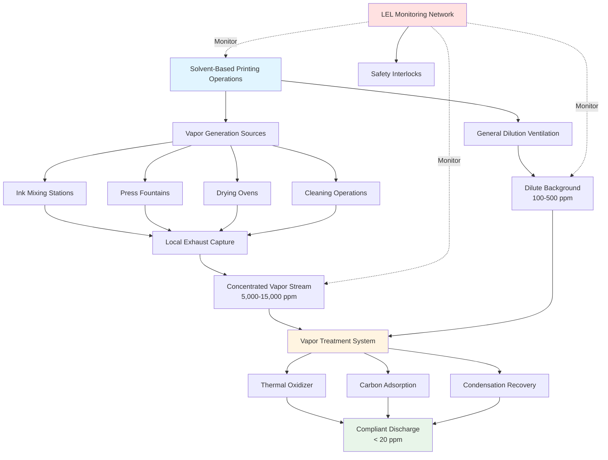
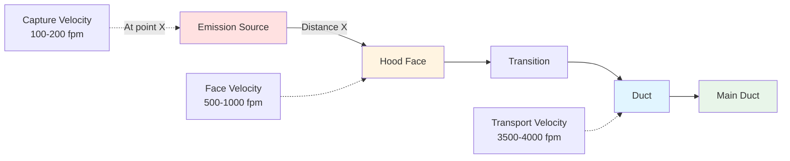
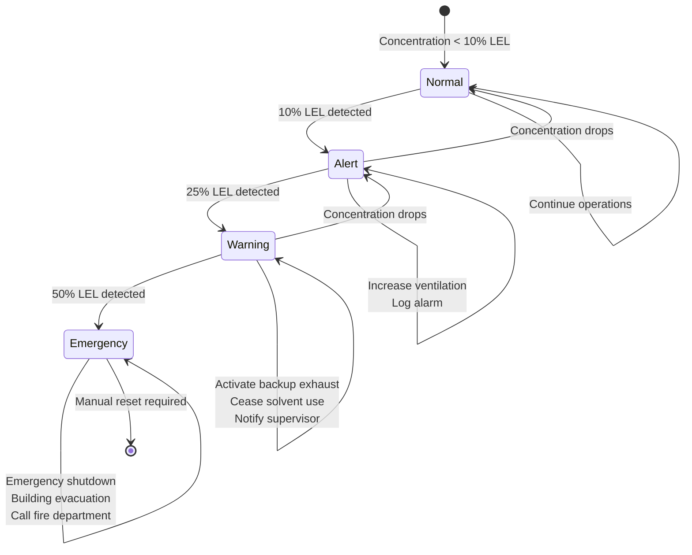
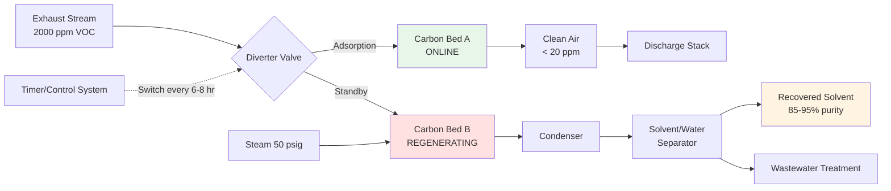
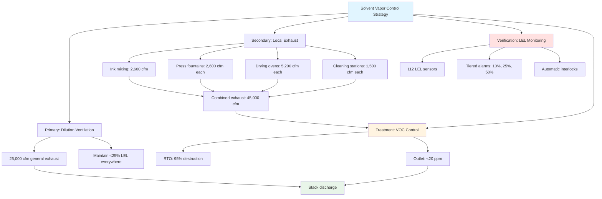

## Overview of Solvent Vapor Control

Printing plants utilizing solvent-based inks and coatings generate volatile organic compound (VOC) emissions that require specialized ventilation and control systems. These systems must simultaneously address worker safety through lower explosive limit (LEL) monitoring, environmental compliance with EPA regulations, and efficient capture and treatment of solvent vapors.

The primary challenge in printing plant HVAC design is maintaining solvent vapor concentrations well below explosive limits while capturing emissions for treatment before atmospheric discharge. Modern facilities employ a layered approach: dilution ventilation provides baseline safety, local exhaust captures concentrated vapors at source, LEL monitoring verifies system performance, and vapor recovery or destruction systems achieve regulatory compliance.

## VOC Emission Sources and Characteristics

Printing operations generate VOC emissions from multiple sources:

**Primary emission points:**
- Ink mixing and preparation stations
- Press fountains and ink delivery systems
- Drying ovens and curing zones
- Cleaning operations using solvent wipes
- Waste solvent storage and handling

Common printing solvents include toluene, MEK (methyl ethyl ketone), acetone, ethyl acetate, and isopropyl alcohol. Each solvent exhibits distinct properties affecting ventilation design:

| Solvent | LEL (%) | Vapor Density | Saturation Concentration (ppm) |
|---------|---------|---------------|-------------------------------|
| Toluene | 1.2 | 3.14 | 37,000 at 77°F |
| MEK | 1.4 | 2.42 | 130,000 at 77°F |
| Acetone | 2.5 | 2.00 | 308,000 at 77°F |
| Ethyl Acetate | 2.0 | 3.04 | 119,000 at 77°F |

All these solvents produce vapors heavier than air, which tend to accumulate in low areas without adequate ventilation.

## Dilution Ventilation Design

Dilution ventilation provides the primary safety mechanism by maintaining solvent vapor concentrations below 25% of LEL (a common industrial safety standard per NFPA 86). The required ventilation rate depends on solvent evaporation rate, vapor density effects, and target dilution level.

### Theoretical Basis for Dilution Calculations

The fundamental principle derives from mass balance: solvent vapor generation rate must equal removal rate through ventilation to maintain steady-state concentration.

$$\dot{m}_{evap} = Q \times \rho_{air} \times C_{target}$$

Where:
- $\dot{m}_{evap}$ = Solvent evaporation rate (lb/min)
- $Q$ = Ventilation airflow (ft³/min)
- $\rho_{air}$ = Air density (lb/ft³)
- $C_{target}$ = Target concentration (lb solvent/lb air)

Converting to volumetric concentration using ideal gas law at standard conditions:

$$Q_{dilution} = \frac{\dot{m}_{evap} \times 387 \times T}{MW \times C_{ppm} \times 10^{-6}}$$

Simplified for room temperature (530°R):

$$Q_{dilution} = \frac{403 \times \dot{m}_{evap} \times SG}{LEL \times SF}$$

Where:
- $Q_{dilution}$ = Required airflow (cfm)
- $\dot{m}_{evap}$ = Evaporation rate (lb/min)
- $SG$ = Specific gravity of solvent
- $LEL$ = Lower explosive limit (% by volume)
- $SF$ = Safety factor (4 for 25% LEL, 10 for 10% LEL)
- $MW$ = Molecular weight (g/mol)

### Design Example: Publication Gravure Press

Press operating parameters:
- Toluene evaporation: 5 lb/hr = 0.083 lb/min
- Solvent properties: $SG = 0.867$, $MW = 92$, $LEL = 1.2\%$
- Target concentration: 25% LEL (safety factor = 4)

$$Q_{dilution} = \frac{403 \times 0.083 \times 0.867}{1.2 \times 4} = \frac{29.0}{4.8} = 6,040 \text{ cfm}$$

**Mixing efficiency correction:** This assumes perfect instantaneous mixing throughout the space. Real facilities exhibit concentration gradients due to:
- Stratification from vapor density differences
- Dead zones with poor air circulation
- Distance from emission source to exhaust points
- Transient emission spikes

Apply mixing factor $K = 3$ to $5$ based on facility geometry:

$$Q_{actual} = K \times Q_{dilution} = 4 \times 6,040 = 24,160 \text{ cfm}$$

Design selection: 25,000 cfm general ventilation system.

### Vapor Density Effects

All common printing solvents produce vapors heavier than air, creating stratification challenges:

**Vapor density relative to air:**

$$\rho_{vapor,rel} = \frac{MW_{solvent}}{MW_{air}} = \frac{MW_{solvent}}{29}$$

| Solvent | Molecular Weight | Relative Density | Stratification Tendency |
|---------|------------------|------------------|------------------------|
| Toluene | 92 | 3.17 | High |
| MEK | 72 | 2.48 | High |
| Acetone | 58 | 2.00 | Moderate |
| Ethyl Acetate | 88 | 3.03 | High |
| IPA | 60 | 2.07 | Moderate |

**Design implications:**
- Provide low-level exhaust points (12-18 in above floor) to capture settled vapors
- Maintain air velocity of 50-100 fpm at floor level to prevent accumulation
- Avoid creating stagnant zones near solvent storage or waste collection areas

## Local Exhaust Ventilation Design

While dilution ventilation provides background safety, local exhaust ventilation (LEV) captures vapors at source, reducing overall ventilation requirements and concentrating emissions for efficient treatment. LEV design follows ACGIH Industrial Ventilation Manual principles.

### Capture Hood Fundamentals

The required airflow to capture contaminants depends on hood geometry, emission velocity, and distance from source:

**Capture velocity equation:**

$$Q_{hood} = V_c \times A_{capture}$$

Where:
- $Q_{hood}$ = Hood airflow (cfm)
- $V_c$ = Capture velocity at furthest emission point (fpm)
- $A_{capture}$ = Cross-sectional area of capture envelope (ft²)

**For exterior hoods** (source outside hood boundary):

$$Q = V_c \times (10X^2 + A_{hood})$$

Where:
- $X$ = Distance from hood face to contaminant source (ft)
- $A_{hood}$ = Hood face area (ft²)

**For enclosing hoods** (source within hood):

$$Q = V_{face} \times A_{opening}$$

### Application-Specific LEV Designs

**Ink mixing station exhaust:**

Open surface tank with volatile solvent evaporation requires lateral exhaust or rim exhaust:

$$Q = V_c \times L \times (5X + W)$$

For rectangular tank:
- $L$ = Tank length (ft)
- $W$ = Tank width (ft)
- $X$ = Distance from hood to furthest edge (ft)
- $V_c$ = 100-150 fpm for solvents

Example: 2 ft × 3 ft mixing tank, hood mounted 1 ft from edge:
$$Q = 125 \times 3 \times (5 \times 1 + 2) = 125 \times 3 \times 7 = 2,625 \text{ cfm}$$

**Press fountain capture:**

Lateral slot hood positioned 12-18 in from fountain provides effective capture:

$$Q = 50 \times L \times (10X + W_{slot})$$

For 60-in wide press with slot hood 1 ft away:
$$Q = 50 \times 5 \times (10 \times 1 + 0.5) = 2,625 \text{ cfm}$$

**Drying oven canopy hoods:**

High-temperature vapor plumes exhibit buoyant rise, captured by canopy hoods with lower face velocities:

$$Q = 1.4 \times P \times H \times \sqrt{H}$$

Where:
- $P$ = Oven perimeter (ft)
- $H$ = Height of hood above oven (ft)

For 8 ft × 4 ft oven with hood 3 ft above:
$$Q = 1.4 \times 24 \times 3 \times \sqrt{3} = 1.4 \times 24 \times 5.20 = 174 \text{ cfm per linear ft}$$

Total: 174 cfm/ft × 24 ft = 4,176 cfm minimum

Add 25-50% for non-ideal conditions: 5,200-6,200 cfm design.

**Cleaning station enclosures:**

Fully enclosed stations with single access opening provide maximum capture efficiency:

$$Q = V_{face} \times A_{opening} + Q_{makeup}$$

Target face velocity: 100-150 fpm for organic solvent vapors

4 ft × 3 ft opening:
$$Q = 125 \times 12 = 1,500 \text{ cfm}$$

### Duct Design for Solvent Vapor Transport

**Minimum transport velocities** prevent vapor condensation and particulate settling:

| Material Transported | Minimum Velocity |
|---------------------|------------------|
| Solvent vapors only | 2,000 fpm |
| Vapors + light mist | 3,000 fpm |
| Vapors + heavy mist | 3,500-4,000 fpm |
| Vapors + dried ink particles | 4,000-4,500 fpm |

**Pressure loss calculation:**

$$\Delta P_{duct} = \frac{f \times L \times V^2}{2g \times D \times 12}$$

Where:
- $f$ = Friction factor (0.02-0.05 for galvanized steel)
- $L$ = Duct length (ft)
- $V$ = Velocity (fpm)
- $D$ = Duct diameter (in)
- $g$ = 32.2 ft/s²

For 100 ft of 12-in diameter duct at 3,500 fpm:

$$\Delta P = \frac{0.025 \times 100 \times 3500^2}{2 \times 32.2 \times 12 \times 12} = 3.26 \text{ in w.c.}$$

Add fitting losses (elbows, transitions, entries) typically 1.5-3× straight duct loss.

## LEL Monitoring and Safety Systems

Continuous LEL monitoring ensures solvent vapor concentrations remain well below explosive limits as mandated by OSHA 29 CFR 1910.106 and NFPA 86. Monitoring system design integrates sensor placement, alarm management, and automatic control responses.

### LEL and UEL Fundamentals

Flammable vapors ignite only within a specific concentration range:

**Lower Explosive Limit (LEL):** Minimum vapor concentration supporting combustion
**Upper Explosive Limit (UEL):** Maximum vapor concentration supporting combustion

$$\text{Flammable Range} = UEL - LEL$$

Common printing solvents exhibit LEL values of 1-3% by volume:

| Solvent | LEL (%) | UEL (%) | Flammable Range | Flash Point (°F) |
|---------|---------|---------|-----------------|------------------|
| Toluene | 1.2 | 7.1 | 5.9% | 40 |
| MEK | 1.4 | 11.4 | 10.0% | 16 |
| Acetone | 2.5 | 12.8 | 10.3% | 0 |
| Ethyl Acetate | 2.0 | 11.5 | 9.5% | 24 |
| IPA | 2.0 | 12.7 | 10.7% | 53 |
| Heptane | 1.05 | 6.7 | 5.65% | 25 |

**Design criterion:** Maintain concentration below 25% LEL (or 10% LEL in highly hazardous applications) to provide safety margin accounting for:
- Sensor accuracy (±10-15% of reading)
- Response time lag (10-30 seconds)
- Non-uniform concentration distribution
- Transient emission spikes

### Sensor Technology Selection

**Catalytic bead sensors:**

Operate on principle of catalytic oxidation. Flammable gas contacts heated platinum bead (400-500°C), causing temperature rise proportional to gas concentration.

**Advantages:**
- Responds to all flammable gases
- Rugged and reliable
- Lower cost ($500-1,500 per sensor)

**Limitations:**
- Requires oxygen (>10% O₂)
- Catalyst poisoning from lead, silicon, sulfur compounds
- Cross-sensitivity to various gases
- 2-3 year calibration interval

**Infrared (IR) sensors:**

Detect specific absorption wavelengths characteristic of hydrocarbon C-H bonds. Non-contact optical measurement.

**Advantages:**
- No catalyst poisoning
- Longer service life (5+ years)
- Works in inert atmospheres
- Minimal drift

**Limitations:**
- Higher cost ($2,000-4,000 per sensor)
- Requires clear optical path
- Compound-specific calibration
- Interference from water vapor, CO₂

**Metal oxide semiconductor (MOS) sensors:**

Tin dioxide semiconductor changes resistance when exposed to reducing gases.

**Advantages:**
- High sensitivity
- Fast response (< 5 seconds)
- Compact size

**Limitations:**
- Shorter lifespan (1-2 years)
- Affected by temperature, humidity
- Less selective

**Recommendation:** Use catalytic bead sensors for general area monitoring, IR sensors in harsh environments or where long-term stability is critical.

### Sensor Placement Strategy

**Coverage density:**

$$N_{sensors} = \frac{A_{floor}}{A_{coverage}} + N_{special}$$

Where:
- $A_{floor}$ = Total floor area (ft²)
- $A_{coverage}$ = Coverage per sensor (400-600 ft² typical)
- $N_{special}$ = Additional sensors at critical points

**Placement criteria:**

1. **General area monitoring:** One sensor per 400-600 ft² of production floor at breathing height (4-6 ft)

2. **Low-level monitoring:** Sensors 6-12 in above floor in areas where heavier-than-air vapors accumulate:
   - Solvent storage rooms
   - Pit areas and depressions
   - Dead-end corridors
   - Equipment rooms below grade

3. **Emission source monitoring:** Within 10-15 ft of major sources:
   - Ink mixing stations
   - Press fountains
   - Cleaning stations
   - Waste solvent drums

4. **Exhaust duct monitoring:** Before treatment equipment to verify capture efficiency and prevent over-LEL conditions in ductwork

**Example facility layout:**

40,000 ft² printing facility with 4 large presses:
- General area: 40,000 / 500 = 80 sensors
- Low-level: 12 sensors (solvent rooms, pits)
- Source points: 16 sensors (4 per press)
- Duct monitoring: 4 sensors
- **Total: 112 sensors**

### Alarm and Interlock Strategy

**Tiered response levels:**

**Level 1: 10% LEL (Advisory)**
- Action: Increase general ventilation by 25-50%
- Log event in monitoring system
- Alert facility operator
- Continue production with heightened awareness

**Level 2: 25% LEL (Warning)**
- Action: Activate supplemental exhaust fans
- Cease adding solvent to process
- Shut down non-essential equipment
- Notify production supervisor and safety manager
- Investigate source of elevated concentration
- Requires manual reset after concentration drops

**Level 3: 50% LEL (Emergency)**
- Action: Emergency shutdown of all solvent-related equipment
- Activate building alarm
- Initiate evacuation procedures
- Notify fire department
- Energize all available exhaust systems
- De-energize non-essential electrical equipment
- Requires safety manager authorization to restart

**OSHA requirements** (29 CFR 1910.106): Systems using Class I flammable liquids must maintain vapor concentration below 25% LEL through ventilation and monitoring.

**NFPA 86 requirements:** Ovens and dryers processing flammable materials require continuous monitoring with automatic shutdown at 25% LEL.

## Vapor Recovery Systems

Vapor recovery captures and recycles solvents rather than destroying them, providing both environmental compliance and economic benefit. Two primary technologies dominate printing applications: carbon adsorption and condensation recovery.

### Carbon Adsorption Systems

Activated carbon physically adsorbs VOC molecules through van der Waals forces within the extensive internal pore structure (surface area 800-1,500 m²/g). Adsorption is reversible, allowing solvent recovery through regeneration.

**Adsorption thermodynamics:**

The equilibrium loading follows Freundlich isotherm:

$$q = K \times C^{1/n}$$

Where:
- $q$ = Solvent loading on carbon (lb solvent/lb carbon)
- $C$ = Gas phase concentration (ppm or g/m³)
- $K$, $n$ = Empirical constants depending on solvent-carbon pair

Typical values for printing solvents on activated carbon:
- Toluene: $K = 0.35$, $n = 2.8$
- MEK: $K = 0.28$, $n = 2.5$
- Ethyl acetate: $K = 0.32$, $n = 2.6$

**Practical design capacity:** 15-25% by weight for common solvents at typical inlet concentrations (1,000-5,000 ppm)

### System Design Calculation

**Mass loading rate:**

$$\dot{m}_{VOC} = \frac{Q \times C_{inlet} \times MW}{387 \times T}$$

Where:
- $\dot{m}_{VOC}$ = VOC mass flow rate (lb/hr)
- $Q$ = Exhaust airflow (cfm)
- $C_{inlet}$ = Inlet concentration (ppm)
- $MW$ = Molecular weight (g/mol)
- $T$ = Temperature (°R)

**Example: 10,000 cfm exhaust, 2,000 ppm toluene**

$$\dot{m}_{VOC} = \frac{10,000 \times 2,000 \times 92}{387 \times 530} = \frac{1.84 \times 10^9}{2.05 \times 10^5} = 89.8 \text{ lb/hr}$$

**Carbon bed sizing:**

$$M_{carbon} = \frac{\dot{m}_{VOC} \times t_{cycle}}{q_{capacity}}$$

Where:
- $M_{carbon}$ = Required carbon mass (lb)
- $t_{cycle}$ = Adsorption time between regenerations (hr)
- $q_{capacity}$ = Working capacity (lb VOC/lb carbon), typically 0.15-0.25

For 6-hour cycle with 20% capacity:

$$M_{carbon} = \frac{89.8 \times 6}{0.20} = 2,694 \text{ lb carbon}$$

**Bed geometry:**

Face velocity through carbon bed: 50-100 fpm (75 fpm typical)

$$A_{bed} = \frac{Q}{V_{face}} = \frac{10,000}{75} = 133 \text{ ft}^2$$

For circular vessel: Diameter = 13 ft
For rectangular bed: 10 ft × 13.3 ft

Bed depth: 12-24 in (18 in typical for good contact time)

$$V_{carbon} = A_{bed} \times D_{bed} = 133 \times 1.5 = 200 \text{ ft}^3$$

Carbon bulk density: 25-30 lb/ft³

$$M_{carbon,actual} = 200 \times 27 = 5,400 \text{ lb}$$

This provides 12-hour cycle time (double the 6-hour requirement), allowing operational flexibility.

**Contact time verification:**

$$t_{contact} = \frac{V_{carbon}}{Q} = \frac{200}{10,000} = 0.02 \text{ min} = 1.2 \text{ seconds}$$

Acceptable for VOC adsorption (minimum 0.5-1.0 seconds).

### Regeneration Systems

**Steam regeneration:**

Most common for printing applications. Inject low-pressure steam (15-50 psig) through saturated carbon bed:

**Steam requirement:**

$$\dot{m}_{steam} = 0.3 \text{ to } 0.5 \times M_{carbon} \text{ (lb steam/lb carbon per cycle)}$$

For 2,700 lb carbon bed:

$$\dot{m}_{steam} = 0.4 \times 2,700 = 1,080 \text{ lb steam per regeneration}$$

Regeneration time: 2-4 hours
Steam flow rate: 1,080 / 3 = 360 lb/hr = 390 lb/hr at 50 psig

**Hot inert gas regeneration:**

Alternative for facilities without steam. Heated nitrogen or air (250-350°F) desorbs solvent:

**Energy requirement:**

$$Q_{regen} = M_{carbon} \times c_p \times \Delta T + \dot{m}_{VOC} \times h_{vap}$$

Typically 1,500-2,500 Btu/lb carbon

**Advantages:**
- No wastewater generation
- Faster regeneration (1-2 hours)
- Higher solvent purity

**Disadvantages:**
- Higher operating cost (fuel for heating)
- Fire risk if not properly controlled

### Condensation Recovery

High-concentration vapor streams (>5,000 ppm) may justify direct condensation recovery. Chill exhaust air below solvent dewpoint to condense vapors.

**Dewpoint calculation:**

Raoult's Law for ideal mixtures:

$$P_{vapor} = X_{vapor} \times P_{sat}(T)$$

Where:
- $P_{vapor}$ = Partial pressure of solvent in air
- $X_{vapor}$ = Mole fraction of solvent
- $P_{sat}$ = Saturation vapor pressure at temperature $T$

For 10,000 ppm (1%) toluene in air at atmospheric pressure:

$$P_{toluene} = 0.01 \times 14.7 = 0.147 \text{ psia}$$

From Antoine equation or vapor pressure tables, toluene saturation pressure equals 0.147 psia at -10°F.

**Condensation system design:**

**Cooling method:** Two-stage approach maximizes recovery:

**Stage 1: Water-cooled condenser**
- Inlet: 100-150°F (oven exhaust temperature)
- Outlet: 40-50°F (chilled water limit)
- Recovery: 70-85% of inlet VOC

**Stage 2: Refrigerated condenser**
- Inlet: 40-50°F
- Outlet: -10 to 0°F
- Recovery: Additional 10-20%
- Overall efficiency: 85-95%

**Cooling load calculation:**

$$Q_{cooling} = Q_{air} \times \rho \times c_p \times \Delta T + \dot{m}_{VOC} \times h_{fg}$$

For 10,000 cfm cooled from 150°F to 0°F, condensing 90 lb/hr toluene:

Sensible cooling:
$$Q_{sensible} = 10,000 \times 0.075 \times 0.24 \times 150 = 27,000 \text{ Btu/hr}$$

Latent cooling (heat of vaporization toluene = 165 Btu/lb):
$$Q_{latent} = 90 \times 165 = 14,850 \text{ Btu/hr}$$

Total: 41,850 Btu/hr = 3.5 tons refrigeration

**Economics:** Condensation systems cost $100,000-300,000 but eliminate carbon replacement and regeneration costs. Payback period depends on solvent value and recovery quantity.

## Thermal Oxidation Technologies

When VOC recovery is not economical or required destruction efficiency exceeds 95%, thermal oxidation destroys VOCs through high-temperature combustion. Three technologies dominate based on concentration, flow rate, and heat recovery requirements.

### Regenerative Thermal Oxidizer (RTO)

RTOs achieve 95-99% destruction efficiency with 90-95% heat recovery through ceramic media beds that alternately absorb combustion heat and preheat incoming exhaust.

**Operating principle:**

1. Cold exhaust enters through hot ceramic bed, preheating to 1,300-1,500°F
2. Minimal supplemental fuel raises temperature to 1,450-1,600°F in combustion chamber
3. Hot clean exhaust passes through cold ceramic bed, transferring heat
4. Valves switch flow direction every 2-3 minutes

**Thermal efficiency:**

$$\eta_{thermal} = \frac{T_{out,cold} - T_{ambient}}{T_{combustion} - T_{ambient}}$$

For well-designed RTO:
$$\eta_{thermal} = \frac{1500 - 70}{1550 - 70} = 0.966 = 96.6\%$$

**Self-sustaining concentration:**

VOC concentration providing sufficient combustion energy to maintain operating temperature without supplemental fuel:

$$C_{autothermal} = \frac{(T_{comb} - T_{inlet}) \times \rho \times c_p}{HHV \times \eta_{thermal}}$$

Where:
- $T_{comb}$ = Combustion temperature (1,550°F = 2,010°R)
- $T_{inlet}$ = Inlet temperature (70°F = 530°R)
- $\rho$ = Air density (0.075 lb/ft³)
- $c_p$ = Specific heat (0.24 Btu/lb·°F)
- $HHV$ = Higher heating value of solvent (18,000 Btu/lb for toluene)
- $\eta_{thermal}$ = Heat recovery efficiency (0.95)

$$C_{autothermal} = \frac{(2010-530) \times 0.075 \times 0.24}{18,000 \times 0.95} = \frac{26.6}{17,100} = 0.00156 = 0.156\%$$

Convert to ppm: 0.156% = 1,560 ppm

**Design implications:** Exhaust streams above 1,500-2,000 ppm operate with minimal fuel consumption. Below this threshold, natural gas supplementation is required.

**Fuel consumption calculation:**

For 15,000 cfm at 800 ppm toluene (below autothermal point):

Heat required:
$$Q_{required} = Q \times \rho \times c_p \times \Delta T \times (1 - \eta)$$

$$Q_{required} = 15,000 \times 0.075 \times 0.24 \times 1,480 \times 0.05 = 19,980 \text{ Btu/min}$$

Natural gas (1,000 Btu/ft³):
$$V_{NG} = \frac{19,980}{1,000 \times 0.9} = 22.2 \text{ ft}^3/\text{min} = 1,332 \text{ ft}^3/\text{hr}$$

At $8/MCF: Operating cost = $10.66/hr = $7,674/month (continuous operation)

**Capital cost:** $500,000-1,500,000 for 10,000-25,000 cfm capacity

### Catalytic Oxidizer

Catalyst (platinum, palladium) enables VOC destruction at 600-900°F, reducing fuel consumption compared to thermal oxidation.

**Catalyst reaction mechanism:**

VOCs adsorb on catalyst surface, oxygen molecules dissociate at active sites, oxidation reaction proceeds at lower activation energy than gas-phase combustion:

$$\text{C}_x\text{H}_y + \left(x + \frac{y}{4}\right)\text{O}_2 \xrightarrow{\text{catalyst}} x\text{CO}_2 + \frac{y}{2}\text{H}_2\text{O}$$

**Operating temperature:** 600-800°F for most solvents, compared to 1,400-1,600°F for thermal oxidation

**Energy savings:**

$$\Delta Q = Q \times \rho \times c_p \times (T_{thermal} - T_{catalytic})$$

For 10,000 cfm:
$$\Delta Q = 10,000 \times 0.075 \times 0.24 \times (1500-700) = 14,400 \text{ Btu/min} = 864,000 \text{ Btu/hr}$$

Fuel savings: 864 therms/hr = $691/day at $8/therm

**Limitations:**

**Catalyst poisons** permanently deactivate catalyst:
- Heavy metals (lead, zinc, bismuth)
- Silicon compounds (siloxanes from coating)
- Phosphorus
- Halogens (chlorine, fluorine)

**Catalyst masking** temporarily blocks active sites:
- Particulate matter
- High-molecular-weight compounds
- Polymerizing materials

**Design requirements:**
- Pre-filtration to remove particulates > 10 microns
- Inlet VOC concentration < 25% LEL (heat generation limitation)
- Face velocity: 5-20 ft/s through catalyst bed
- Catalyst replacement: Every 3-5 years ($50,000-150,000)

**Capital cost:** $300,000-800,000 for 10,000-25,000 cfm

### Direct-Fired Thermal Oxidizer

Simplest technology: Exhaust mixes with burner flame in refractory-lined chamber at 1,400-2,000°F.

**Destruction efficiency:** 99%+ with 0.5-1.0 second residence time at temperature

**Heat recovery:** 0-70% through shell-and-tube heat exchanger preheating inlet stream

**Fuel consumption (no heat recovery):**

$$\dot{m}_{fuel} = \frac{Q \times \rho \times c_p \times \Delta T}{HHV_{fuel} \times \eta_{combustion}}$$

For 10,000 cfm from 70°F to 1,600°F:

$$\dot{m}_{fuel} = \frac{10,000 \times 0.075 \times 0.24 \times 1530}{1,000 \times 0.85} = 323 \text{ ft}^3/\text{min} = 19,380 \text{ ft}^3/\text{hr}$$

Operating cost: $155/hr = $112,000/month (continuous operation at $8/MCF)

**With 60% heat recovery:**

Fuel reduced by 60%: $155 × 0.40 = $62/hr = $44,640/month

**Application:** Low-concentration streams (<1,000 ppm) where RTO capital cost cannot be justified, or where maximum destruction efficiency is required regardless of cost.

**Capital cost:** $150,000-400,000 for 10,000-25,000 cfm

### Technology Selection Matrix

| Parameter | Direct-Fired | Catalytic | RTO |
|-----------|-------------|-----------|-----|
| Destruction efficiency | 99%+ | 95-98% | 95-99% |
| Operating temperature | 1,400-2,000°F | 600-900°F | 1,450-1,600°F |
| Heat recovery | 0-70% | 50-70% | 90-95% |
| Autothermal concentration | 8,000-12,000 ppm | 4,000-6,000 ppm | 1,500-2,000 ppm |
| Catalyst poisoning risk | None | High | None |
| Capital cost | $ | $$ | $$$ |
| Operating cost (low VOC) | $$$ | $$ | $ |
| Operating cost (high VOC) | $ | $ | $ |
| Best application | <1,000 ppm variable | 1,000-4,000 ppm clean | >1,500 ppm continuous |

## EPA Regulatory Compliance

Printing facilities face complex VOC emission regulations under the Clean Air Act. Compliance requirements depend on facility size, location, printing process, and annual VOC emissions.

### Applicable Regulations

**National Emission Standards for Hazardous Air Pollutants (NESHAP) - 40 CFR Part 63, Subpart KK:**

Applies to major sources (>10 tons/year of single HAP or >25 tons/year of combined HAPs):

**Control requirements:**
- 95% capture efficiency for all emission points
- 95% destruction efficiency for control devices
- Or outlet concentration ≤20 ppmv as propane

**Affected operations:**
- Publication rotogravure printing
- Product and packaging rotogravure printing
- Flexographic printing
- Coating operations

**Maximum Achievable Control Technology (MACT) standards:**

Emission limits based on best-performing 12% of existing sources:
- Facility-wide emission rate: 0.04-0.20 kg VOC/kg solids applied (varies by process)
- Or overall control efficiency ≥90-95%

**State Implementation Plans (SIP):**

Regional regulations in non-attainment areas (fail to meet NAAQS):

**Ozone non-attainment area requirements:**
- Reasonably Available Control Technology (RACT): 85-90% overall efficiency
- Best Available Retrofit Technology (BART): 90-95% efficiency for large sources
- Lowest Achievable Emission Rate (LAER): Maximum control for new major sources

**Example: South Coast Air Quality Management District (SCAQMD) Rule 1130:**
- Gravure printing: 16 lb VOC/lb solids applied
- Flexographic printing: 16 lb VOC/lb solids applied
- Screen printing: 4.8 lb VOC/gallon coating (minus water and exempt compounds)

### Compliance Demonstration

**Capture efficiency testing:**

$$E_{capture} = \frac{\dot{m}_{captured}}{\dot{m}_{total}} \times 100\%$$

Measure VOC concentration and flow rate at all emission points (captured and fugitive).

**Method 204** (EPA): Determine capture efficiency using temporary total enclosure or building enclosure with inlet and outlet monitoring.

**Control device efficiency testing:**

$$E_{control} = \frac{C_{inlet} - C_{outlet}}{C_{inlet}} \times 100\%$$

**Test methods:**
- **EPA Method 25A:** Total gaseous organics as propane (FID measurement)
- **EPA Method 25:** Individual VOC compounds (GC/FID analysis)
- **EPA Method 18:** Specific compounds (GC/MS)

**Overall efficiency:**

$$E_{overall} = E_{capture} \times E_{control}$$

Example: 92% capture × 97% destruction = 89.2% overall efficiency

**Facility-wide emission calculation:**

$$E_{annual} = \sum_{i=1}^{n} \left[ M_{material,i} \times F_{VOC,i} \times (1 - E_{overall,i}) \right]$$

Where:
- $M_{material,i}$ = Mass of coating/ink applied (lb/yr)
- $F_{VOC,i}$ = VOC fraction of material
- $E_{overall,i}$ = Overall control efficiency

### Continuous Compliance Monitoring

**Thermal oxidizer monitoring parameters:**

Required by 40 CFR Part 63 Subpart KK:

| Parameter | Monitoring Frequency | Alarm Setpoint |
|-----------|---------------------|----------------|
| Combustion temperature | Continuous (15-min avg) | <50°F below design |
| Combustion chamber pressure | Continuous | Negative draft indication |
| Fuel flow rate | Continuous | Low fuel alarm |
| VOC concentration (optional) | Continuous | >20 ppmv outlet |

**Carbon adsorption monitoring:**

| Parameter | Monitoring Frequency | Alarm Setpoint |
|-----------|---------------------|----------------|
| Bed temperature | Continuous during regeneration | >250°F (fire risk) |
| Outlet VOC concentration | Continuous or periodic | Breakthrough detection |
| Regeneration cycle time | Event logging | Delayed regeneration |
| Differential pressure | Continuous | High ΔP (plugging) |

**LEL monitoring for compliance:**

Continuous monitoring demonstrates concentration maintained <25% LEL as required by NFPA 86 and OSHA 29 CFR 1910.106.

### Record-Keeping Requirements

**Daily operational logs:**
- Hours of operation
- Material usage (gallons or pounds)
- VOC content of materials
- Control device operating parameters
- Excursions from normal operation

**Monthly calculations:**
- VOC emissions by process
- Capture efficiency verification
- Control efficiency verification
- Facility-wide emissions total

**Annual reports:**
- Compliance certification
- Deviation reports (parameter excursions >5% of time)
- Performance test results (conducted every 2-5 years)
- Material usage and emission inventory

**Electronic reporting:** EPA requires electronic submittal through CEDRI (Compliance and Emissions Data Reporting Interface) for NESHAP compliance.

### Permitting Considerations

**Title V Operating Permit:**

Required for major sources (>100 tons/yr VOC or 25 tons/yr HAP):
- Emission limits for each process
- Operating parameters and monitoring requirements
- Record-keeping and reporting requirements
- Annual compliance certification
- Permit renewal every 5 years

**Pre-construction permits:**

New or modified sources require permits demonstrating:
- BACT (Best Available Control Technology) analysis
- Air quality impact modeling
- Public notice and comment period
- EPA review for PSD (Prevention of Significant Deterioration) sources

**Penalties for non-compliance:**

Civil penalties up to $55,808 per day per violation (2024 rate, adjusted annually for inflation). Criminal penalties for knowing violations causing endangerment.

**OSHA compliance:** 29 CFR 1910.106 and 1910.107 establish requirements for flammable liquid storage, handling, and spray application in printing operations.

## System Integration and Operation

Effective solvent vapor control requires integration of ventilation, monitoring, and treatment systems into a cohesive safety and compliance strategy.

### Layered Control Approach

### Design Integration Checklist

**Ventilation system coordination:**

1. **Exhaust system capacity:**
   - General dilution: 0.3-0.5 cfm/ft² floor area
   - Local exhaust: Sum of individual hood requirements
   - Treatment system: Sized for combined exhaust flow

2. **Makeup air requirements:**
   $$Q_{makeup} = Q_{exhaust} - Q_{infiltration}$$

   Typically 90-95% of exhaust (assuming 5-10% building infiltration)

3. **Building pressurization:**
   - Maintain +0.02 to +0.05 in w.c. in production areas
   - Negative pressure in solvent storage rooms
   - Differential pressure monitoring between zones

**Control system integration:**

**Normal operation sequence:**
1. Makeup air unit energizes, establishes positive building pressure
2. General dilution exhaust fans start
3. LEL monitoring system confirms <10% LEL throughout facility
4. Local exhaust systems energize
5. Treatment system preheats to operating temperature (30-60 minutes for RTO)
6. Production equipment permitted to start

**Shutdown sequence:**
1. Cease solvent addition to process
2. Continue all exhaust systems for purge period (15-30 minutes)
3. LEL monitoring confirms <5% LEL throughout facility
4. De-energize local exhaust systems
5. Reduce general dilution to minimum ventilation rate
6. Treatment system remains at temperature (standby mode) or cools down

**Emergency shutdown:**
1. LEL sensor triggers 50% LEL alarm
2. All solvent-handling equipment de-energizes immediately
3. All exhaust systems energize to maximum capacity
4. Building alarm activates
5. Emergency response procedures initiated

### Maintenance Program

**Daily checks:**
- LEL sensor readings review
- Treatment system temperature verification
- Visual inspection for leaks or spills
- Exhaust fan operation verification

**Weekly maintenance:**
- LEL sensor zero/span check
- Local exhaust hood airflow measurement (pitot traverse or hot-wire anemometer)
- Treatment system parameter trending analysis
- Inspection of ductwork for leaks

**Monthly maintenance:**
- LEL sensor calibration with test gas
- Exhaust fan belt tension and bearing inspection
- Treatment system burner inspection and cleaning
- Differential pressure gauge calibration

**Quarterly maintenance:**
- Carbon bed inspection (if applicable)
- Catalyst inspection (if applicable)
- Comprehensive LEL monitoring system test
- Exhaust fan motor current and vibration analysis

**Annual maintenance:**
- Complete LEL sensor replacement (or per manufacturer schedule)
- Treatment system refractory inspection
- Comprehensive airflow balancing
- Regulatory compliance testing (capture efficiency, destruction efficiency)

### Operating Cost Analysis

**Example facility:** 50,000 ft² printing plant, gravure process

**Ventilation costs:**
- General dilution: 25,000 cfm
- Local exhaust: 20,000 cfm
- Total: 45,000 cfm

Heating cost (winter): 45,000 cfm × $0.80/hr per 1,000 cfm = $36/hr
Cooling cost (summer): 45,000 cfm × $1.20/hr per 1,000 cfm = $54/hr

Annual HVAC operating cost: $350,000 (8,000 operating hours)

**Treatment system costs:**

RTO operating at 2,000 ppm average (near autothermal):
- Natural gas: $2,000/month
- Electricity (fans, controls): $1,500/month
- Maintenance: $1,000/month
- Annual: $54,000

**LEL monitoring:**
- Sensor replacement: $50,000/year (112 sensors × $450 each, 2-year life)
- Calibration gas: $2,400/year
- Maintenance labor: $12,000/year
- Annual: $64,400

**Total operating cost:** $468,400/year or $58.55 per operating hour

**Cost reduction strategies:**
- Heat recovery from RTO to preheat makeup air (20-40% HVAC cost reduction)
- Demand-controlled ventilation based on actual VOC generation rates
- Solvent substitution to reduce overall emissions
- Process improvements to minimize solvent usage

---

*Comprehensive solvent vapor control in printing plants integrates dilution ventilation, local exhaust capture, continuous LEL monitoring, and vapor treatment technologies to simultaneously achieve worker safety compliance (OSHA 29 CFR 1910.106), environmental regulatory requirements (EPA 40 CFR Part 63), and economic operation through efficient system design and maintenance programs.*