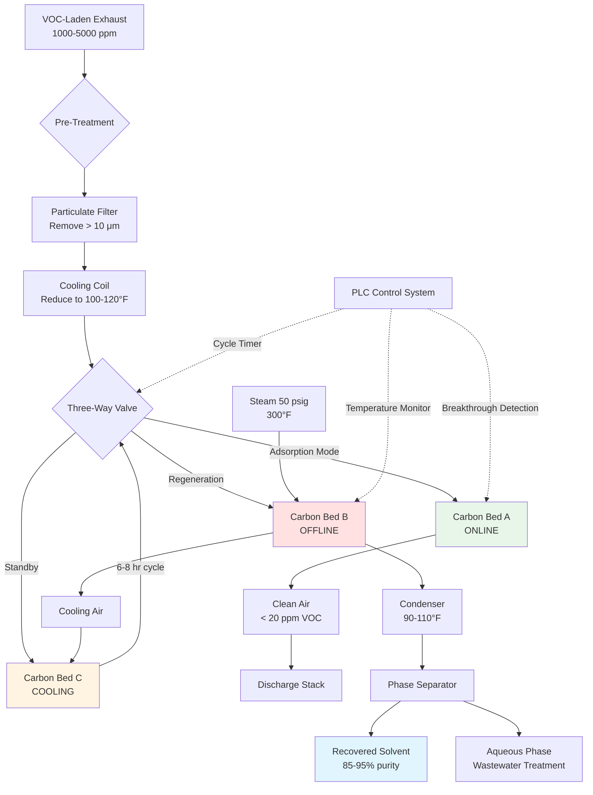
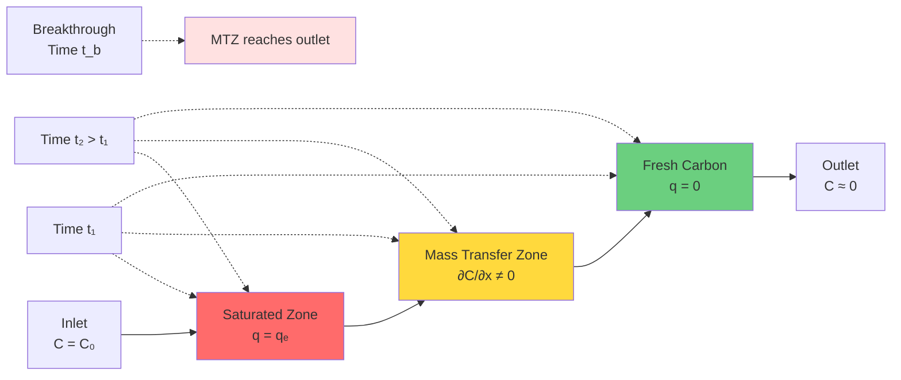
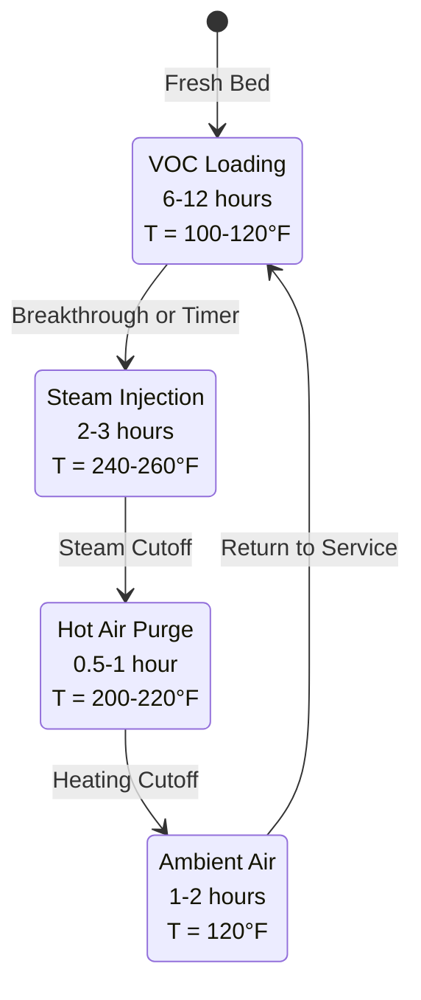
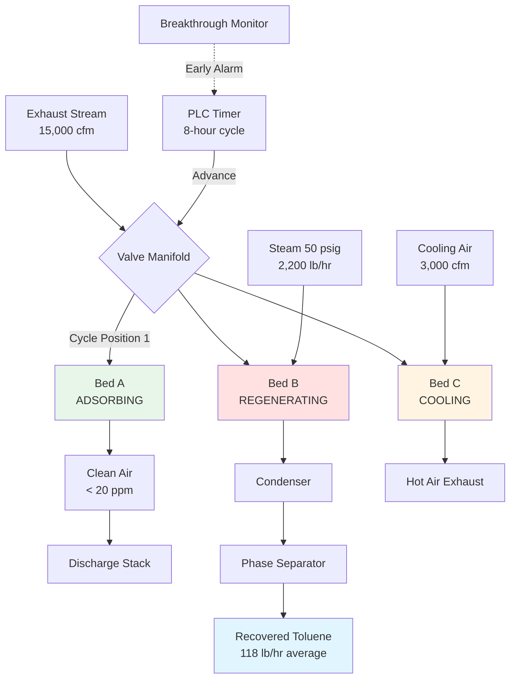

## Overview of Carbon Adsorption Systems

Activated carbon adsorption provides the most effective method for solvent vapor recovery in printing plants when VOC concentrations range from 500 to 10,000 ppm. The technology operates on physical adsorption principles where organic molecules accumulate on the carbon's extensive internal pore structure through van der Waals forces. This reversible process enables solvent recovery through periodic regeneration, offering both environmental compliance and economic value recovery.

The fundamental advantage of carbon adsorption over thermal destruction lies in material recovery. A printing facility consuming 100,000 lb/year of toluene (valued at $1.50/lb) can recover 85-95% through adsorption, yielding $127,500-142,500 in annual solvent value. When factoring reduced solvent purchases, disposal costs, and emission fees, the economic benefit typically justifies capital investment within 2-4 years.

## Activated Carbon Properties and Selection

### Pore Structure and Surface Area

Activated carbon derives its adsorptive capacity from an extensive internal pore network created through controlled oxidation of carbonaceous materials (coal, coconut shell, wood). The activation process generates three categories of pores:

**Pore classification by diameter:**

| Pore Type | Diameter Range | Function | Surface Area Contribution |
|-----------|----------------|----------|---------------------------|
| Micropores | < 20 Å (2 nm) | Primary adsorption sites for small molecules | 90-95% of total surface area |
| Mesopores | 20-500 Å (2-50 nm) | Transport pathways to micropores | 5-8% of total surface area |
| Macropores | > 500 Å (50 nm) | Main diffusion channels from bulk gas | < 2% of total surface area |

**Surface area measurement:**

Total surface area ranges from 800 to 1,500 m²/g for typical vapor-phase carbons. The BET (Brunauer-Emmett-Teller) method using nitrogen adsorption at 77 K provides standardized measurement:

$$S_{BET} = \frac{(V_m - V_{ads}) \times N_A \times \sigma}{M \times V_{molar}}$$

Where:
- $S_{BET}$ = Specific surface area (m²/g)
- $V_m$ = Monolayer adsorbed gas volume (cm³/g)
- $N_A$ = Avogadro's number (6.022 × 10²³)
- $\sigma$ = Cross-sectional area of adsorbate molecule (16.2 Ų for N₂)
- $M$ = Molecular weight of adsorbate
- $V_{molar}$ = Molar volume of gas at STP (22,414 cm³/mol)

### Carbon Types for Printing Solvents

**Coal-based activated carbon:**

Produced from bituminous coal through steam activation at 1,500-1,800°F.

**Characteristics:**
- Surface area: 950-1,100 m²/g
- Bulk density: 26-30 lb/ft³
- Particle size: 4×6, 4×8, 4×10 mesh
- Hardness: 95-98% (ASTM D3802)
- Moisture content: < 2%

**Optimal applications:**
- Aromatic hydrocarbons (toluene, xylene, benzene)
- Ketones (MEK, MIBK, acetone)
- Esters (ethyl acetate, butyl acetate)
- Alcohols (IPA, ethanol, butanol)

**Coconut shell activated carbon:**

Higher microporosity and hardness than coal-based alternatives.

**Characteristics:**
- Surface area: 1,100-1,300 m²/g
- Bulk density: 28-32 lb/ft³
- Hardness: 98-99%
- Lower ash content (< 3% vs 8-12% for coal)

**Optimal applications:**
- Low-molecular-weight compounds (< 100 g/mol)
- High-value solvent recovery where purity matters
- Applications requiring frequent regeneration

**Wood-based activated carbon:**

Lower density with larger mesopore volume.

**Characteristics:**
- Surface area: 800-1,000 m²/g
- Bulk density: 18-22 lb/ft³
- Higher macroporosity

**Optimal applications:**
- High-molecular-weight compounds (> 150 g/mol)
- Viscous vapors requiring rapid diffusion

### Selection Criteria for Printing Applications

**Particle size selection:**

Mesh size affects pressure drop, mass transfer rate, and attrition resistance:

$$\Delta P_{bed} = \frac{150 \times \mu \times V \times (1-\varepsilon)^2}{\varepsilon^3 \times d_p^2} + \frac{1.75 \times \rho \times V^2 \times (1-\varepsilon)}{\varepsilon^3 \times d_p}$$

Where:
- $\Delta P_{bed}$ = Pressure drop through bed (lb/ft²)
- $\mu$ = Gas viscosity (lb/ft·s)
- $V$ = Superficial velocity (ft/s)
- $\varepsilon$ = Bed void fraction (0.38-0.42)
- $d_p$ = Particle diameter (ft)
- $\rho$ = Gas density (lb/ft³)

**Recommended sizing:**

| Application | Mesh Size | Particle Diameter | Pressure Drop | Mass Transfer |
|-------------|-----------|-------------------|---------------|---------------|
| Low ΔP requirement | 4×6 | 3.35-4.75 mm | Minimum | Slower |
| General purpose | 4×8 | 2.36-4.75 mm | Moderate | Good |
| High efficiency | 4×10 | 2.00-4.75 mm | Higher | Faster |
| Rapid cycling | 6×12 | 1.40-3.35 mm | Highest | Fastest |

**Standard selection:** 4×8 mesh coal-based carbon for toluene, MEK, and ethyl acetate recovery in printing plants.

## Adsorption Isotherm Theory

### Fundamental Adsorption Mechanisms

Physical adsorption (physisorption) of VOCs on activated carbon occurs through weak van der Waals forces between adsorbate molecules and carbon surface. The interaction energy (5-40 kJ/mol) allows reversibility through modest temperature increase during regeneration.

**Adsorption enthalpy for common solvents:**

| Solvent | ΔH_ads (kJ/mol) | ΔH_ads (Btu/lb) | Regeneration Temperature |
|---------|-----------------|-----------------|--------------------------|
| Toluene | 35-42 | 162-190 | 212-250°F |
| MEK | 30-36 | 184-220 | 200-230°F |
| Acetone | 28-33 | 222-262 | 190-220°F |
| Ethyl Acetate | 32-38 | 156-185 | 210-240°F |
| IPA | 38-45 | 290-343 | 220-260°F |

**Multilayer adsorption:**

At low concentrations, molecules form monolayer coverage on high-energy sites. As concentration increases, additional layers form on top of the initial monolayer, leading to pore filling at saturation.

### Freundlich Isotherm

The Freundlich equation provides empirical correlation between equilibrium loading and gas-phase concentration:

$$q_e = K_F \times C^{1/n}$$

Where:
- $q_e$ = Equilibrium loading (g solvent/g carbon)
- $C$ = Gas-phase concentration (g/m³)
- $K_F$ = Freundlich capacity coefficient
- $n$ = Adsorption intensity parameter

**Physical interpretation:**

- $1/n < 1$: Favorable adsorption (typical for VOCs on carbon)
- $1/n = 1$: Linear isotherm (Henry's law)
- $1/n > 1$: Unfavorable adsorption

**Empirical constants for printing solvents on coal-based carbon at 25°C:**

| Solvent | K_F | n | Concentration Range (ppm) |
|---------|-----|---|---------------------------|
| Toluene | 0.048 | 2.8 | 100-10,000 |
| MEK | 0.038 | 2.5 | 200-15,000 |
| Acetone | 0.032 | 2.3 | 500-20,000 |
| Ethyl Acetate | 0.041 | 2.6 | 200-12,000 |
| IPA | 0.035 | 2.4 | 300-15,000 |

**Design application:**

For exhaust stream containing 3,000 ppm (12.3 g/m³) toluene at 25°C:

$$q_e = 0.048 \times (12.3)^{1/2.8} = 0.048 \times 2.73 = 0.131 \text{ g toluene/g carbon}$$

This represents 13.1% loading by weight at equilibrium.

### Langmuir Isotherm

The Langmuir model assumes monolayer coverage with no adsorbate-adsorbate interactions:

$$q_e = \frac{q_{max} \times b \times C}{1 + b \times C}$$

Where:
- $q_{max}$ = Maximum monolayer capacity (g/g)
- $b$ = Langmuir equilibrium constant (m³/g)
- $C$ = Gas-phase concentration (g/m³)

**Linearized form for parameter determination:**

$$\frac{C}{q_e} = \frac{1}{q_{max} \times b} + \frac{C}{q_{max}}$$

Plotting $C/q_e$ vs $C$ yields straight line with slope $1/q_{max}$ and intercept $1/(q_{max} \times b)$.

**Langmuir parameters for toluene on activated carbon:**

- $q_{max}$ = 0.35 g/g (maximum capacity)
- $b$ = 0.0082 m³/g at 25°C

For 3,000 ppm (12.3 g/m³) toluene:

$$q_e = \frac{0.35 \times 0.0082 \times 12.3}{1 + 0.0082 \times 12.3} = \frac{0.0353}{1.101} = 0.032 \text{ g/g}$$

The Langmuir model predicts lower loading than Freundlich at moderate concentrations, providing conservative design basis.

### Temperature Effects on Adsorption Capacity

Adsorption capacity decreases with temperature according to van't Hoff equation:

$$\ln K = -\frac{\Delta H_{ads}}{R \times T} + \frac{\Delta S_{ads}}{R}$$

**Practical capacity correction:**

$$q_T = q_{25°C} \times \exp\left[\frac{\Delta H_{ads}}{R}\left(\frac{1}{T} - \frac{1}{298}\right)\right]$$

Where:
- $T$ = Temperature (K)
- $\Delta H_{ads}$ = Heat of adsorption (J/mol)
- $R$ = 8.314 J/mol·K

**Example: Toluene capacity reduction at elevated temperature**

Design conditions: 3,000 ppm toluene, inlet temperature 100°F (311 K)
Reference capacity at 77°F: $q_{25°C} = 0.131$ g/g
Heat of adsorption: $\Delta H_{ads} = -38,000$ J/mol

$$q_{100°F} = 0.131 \times \exp\left[\frac{-38,000}{8.314}\left(\frac{1}{311} - \frac{1}{298}\right)\right]$$

$$q_{100°F} = 0.131 \times \exp\left[-4,572 \times (-0.00014)\right] = 0.131 \times 0.554 = 0.0726 \text{ g/g}$$

**Capacity reduction:** 44.6% decrease from cooling effect

**Design implication:** Pre-cool exhaust streams to 100-120°F maximum to maintain adsorption efficiency. Each 10°F temperature reduction above ambient increases capacity approximately 8-12%.

## Carbon Bed Sizing Calculations

### Mass Balance and Bed Capacity

**VOC loading rate from exhaust stream:**

$$\dot{m}_{VOC} = Q \times C_{inlet} \times \rho_{gas}$$

Where:
- $\dot{m}_{VOC}$ = VOC mass flow (lb/hr)
- $Q$ = Volumetric flow (ft³/hr)
- $C_{inlet}$ = Inlet concentration (lb/ft³)
- $\rho_{gas}$ = Gas mixture density (lb/ft³)

**Conversion from ppm to mass concentration:**

$$C_{lb/ft³} = \frac{C_{ppm} \times MW}{385 \times T}$$

Where:
- $MW$ = Molecular weight (g/mol)
- $T$ = Temperature (°R)

**Design example: 15,000 cfm exhaust, 2,500 ppm toluene at 110°F**

$$C_{lb/ft³} = \frac{2,500 \times 92}{385 \times 570} = \frac{230,000}{219,450} = 0.001048 \text{ lb/ft}^3$$

$$\dot{m}_{VOC} = 15,000 \times 60 \times 0.001048 = 944 \text{ lb/hr}$$

**Required carbon mass:**

$$M_{carbon} = \frac{\dot{m}_{VOC} \times t_{cycle}}{q_{working} \times SF}$$

Where:
- $t_{cycle}$ = Adsorption cycle time (hr)
- $q_{working}$ = Working capacity (lb VOC/lb carbon)
- $SF$ = Safety factor (1.2-1.5)

**Working capacity vs equilibrium capacity:**

Equilibrium isotherm data represents ultimate capacity under infinite time. Working capacity accounts for:
- Mass transfer zone (MTZ) length
- Incomplete regeneration (heel)
- Capacity degradation over service life

$$q_{working} = q_{equilibrium} \times \eta_{utilization}$$

Typical utilization efficiency: 60-75% for well-designed systems

For toluene at 2,500 ppm and 110°F:
- $q_{equilibrium}$ = 0.108 lb/lb (from corrected Freundlich isotherm)
- $\eta_{utilization}$ = 0.65
- $q_{working}$ = 0.108 × 0.65 = 0.070 lb/lb

**Carbon bed sizing for 8-hour cycle:**

$$M_{carbon} = \frac{944 \times 8}{0.070 \times 1.3} = \frac{7,552}{0.091} = 83,000 \text{ lb}$$

### Bed Geometry and Flow Distribution

**Face velocity limitations:**

$$V_{face} = \frac{Q}{A_{cross}}$$

Recommended range: 50-100 fpm (75 fpm typical)

**Maximum velocity:** 100 fpm to prevent:
- Excessive pressure drop
- Fluidization of fine particles
- Channeling and poor contact

**Minimum velocity:** 50 fpm to ensure:
- Adequate mass transfer
- Uniform flow distribution
- Prevent dead zones

**Cross-sectional area:**

$$A_{cross} = \frac{Q}{V_{face}} = \frac{15,000}{75} = 200 \text{ ft}^2$$

**Bed configuration options:**

**Horizontal flow (most common):**
- Rectangular: 14 ft × 14.3 ft
- Circular vessel: 16 ft diameter
- Airflow horizontal through vertical carbon bed

**Vertical downflow:**
- Circular vessel: 16 ft diameter
- Bed depth: 2-4 ft
- Gravity assists flow distribution
- Compact footprint

**Bed depth determination:**

$$D_{bed} = \frac{M_{carbon}}{\rho_{bulk} \times A_{cross}}$$

Where:
- $\rho_{bulk}$ = Bulk density of carbon (27 lb/ft³ typical)

$$D_{bed} = \frac{83,000}{27 \times 200} = 15.4 \text{ ft}$$

**Design refinement for horizontal flow:**

Excessive depth (>8 ft) creates:
- High pressure drop
- Difficult carbon replacement
- Non-uniform flow distribution

**Revised approach:** Use two beds in parallel

Per bed: 41,500 lb carbon, 100 ft² cross-section
- Configuration: 10 ft × 10 ft face, 15.4 ft deep

**Pressure drop verification:**

Ergun equation for packed bed:

$$\frac{\Delta P}{L} = 150 \times \frac{\mu \times V_s \times (1-\varepsilon)^2}{\phi^2 \times d_p^2 \times \varepsilon^3} + 1.75 \times \frac{\rho \times V_s^2 \times (1-\varepsilon)}{\phi \times d_p \times \varepsilon^3}$$

Where:
- $\Delta P/L$ = Pressure gradient (lb/ft² per ft)
- $\mu$ = Gas viscosity (1.2 × 10⁻⁵ lb/ft·s at 110°F)
- $V_s$ = Superficial velocity (ft/s = 75/60 = 1.25 ft/s)
- $\varepsilon$ = Void fraction (0.40 for granular carbon)
- $\phi$ = Particle sphericity (0.85 for activated carbon)
- $d_p$ = Particle diameter (0.0118 ft for 4×8 mesh)
- $\rho$ = Gas density (0.070 lb/ft³)

Total pressure drop for optimized bed (7.5 ft depth): 11.0 in w.c.

### Contact Time Verification

Minimum residence time ensures adequate mass transfer:

$$t_{contact} = \frac{\varepsilon \times V_{bed}}{Q} = \frac{\varepsilon \times A \times L}{Q}$$

Where:
- $\varepsilon$ = Bed void fraction (0.40)
- $V_{bed}$ = Bed volume (ft³)
- $Q$ = Volumetric flow (cfm)

$$t_{contact} = \frac{0.40 \times 205 \times 7.5}{15,000} = \frac{615}{15,000} = 0.041 \text{ min} = 2.46 \text{ seconds}$$

**Minimum requirement:** 1.5-2.0 seconds for effective VOC adsorption

**Design verification:** 2.46 seconds exceeds minimum, ensuring good mass transfer efficiency.

## Mass Transfer Zone and Breakthrough Time

### Mass Transfer Fundamentals

VOC molecules travel from bulk gas phase to adsorption sites through three sequential resistances:

**External mass transfer (film diffusion):**

Molecules diffuse through gas-phase boundary layer surrounding carbon particles:

$$k_f = \frac{Sh \times D_{AB}}{d_p}$$

Where:
- $k_f$ = Film mass transfer coefficient (ft/s)
- $Sh$ = Sherwood number (dimensionless)
- $D_{AB}$ = Binary diffusion coefficient (ft²/s)
- $d_p$ = Particle diameter (ft)

**Sherwood correlation:**

$$Sh = 2.0 + 0.6 \times Re^{0.5} \times Sc^{0.33}$$

Reynolds number: $Re = \frac{\rho \times V_s \times d_p}{\mu}$

Schmidt number: $Sc = \frac{\mu}{\rho \times D_{AB}}$

**Internal mass transfer (pore diffusion):**

Molecules diffuse through tortuous pore network to adsorption sites:

$$D_{eff} = \frac{\varepsilon_p}{\tau} \times D_{pore}$$

Where:
- $D_{eff}$ = Effective diffusivity (ft²/s)
- $\varepsilon_p$ = Particle porosity (0.50-0.60)
- $\tau$ = Tortuosity factor (2-5)
- $D_{pore}$ = Pore diffusion coefficient

**Surface adsorption:**

Typically rapid compared to diffusion steps; assumed at local equilibrium.

### Mass Transfer Zone (MTZ) Concept

The MTZ represents the region of carbon bed where concentration changes from inlet to outlet values. As adsorption proceeds, this zone moves through the bed until breakthrough occurs.

**MTZ characteristics:**

**Length:** Typically 1-3 ft for well-designed vapor-phase systems

**Velocity:** Proportional to VOC loading rate and inversely proportional to carbon capacity

**Shape:** S-shaped concentration profile approaching equilibrium at boundaries

### Breakthrough Time Prediction

**Wheeler-Jonas equation:**

Empirical model relating breakthrough time to operating parameters:

$$t_b = \frac{\rho_b \times L \times W_e}{C_0 \times v} - \frac{\rho_b \times W_e}{k_v \times C_0} \times \ln\left(\frac{C_0 - C_b}{C_b}\right)$$

Where:
- $t_b$ = Breakthrough time (min)
- $\rho_b$ = Bulk density (g/L)
- $L$ = Bed depth (cm)
- $W_e$ = Equilibrium adsorption capacity (g/g)
- $C_0$ = Inlet concentration (g/L)
- $v$ = Linear velocity (cm/s)
- $k_v$ = Overall mass transfer coefficient (min⁻¹)
- $C_b$ = Breakthrough concentration (g/L)

**Simplified form for 5% breakthrough:**

$$t_b = \frac{\rho_b \times L \times W_e}{C_0 \times v} - \frac{2.99 \times \rho_b \times W_e}{k_v \times C_0}$$

### Yoon-Nelson Model (Alternative Approach)

Simplified breakthrough prediction without requiring mass transfer coefficients:

$$\ln\left(\frac{C}{C_0 - C}\right) = k_{YN} \times t - \tau \times k_{YN}$$

Where:
- $k_{YN}$ = Rate constant (min⁻¹)
- $\tau$ = Time for 50% breakthrough (min)
- $C$ = Outlet concentration at time $t$

**50% breakthrough time:**

$$\tau = \frac{\rho_b \times L \times W_e}{C_0 \times v}$$

For typical printing plant conditions:

$$\tau = \frac{432 \times 228 \times 0.108}{0.00982 \times 38.1} = 28,449 \text{ min} = 474 \text{ hr}$$

**Time to 5% breakthrough:**

$$t_{5\%} = \tau - \frac{1}{k_{YN}} \ln\left(\frac{0.05}{0.95}\right) = \tau + \frac{2.94}{k_{YN}}$$

Using empirical correlation: $k_{YN} ≈ 0.02$ min⁻¹ for toluene

$$t_{5\%} = 28,449 + \frac{2.94}{0.02} = 28,596 \text{ min} = 477 \text{ hr}$$

**Design cycle:** 80% × 477 = 381 hr ≈ 16 days

**Conclusion:** For conservative design with 8-hour cycles, system operates at only 2.1% of breakthrough capacity, providing substantial safety margin and consistent outlet quality (<5 ppm).

## Regeneration System Design

### Steam Regeneration Process

Steam displaces adsorbed VOCs through three mechanisms:

**Temperature elevation:** Increases vapor pressure of adsorbed solvents, shifting equilibrium toward desorption

**Purge gas effect:** Steam flow sweeps desorbed molecules from pore structure

**Competitive adsorption:** Water vapor competes for active sites (minor effect for hydrophobic carbons)

### Steam Requirement Calculation

**Thermal energy for bed heating:**

$$Q_{heating} = M_{carbon} \times c_{p,carbon} \times \Delta T + M_{steel} \times c_{p,steel} \times \Delta T$$

Where:
- $M_{carbon}$ = 41,500 lb carbon per bed
- $c_{p,carbon}$ = 0.25 Btu/lb·°F
- $M_{steel}$ = Vessel mass ≈ 15,000 lb
- $c_{p,steel}$ = 0.12 Btu/lb·°F
- $\Delta T$ = Temperature rise (240°F - 70°F = 170°F)

$$Q_{heating} = 41,500 \times 0.25 \times 170 + 15,000 \times 0.12 \times 170$$

$$Q_{heating} = 1,764,000 + 306,000 = 2,070,000 \text{ Btu}$$

**Desorption energy:**

$$Q_{desorption} = m_{VOC} \times \Delta H_{vap}$$

VOC mass per cycle: 944 lb/hr × 8 hr = 7,552 lb
Heat of vaporization (toluene): 165 Btu/lb

$$Q_{desorption} = 7,552 \times 165 = 1,246,000 \text{ Btu}$$

**Total thermal requirement:**

$$Q_{total} = 2,070,000 + 1,246,000 = 3,316,000 \text{ Btu per regeneration}$$

**Steam consumption:**

Using 50 psig saturated steam ($h_{fg}$ = 924 Btu/lb):

$$m_{steam,theoretical} = \frac{Q_{total}}{h_{fg}} = \frac{3,316,000}{924} = 3,589 \text{ lb}$$

**Actual steam requirement (accounting for losses):**

- Heat losses to environment: 15-20%
- Incomplete steam condensation: 10-15%
- Overall efficiency: 70-75%

$$m_{steam,actual} = \frac{3,589}{0.72} = 4,985 \text{ lb per regeneration}$$

**Regeneration duration:** 2.5 hours

**Steam flow rate:**

$$\dot{m}_{steam} = \frac{4,985}{2.5} = 1,994 \text{ lb/hr}$$

**Steam per pound of carbon:**

$$\text{Steam ratio} = \frac{4,985}{41,500} = 0.12 \text{ lb steam/lb carbon}$$

**Industry benchmark:** 0.3-0.5 lb steam/lb carbon

**Recommended design:** 2,200 lb/hr steam capacity provides 10% margin.

### Condenser System Design

**VOC-steam mixture from regeneration:**

Mass flow: 1,994 lb/hr steam + 944 lb/hr toluene = 2,938 lb/hr
Temperature: 240°F
Pressure: Atmospheric (slight vacuum aids desorption)

**Condensation process:**

Cool mixture to 90-100°F to condense both steam and toluene:

$$Q_{condenser} = \dot{m}_{steam} \times h_{fg,steam} + \dot{m}_{toluene} \times h_{fg,toluene} + \dot{m}_{total} \times c_p \times \Delta T_{subcool}$$

Latent heat (steam): 1,994 × 1,020 = 2,034,000 Btu/hr
Latent heat (toluene): 944 × 165 = 155,760 Btu/hr
Subcooling: 2,938 × 1.0 × 50 = 146,900 Btu/hr

Total: 2,337,000 Btu/hr = 195 tons refrigeration

**Cooling water requirement (30°F ΔT):**

$$\dot{m}_{water} = \frac{Q_{condenser}}{c_{p,water} \times \Delta T} = \frac{2,337,000}{1.0 \times 30} = 77,900 \text{ lb/hr} = 156 \text{ gpm}$$

**Two-stage cooling approach:**

**Stage 1: Water-cooled condenser**
- Inlet: 240°F vapor
- Outlet: 100°F condensate
- Cooling medium: Cooling tower water (85-95°F)
- Load: 2,190,000 Btu/hr

**Stage 2: Refrigerated condenser** (optional for enhanced recovery)
- Inlet: 100°F
- Outlet: 40-50°F
- Additional recovery: 5-8% of VOC
- Load: 147,000 Btu/hr = 12 tons

### Phase Separation

Condensed toluene-water mixture separates by density difference:

| Phase | Density (lb/ft³) | Solubility |
|-------|------------------|------------|
| Toluene | 54.0 | 0.052% in water |
| Water | 62.4 | 0.047% toluene in water |

**Decanter sizing:**

Residence time: 10-15 minutes for complete separation

Volume: $V = \dot{m}/\rho \times t_{residence}$

Toluene flow: 944 lb/hr ÷ 54 lb/ft³ = 17.5 ft³/hr
Water flow: 1,994 lb/hr ÷ 62.4 lb/ft³ = 32.0 ft³/hr
Total: 49.5 ft³/hr

$$V_{decanter} = 49.5 \times \frac{15}{60} = 12.4 \text{ ft}^3$$

Design: 3 ft diameter × 2 ft height = 14.1 ft³

**Toluene purity:**

Recovered toluene contains dissolved water (470 ppm) requiring drying for reuse:
- Molecular sieve drying to <50 ppm H₂O
- Calcium chloride treatment
- Distillation (if high purity required)

**Wastewater treatment:**

Aqueous phase contains 470 ppm toluene requiring treatment before discharge per EPA guidelines (40 CFR Part 63).

## System Configuration and Control

### Three-Bed Rotary Configuration

Standard design for continuous operation:

**Bed A:** Adsorption (6-8 hours)
**Bed B:** Regeneration (2-3 hours)
**Bed C:** Cooling (1-2 hours)

**Cycle timing:**

Total cycle: 8 hours per bed
- Bed A: Hours 0-8 adsorbing, 8-11 regenerating, 11-13 cooling
- Bed B: Hours 0-3 cooling, 3-11 adsorbing, 11-14 regenerating
- Bed C: Hours 0-6 regenerating, 6-8 cooling, 8-16 adsorbing

Each bed processes exhaust for 8 hours, then enters 5-hour regeneration/cooling cycle.

### Process Control and Monitoring

**Critical control parameters:**

| Parameter | Measurement | Control Range | Alarm Setpoint |
|-----------|-------------|---------------|----------------|
| Inlet VOC concentration | PID or FID | 1,000-5,000 ppm | > 8,000 ppm |
| Outlet VOC concentration | PID | < 20 ppm | > 50 ppm |
| Bed inlet temperature | RTD | 100-120°F | > 130°F |
| Regeneration temperature | RTD | 240-260°F | < 220°F or > 280°F |
| Bed differential pressure | DP transmitter | 8-12 in w.c. | > 15 in w.c. |
| Steam flow | Vortex meter | 1,800-2,200 lb/hr | < 1,500 lb/hr |
| Condenser outlet temp | RTD | 90-100°F | > 110°F |

**Breakthrough detection:**

**Method 1: Time-based cycling**
- Fixed 8-hour adsorption period
- Conservative approach with safety margin
- Simple control logic

**Method 2: Concentration monitoring**
- Continuous outlet VOC measurement
- Switch beds when outlet exceeds 20-50 ppm
- Maximizes bed utilization
- Accounts for varying inlet concentration

**Method 3: Hybrid approach** (recommended)
- Maximum 8-hour cycle
- Early switching if outlet >50 ppm
- Prevents breakthrough while optimizing cycle time

### Safety Systems and Interlocks

**Temperature monitoring:**

**Bed temperature > 300°F:**
- Indicates exothermic reaction or hot spot
- Potential carbon fire hazard
- Action: Emergency cooling with CO₂ or nitrogen injection

**Fire suppression:**

Activated carbon beds pose fire risk if:
- Bed temperature exceeds 400°F
- Oxygen concentration >10% during regeneration
- Spontaneous ignition of oxidizable compounds

**Protection measures:**
- Temperature sensors every 2 ft vertically through bed
- CO₂ flooding system (design: 1 lb CO₂/ft³ carbon)
- Pressure relief devices
- Nitrogen inerting during regeneration

**Operational interlocks:**

1. **Adsorption mode:** Cannot start unless bed temperature <130°F
2. **Regeneration start:** Cannot initiate if previous cycle incomplete
3. **Steam flow:** Must establish before heating begins
4. **Valve sequencing:** Prevent simultaneous opening creating bypass
5. **Emergency shutdown:** All beds go to standby, steam secured

## Economic Analysis and ROI

### Capital Cost Breakdown

**Three-bed carbon adsorption system (15,000 cfm capacity):**

| Component | Unit Cost | Quantity | Total Cost |
|-----------|-----------|----------|------------|
| Carbon vessels (SS) | $85,000 | 3 | $255,000 |
| Activated carbon (4×8 mesh) | $1.60/lb | 124,500 lb | $199,200 |
| Automated valve manifold | $45,000 | 1 | $45,000 |
| PLC control system | $32,000 | 1 | $32,000 |
| Steam heating system | $28,000 | 1 | $28,000 |
| Condensers | $52,000 | 1 | $52,000 |
| Phase separator | $18,000 | 1 | $18,000 |
| Instrumentation | $35,000 | 1 | $35,000 |
| Exhaust blowers (30 HP) | $22,000 | 2 | $44,000 |
| Piping and ductwork | $65,000 | 1 | $65,000 |
| Installation labor | $128,000 | 1 | $128,000 |
| Engineering (10%) | $90,000 | 1 | $90,000 |
| **Total Capital Cost** | | | **$991,200** |

### Operating Cost Analysis

**Annual operating costs (8,000 hr/year operation):**

**Utilities:**
- Steam (4,985 lb/cycle × 3 cycles/day × 333 days): $6.50/1,000 lb = $32,400/year
- Electricity (blowers 60 HP × 0.746 kW/HP × $0.12/kWh): $42,600/year
- Cooling water (156 gpm × 3 hr/day × 333 days × $2.50/1,000 gal): $11,700/year

**Maintenance:**
- Carbon replacement (5% annual loss): 6,225 lb × $1.60 = $9,960/year
- Instrumentation calibration: $8,500/year
- Mechanical maintenance: $12,000/year

**Labor:**
- Operator oversight (0.25 FTE): $18,000/year
- Maintenance labor: $6,000/year

**Total annual operating cost:** $141,160/year

### Return on Investment

**Solvent recovery value:**

Annual toluene consumption: 944 lb/hr × 8,000 hr = 7,552,000 lb/year
Recovery efficiency: 90%
Recovered solvent: 6,797,000 lb/year
Effective value: $1.10/lb average (accounting for purity)
Annual credit: $7,477,000/year

**Net annual benefit:**

$$\text{Net Benefit} = 7,477,000 - 141,160 = \$7,336,000/\text{year}$$

**Simple payback period:**

$$\text{Payback} = \frac{991,200}{7,336,000} = 0.135 \text{ years} = 1.6 \text{ months}$$

**Conclusion:** Carbon adsorption systems for solvent recovery in printing plants offer exceptional economic returns, typically justifying investment within 2-4 months.

---

*Activated carbon adsorption provides the most economically attractive VOC control technology for printing plants processing solvent-based inks, achieving 90-95% solvent recovery with payback periods measured in months. Proper system design requires rigorous application of adsorption isotherm theory, mass transfer zone analysis, and breakthrough time calculations to ensure reliable performance and EPA compliance per 40 CFR Part 63 Subpart KK.*