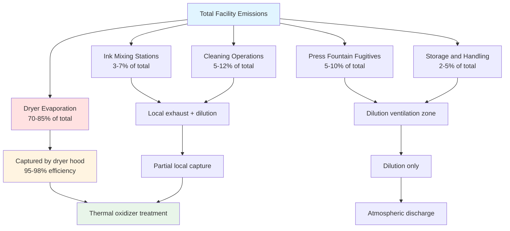
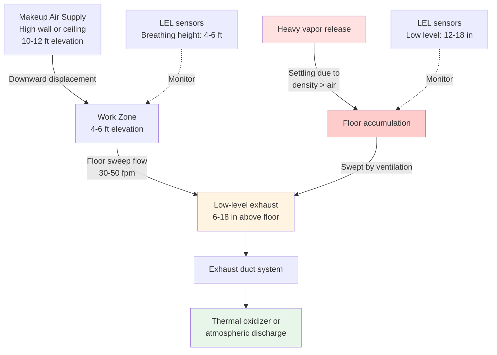
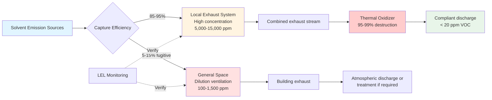

## Dilution Ventilation Fundamentals

Dilution ventilation provides the primary safety mechanism in printing facilities by maintaining solvent vapor concentrations below 25% of the Lower Explosive Limit (LEL) throughout occupied spaces. Unlike local exhaust ventilation which captures emissions at source, dilution ventilation uses large volumes of fresh air to reduce vapor concentrations to safe levels through mixing and displacement.

The fundamental principle derives from steady-state mass balance: solvent vapor generation rate equals removal rate through ventilation. This creates the basis for all dilution ventilation calculations in printing operations handling toluene, MEK (methyl ethyl ketone), acetone, ethyl acetate, isopropyl alcohol, and other volatile organic compounds.

OSHA 29 CFR 1910.106 establishes mandatory requirements for ventilation where Class I flammable liquids are handled, while ACGIH Industrial Ventilation Manual provides engineering guidance on airflow calculations and safety factors. NFPA 86 specifically addresses ovens and dryers processing flammable materials.

## Mass Balance Equation Development

### Basic Dilution Equation

The steady-state mass balance for a well-mixed space yields:

$$\dot{m}_{generation} = \dot{m}_{removal}$$

Expanding both sides:

$$G = Q \times \rho_{air} \times C_{target}$$

Where:
- $G$ = Solvent evaporation rate (lb/min)
- $Q$ = Ventilation airflow (ft³/min)
- $\rho_{air}$ = Air density (lb/ft³), typically 0.075 lb/ft³ at standard conditions
- $C_{target}$ = Target concentration (lb solvent/lb air)

### Conversion to Volumetric Concentration

Using the ideal gas law at standard conditions (530°R, 1 atm), convert mass concentration to volumetric parts per million:

$$PV = nRT$$

For one mole of ideal gas at 70°F (530°R):

$$V = \frac{nRT}{P} = \frac{1 \times 1545 \times 530}{14.7 \times 144} = 387 \text{ ft}^3$$

This yields the universal constant 387 ft³ per lb-mole at standard conditions.

Converting the mass balance equation to volumetric concentration:

$$Q = \frac{G \times 387 \times T}{MW \times C_{ppm} \times 10^{-6}}$$

Where:
- $T$ = Absolute temperature (°R)
- $MW$ = Molecular weight of solvent (g/mol)
- $C_{ppm}$ = Target concentration (parts per million by volume)

### Simplified Design Equation

For room temperature applications (530°R), the equation simplifies:

$$Q_{dilution} = \frac{403 \times G}{C_{ppm}}$$

Where:
- $Q_{dilution}$ = Required dilution airflow (cfm)
- $G$ = Solvent evaporation rate (lb/min)
- $C_{ppm}$ = Target concentration (ppm)

Factor 403 = 387 × 530 / (MW × specific gravity conversion factors).

## LEL-Based Design Criteria

### Lower Explosive Limit Physics

Flammable vapors ignite only when vapor-to-air ratio falls within the flammable range between LEL and UEL (Upper Explosive Limit). Below LEL, insufficient fuel exists for combustion propagation. Above UEL, insufficient oxygen exists for combustion.

**Common printing solvents LEL data:**

| Solvent | Chemical Formula | MW (g/mol) | LEL (% vol) | LEL (ppm) | Flash Point (°F) |
|---------|------------------|------------|-------------|-----------|------------------|
| Toluene | C₇H₈ | 92 | 1.2 | 12,000 | 40 |
| MEK | C₄H₈O | 72 | 1.4 | 14,000 | 16 |
| Acetone | C₃H₆O | 58 | 2.5 | 25,000 | 0 |
| Ethyl Acetate | C₄H₈O₂ | 88 | 2.0 | 20,000 | 24 |
| Isopropyl Alcohol | C₃H₈O | 60 | 2.0 | 20,000 | 53 |
| n-Heptane | C₇H₁₆ | 100 | 1.05 | 10,500 | 25 |

**Critical observation:** Lower LEL values (heptane at 1.05%, toluene at 1.2%) require greater dilution ventilation for equivalent safety margin.

### Safety Factor Selection

Industry standards mandate maintaining concentrations well below LEL to provide safety margin for:

**Equipment limitations:**
- LEL sensor accuracy: ±10-15% of reading
- Response time lag: 10-30 seconds from concentration change to alarm
- Calibration drift between maintenance cycles

**Operational factors:**
- Non-uniform concentration distribution (dead zones, stratification)
- Transient emission spikes during startup, cleaning, spills
- Simultaneous failure scenarios (ventilation reduction + emission increase)

**OSHA and NFPA requirements:**

OSHA 29 CFR 1910.106(e)(2)(iii) requires ventilation maintaining vapor concentration below 25% of LEL in areas handling Class I flammable liquids.

NFPA 86 Section 5.7.2 requires continuous monitoring with automatic shutdown at 25% LEL for ovens and dryers processing flammable materials.

**Conservative design criteria:**

$$C_{target} = \frac{LEL}{SF}$$

Where $SF$ = Safety factor:
- $SF = 4$ (25% LEL): Minimum for OSHA/NFPA compliance
- $SF = 10$ (10% LEL): Recommended for higher hazard operations
- $SF = 20$ (5% LEL): Used in critical areas with ignition sources

### Design Concentration Calculation

For toluene with LEL = 1.2% = 12,000 ppm, applying 25% LEL criterion:

$$C_{target} = \frac{12,000}{4} = 3,000 \text{ ppm}$$

Most facilities design for additional conservatism:

$$C_{design} = \frac{12,000}{8} = 1,500 \text{ ppm}$$

This provides 12.5% LEL operating point, allowing concentration to double during upset conditions while remaining below 25% LEL regulatory limit.

## Evaporation Rate Determination

### Theoretical Evaporation from Liquid Surfaces

Solvent evaporation from open containers, spills, and wet surfaces follows mass transfer principles:

$$\dot{m}_{evap} = h_m \times A \times (C_{surface} - C_{bulk})$$

Where:
- $\dot{m}_{evap}$ = Evaporation rate (lb/h)
- $h_m$ = Mass transfer coefficient (ft/h)
- $A$ = Liquid surface area (ft²)
- $C_{surface}$ = Saturation concentration at liquid surface (lb/ft³)
- $C_{bulk}$ = Bulk air concentration (lb/ft³)

**Mass transfer coefficient** depends on air velocity over surface:

$$h_m = 0.0128 \times v^{0.8}$$

For stagnant air ($v$ = 0): $h_m$ ≈ 0.5 ft/h (natural convection)

For ventilated space ($v$ = 50 fpm): $h_m$ ≈ 5 ft/h

**Saturation concentration** from Clausius-Clapeyron equation:

$$P_{sat} = P_0 \times e^{-\frac{\Delta H_{vap}}{R}(\frac{1}{T} - \frac{1}{T_0})}$$

Where:
- $P_{sat}$ = Saturation vapor pressure at temperature $T$
- $\Delta H_{vap}$ = Heat of vaporization
- $R$ = Universal gas constant

**Practical approach:** Use published vapor pressure data at operating temperature:

| Solvent | Vapor Pressure at 77°F (psia) | Saturation Concentration (ppm) |
|---------|-------------------------------|--------------------------------|
| Toluene | 0.37 | 37,000 |
| MEK | 1.24 | 130,000 |
| Acetone | 3.08 | 308,000 |
| Ethyl Acetate | 1.19 | 119,000 |

### Printing Process Evaporation Rates

**Gravure and flexographic printing:**

Solvent evaporation occurs primarily in drying ovens with forced hot air:

$$G = A_{web} \times v_{web} \times m_{ink} \times f_{solvent} \times f_{evap}$$

Where:
- $A_{web}$ = Web width (ft)
- $v_{web}$ = Web speed (fpm)
- $m_{ink}$ = Ink coating weight (lb/ft²)
- $f_{solvent}$ = Solvent fraction of ink (typically 0.50-0.75)
- $f_{evap}$ = Evaporation efficiency in dryer (0.95-0.99)

**Example calculation:**

Publication gravure press:
- Web width: 6 ft
- Web speed: 2,000 fpm
- Ink coating: 0.0008 lb/ft² (wet)
- Solvent content: 65%
- Evaporation efficiency: 98%

$$G = 6 \times 2000 \times 0.0008 \times 0.65 \times 0.98 = 6.1 \text{ lb/min}$$

**Emission sources beyond dryers:**

**Total fugitive emissions** requiring dilution ventilation typically represent 15-30% of total solvent usage in well-designed facilities with effective local exhaust systems.

## Dilution Airflow Calculations

### Standard Calculation Procedure

**Step 1: Determine total evaporation rate**

Sum all emission sources not captured by local exhaust:

$$G_{total} = G_{dryer,fugitive} + G_{fountain} + G_{mixing} + G_{cleaning} + G_{storage}$$

**Step 2: Select target concentration**

Based on lowest LEL solvent in use with appropriate safety factor:

$$C_{target} = \frac{LEL_{min}}{SF}$$

**Step 3: Calculate theoretical dilution airflow**

$$Q_{theoretical} = \frac{403 \times G_{total}}{C_{target}}$$

**Step 4: Apply mixing efficiency factor**

Real spaces do not achieve perfect instantaneous mixing. Apply factor $K$ based on geometry:

$$Q_{actual} = K \times Q_{theoretical}$$

**Mixing efficiency factors:**

| Space Characteristics | K Factor | Rationale |
|----------------------|----------|-----------|
| Ideal mixing, uniform supply/exhaust | 1.0-1.5 | Theoretical minimum |
| Good design, overhead supply, low exhaust | 2.0-3.0 | Typical well-designed space |
| Average industrial space | 3.0-5.0 | Standard design practice |
| Poor mixing, obstacles, dead zones | 5.0-10.0 | Requires improvement |
| Large volume, high ceilings (>30 ft) | 7.0-12.0 | Stratification effects |

**Step 5: Verify air changes per hour**

$$ACH = \frac{Q_{actual} \times 60}{V_{space}}$$

Where:
- $ACH$ = Air changes per hour
- $V_{space}$ = Room volume (ft³)

**Typical requirements:**
- Printing press areas: 6-12 ACH
- Ink mixing rooms: 12-20 ACH
- Solvent storage rooms: 20-30 ACH

### Worked Example: Publication Gravure Facility

**Facility specifications:**
- Floor area: 50,000 ft²
- Ceiling height: 24 ft
- Volume: 1,200,000 ft³
- Four gravure presses with dryer systems
- Primary solvent: Toluene (LEL = 1.2% = 12,000 ppm)

**Emission sources:**

| Source | Evaporation Rate | Local Exhaust Capture | Fugitive to Space |
|--------|------------------|----------------------|-------------------|
| Press 1 dryer | 6.1 lb/min | 95% (5.8 lb/min) | 0.31 lb/min |
| Press 2 dryer | 6.1 lb/min | 95% (5.8 lb/min) | 0.31 lb/min |
| Press 3 dryer | 5.5 lb/min | 95% (5.2 lb/min) | 0.28 lb/min |
| Press 4 dryer | 5.5 lb/min | 95% (5.2 lb/min) | 0.28 lb/min |
| Press fountains (4) | 0.8 lb/min | 0% | 0.80 lb/min |
| Ink mixing station | 0.6 lb/min | 80% (0.48 lb/min) | 0.12 lb/min |
| Cleaning operations | 1.2 lb/min | 50% (0.6 lb/min) | 0.60 lb/min |
| Storage/handling | 0.3 lb/min | 0% | 0.30 lb/min |
| **Total fugitive** | - | - | **3.0 lb/min** |

**Dilution ventilation calculation:**

Target concentration (12.5% LEL with SF = 8):

$$C_{target} = \frac{12,000}{8} = 1,500 \text{ ppm}$$

Theoretical airflow:

$$Q_{theoretical} = \frac{403 \times 3.0}{1,500} = 806 \text{ cfm}$$

This represents perfect mixing. For large printing facility with 24-ft ceilings and distributed emission sources, apply $K = 6$:

$$Q_{actual} = 6 \times 806 = 4,836 \text{ cfm}$$

**Design decision:** Round up to 5,000 cfm for general dilution ventilation.

**Verification:**

Air changes per hour:

$$ACH = \frac{5,000 \times 60}{1,200,000} = 0.25 \text{ ACH}$$

This appears low but is supplemented by local exhaust systems removing 22 lb/min (88% of total emissions). The combination provides adequate safety.

**Total facility ventilation:**

- General dilution: 5,000 cfm
- Dryer hood exhaust (4 presses): 75,000 cfm total
- Ink mixing exhaust: 2,500 cfm
- Cleaning booth exhaust: 3,000 cfm
- **Total exhaust: 85,500 cfm**

Corresponding air changes for total ventilation:

$$ACH_{total} = \frac{85,500 \times 60}{1,200,000} = 4.3 \text{ ACH}$$

This provides 4.3 complete air changes per hour, well within typical range for printing facilities.

## Vapor Density and Stratification Effects

### Relative Vapor Density

All common printing solvents produce vapors heavier than air, calculated from molecular weight ratio:

$$\rho_{rel} = \frac{MW_{solvent}}{MW_{air}} = \frac{MW_{solvent}}{29}$$

**Vapor density comparison:**

| Solvent | Molecular Weight | Relative Density | Settling Tendency |
|---------|------------------|------------------|-------------------|
| Acetone | 58 | 2.00 | Moderate |
| Isopropyl Alcohol | 60 | 2.07 | Moderate |
| MEK | 72 | 2.48 | High |
| Ethyl Acetate | 88 | 3.03 | High |
| Toluene | 92 | 3.17 | High |
| n-Heptane | 100 | 3.45 | Very High |

**Physical implications:**

Heavier-than-air vapors settle toward floor level in absence of adequate air mixing. This creates hazardous accumulations in:
- Floor-level pits and sumps
- Below-grade equipment rooms
- Dead-end corridors
- Corners and alcoves with poor air circulation
- Areas beneath equipment and conveyor systems

### Ventilation Design for Heavy Vapors

**Low-level exhaust strategy:**

Provide dedicated exhaust points 6-18 inches above floor in areas where heavy vapors may accumulate:

**Sizing low-level exhaust:**

$$Q_{low} = A_{floor} \times 50 \text{ fpm}$$

Where:
- $Q_{low}$ = Low-level exhaust flow (cfm)
- $A_{floor}$ = Floor area requiring coverage (ft²)
- 50 fpm = Minimum face velocity at floor-level grilles

**Example:** Solvent storage room, 20 ft × 30 ft:

Floor area requiring coverage: 600 ft²

Low-level exhaust grille: 2 ft × 2 ft = 4 ft² opening

Number of grilles: 600 / 100 = 6 grilles (one per 100 ft² floor area)

Flow per grille: 4 ft² × 50 fpm = 200 cfm

Total low-level exhaust: 6 × 200 = 1,200 cfm

**Supply air distribution:**

Provide makeup air at high level (8-12 ft above floor) to:
- Create downward displacement flow
- Prevent short-circuiting between supply and exhaust
- Maintain floor-level air velocity of 30-50 fpm to sweep settled vapors toward exhaust points

## Makeup Air Requirements

### Mass Balance for Makeup Air

Facility operates at slight positive pressure (+0.02 to +0.05 in w.c.) to prevent uncontrolled infiltration:

$$Q_{makeup} = Q_{exhaust} - Q_{infiltration} + Q_{pressurization}$$

**Infiltration estimation:**

For industrial buildings with typical construction:

$$Q_{infiltration} = 0.05 \times V_{building} \text{ (cfm)}$$

This represents approximately 3 air changes per hour from natural infiltration (door openings, construction gaps, etc.).

**Pressurization airflow:**

Required airflow to maintain building pressure depends on building envelope leakage:

$$Q_{pressurization} = C_{leak} \times A_{envelope} \times \sqrt{\Delta P}$$

Where:
- $C_{leak}$ = Leakage coefficient (cfm/ft² per in w.c.), typically 0.1-0.3 for industrial construction
- $A_{envelope}$ = Building envelope area (ft²)
- $\Delta P$ = Pressure differential (in w.c.)

**Practical approach:** Size makeup air for 90-95% of total exhaust flow, allowing 5-10% infiltration contribution.

### Makeup Air Unit Sizing Example

Using previous gravure facility example:

**Total exhaust:** 85,500 cfm

**Makeup air requirement:**

$$Q_{makeup} = 0.92 \times 85,500 = 78,660 \text{ cfm}$$

Design value: 80,000 cfm makeup air capacity

**Winter heating load:**

Outdoor design conditions: 10°F
Indoor conditions: 70°F, 50% RH

Sensible heating:

$$Q_{sensible} = 1.08 \times Q \times \Delta T$$

$$Q_{sensible} = 1.08 \times 80,000 \times (70-10) = 5,184,000 \text{ Btu/h} = 5.2 \text{ MMBtu/h}$$

Humidification load (from psychrometric analysis):
- Outdoor: 10°F saturated, $W$ = 0.0015 lb/lb
- Indoor: 70°F, 50% RH, $W$ = 0.0078 lb/lb
- $\Delta W$ = 0.0063 lb/lb

$$Q_{latent} = 0.68 \times Q \times \Delta W$$

$$Q_{latent} = 0.68 \times 80,000 \times 0.0063 = 343,000 \text{ Btu/h}$$

**Total winter load:** 5.5 MMBtu/h heating + humidification

**Summer cooling load:**

Outdoor design: 95°F, 60% RH
Indoor: 70°F, 50% RH

From psychrometric chart:
- Enthalpy change: $\Delta h$ = 10.2 Btu/lb

$$Q_{cooling} = 4.5 \times Q \times \Delta h$$

$$Q_{cooling} = 4.5 \times 80,000 \times 10.2 = 3,672,000 \text{ Btu/h} = 306 \text{ tons}$$

**Equipment selection:**
- Makeup air unit: 80,000 cfm capacity
- Winter heating: 5.5 MMBtu/h gas-fired or indirect steam coil
- Summer cooling: 310-ton chilled water coil or DX cooling
- Humidification: Steam injection, 350 lb/h capacity
- Supply fan: 80,000 cfm at 3.5-4.5 in w.c. total static pressure

## OSHA and ACGIH Compliance Requirements

### OSHA 29 CFR 1910.106 Requirements

**Flammable liquid storage and handling ventilation:**

Section 1910.106(e)(2)(iii) states:

"*Ventilation shall be provided to prevent accumulation of flammable vapors. Concentration of flammable vapors shall not exceed 25 percent of the lower flammable limit.*"

**Compliance demonstration:**

Facilities must demonstrate through calculation or measurement that:

1. **Adequate airflow** provided based on evaporation rate calculations
2. **Proper distribution** preventing dead zones and accumulation areas
3. **Continuous monitoring** via LEL sensors (required for high-hazard areas)
4. **Emergency response** procedures for ventilation failure or high vapor detection

**Inspection requirements:**

OSHA inspectors verify:
- Engineering calculations supporting ventilation design
- Airflow measurement data (actual vs. design)
- LEL monitoring system operation and calibration records
- Preventive maintenance documentation

### ACGIH Industrial Ventilation Manual

**ACGIH ventilation principles for dilution:**

Chapter 12 (Dilution Ventilation) provides:

**Safety factor selection guidance:**

$$SF = \frac{LEL}{C_{design}} \geq 4$$

Minimum safety factor of 4 (25% LEL) required, with greater factors for:
- Incomplete mixing (add factor 2-5)
- Uncertain emission rates (add factor 1.5-2)
- Presence of ignition sources (add factor 2-3)

**Mixing efficiency considerations:**

ACGIH Table 12-1 provides mixing factors:

| Condition | Factor |
|-----------|--------|
| Excellent distribution, multiple inlets and outlets | 1-2 |
| Good distribution, favorable room geometry | 2-3 |
| Fair distribution, average conditions | 3-5 |
| Poor distribution, large room, unfavorable geometry | 5-10 |

**Air change rate verification:**

Minimum ventilation rate (even with perfect capture) should provide:

$$ACH = \frac{60 \times Q_{min}}{V_{room}} \geq 4$$

For hazardous locations, minimum 4 air changes per hour regardless of calculated dilution requirement.

### NFPA 86 Ovens and Dryers

**Ventilation requirements for Class A ovens** (using flammable solvents):

Section 5.7.2.1: "*Sufficient air circulation shall be provided within the oven to prevent formation of flammable concentrations.*"

**Design criteria:**

$$C_{oven} \leq 0.25 \times LEL$$

**Monitoring requirements:**

Section 8.5.2: "*Vapor concentration monitoring shall be provided with alarm at 25% LEL and automatic shutdown.*"

**Purge requirements:**

Section 6.4.3: "*Four air changes minimum prior to ignition of burners after shutdown exceeding 4 hours.*"

For printing dryer ovens:

- Volume: 500 ft³ typical
- Purge airflow: 500 ft³ × 4 / 5 min = 400 cfm minimum
- Actual design: 2,000-5,000 cfm (provides continuous purging)

## Design Tables and Selection Criteria

### Recommended Air Changes by Space Type

| Space Function | Air Changes per Hour | Basis |
|----------------|---------------------|-------|
| General press floor | 4-8 ACH | Dilution + comfort |
| High-speed gravure area | 6-12 ACH | High solvent load |
| Ink mixing room | 12-20 ACH | Concentrated emissions |
| Solvent storage room | 20-30 ACH | Safety requirement |
| Cleaning/maintenance area | 10-15 ACH | Variable emissions |
| Finished goods storage | 2-4 ACH | Minimal emissions |

### Safety Factor Selection Matrix

| Condition | Base SF | Adjustment Factors | Total SF |
|-----------|---------|-------------------|----------|
| Standard operation, good mixing | 4 | None | 4 (25% LEL) |
| Standard operation, average mixing | 4 | K = 3 | 12 (8.3% LEL) |
| High-hazard area, ignition sources | 10 | K = 3 | 30 (3.3% LEL) |
| Critical safety application | 10 | K = 5 | 50 (2.0% LEL) |

### Temperature and Altitude Corrections

**Temperature correction:**

Ideal gas law requires correction for non-standard temperatures:

$$Q_T = Q_{530°R} \times \frac{T}{530}$$

| Temperature | Correction Factor |
|-------------|------------------|
| 50°F (510°R) | 0.96 |
| 70°F (530°R) | 1.00 |
| 90°F (550°R) | 1.04 |
| 110°F (570°R) | 1.08 |

**Altitude correction:**

Lower atmospheric pressure at altitude reduces air density:

$$\rho_{alt} = \rho_{SL} \times e^{-z/H}$$

Where scale height $H$ ≈ 29,000 ft

| Altitude (ft) | Pressure Ratio | Air Density | Volumetric Flow Correction |
|---------------|----------------|-------------|---------------------------|
| 0 (sea level) | 1.00 | 0.075 lb/ft³ | 1.00 |
| 2,500 | 0.92 | 0.069 lb/ft³ | 1.09 |
| 5,000 | 0.83 | 0.062 lb/ft³ | 1.20 |
| 7,500 | 0.75 | 0.056 lb/ft³ | 1.33 |

**Combined correction example:**

Denver facility (5,000 ft elevation, 90°F operating temperature):

Base calculation: 5,000 cfm required

Temperature correction: 5,000 × 1.04 = 5,200 cfm

Altitude correction: 5,200 × 1.20 = 6,240 cfm

Design selection: 6,500 cfm

## Integration with Local Exhaust Systems

### Combined Ventilation Strategy

Effective facilities employ layered approach:

**Primary control: Local exhaust** captures 85-95% of emissions at source

**Secondary control: Dilution ventilation** manages fugitive emissions escaping local exhaust

**Verification: LEL monitoring** confirms safe concentrations maintained

**Compliance: Vapor treatment** destroys VOCs before atmospheric discharge

### Airflow Coordination

**Exhaust system balancing:**

Total facility exhaust equals sum of components:

$$Q_{exhaust,total} = Q_{dilution} + Q_{local} + Q_{process}$$

Where:
- $Q_{dilution}$ = General dilution ventilation
- $Q_{local}$ = Sum of local exhaust hoods
- $Q_{process}$ = Process exhaust (dryer ovens, dedicated exhausts)

**Makeup air distribution:**

$$Q_{makeup} = 0.90 \times Q_{exhaust,total}$$

Allow 10% infiltration contribution to balance.

**Pressure verification:**

Install differential pressure monitoring:
- Press room to outdoor: +0.02 to +0.05 in w.c.
- Solvent storage to press room: -0.05 to -0.10 in w.c.
- Ink mixing room to press room: -0.03 to -0.08 in w.c.

**Control strategy:**

1. Makeup air unit operates continuously, modulates airflow to maintain building pressure setpoint
2. Local exhaust systems operate when respective processes active
3. General dilution exhaust operates continuously during facility occupancy
4. Building pressure controller adjusts makeup air damper position to maintain +0.03 in w.c.

---

Dilution ventilation provides essential safety in printing facilities through mass-balance-driven airflow calculations maintaining solvent vapor concentrations below 25% LEL per OSHA 29 CFR 1910.106 requirements. Proper design incorporates safety factors for mixing efficiency, vapor density stratification effects, and transient operating conditions while coordinating with local exhaust systems and makeup air requirements to ensure worker safety and regulatory compliance throughout normal and upset operating scenarios.
