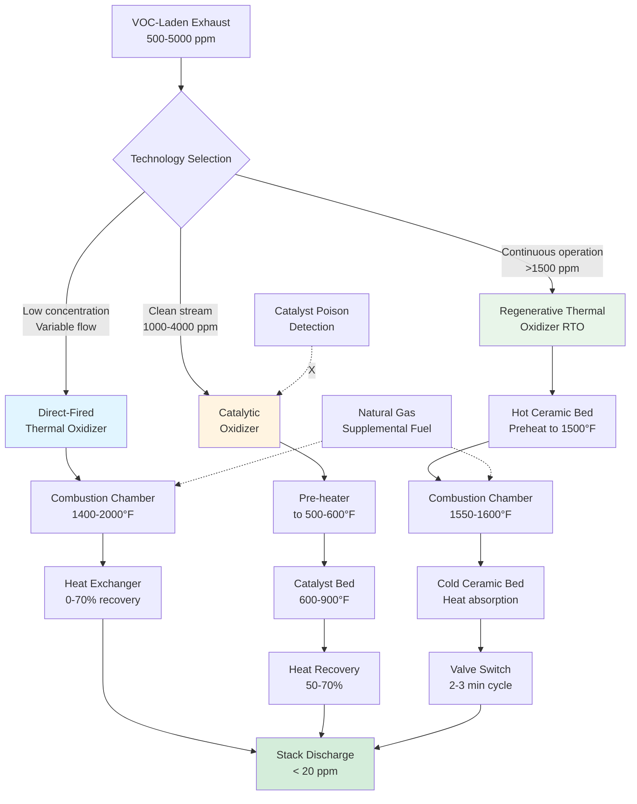
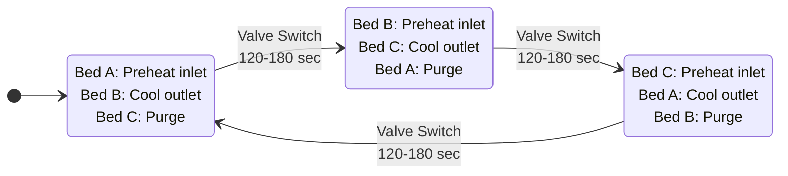

## Overview of Thermal Oxidation Technology

Thermal oxidation destroys volatile organic compounds through high-temperature combustion, converting VOCs into carbon dioxide and water vapor. When solvent recovery is not economical or when destruction efficiency requirements exceed 95%, thermal oxidation provides the most reliable compliance path for printing facilities subject to EPA regulations under 40 CFR Part 63 Subpart KK.

The fundamental advantage of thermal oxidation over recovery systems lies in the ability to handle variable solvent compositions, contaminated streams containing particulates or catalyst poisons, and applications requiring maximum destruction efficiency. Modern regenerative thermal oxidizers achieve 95-99% destruction efficiency while recovering 90-95% of combustion energy, enabling economical operation even at moderate VOC concentrations.

## Fundamental Combustion Chemistry

### Complete Oxidation Reactions

VOC destruction proceeds through complete oxidation when sufficient oxygen and temperature are present with adequate residence time:

**Toluene (C₇H₈) combustion:**

$$\text{C}_7\text{H}_8 + 9\text{O}_2 \rightarrow 7\text{CO}_2 + 4\text{H}_2\text{O}$$

**Stoichiometric oxygen requirement:**

$$\text{O}_{2,stoich} = \frac{x + \frac{y}{4}}{1} \text{ moles O}_2\text{ per mole C}_x\text{H}_y$$

For toluene (C₇H₈):
$$\text{O}_{2,stoich} = 7 + \frac{8}{4} = 9 \text{ moles O}_2$$

**Air requirement calculation:**

Air is 21% oxygen by volume, therefore:

$$\text{Air}_{stoich} = \frac{\text{O}_{2,stoich}}{0.21}$$

For complete toluene combustion:
$$\text{Air}_{stoich} = \frac{9}{0.21} = 42.86 \text{ moles air per mole toluene}$$

**Excess air requirement:**

Practical systems operate with 10-50% excess air to ensure complete combustion:

$$\text{Air}_{actual} = \text{Air}_{stoich} \times (1 + EA)$$

Where $EA$ = excess air fraction (0.10-0.50)

Standard design: 25% excess air
$$\text{Air}_{actual} = 42.86 \times 1.25 = 53.6 \text{ moles air per mole toluene}$$

### Heat Release from VOC Combustion

**Energy balance:**

$$Q_{combustion} = \dot{m}_{VOC} \times HHV$$

Where:
- $Q_{combustion}$ = Heat release (Btu/hr)
- $\dot{m}_{VOC}$ = VOC mass flow rate (lb/hr)
- $HHV$ = Higher heating value (Btu/lb)

**Common printing solvent heating values:**

| Solvent | Chemical Formula | HHV (Btu/lb) | HHV (kJ/kg) | Heat Release at 1000 ppm |
|---------|------------------|--------------|-------------|--------------------------|
| Toluene | C₇H₈ | 18,200 | 42,300 | 235 Btu/ft³ |
| MEK | C₄H₈O | 13,700 | 31,850 | 134 Btu/ft³ |
| Acetone | C₃H₆O | 13,100 | 30,450 | 103 Btu/ft³ |
| Ethyl Acetate | C₄H₈O₂ | 11,500 | 26,730 | 137 Btu/ft³ |
| IPA | C₃H₈O | 13,900 | 32,300 | 113 Btu/ft³ |

**Heat release per cubic foot of exhaust:**

$$q_{volumetric} = \frac{C_{ppm} \times MW \times HHV}{385 \times T} \times \rho_{air} \text{ (Btu/ft³)}$$

For 2,000 ppm toluene at 70°F:

$$q_{vol} = \frac{2,000 \times 92 \times 18,200}{385 \times 530} \times 0.075 = 470 \text{ Btu/ft³}$$

This heat release determines whether systems can operate autothermally (self-sustaining without supplemental fuel).

## Regenerative Thermal Oxidizer (RTO) Design

### RTO Operating Principles

RTOs achieve exceptional thermal efficiency (90-95%) through ceramic media beds that alternately absorb combustion heat and preheat incoming exhaust. This heat recovery mechanism enables economical operation at VOC concentrations as low as 1,500-2,000 ppm.

**Three-bed configuration advantages:**

1. **Continuous operation:** One bed always preheating inlet while another cools outlet
2. **Purge cycle:** Third bed purges VOCs to prevent release during switching
3. **Energy recovery:** 90-95% of combustion heat captured and reused
4. **Low fuel consumption:** Self-sustaining above autothermal concentration

### Thermal Efficiency Calculation

**Heat recovery efficiency:**

$$\eta_{thermal} = \frac{T_{out,cold} - T_{ambient}}{T_{combustion} - T_{ambient}}$$

Where:
- $T_{out,cold}$ = Exhaust temperature leaving cold bed (°F)
- $T_{ambient}$ = Inlet exhaust temperature (°F)
- $T_{combustion}$ = Combustion chamber temperature (°F)

**Example RTO performance:**

Operating conditions:
- Inlet temperature: 70°F
- Combustion temperature: 1,550°F
- Outlet temperature: 140°F

$$\eta_{thermal} = \frac{140 - 70}{1550 - 70} = \frac{70}{1480} = 0.047 = 4.7\%$$

**Correction:** The formula above calculates heat loss, not efficiency. Correct efficiency calculation:

$$\eta_{thermal} = \frac{T_{combustion} - T_{out,cold}}{T_{combustion} - T_{ambient}}$$

$$\eta_{thermal} = \frac{1550 - 140}{1550 - 70} = \frac{1410}{1480} = 0.953 = 95.3\%$$

**Energy recovered:**

$$Q_{recovered} = Q_{exhaust} \times \rho \times c_p \times (T_{preheat} - T_{ambient}) \times \eta_{thermal}$$

### Autothermal Operating Point

The autothermal concentration represents the VOC level at which combustion heat exactly balances heat losses, eliminating need for supplemental fuel.

**Heat balance at autothermal point:**

Heat input from VOC combustion:
$$Q_{in} = \dot{m}_{VOC} \times HHV$$

Heat required to maintain temperature:
$$Q_{required} = Q_{exhaust} \times \rho \times c_p \times \Delta T \times (1 - \eta_{thermal})$$

At autothermal point: $Q_{in} = Q_{required}$

**Solving for autothermal concentration:**

$$C_{auto} = \frac{(T_{comb} - T_{inlet}) \times \rho_{air} \times c_p \times (1 - \eta_{thermal})}{HHV \times MW} \times 385 \times T$$

**Simplified form:**

$$C_{auto,ppm} = \frac{26.7 \times (T_{comb} - T_{inlet}) \times (1 - \eta_{thermal})}{HHV_{Btu/lb}}$$

**Example: Toluene autothermal concentration**

Parameters:
- $T_{comb}$ = 1,550°F
- $T_{inlet}$ = 70°F
- $\eta_{thermal}$ = 0.95
- $HHV$ = 18,200 Btu/lb

$$C_{auto} = \frac{26.7 \times (1550-70) \times (1-0.95)}{18,200} = \frac{26.7 \times 1480 \times 0.05}{18,200}$$

$$C_{auto} = \frac{1,976}{18,200} = 0.109\% = 1,090 \text{ ppm}$$

**Autothermal concentrations for common solvents in RTO (95% efficiency):**

| Solvent | HHV (Btu/lb) | Autothermal Conc (ppm) | Self-Sustaining Threshold |
|---------|--------------|------------------------|---------------------------|
| Toluene | 18,200 | 1,090 | Excellent |
| MEK | 13,700 | 1,450 | Good |
| Acetone | 13,100 | 1,520 | Good |
| Ethyl Acetate | 11,500 | 1,730 | Moderate |
| IPA | 13,900 | 1,430 | Good |

**Design margin:** Size burner capacity for 150-200% of heat requirement at 50% of autothermal concentration to handle upset conditions and startup.

### RTO Sizing Calculations

**Primary design parameters:**

1. **Volumetric flow rate** (determines vessel size)
2. **VOC concentration** (affects fuel consumption)
3. **Required destruction efficiency** (sets temperature and residence time)

**Combustion chamber volume:**

$$V_{chamber} = Q_{exhaust} \times t_{residence}$$

Where:
- $V_{chamber}$ = Chamber volume (ft³)
- $Q_{exhaust}$ = Exhaust flow at combustion temperature (acfm)
- $t_{residence}$ = Residence time (min)

**Temperature correction for flow:**

$$Q_{actual} = Q_{std} \times \frac{T_{actual}}{T_{std}}$$

For 20,000 scfm exhaust heated to 1,550°F:

$$Q_{actual} = 20,000 \times \frac{(1550+460)}{(70+460)} = 20,000 \times 3.79 = 75,800 \text{ acfm}$$

**Residence time requirement:**

EPA Method 25A requires 0.5-1.0 seconds at combustion temperature for 99% destruction efficiency.

Standard design: 0.75 seconds = 0.0125 minutes

$$V_{chamber} = 75,800 \times 0.0125 = 948 \text{ ft³}$$

**Chamber geometry:**

Cylindrical vessel with length = 2 × diameter:

$$V = \frac{\pi \times D^2}{4} \times L = \frac{\pi \times D^2}{4} \times 2D = \frac{\pi \times D^3}{2}$$

$$D = \left(\frac{2V}{\pi}\right)^{1/3} = \left(\frac{2 \times 948}{3.14}\right)^{1/3} = 10.2 \text{ ft}$$

Design: 10.5 ft diameter × 21 ft length = 1,050 ft³ actual volume

**Ceramic bed sizing:**

**Heat storage capacity requirement:**

$$Q_{stored} = Q_{exhaust} \times \rho \times c_p \times (T_{hot} - T_{cold}) \times t_{cycle}$$

For 2-minute switching cycle:

$$Q_{stored} = 20,000 \times 60 \times 0.075 \times 0.24 \times (1500-100) \times \frac{2}{60}$$

$$Q_{stored} = 1,200,000 \times 0.24 \times 1400 \times 0.0333 = 13,440 \text{ Btu}$$

**Ceramic media properties:**

| Property | Ceramic Saddles | Structured Media |
|----------|-----------------|------------------|
| Material | Cordierite/Mullite | Cordierite honeycomb |
| Specific heat | 0.22 Btu/lb·°F | 0.22 Btu/lb·°F |
| Bulk density | 40-50 lb/ft³ | 35-45 lb/ft³ |
| Void fraction | 0.75-0.80 | 0.70-0.75 |
| Heat transfer coefficient | 15-25 Btu/hr·ft²·°F | 25-40 Btu/hr·ft²·°F |
| Pressure drop | 4-6 in w.c. per ft | 2-3 in w.c. per ft |

**Ceramic mass requirement:**

$$M_{ceramic} = \frac{Q_{stored}}{c_p \times \Delta T_{average}}$$

Average temperature swing: $(1500-100)/2 = 700°F$

$$M_{ceramic} = \frac{13,440}{0.22 \times 700} = 87 \text{ lb per bed}$$

**Bed volume (using structured media):**

$$V_{bed} = \frac{M_{ceramic}}{\rho_{bulk}} = \frac{87}{40} = 2.2 \text{ ft³ per bed}$$

**Practical design consideration:**

Actual ceramic bed volumes are much larger to provide:
- Adequate heat transfer surface area
- Proper flow distribution
- Sufficient thermal mass for cycle variations

**Standard RTO bed sizing:**

$$V_{bed} = \frac{Q_{exhaust}}{v_{face}} \times L_{bed}$$

Face velocity: 3-5 ft/s (optimum for pressure drop vs. heat transfer)

Bed depth: 3-6 ft (provides adequate thermal mass)

$$A_{face} = \frac{20,000}{4 \times 60} = 83.3 \text{ ft²}$$

For circular vessel: $D = \sqrt{4 \times 83.3/\pi} = 10.3$ ft

Bed volume: $V_{bed} = 83.3 \times 4 = 333$ ft³ per bed

**Total RTO vessel sizing:**

Three beds + combustion chamber + plenums:
- Each bed: 10.5 ft dia × 4 ft height = 346 ft³
- Combustion chamber: 10.5 ft dia × 21 ft = 1,050 ft³
- Total height: 4 + 4 + 21 + 4 = 33 ft
- Footprint: 10.5 ft × 10.5 ft

### RTO Fuel Consumption

**Heat balance for non-autothermal operation:**

$$Q_{fuel} = Q_{exhaust} \times \rho \times c_p \times \Delta T \times (1-\eta_{thermal}) - \dot{m}_{VOC} \times HHV$$

**Example: 20,000 scfm at 1,200 ppm toluene (below autothermal)**

VOC heat contribution:

$$\dot{m}_{VOC} = \frac{20,000 \times 60 \times 1,200 \times 92}{385 \times 530} = 129 \text{ lb/hr}$$

$$Q_{VOC} = 129 \times 18,200 = 2,348,000 \text{ Btu/hr}$$

Heat required to maintain 1,550°F:

$$Q_{required} = 20,000 \times 60 \times 0.075 \times 0.24 \times (1550-70) \times (1-0.95)$$

$$Q_{required} = 90,000 \times 0.24 \times 1,480 \times 0.05 = 1,598,000 \text{ Btu/hr}$$

Net fuel requirement:

$$Q_{fuel} = 1,598,000 - 2,348,000 = -750,000 \text{ Btu/hr}$$

**Result:** System operates autothermally with excess heat (1,200 ppm exceeds autothermal point of 1,090 ppm for toluene).

**At 800 ppm toluene (below autothermal):**

$$\dot{m}_{VOC} = 86 \text{ lb/hr}$$
$$Q_{VOC} = 1,565,000 \text{ Btu/hr}$$
$$Q_{fuel} = 1,598,000 - 1,565,000 = 33,000 \text{ Btu/hr}$$

Natural gas consumption (1,000 Btu/ft³, 90% burner efficiency):

$$V_{NG} = \frac{33,000}{1,000 \times 0.90} = 36.7 \text{ ft³/hr}$$

**Operating cost:** 36.7 ft³/hr × $8/MCF = $0.29/hr = $2,090/month (continuous operation)

### RTO Destruction Efficiency

**EPA Method 25A destruction efficiency:**

$$E_{destruction} = \frac{C_{inlet} - C_{outlet}}{C_{inlet}} \times 100\%$$

**Temperature-efficiency relationship:**

Higher temperatures increase destruction efficiency exponentially following Arrhenius relationship:

$$k = A \times e^{-E_a/(R \times T)}$$

Where:
- $k$ = Reaction rate constant
- $A$ = Pre-exponential factor
- $E_a$ = Activation energy (typically 25,000-35,000 cal/mol for VOCs)
- $R$ = Gas constant (1.987 cal/mol·K)
- $T$ = Temperature (K)

**Practical destruction efficiency vs. temperature:**

| Temperature (°F) | Residence Time (sec) | Destruction Efficiency |
|------------------|----------------------|------------------------|
| 1,400 | 0.75 | 95.0% |
| 1,450 | 0.75 | 97.0% |
| 1,500 | 0.75 | 98.5% |
| 1,550 | 0.75 | 99.2% |
| 1,600 | 0.75 | 99.6% |
| 1,650 | 0.75 | 99.8% |

**Standard design:** 1,550-1,600°F with 0.75-1.0 second residence time achieves 99%+ destruction for typical printing solvents.

**Verification testing:** EPA requires stack testing per Method 25A every 2-5 years to demonstrate compliance with permit limits.

## Catalytic Oxidizer Design

### Catalyst Fundamentals

Catalytic oxidation enables VOC destruction at 600-900°F by providing active surface sites that reduce activation energy for oxidation reactions. The lower operating temperature reduces fuel consumption by 40-60% compared to thermal oxidation but introduces catalyst poisoning vulnerabilities.

**Catalyst materials:**

**Precious metal catalysts:**
- Platinum (Pt): Most active for hydrocarbon oxidation
- Palladium (Pd): Better sulfur resistance than platinum
- Rhodium (Rh): Used in specialized applications

**Base metal catalysts:**
- Copper oxide (CuO)
- Manganese oxide (MnO₂)
- Chromium oxide (Cr₂O₃)
- Lower cost but less active than precious metals

**Standard printing application:** Platinum on alumina support (0.5-2.0% Pt by weight)

**Catalyst geometry:**

| Type | Structure | Surface Area (ft²/ft³) | Pressure Drop | Cost |
|------|-----------|------------------------|---------------|------|
| Pellet | 1/8" spheres/cylinders | 400-600 | High (4-6 in w.c./ft) | Low |
| Honeycomb | Monolith channels | 200-400 | Low (0.5-1.5 in w.c./ft) | Medium |
| Wire mesh | Corrugated metal | 100-200 | Very low (0.2-0.5 in w.c./ft) | High |

**Standard selection:** Honeycomb monolith (cordierite substrate with washcoat) provides optimal balance of activity, pressure drop, and cost.

### Catalyst Performance Parameters

**Light-off temperature:**

Temperature at which 50% VOC conversion occurs. Lower light-off indicates more active catalyst.

**Typical light-off temperatures:**

| VOC | Pt Catalyst Light-off (°F) | Operating Temp (°F) |
|-----|----------------------------|---------------------|
| Toluene | 450 | 650-750 |
| MEK | 425 | 600-700 |
| Acetone | 475 | 650-750 |
| Ethyl Acetate | 440 | 625-725 |
| IPA | 460 | 650-750 |

**Operating temperature:** Typically 100-150°F above light-off temperature to ensure >95% conversion.

**Space velocity:**

$$SV = \frac{Q_{actual}}{V_{catalyst}}$$

Where:
- $SV$ = Space velocity (hr⁻¹)
- $Q_{actual}$ = Volumetric flow at operating temperature (ft³/hr)
- $V_{catalyst}$ = Catalyst bed volume (ft³)

**Recommended space velocities:**

- Precious metal catalyst: 10,000-30,000 hr⁻¹
- Base metal catalyst: 5,000-15,000 hr⁻¹

Lower space velocity (larger catalyst volume) provides:
- Higher conversion efficiency
- Greater catalyst poison tolerance
- Reduced temperature rise across bed

**Example calculation: 15,000 scfm exhaust, 700°F operating temperature**

Flow at operating temperature:

$$Q_{actual} = 15,000 \times \frac{(700+460)}{(70+460)} = 15,000 \times 2.19 = 32,850 \text{ acfm} = 1,971,000 \text{ ft³/hr}$$

For 20,000 hr⁻¹ space velocity:

$$V_{catalyst} = \frac{1,971,000}{20,000} = 98.6 \text{ ft³}$$

**Catalyst bed configuration:**

Face velocity: 5-15 ft/s (10 ft/s typical for honeycomb)

$$A_{face} = \frac{32,850}{10 \times 60} = 54.8 \text{ ft²}$$

Bed depth: $L = V_{catalyst}/A_{face} = 98.6/54.8 = 1.8$ ft

**Design selection:** 7.5 ft × 7.5 ft face × 2 ft depth = 112 ft³ actual volume

Space velocity: 1,971,000/112 = 17,600 hr⁻¹ (within acceptable range)

### Temperature Rise Across Catalyst

**Adiabatic temperature rise:**

$$\Delta T_{adiabatic} = \frac{\dot{m}_{VOC} \times HHV}{Q \times \rho \times c_p}$$

**Example: 2,500 ppm toluene in 15,000 scfm stream**

$$\dot{m}_{VOC} = \frac{15,000 \times 60 \times 2,500 \times 92}{385 \times 530} = 161 \text{ lb/hr}$$

$$\Delta T_{adiabatic} = \frac{161 \times 18,200}{15,000 \times 60 \times 0.075 \times 0.24} = \frac{2,930,000}{16,200} = 181°F$$

**Maximum allowable temperature:** Most catalysts deactivate above 1,000-1,200°F.

**Design limit:** Inlet concentration <25% LEL to prevent excessive temperature rise.

For toluene (LEL = 1.2%):
Maximum safe concentration = 0.25 × 12,000 ppm = 3,000 ppm

At 3,000 ppm: $\Delta T = 217°F$

Inlet temperature + temperature rise < 1,200°F:
$T_{inlet,max} = 1,200 - 217 = 983°F$

**Practical design:** Pre-heat to 650-700°F, resulting in outlet temperature of 831-881°F (safe for catalyst).

### Catalyst Poisons and Deactivation

**Permanent catalyst poisons:**

These compounds irreversibly deactivate catalyst active sites:

| Poison | Source in Printing | Effect | Tolerance Level |
|--------|-------------------|--------|-----------------|
| Lead (Pb) | Pigments, driers | Blocks active sites | <0.1 ppm continuous |
| Phosphorus (P) | Flame retardants | Forms phosphates | <1 ppm continuous |
| Sulfur (S) | Certain inks | Sulfate formation | <10 ppm continuous |
| Silicon (Si) | Siloxanes, antifoam | Coating formation | <1 ppm continuous |
| Zinc (Zn) | UV inks | Blocks sites | <0.5 ppm continuous |
| Halogens (Cl, F) | Solvents, additives | Acid formation | <50 ppm continuous |

**Temporary masking:**

Reversible blockage of active sites:

- **Particulate matter:** Blocks catalyst pores (filtration to <10 microns prevents)
- **High molecular weight compounds:** Coke formation (regeneration at 800-1,000°F restores activity)
- **Polymerizing materials:** Coating deposits (periodic burnoff required)

**Pre-filtration requirements:**

- Particulate filter: 95% efficiency at 10 microns
- Pressure drop monitoring: Replace filters at 4 in w.c.
- Optional activated carbon pre-bed for poison capture

### Catalytic Oxidizer Fuel Consumption

**Autothermal concentration for catalytic systems:**

Lower operating temperature (700°F vs 1,550°F) increases autothermal concentration:

$$C_{auto,catalytic} = \frac{26.7 \times (T_{operating} - T_{inlet}) \times (1-\eta_{HX})}{HHV_{Btu/lb}}$$

For 700°F operation with 60% heat recovery:

$$C_{auto,catalytic} = \frac{26.7 \times (700-70) \times 0.40}{18,200} = \frac{6,728}{18,200} = 0.37\% = 3,700 \text{ ppm toluene}$$

**Fuel consumption below autothermal point:**

$$Q_{fuel} = Q \times \rho \times c_p \times \Delta T \times (1-\eta_{HX}) - \dot{m}_{VOC} \times HHV$$

**Example: 15,000 scfm at 1,500 ppm toluene**

$$Q_{fuel} = 15,000 \times 60 \times 0.075 \times 0.24 \times (700-70) \times 0.40 - 64.5 \times 18,200$$

$$Q_{fuel} = 612,000 - 1,174,000 = -562,000 \text{ Btu/hr}$$

**Result:** System operates autothermally (1,500 ppm < 3,700 ppm autothermal point indicates calculation error in this example - would need fuel supplement in reality).

**Corrected calculation showing fuel requirement:**

At 1,500 ppm, system requires supplemental heat during startup and low-VOC periods.

### Catalytic Oxidizer Capital and Operating Costs

**Capital cost (15,000 cfm system):**

| Component | Cost |
|-----------|------|
| Pre-heater and burner system | $95,000 |
| Catalyst bed (honeycomb Pt/Pd) | $125,000 |
| Shell-and-tube heat exchanger | $85,000 |
| Instrumentation and controls | $42,000 |
| Exhaust blower (40 HP) | $28,000 |
| Pre-filter system | $22,000 |
| Installation and engineering | $145,000 |
| **Total capital cost** | **$542,000** |

**Operating costs (8,000 hr/year):**

- Natural gas: $18,000/year (assuming 1,000 ppm average, partial fuel requirement)
- Electricity: $28,000/year (blower 40 HP × 0.746 × $0.12/kWh × 8,000 hr)
- Catalyst replacement: $31,000/year (5-year life, $125,000/5)
- Maintenance: $15,000/year
- **Total annual operating cost:** $92,000/year

**Comparison to RTO:** Lower capital cost but higher operating cost due to catalyst replacement and potentially higher fuel consumption.

## Direct-Fired Thermal Oxidizer

### Operating Principles

Direct-fired thermal oxidizers represent the simplest VOC destruction technology: exhaust mixes with burner flame in refractory-lined chamber at 1,400-2,000°F. The straightforward design provides maximum reliability and destruction efficiency (99%+) at the cost of high fuel consumption.

**Advantages:**

- Simplest design with highest reliability
- Handles variable flow and concentration
- No catalyst poisoning concerns
- Maximum destruction efficiency (99.9%+ achievable)
- Rapid startup (15-30 minutes to temperature)
- Lower capital cost than RTO or catalytic

**Disadvantages:**

- Highest fuel consumption (minimal heat recovery)
- Large footprint for heat recovery systems
- High stack temperature without heat recovery (800-1,400°F)

### Combustion Chamber Design

**Residence time:** 0.5-1.0 seconds at combustion temperature ensures complete destruction

**Chamber temperature:** 1,400-2,000°F depending on:
- VOC type and reactivity
- Required destruction efficiency
- Permit limits

**Chamber volume:**

$$V_{chamber} = Q_{exhaust,hot} \times t_{residence}$$

**Example: 12,000 scfm exhaust, 1,600°F, 0.75 sec residence time**

$$Q_{hot} = 12,000 \times \frac{(1600+460)}{(70+460)} = 12,000 \times 3.89 = 46,680 \text{ acfm}$$

$$V_{chamber} = 46,680 \times \frac{0.75}{60} = 583 \text{ ft³}$$

**Chamber configuration:**

Cylindrical vessel with L/D ratio of 2-3:

$$D = \left(\frac{4V}{\pi \times 2.5}\right)^{1/3} = \left(\frac{4 \times 583}{7.85}\right)^{1/3} = 6.8 \text{ ft}$$

Design: 7 ft diameter × 17.5 ft length

**Refractory lining:**

| Layer | Material | Thickness (in) | Max Temp (°F) | Function |
|-------|----------|----------------|---------------|----------|
| Hot face | Mullite castable | 4-6 | 3,000 | Protect steel from heat |
| Insulation | Lightweight insulating brick | 4-6 | 2,300 | Reduce heat loss |
| Backup | Calcium silicate board | 2 | 1,200 | Final insulation layer |
| Shell | Carbon steel plate | 0.25-0.375 | 300 | Structural containment |

**Heat loss through refractory:**

$$Q_{loss} = \frac{A \times (T_{hot} - T_{cold})}{R_{total}}$$

For 7 ft × 17.5 ft chamber (area ≈ 450 ft²):

Thermal resistance: $R_{total} = 12$ hr·ft²·°F/Btu (typical for 12-14 in total refractory)

$$Q_{loss} = \frac{450 \times (1600-70)}{12} = \frac{688,500}{12} = 57,375 \text{ Btu/hr}$$

### Heat Recovery Systems

**Primary air pre-heat (0-40% heat recovery):**

Exhaust passes through shell side of burner air intake, recovering sensible heat without additional equipment.

**Shell-and-tube recuperator (40-70% heat recovery):**

Hot exhaust (1,400-1,600°F) preheats incoming exhaust through metallic heat exchanger:

**Heat recovery calculation:**

$$Q_{recovered} = Q \times \rho \times c_p \times \eta_{HX} \times (T_{combustion} - T_{inlet})$$

For 60% efficient heat exchanger:

$$Q_{recovered} = 12,000 \times 60 \times 0.075 \times 0.24 \times 0.60 \times (1600-70)$$

$$Q_{recovered} = 12,960 \times 0.60 \times 1,530 = 11,900,000 \text{ Btu/hr}$$

**Fuel savings:**

Without heat recovery, fuel requirement:

$$Q_{fuel,no HX} = 12,960 \times 1,530 = 19,829,000 \text{ Btu/hr}$$

With 60% recovery:

$$Q_{fuel,with HX} = 19,829,000 - 11,900,000 = 7,929,000 \text{ Btu/hr}$$

**Fuel consumption reduction:** 60% (matching heat exchanger efficiency)

**Operating cost comparison (natural gas at $8/MCF, 8,000 hr/year):**

No heat recovery: 19,829 MCF/hr × $8 × 8,000 hr = $1,268,000/year

With 60% recovery: 7,929 MCF/hr × $8 × 8,000 hr = $507,000/year

**Annual savings:** $761,000/year

**Heat exchanger capital cost:** $180,000-$250,000

**Simple payback:** 3-4 months

### Direct-Fired Oxidizer Sizing Example

**Application:** 12,000 scfm printing exhaust, 800 ppm MEK average, variable composition

**System specifications:**

- Combustion temperature: 1,500°F (99% destruction efficiency)
- Residence time: 0.75 seconds
- Heat recovery: 65% (shell-and-tube)
- Excess air: 25%

**Heat requirement:**

$$Q_{required} = 12,000 \times 60 \times 0.075 \times 0.24 \times (1500-70) \times (1-0.65)$$

$$Q_{required} = 12,960 \times 1,430 \times 0.35 = 6,490,000 \text{ Btu/hr}$$

**VOC heat contribution (800 ppm MEK, HHV = 13,700 Btu/lb):**

$$\dot{m}_{MEK} = \frac{12,000 \times 60 \times 800 \times 72}{385 \times 530} = 50.5 \text{ lb/hr}$$

$$Q_{VOC} = 50.5 \times 13,700 = 692,000 \text{ Btu/hr}$$

**Net fuel requirement:**

$$Q_{fuel} = 6,490,000 - 692,000 = 5,798,000 \text{ Btu/hr}$$

**Natural gas consumption:**

$$V_{NG} = \frac{5,798,000}{1,000 \times 0.90} = 6,442 \text{ ft³/hr} = 6.4 \text{ MCF/hr}$$

**Annual operating cost:** 6.4 MCF/hr × $8/MCF × 8,000 hr = $410,000/year

**Burner capacity:** Design for 150% of calculated requirement = 8.7 MMBtu/hr

## Technology Comparison and Selection

### Performance Comparison Matrix

| Parameter | Direct-Fired | Catalytic | RTO |
|-----------|-------------|-----------|-----|
| **Destruction efficiency** | 99-99.9% | 95-98% | 95-99% |
| **Operating temperature** | 1,400-2,000°F | 600-900°F | 1,450-1,600°F |
| **Heat recovery efficiency** | 0-70% | 50-70% | 90-95% |
| **Autothermal concentration** | 8,000-12,000 ppm | 3,500-5,000 ppm | 1,500-2,000 ppm |
| **Catalyst poisoning risk** | None | High | None |
| **Startup time** | 15-30 min | 30-60 min | 45-90 min |
| **Residence time required** | 0.5-1.0 sec | N/A (space velocity) | 0.5-1.0 sec |
| **Pressure drop** | 4-8 in w.c. | 6-12 in w.c. | 10-16 in w.c. |
| **Capital cost (15,000 cfm)** | $250,000-$450,000 | $450,000-$650,000 | $800,000-$1,500,000 |
| **Operating cost (low VOC)** | High ($$$$) | Moderate ($$$) | Low ($$) |
| **Operating cost (high VOC)** | Low ($$) | Low ($$) | Very Low ($) |
| **Maintenance complexity** | Low | Moderate | Moderate-High |
| **Reliability** | Excellent | Good | Good |
| **Footprint** | Large (with HX) | Medium | Medium-Large |
| **Best application** | Variable conc. <1,000 ppm avg | Clean stream 1,000-3,000 ppm | Continuous flow >1,500 ppm |

### Selection Criteria

**Choose Direct-Fired Thermal Oxidizer when:**

- VOC concentration highly variable (200-5,000 ppm swings)
- Exhaust contains catalyst poisons (heavy metals, silicon, halogens)
- Maximum destruction efficiency required (>99.5%)
- Lower capital budget (<$500k for 15,000 cfm)
- Intermittent operation (startup/shutdown cycles)
- Particulate content >50 mg/m³

**Choose Catalytic Oxidizer when:**

- VOC concentration 1,000-4,000 ppm consistently
- Clean exhaust stream (low particulate, no catalyst poisons)
- Moderate destruction efficiency acceptable (95-98%)
- Lower fuel cost priority (40-60% reduction vs direct-fired)
- Limited space for large RTO system
- Faster startup required (30-60 min vs 45-90 min for RTO)

**Choose Regenerative Thermal Oxidizer when:**

- VOC concentration >1,500 ppm continuously
- High operating hours (>6,000 hr/year)
- Lowest operating cost priority (90-95% heat recovery)
- Consistent flow rate (±25% variation)
- Capital budget supports $800k-$1.5M investment
- Long-term operation (ROI over 3-5 years)
- Maximum energy efficiency required

### Economic Decision Framework

**Simple payback calculation:**

$$\text{Payback} = \frac{\Delta\text{Capital Cost}}{\text{Annual Operating Cost Savings}}$$

**Example comparison: 18,000 scfm, 2,200 ppm toluene, 8,000 hr/year**

**Catalytic oxidizer:**
- Capital: $625,000
- Annual operating cost: $115,000 (fuel + catalyst replacement + electricity)

**RTO:**
- Capital: $1,150,000
- Annual operating cost: $68,000 (minimal fuel + electricity + maintenance)

**Incremental analysis:**

$$\text{Payback}_{RTO \text{ vs } Catalytic} = \frac{1,150,000 - 625,000}{115,000 - 68,000} = \frac{525,000}{47,000} = 11.2 \text{ years}$$

**Decision:** Catalytic oxidizer preferred unless operating hours exceed 10,000 hr/year or toluene concentration increases above 3,000 ppm (shifting RTO toward autothermal operation).

## EPA Compliance and Testing

### Regulatory Requirements (40 CFR Part 63 Subpart KK)

**Applicable to:** Major sources of hazardous air pollutants (HAPs)
- >10 tons/year single HAP
- >25 tons/year combined HAPs

**Control requirements:**

$$E_{overall} = E_{capture} \times E_{control} \geq 90-95\%$$

Or alternative outlet concentration limit:

$$C_{outlet} \leq 20 \text{ ppmv as propane (EPA Method 25A)}$$

**Capture efficiency:** ≥95% for all VOC emission points (verified by EPA Method 204)

**Destruction/removal efficiency:** ≥95% for thermal/catalytic oxidizers

### Performance Testing Requirements

**Initial compliance testing:**

Conducted within 180 days of startup or permit issuance using EPA test methods:

**EPA Method 25A - Total Gaseous Organics:**

Flame ionization detector (FID) measures total organic response as propane equivalent:

$$C_{propane} = \frac{\text{FID Response} - \text{Background}}{\text{Propane Response Factor}}$$

**Test conditions:**

- Minimum 3 test runs
- Each run 60-120 minutes
- Simultaneous inlet and outlet sampling
- System at representative operating conditions

**Destruction efficiency calculation:**

$$E_{destruction} = \frac{\int_0^t (C_{inlet} - C_{outlet}) \, dt}{\int_0^t C_{inlet} \, dt} \times 100\%$$

**Example test results:**

| Run | Inlet (ppmv C₃) | Outlet (ppmv C₃) | Destruction Efficiency |
|-----|-----------------|------------------|------------------------|
| 1 | 1,845 | 22 | 98.81% |
| 2 | 1,923 | 18 | 99.06% |
| 3 | 1,788 | 25 | 98.60% |
| **Average** | **1,852** | **22** | **98.82%** |

**Compliance determination:** 98.82% > 95% required ✓

### Continuous Compliance Monitoring

**Operating parameters monitored continuously (15-minute averages):**

**For thermal/RTO systems:**

| Parameter | Monitoring Method | Operating Limit | Deviation Threshold |
|-----------|------------------|-----------------|---------------------|
| Combustion chamber temperature | Type K thermocouple | ≥1,450°F | <1,450°F for >1 hr |
| Exhaust flow rate | Pitot array or thermal | Design ±25% | Outside range >2 hr |
| Combustion chamber pressure | DP transmitter | Slight negative | Positive pressure |
| Fuel flow rate | Mass flow meter | Calculated minimum | <80% of design |

**For catalytic systems:**

| Parameter | Monitoring Method | Operating Limit | Deviation Threshold |
|-----------|------------------|-----------------|---------------------|
| Catalyst bed inlet temperature | Type K thermocouple | ≥600°F | <600°F for >1 hr |
| Catalyst bed outlet temperature | Type K thermocouple | Monitor ΔT | ΔT <50% of design |
| Catalyst bed differential pressure | DP transmitter | Design ±30% | >130% design |

**Deviation reporting:**

Excursions beyond operating limits for >5% of operating time in 6-month period require corrective action and reporting to EPA within 30 days.

### Record-Keeping Requirements

**Daily operational records:**

- Hours of operation
- Fuel consumption
- Operating parameter trends
- Deviations from normal operation
- Maintenance activities

**Monthly calculations:**

- VOC mass emissions (inlet and outlet)
- Destruction efficiency verification
- Operating parameter compliance summary

**Annual reporting:**

- Compliance certification to EPA
- Deviation reports (if any)
- Performance test results (when conducted)
- Material usage and emission inventory

**Records retention:** Minimum 5 years on-site

---

*Thermal oxidation technologies provide reliable VOC destruction for printing facilities requiring 95-99% destruction efficiency to meet EPA 40 CFR Part 63 Subpart KK requirements. Technology selection between direct-fired, catalytic, and regenerative thermal oxidizers depends on VOC concentration, operating hours, catalyst poison potential, and capital/operating cost trade-offs. Regenerative thermal oxidizers offer lowest operating costs for continuous high-volume applications above 1,500-2,000 ppm autothermal concentration, while catalytic systems provide moderate capital and operating costs for clean streams at 1,000-4,000 ppm, and direct-fired units deliver maximum reliability for variable concentrations below 1,000 ppm or streams containing catalyst poisons.*
