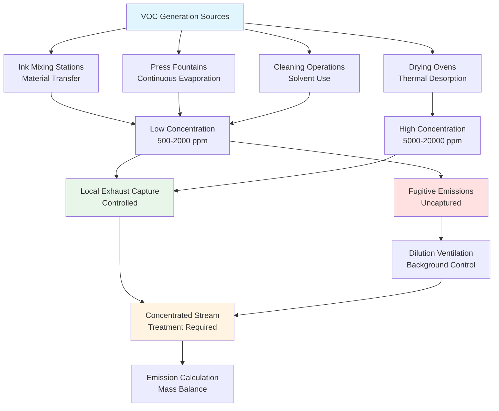
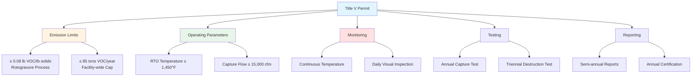

## Fundamentals of VOC Emissions in Printing

Volatile organic compounds (VOCs) released during printing operations constitute the primary environmental concern requiring specialized ventilation and control systems. VOC emissions originate from solvent-based inks, coatings, fountain solutions, and cleaning operations. The rate and character of these emissions depend on solvent composition, application method, drying conditions, and process temperature.

From a physics perspective, VOC emissions follow mass transfer principles where solvent evaporates from liquid ink films into surrounding air. The evaporation rate depends on vapor pressure, surface area exposed, air velocity over the surface, and temperature:

$$\dot{m}_{evap} = k \times A \times (P_{sat} - P_{partial})$$

Where:
- $\dot{m}_{evap}$ = Evaporation rate (lb/hr)
- $k$ = Mass transfer coefficient (lb/hr·ft²·psi)
- $A$ = Exposed surface area (ft²)
- $P_{sat}$ = Saturation vapor pressure at operating temperature (psia)
- $P_{partial}$ = Partial pressure of solvent in surrounding air (psia)

This fundamental relationship explains why drying ovens (elevated temperature increases $P_{sat}$), high-speed presses (increased air velocity increases $k$), and large printing widths (increased $A$) all produce higher VOC emission rates.

## VOC Emission Calculation Methods

### Material Balance Method

The most accurate approach for determining facility-wide VOC emissions uses material balance accounting. Total VOC emissions equal VOC input minus VOC retained in finished product:

$$E_{VOC} = \sum_{i=1}^{n} \left[ M_{material,i} \times F_{VOC,i} \times (1 - R_i) \right]$$

Where:
- $E_{VOC}$ = Total VOC emissions (lb/year)
- $M_{material,i}$ = Mass of material $i$ consumed (lb/year)
- $F_{VOC,i}$ = VOC mass fraction of material $i$ (lb VOC/lb material)
- $R_i$ = VOC retention fraction (typically 0.01-0.05 for printing)
- $n$ = Number of different materials used

**Example calculation for publication gravure facility:**

Annual material consumption:
- Solvent-based ink: 500,000 lb/year at 35% VOC content
- Fountain solution: 50,000 lb/year at 8% alcohol
- Cleanup solvents: 20,000 lb/year at 95% VOC

$$E_{ink} = 500,000 \times 0.35 \times (1 - 0.02) = 171,500 \text{ lb/year}$$

$$E_{fountain} = 50,000 \times 0.08 \times (1 - 0.10) = 3,600 \text{ lb/year}$$

$$E_{cleanup} = 20,000 \times 0.95 \times (1 - 0.00) = 19,000 \text{ lb/year}$$

$$E_{total} = 171,500 + 3,600 + 19,000 = 194,100 \text{ lb/year} = 97.1 \text{ tons/year}$$

This facility exceeds the 100 ton/year major source threshold, triggering Title V permit requirements.

### Emission Factor Method

When material usage records are incomplete, EPA-developed emission factors estimate emissions based on production activity:

$$E_{VOC} = A \times EF \times (1 - E_{control})$$

Where:
- $E_{VOC}$ = VOC emissions (lb)
- $A$ = Activity level (production quantity)
- $EF$ = Emission factor (lb VOC per unit production)
- $E_{control}$ = Overall control efficiency (fraction)

**EPA AP-42 emission factors for printing operations:**

| Process Type | Emission Factor | Basis |
|--------------|-----------------|-------|
| Publication rotogravure | 0.35 lb VOC/lb solids | Uncontrolled |
| Packaging rotogravure | 0.40 lb VOC/lb solids | Uncontrolled |
| Flexographic printing | 0.28 lb VOC/lb solids | Uncontrolled |
| Screen printing | 0.45 lb VOC/lb coating | Uncontrolled |
| Lithographic printing | 0.02 lb VOC/lb ink | Alcohol-based fountain |

**Example using emission factors:**

Flexographic facility producing 5,000,000 lb solids applied annually with 90% control efficiency:

$$E_{VOC} = 5,000,000 \times 0.28 \times (1 - 0.90) = 140,000 \text{ lb/year} = 70 \text{ tons/year}$$

### Continuous Monitoring Calculation

Facilities with continuous emission monitoring systems (CEMS) calculate emissions from measured concentration and flow rate:

$$E_{VOC} = \frac{Q \times C \times MW \times t}{387 \times T}$$

Where:
- $E_{VOC}$ = VOC mass emitted (lb)
- $Q$ = Exhaust flow rate (cfm)
- $C$ = VOC concentration (ppmv)
- $MW$ = Average molecular weight (g/mol)
- $t$ = Time period (minutes)
- $T$ = Temperature (°R)
- 387 = Conversion factor at standard conditions

**Hourly emission calculation example:**

Stack conditions:
- Flow rate: 15,000 cfm at 150°F (610°R)
- VOC concentration: 18 ppm (as propane equivalent, MW = 44)
- Operating time: 60 minutes

$$E_{VOC} = \frac{15,000 \times 18 \times 44 \times 60}{387 \times 610} = \frac{712,800,000}{236,070} = 3,019 \text{ lb/hr}$$

Annual emissions at 8,000 operating hours:
$$E_{annual} = 3,019 \times 8,000 = 24,152,000 \text{ lb/year} = 12,076 \text{ tons/year}$$

This calculation demonstrates why outlet concentration limits (<20 ppm typical) are necessary for compliance.

## EPA Regulatory Framework

### National Emission Standards for Hazardous Air Pollutants (NESHAP)

**40 CFR Part 63 Subpart KK** establishes Maximum Achievable Control Technology (MACT) standards for printing and publishing facilities that are major sources of hazardous air pollutants (HAPs).

**Major source definition:**
- Single HAP: ≥10 tons/year
- Combined HAPs: ≥25 tons/year

Common HAP solvents in printing operations:
- Toluene
- Methyl ethyl ketone (MEK)
- Xylene
- Methanol
- Ethyl benzene

**Control requirements under Subpart KK:**

**Option 1 - Overall control efficiency:**
$$E_{overall} = E_{capture} \times E_{control} \geq 95\%$$

**Option 2 - Outlet concentration limit:**
$$C_{outlet} \leq 20 \text{ ppmv (as propane)}$$

**Option 3 - Emission rate limit:**
$$\frac{E_{VOC}}{M_{solids}} \leq EL$$

Where emission limit ($EL$) varies by process:

| Process | Emission Limit (lb VOC/lb solids) |
|---------|-----------------------------------|
| Publication rotogravure | 0.04 |
| Product and packaging rotogravure | 0.08 |
| Flexographic printing | 0.20 |
| Coating operations | 0.04-0.08 |

### State Implementation Plans (SIPs)

States with ozone non-attainment areas impose additional requirements beyond federal NESHAP standards. Requirements vary by attainment classification:

**Reasonably Available Control Technology (RACT):**
- Applies to existing sources in moderate non-attainment areas
- Typical requirement: 85-90% overall control efficiency
- Based on economically achievable technology

**Best Available Retrofit Technology (BART):**
- Applies to large existing sources affecting visibility in Class I areas
- Typical requirement: 90-95% control efficiency
- More stringent than RACT

**Lowest Achievable Emission Rate (LAER):**
- Applies to new or modified major sources in severe non-attainment
- Requires maximum control regardless of cost
- Typically 95-98% control efficiency

**Example state requirements - California SCAQMD Rule 1130:**

| Printing Process | VOC Limit |
|------------------|-----------|
| Rotogravure | 16 lb VOC/lb coating solids |
| Flexographic | 16 lb VOC/lb coating solids |
| Screen printing | 4.8 lb VOC/gal (minus water) |
| Lithographic | 1.6 lb VOC/gal fountain solution |

### New Source Performance Standards (NSPS)

**40 CFR Part 60 Subpart QQ** applies to rotogravure printing presses constructed after October 28, 1980:

**Performance requirements:**
- Emission limit: 16% VOC by weight of ink and coating solids
- Or control device achieving 90% reduction
- Continuous monitoring of control device parameters

## Capture Efficiency Determination

Capture efficiency represents the fraction of generated VOC emissions successfully collected by local exhaust systems for treatment. Accurate capture efficiency measurement is critical for demonstrating regulatory compliance.

### Regulatory Test Methods

**EPA Method 204 - Determination of Capture Efficiency:**

This method uses temporary total enclosures (TTE) or building enclosures to quantify capture efficiency. The fundamental principle establishes mass balance across the enclosure boundary.

**Temporary total enclosure approach:**

Construct temporary enclosure around emission source that is substantially larger than source. Measure:
- VOC concentration entering enclosure ($C_{in}$, typically ambient)
- VOC concentration exiting enclosure natural ventilation ($C_{nat}$)
- VOC concentration in capture system ($C_{cap}$)
- Airflow entering enclosure ($Q_{in}$)
- Airflow in capture system ($Q_{cap}$)

$$E_{capture} = \frac{Q_{cap} \times C_{cap}}{Q_{cap} \times C_{cap} + Q_{nat} \times (C_{nat} - C_{in})} \times 100\%$$

**Practical considerations:**
- TTE must enclose all emission points
- TTE flow rate must exceed capture system by 10%+ to prevent positive pressure
- Minimize TTE volume relative to source size
- Conduct test during representative operating conditions
- Test duration: Minimum 3 runs of 1 hour each

**Building enclosure approach:**

For large sources where TTE is impractical, use entire building as enclosure:

$$E_{capture} = \frac{Q_{cap} \times C_{cap}}{Q_{cap} \times C_{cap} + Q_{bldg} \times (C_{bldg} - C_{amb})} \times 100\%$$

Where:
- $Q_{bldg}$ = Building exhaust airflow (cfm)
- $C_{bldg}$ = VOC concentration in building exhaust
- $C_{amb}$ = Ambient VOC concentration

**Example calculation - gravure press capture efficiency:**

Test data:
- Capture system: $Q_{cap} = 12,000$ cfm, $C_{cap} = 8,500$ ppm
- Building exhaust: $Q_{bldg} = 35,000$ cfm, $C_{bldg} = 450$ ppm
- Ambient: $C_{amb} = 50$ ppm

$$E_{capture} = \frac{12,000 \times 8,500}{12,000 \times 8,500 + 35,000 \times (450-50)} \times 100\%$$

$$E_{capture} = \frac{102,000,000}{102,000,000 + 14,000,000} \times 100\% = 87.9\%$$

This facility fails to meet 95% capture requirement and must improve hood design or enclosure effectiveness.

### Factors Affecting Capture Efficiency

**Hood proximity to source:**

Capture efficiency declines exponentially with distance from emission point:

$$E_{capture} = E_{max} \times e^{-X/L_c}$$

Where:
- $E_{max}$ = Maximum capture (typically 95-99% at hood face)
- $X$ = Distance from source (ft)
- $L_c$ = Characteristic capture length (0.5-2 ft depending on hood velocity)

**Cross-drafts:**

Ambient air currents from building ventilation, personnel movement, or equipment operation reduce capture efficiency:

$$E_{effective} = E_{design} \times \left(1 - \frac{V_{cross}}{V_{hood}}\right)$$

Where:
- $V_{cross}$ = Cross-draft velocity (fpm)
- $V_{hood}$ = Hood face velocity (fpm)

For effective capture: $V_{cross} < 0.5 \times V_{hood}$

**Emission velocity:**

High-velocity emissions (spray application, high-speed press) require higher capture velocities:

| Emission Condition | Required Capture Velocity |
|--------------------|---------------------------|
| Quiescent evaporation | 50-100 fpm |
| Low-velocity release | 100-200 fpm |
| Active generation | 200-500 fpm |
| High-velocity ejection | 500-1,000 fpm |

## Control Device Performance Testing

### Test Protocol Requirements

**EPA Method 25A - Total Gaseous Organics (TGO):**

Flame ionization detector (FID) measures total hydrocarbon concentration as propane equivalent.

**Sampling requirements:**
- Inlet and outlet measurements at representative points
- Minimum 3 test runs of 1 hour duration each
- Simultaneous flow rate measurement (EPA Method 2)
- Temperature measurement at measurement points

**Destruction efficiency calculation:**

$$E_{control} = \frac{C_{inlet} - C_{outlet}}{C_{inlet}} \times 100\%$$

**Mass destruction efficiency:**

$$E_{mass} = \frac{\dot{m}_{inlet} - \dot{m}_{outlet}}{\dot{m}_{inlet}} \times 100\%$$

Where:
$$\dot{m} = \frac{Q \times C \times MW}{387 \times T}$$

**Example thermal oxidizer performance test:**

Inlet conditions:
- Flow: 15,000 cfm at 120°F (580°R)
- Concentration: 2,450 ppm (as propane)

Outlet conditions:
- Flow: 15,200 cfm at 1,520°F (1,980°R)
- Concentration: 12 ppm (as propane)

Concentration-based efficiency:
$$E_{control} = \frac{2,450 - 12}{2,450} \times 100\% = 99.5\%$$

Mass-based efficiency:
$$\dot{m}_{inlet} = \frac{15,000 \times 2,450 \times 44}{387 \times 580} = 7,256 \text{ lb/hr}$$

$$\dot{m}_{outlet} = \frac{15,200 \times 12 \times 44}{387 \times 1,980} = 10.7 \text{ lb/hr}$$

$$E_{mass} = \frac{7,256 - 10.7}{7,256} \times 100\% = 99.85\%$$

System meets 95% destruction requirement with substantial margin.

### EPA Method 25 - Speciated VOC Analysis

Gas chromatography with FID detection identifies and quantifies individual VOC compounds.

**Applications:**
- HAP-specific compliance (toluene, MEK, xylene)
- Verification of compound-specific emission factors
- Differentiation between exempt and regulated compounds

**Procedure:**
1. Collect gas samples in Tedlar bags or canisters
2. Extract VOCs using Tenax adsorbent tubes
3. Thermal desorption and GC/FID or GC/MS analysis
4. Quantify each compound against calibration standards

### Continuous Emission Monitoring Systems (CEMS)

Facilities requiring continuous compliance monitoring install CEMS to track emissions in real-time.

**40 CFR Part 63 Subpart KK CEMS requirements:**

| Parameter | Technology | Span Range | Accuracy |
|-----------|------------|------------|----------|
| Total hydrocarbons | FID | 0-100 ppm or 0-20 ppm | ±5% of span |
| Oxygen (if applicable) | Paramagnetic or zirconia | 0-25% | ±0.5% absolute |
| Combustion temperature | Thermocouple | Design temp ±100°F | ±15°F |

**Data averaging and reporting:**
- 15-minute block averages for compliance assessment
- Daily calibration drift checks (zero and span)
- Quarterly cylinder gas audits (CGA)
- Annual relative accuracy test audit (RATA)

**Relative accuracy requirement:**
$$RA = \frac{\left| \bar{d} \right| + \left| cc \right|}{\bar{R}} \times 100\% < 20\%$$

Where:
- $\bar{d}$ = Mean difference between CEMS and reference method
- $cc$ = Confidence coefficient at 95% confidence level
- $\bar{R}$ = Mean reference method value

## Air Permit Requirements

### Title V Operating Permits

Major sources of VOC emissions (≥100 tons/year) or HAPs (≥25 tons/year combined, ≥10 tons/year single HAP) require comprehensive Title V operating permits under 40 CFR Part 70.

**Permit components:**

**1. Emission limitations:**
- Process-specific limits (lb VOC/lb solids)
- Facility-wide annual caps (tons/year)
- Short-term limits (lb/hr or lb/day)

**2. Operating parameters:**
- Control device minimum operating temperature
- Minimum pressure drop across carbon beds
- Maximum face velocity through hoods
- Minimum capture system flow rate

**3. Monitoring requirements:**
- Parameter monitoring frequency (continuous, daily, weekly)
- Recordkeeping procedures
- Excursion definitions and corrective actions

**4. Testing requirements:**
- Initial performance testing schedule
- Periodic testing frequency (typically every 2-5 years)
- Test methods and protocols
- Quality assurance procedures

**5. Reporting requirements:**
- Semi-annual monitoring reports
- Annual compliance certification
- Deviation reports (within 30 days of occurrence)
- Annual emissions inventory

**Example permit condition structure:**

### Pre-Construction Permits

New sources or major modifications to existing sources require pre-construction permits demonstrating:

**Prevention of Significant Deterioration (PSD):**

Applies in attainment areas for increases ≥40 tons/year VOC:
- Best Available Control Technology (BACT) analysis
- Air quality impact modeling
- Additional impacts analysis (visibility, growth, soils)
- Public notice and comment period

**BACT analysis methodology:**

**Step 1 - Identify control technologies:**
List all available VOC control technologies:
- Water-based inks (pollution prevention)
- Carbon adsorption with regeneration
- Regenerative thermal oxidizer
- Catalytic oxidizer
- Direct-fired thermal oxidizer

**Step 2 - Eliminate technically infeasible options:**
Example: Water-based inks technically infeasible for publication rotogravure due to print quality requirements.

**Step 3 - Rank by control effectiveness:**
| Technology | Control Efficiency | Capital Cost | Operating Cost |
|------------|-------------------|--------------|----------------|
| RTO | 95-99% | $1,200,000 | $75,000/yr |
| Catalytic oxidizer | 95-98% | $650,000 | $95,000/yr |
| Carbon adsorption | 90-95% | $450,000 | $125,000/yr |

**Step 4 - Evaluate energy, environmental, economic impacts:**
RTO provides highest destruction efficiency with acceptable costs. Selected as BACT.

**Step 5 - Propose BACT determination:**
- Control technology: Regenerative thermal oxidizer
- Emission limit: 0.06 lb VOC/lb solids applied
- Outlet concentration: ≤20 ppm as propane
- Destruction efficiency: ≥95%

**Non-attainment New Source Review (NNSR):**

Applies in non-attainment areas for increases ≥40 tons/year VOC (severe areas) or ≥25 tons/year (extreme areas):
- Lowest Achievable Emission Rate (LAER)
- Emission offsets at 1.1:1 to 1.5:1 ratio
- Certification of compliance at all other sources
- Air quality impact analysis

**Emission offset requirement:**

New source emitting 60 tons/year VOC in severe non-attainment area requires:
$$\text{Offset required} = 60 \times 1.2 = 72 \text{ tons/year reduction}$$

Facility must obtain emission reduction credits from:
- Shutdown of existing equipment
- Over-control at other sources
- Purchase from emission reduction credit bank

### Minor Source Permits

Facilities below Title V thresholds require state minor source permits or general permits with simplified requirements:

**Typical minor source conditions:**
- Technology-based emission limits (RACT equivalent)
- Basic monitoring (operating hours, material usage)
- Annual reporting
- No continuous monitoring required
- 5-year permit term

**Synthetic minor source option:**

Facility can accept federally enforceable emission limits below major source thresholds to avoid Title V requirements:

Example: Facility with potential emissions of 120 tons/year VOC accepts limit of 95 tons/year through:
- Operating hour restrictions
- Material VOC content limits
- Monthly material usage tracking

## Compliance Demonstration Recordkeeping

### Daily Operating Records

**Material usage logs:**
- Ink/coating type and quantity used (gallons or pounds)
- VOC content of each material (% by weight from MSDS)
- Batch numbers for traceability
- Application location/process

**Control device parameters:**
- Operating hours
- Combustion temperature (if thermal oxidizer)
- Pressure drop across carbon beds (if adsorber)
- Natural gas usage (if thermal oxidizer)
- Malfunction events and duration

### Monthly Emission Calculations

**Process emission calculation:**

$$E_{process} = \sum_{i=1}^{n} M_i \times F_{VOC,i} \times (1 - R_i)$$

**Controlled emission calculation:**

$$E_{controlled} = E_{process} \times (1 - E_{overall})$$

Where:
$$E_{overall} = E_{capture} \times E_{control}$$

**Example monthly calculation:**

Material usage:
- Ink A: 12,500 lb at 38% VOC
- Ink B: 8,200 lb at 42% VOC
- Cleanup solvent: 650 lb at 95% VOC

Process emissions:
$$E_{process} = 12,500 \times 0.38 + 8,200 \times 0.42 + 650 \times 0.95 = 8,689 \text{ lb}$$

Controlled emissions (90% overall efficiency):
$$E_{controlled} = 8,689 \times (1 - 0.90) = 869 \text{ lb month}$$

Annual projection:
$$E_{annual} = 869 \times 12 = 10,428 \text{ lb/year} = 5.2 \text{ tons/year}$$

### Deviation Reporting

**Definition of deviation:**

Any instance where operating parameters fall outside permit limits for >5% of operating time in reporting period.

**Reportable deviations:**
- Combustion temperature <50°F below design setpoint
- Carbon bed not regenerated within scheduled interval
- Capture system flow rate <95% of design
- Visible emissions from control device
- Monitor malfunction >4 hours

**Corrective action documentation:**
- Description of deviation and probable cause
- Duration and magnitude of deviation
- Estimated excess emissions during deviation
- Corrective actions taken
- Steps to prevent recurrence

### Annual Compliance Certification

Responsible official must certify annually under penalty of perjury:

**Certification statement template:**

"Based on information and belief formed after reasonable inquiry, the statements and information in this document are true, accurate, and complete. I hereby certify that [Facility Name] was in compliance with all applicable requirements of Title V Operating Permit [Number] during the period [Dates], except as noted in deviation reports previously submitted."

**Supporting documentation:**
- Monthly emission summaries
- Operating parameter monitoring data
- Performance test results
- Fuel usage records
- Material purchase invoices and MSDS sheets

---

*VOC emission control in printing operations requires comprehensive understanding of emission calculation methodologies, EPA regulatory requirements under 40 CFR Part 63 Subpart KK, capture efficiency testing per Method 204, control device performance verification using Methods 25/25A, and detailed recordkeeping to demonstrate continuous compliance with Title V operating permit conditions and state implementation plan requirements.*
