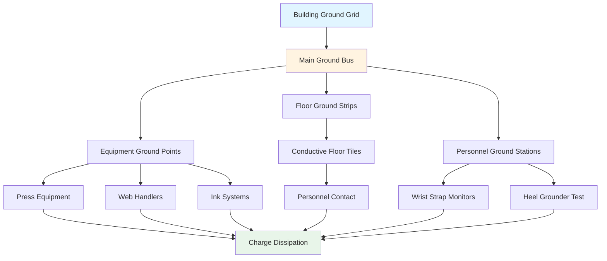

Grounding systems form the foundation of effective static electricity control in printing facilities. Proper grounding provides a conductive path for accumulated electrostatic charges to dissipate safely to earth potential, preventing discharge events that can damage sensitive electronics, ignite flammable vapors, or cause product quality issues.

## Physical Principles of Grounding

Static charge accumulation occurs when electrons transfer between materials through triboelectric effect. The charge density on an insulated surface follows:

$$\sigma = \frac{Q}{A}$$

where $\sigma$ is surface charge density (C/m²), $Q$ is total charge (C), and $A$ is surface area (m²). For grounding to be effective, a conductive path must provide sufficient charge dissipation rate:

$$\frac{dQ}{dt} = -\frac{Q}{RC}$$

where $R$ is resistance to ground (Ω) and $C$ is capacitance (F). The time constant $\tau = RC$ determines discharge rate. For effective static control, resistance to ground should be maintained below $10^9$ Ω, with most printing applications requiring $10^6$ to $10^8$ Ω.

## Grounding System Components

### Equipment Grounding

All conductive equipment in the printing environment must connect to a common ground reference:

**Metallic Component Grounding**
- Press frames and rollers: Direct bonding to ground bus
- Ink fountains and reservoirs: Hard-wired connections
- Web handling equipment: Continuous electrical path
- Resistance requirement: < 1 Ω to ground

**Ground Bus Design**
The ground bus provides a common reference point for all grounded equipment. Bus sizing follows current-carrying capacity:

$$A_{bus} = \frac{I_{max}}{\delta_{cu}}$$

where $A_{bus}$ is cross-sectional area (mm²), $I_{max}$ is maximum fault current (A), and $\delta_{cu}$ is current density for copper (typically 3-5 A/mm² for continuous duty).

### Conductive Flooring

Flooring systems provide charge dissipation path for personnel and mobile equipment:

| Flooring Type | Resistance Range | Application |
|---------------|------------------|-------------|
| Conductive | $10^4$ - $10^6$ Ω | High-sensitivity areas |
| Static-dissipative | $10^6$ - $10^9$ Ω | General printing areas |
| Anti-static | $10^9$ - $10^{12}$ Ω | Low-risk zones |

**Resistance Measurement**
Floor resistance is measured using ANSI/ESD STM7.1 standard with electrode configuration:

$$R_{floor} = \frac{V}{I}$$

measured between 5 lb (22 N) electrodes spaced 3 ft (914 mm) apart. Measurements should be taken at multiple locations, with the geometric mean representing overall floor performance.

**Installation Requirements**
- Continuous copper ground strips embedded at 6-10 ft (1.8-3 m) intervals
- Ground strip connection to building ground at minimum 4 points
- Resistance verification before and after coating application
- Humidity control: 30-50% RH for consistent performance

### Grounding Straps and Connections

Flexible connections accommodate equipment movement while maintaining ground continuity:

**Strap Design Parameters**
- Material: Tinned copper braid or conductive elastomer
- Minimum cross-section: 10 mm²
- Maximum length: 1 m (to minimize inductance)
- Connection resistance: < 0.1 Ω

The inductance of grounding straps affects high-frequency discharge:

$$L = \frac{\mu_0 \mu_r l}{2\pi} \ln\left(\frac{2l}{r}\right)$$

where $L$ is inductance (H), $l$ is length (m), and $r$ is conductor radius (m). Shorter, wider straps minimize impedance at discharge frequencies (1-100 MHz).

### Personnel Grounding

Personnel accumulate charge through movement and contact with materials:

**Wrist Straps**
- Resistance: 1 MΩ ± 20% (includes 1 MΩ current-limiting resistor)
- Connection verification: Continuous monitoring recommended
- Skin contact resistance: < 100 kΩ for effective operation

**Heel Grounders and ESD Footwear**
Combined with conductive flooring:

$$R_{total} = R_{footwear} + R_{floor} + R_{ground}$$

Target $R_{total}$ < $10^8$ Ω for charge dissipation within 1 second.

## Grounding System Design

## Grounding System Verification

**Resistance Testing Protocol**

1. Equipment-to-ground resistance: Measured with megohmmeter at 500 VDC
2. Floor-to-ground resistance: Per ANSI/ESD STM7.1 at specified locations
3. Continuity verification: All ground paths < 1 Ω DC resistance
4. Ground loop resistance: < 25 Ω for building ground system

**Test Frequency**
- Initial installation: 100% verification of all components
- Quarterly: Representative sampling (20% of points)
- Annual: Complete system verification
- After modifications: Affected circuits and adjacent areas

## Environmental Effects on Grounding Performance

Relative humidity significantly affects charge dissipation:

$$\tau_{dissipation} = \epsilon_0 \epsilon_r \rho$$

where $\rho$ is material resistivity (Ω⋅m). At low humidity (< 30% RH), surface resistivity increases by 2-3 orders of magnitude, degrading grounding effectiveness.

**Humidity Control Integration**
- Maintain 40-50% RH in printing areas
- Humidification capacity: 0.5-1.0 lb water/1000 cfm air
- Distribution uniformity: ± 5% RH across work areas

## Grounding System Maintenance

| Component | Inspection Item | Frequency | Acceptance Criteria |
|-----------|----------------|-----------|---------------------|
| Equipment grounds | Visual inspection | Monthly | No corrosion, tight connections |
| Floor conductivity | Resistance test | Quarterly | Within specified range |
| Wrist straps | Continuity check | Daily | < 10 MΩ total resistance |
| Ground bus | Connection torque | Annual | Per manufacturer specs |
| Building ground | Resistance to earth | Annual | < 25 Ω |

**Common Grounding Failures**

1. Oxidation at connections: Increases resistance over time
2. Mechanical stress: Breaks in flexible straps
3. Coating degradation: Floor conductivity loss
4. Improper bonding: Isolated equipment sections
5. Ground loops: Can create electromagnetic interference

**Corrective Actions**
- Connection refurbishment: Clean and re-torque annually
- Strap replacement: When resistance exceeds 1 Ω
- Floor reconditioning: Recoat or replace when resistance drifts
- Bonding jumpers: Install across mechanical joints
- Ground routing: Single-point grounding for sensitive equipment

## Integration with Static Control Systems

Grounding works synergistically with other static control methods:

- **Ionization**: Neutralizes charges that cannot reach ground
- **Humidity control**: Increases surface conductivity
- **Material selection**: Minimizes triboelectric charging

The combined effectiveness follows:

$$E_{total} = 1 - (1-E_g)(1-E_i)(1-E_h)$$

where $E_g$, $E_i$, and $E_h$ represent effectiveness of grounding, ionization, and humidity control respectively. Properly designed systems achieve 99%+ charge dissipation efficiency.

## Conclusion

Effective grounding systems require careful design, installation, and maintenance. All conductive materials must provide low-resistance paths to a common ground reference. Regular testing verifies system integrity, while environmental controls optimize performance. Integration with ionization and humidity management provides comprehensive static electricity control in printing facilities.
