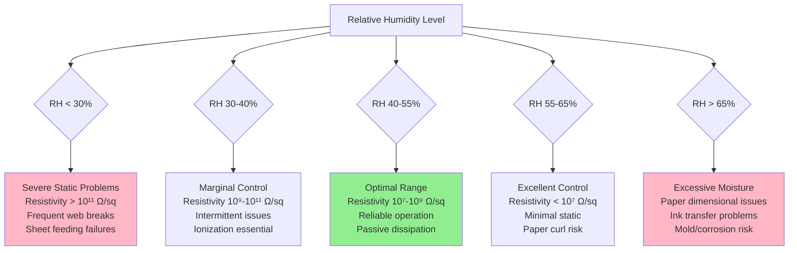
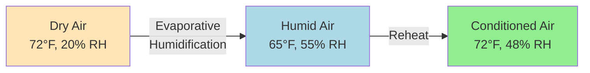
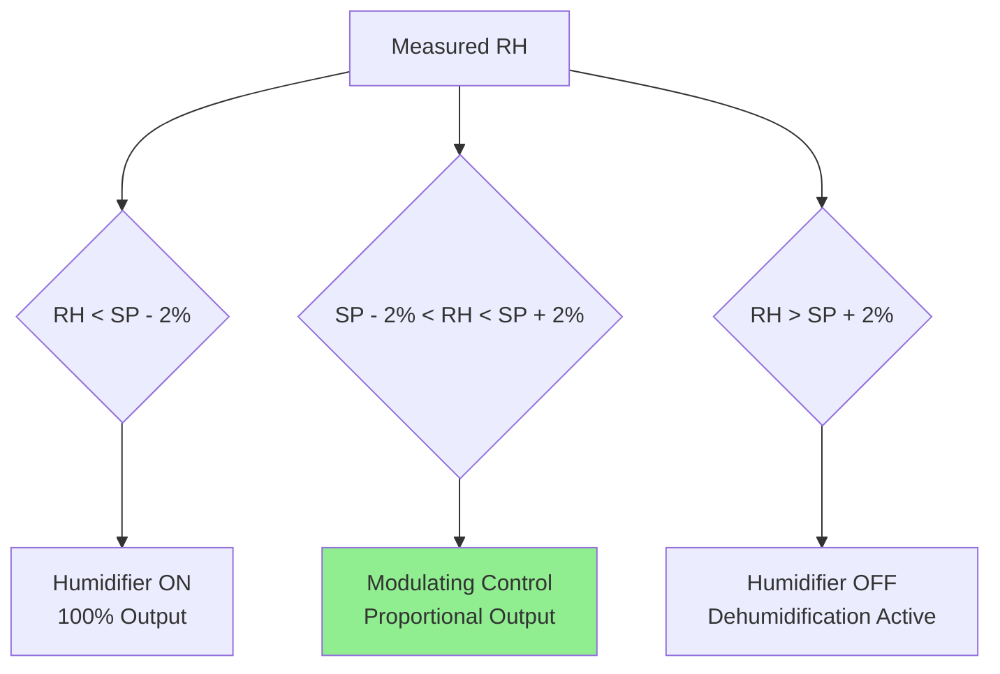

## Humidity as Static Control Mechanism

Relative humidity control represents the most fundamental and passive method of static electricity mitigation in printing operations. Water vapor molecules adsorbed onto hygroscopic substrates create a conductive surface layer that facilitates charge dissipation, reducing surface resistivity by 3-6 orders of magnitude between 20% and 60% RH. This moisture film enables accumulated electrostatic charges to dissipate to ground through conductive pathways rather than accumulating to problematic voltage levels that disrupt press operations.

The effectiveness of humidity control depends on substrate material composition, surface chemistry, air temperature, and ventilation patterns that influence moisture uptake kinetics and equilibrium moisture content at the paper surface.

## Surface Resistivity-Humidity Relationship

### Fundamental Physics

Surface resistivity ($\rho_s$) quantifies the electrical resistance of a material's surface layer, measured in ohms per square (Ω/sq). This parameter determines charge decay time and static accumulation propensity:

$$\rho_s = \frac{V}{I} \times \frac{L}{W}$$

Where:
- $\rho_s$ = Surface resistivity (Ω/sq)
- $V$ = Applied voltage (V)
- $I$ = Current through surface (A)
- $L$ = Electrode spacing length (m)
- $W$ = Electrode width (m)

**Moisture adsorption mechanism:**

Hygroscopic materials (paper, paperboard) contain polar hydroxyl groups (OH⁻) in cellulose fibers that attract water molecules through hydrogen bonding. At relative humidity above 30-35%, a continuous monolayer of adsorbed water molecules forms on the fiber surface. This adsorbed layer contains mobile ions (H⁺, OH⁻, and dissolved salts) that provide electrical conductivity.

**Exponential resistivity decrease:**

Surface resistivity decreases exponentially with increasing relative humidity according to empirical relationship:

$$\rho_s(RH) = \rho_0 \times 10^{-k \times RH}$$

Where:
- $\rho_0$ = Baseline resistivity at 0% RH (typically 10¹⁴-10¹⁶ Ω/sq)
- $k$ = Material-specific humidity coefficient (0.04-0.08 for paper)
- $RH$ = Relative humidity (expressed as fraction, 0-1)

### Material-Specific Behavior

| Material Type | 20% RH | 35% RH | 50% RH | 65% RH | 80% RH |
|---------------|---------|---------|---------|---------|---------|
| Uncoated offset paper | 10¹² Ω/sq | 10¹⁰ Ω/sq | 10⁸ Ω/sq | 10⁷ Ω/sq | 10⁶ Ω/sq |
| Coated gloss paper | 10¹³ Ω/sq | 10¹¹ Ω/sq | 10⁹ Ω/sq | 10⁸ Ω/sq | 10⁷ Ω/sq |
| Kraft paperboard | 10¹¹ Ω/sq | 10⁹ Ω/sq | 10⁷ Ω/sq | 10⁶ Ω/sq | 10⁵ Ω/sq |
| PE-coated board | 10¹⁴ Ω/sq | 10¹³ Ω/sq | 10¹² Ω/sq | 10¹² Ω/sq | 10¹¹ Ω/sq |
| PET film | 10¹⁵ Ω/sq | 10¹⁴ Ω/sq | 10¹⁴ Ω/sq | 10¹³ Ω/sq | 10¹³ Ω/sq |
| Polypropylene film | 10¹⁶ Ω/sq | 10¹⁵ Ω/sq | 10¹⁵ Ω/sq | 10¹⁴ Ω/sq | 10¹⁴ Ω/sq |

**Critical observations:**

1. **Paper substrates** show dramatic resistivity reduction (4-6 orders of magnitude) between 20% and 65% RH due to cellulose hygroscopicity
2. **Polymer-coated materials** exhibit minimal humidity response (1-2 orders of magnitude change) as non-hygroscopic polymers do not adsorb significant water
3. **Synthetic films** (PET, PP, PE) remain highly insulating across full RH range, requiring active ionization regardless of humidity

### Charge Decay Time Correlation

Static charge dissipation rate relates directly to surface resistivity through material capacitance:

$$t_{decay} = \rho_s \times \varepsilon_0 \times \varepsilon_r$$

Where:
- $t_{decay}$ = Time for charge to decay to 37% of initial value (seconds)
- $\rho_s$ = Surface resistivity (Ω/sq)
- $\varepsilon_0$ = Permittivity of free space (8.85 × 10⁻¹² F/m)
- $\varepsilon_r$ = Relative permittivity of material (2.0-4.0 for paper)

**Practical decay time examples:**

For uncoated paper ($\varepsilon_r$ = 3.0):

| RH Level | Surface Resistivity | Decay Time (37%) | Decay Time (10%) |
|----------|---------------------|------------------|------------------|
| 20% RH | 10¹² Ω/sq | 26.6 seconds | 61.2 seconds |
| 35% RH | 10¹⁰ Ω/sq | 0.27 seconds | 0.61 seconds |
| 50% RH | 10⁸ Ω/sq | 2.7 milliseconds | 6.1 milliseconds |
| 65% RH | 10⁷ Ω/sq | 0.27 milliseconds | 0.61 milliseconds |

**Significance:** At 50% RH and above, paper substrates dissipate static charges within milliseconds to seconds—sufficiently fast to prevent accumulation during typical press operations (web speeds 100-2000 fpm). Below 35% RH, decay times exceed practical timeframes, leading to charge buildup.

## Critical Humidity Thresholds

### Static Suppression Zones

### Optimal Operating Ranges by Press Type

**Sheet-fed lithographic presses:**

- **Target RH:** 45-50%
- **Tolerance:** ±3% RH
- **Rationale:** Balance static control with dimensional stability for register accuracy
- **Paper equilibration:** 24-48 hours at target conditions
- **Temperature:** 70-75°F (21-24°C)

**Web offset presses:**

- **Target RH:** 50-55%
- **Tolerance:** ±2% RH
- **Rationale:** Higher web speeds generate more static; elevated RH compensates
- **Material velocity:** 1,000-2,000 fpm increases triboelectric charging
- **Temperature:** 72-78°F (22-26°C)

**Gravure and flexographic presses:**

- **Target RH:** 50-60%
- **Tolerance:** ±3% RH
- **Rationale:** Film substrates require maximum practical humidity plus ionization
- **Substrate types:** PET, BOPP, PE films with minimal hygroscopicity
- **Temperature:** 72-78°F (22-26°C)

**Digital printing systems:**

- **Target RH:** 40-50%
- **Tolerance:** ±5% RH
- **Rationale:** Lower speeds reduce static generation; paper dimensional stability critical
- **Material handling:** Cut sheets require consistent moisture content
- **Temperature:** 68-75°F (20-24°C)

### Seasonal Adjustment Strategies

**Winter operation (outdoor air < 30°F, < 20% RH):**

Challenge: Heated outdoor air has extremely low absolute humidity, requiring substantial humidification.

**Calculation example:**

Outdoor conditions: 10°F, 50% RH
- Dewpoint: -2°F
- Absolute humidity: 0.0010 lb H₂O/lb dry air

Heated to 72°F (without humidification):
- Relative humidity: 4.7%
- Surface resistivity: > 10¹³ Ω/sq (severe static)

Required humidification to 72°F, 50% RH:
- Target absolute humidity: 0.0081 lb H₂O/lb dry air
- Humidification load: 0.0071 lb H₂O/lb dry air

For 20,000 CFM outdoor air makeup:
$$\dot{m}_{steam} = 20,000 \times 0.075 \times 0.0071 \times 60 = 639 \text{ lb/hr}$$

**Winter strategies:**

1. **Minimize outdoor air:** Use minimum code-required ventilation (typically 0.06 CFM/ft² for printing areas)
2. **Energy recovery:** Heat recovery ventilators (HRV) or energy recovery ventilators (ERV) reduce heating load
3. **Staged humidification:** Pre-humidify makeup air to 30-35% RH, then space humidifiers boost to 45-50%
4. **Destratification:** Ceiling fans recirculate warm, humidified air from ceiling to occupied zone

**Summer operation (outdoor air > 75°F, > 60% RH):**

Challenge: Excessive moisture requires dehumidification while maintaining cooling.

**Calculation example:**

Outdoor conditions: 90°F, 65% RH
- Dewpoint: 77°F
- Absolute humidity: 0.0181 lb H₂O/lb dry air

Target indoor: 72°F, 50% RH
- Dewpoint: 51°F
- Absolute humidity: 0.0081 lb H₂O/lb dry air
- Required dehumidification: 0.0100 lb H₂O/lb dry air

**Summer strategies:**

1. **Cooling-based dehumidification:** Chilled water coils at 42-45°F remove moisture by condensation
2. **Reheat for temperature control:** Cool air to 52-55°F for dehumidification, reheat to 72°F supply
3. **Dewpoint control:** Maintain coil leaving air dewpoint at 48-52°F to achieve 50% RH at space
4. **Dedicated outdoor air system (DOAS):** Separate unit for dehumidifying ventilation air, recirculation units for sensible cooling

## Humidification System Selection

### Technology Comparison

| System Type | Moisture Output | Energy Source | Water Quality | Maintenance | Capital Cost | Operating Cost |
|-------------|-----------------|---------------|---------------|-------------|--------------|----------------|
| Steam-to-steam | Clean, mineral-free | Boiler steam | Any | Low | High | Medium |
| Direct steam injection | Moderate purity | Boiler steam | Requires clean steam | Low | Low | Medium |
| Electrode boiler | Pure steam | Electric | Demineralized water | Medium | Medium | High (electric) |
| Gas-fired steam | High capacity | Natural gas | Any | Medium | High | Low (gas) |
| Evaporative media | Mineral carryover possible | Electric fan | Softened water | High | Low | Low |
| Ultrasonic atomizer | Fine droplets | Electric | Demineralized water | High | Medium | Medium |
| Compressed air atomizer | Controlled droplets | Compressed air + electric | Demineralized water | Medium | Medium | Medium-High |

### Steam Humidification Systems

**Steam-to-steam humidifiers:**

Optimal choice for printing plants requiring clean, mineral-free humidification.

**Operating principle:**

Building steam (typically 5-15 psig) flows through heat exchanger coil immersed in clean water reservoir. Heat evaporates clean water, producing pure steam free of boiler treatment chemicals.

**Design specifications:**

- **Steam capacity:** 5-500 lb/hr per unit
- **Primary steam pressure:** 5-50 psig
- **Response time:** 30-60 seconds to full output
- **Turndown ratio:** 10:1 with modulating control
- **Electrical requirement:** 120V for controls, minimal power

**Distribution method:**

In-duct steam dispersion tubes positioned in makeup air stream:

$$N_{tubes} = \frac{W_{duct}}{S_{tube}}$$

Where:
- $N_{tubes}$ = Number of dispersion tubes required
- $W_{duct}$ = Duct width (inches)
- $S_{tube}$ = Tube spacing (typically 12-18 inches)

**Absorption distance:**

Steam requires minimum distance to fully evaporate before contacting duct bends or equipment:

$$L_{abs} = V_{air} \times t_{evap}$$

Where:
- $L_{abs}$ = Required absorption distance (ft)
- $V_{air}$ = Air velocity in duct (fps)
- $t_{evap}$ = Evaporation time (1.5-2.5 seconds typical)

For 1,500 fpm (25 fps) duct velocity:
$$L_{abs} = 25 \times 2.0 = 50 \text{ feet minimum}$$

**Practical guideline:** 15-20 duct diameters downstream of humidifier before first elbow or equipment.

### Direct Steam Injection

**Application:** Lower cost alternative when clean boiler steam is available (food-grade boiler chemicals, < 0.5 ppm total dissolved solids).

**Advantages:**

- Lowest capital cost
- Rapid response (instantaneous)
- Simple installation
- No water treatment required (uses boiler water)
- Minimal maintenance

**Limitations:**

- Requires existing steam infrastructure
- Boiler water quality must meet purity standards
- Potential for mineral deposits if steam quality inadequate
- Safety concerns with high-pressure steam in occupied areas

**Design considerations:**

Steam pressure reduction station:
- Building steam: 15-125 psig typical
- Humidifier steam: 2-5 psig required
- Pressure reducing valve (PRV) with strainer upstream

**Control strategy:**

Modulating steam valve with proportional-integral (PI) control:

$$\dot{m}_{valve} = K_p \times (RH_{setpoint} - RH_{actual}) + K_i \int (RH_{setpoint} - RH_{actual}) dt$$

Where:
- $\dot{m}_{valve}$ = Commanded steam flow rate
- $K_p$ = Proportional gain (typical 5-10)
- $K_i$ = Integral gain (typical 0.5-2.0)

**Tuning:** Adjust $K_p$ and $K_i$ to achieve ±1-2% RH stability without hunting (oscillation).

### Evaporative Media Humidifiers

**Application:** Moderate humidity requirements (< 60% RH) in facilities with acceptable water quality (< 200 ppm hardness).

**Operating principle:**

Air flows through wetted evaporative media (cellulose or synthetic fiber) where water evaporates into airstream through adiabatic process. Unlike steam systems, evaporative humidifiers cool the air as latent heat is absorbed.

**Psychrometric process:**

**Energy analysis:**

Evaporative cooling effect:

$$\Delta T_{air} = \frac{\Delta W \times h_{fg}}{c_p}$$

Where:
- $\Delta T_{air}$ = Temperature drop (°F)
- $\Delta W$ = Humidity ratio increase (lb/lb)
- $h_{fg}$ = Latent heat of vaporization (1,050 Btu/lb at 72°F)
- $c_p$ = Air specific heat (0.24 Btu/lb·°F)

Example: Humidifying from 20% to 50% RH at 72°F:
- $\Delta W$ = 0.0062 lb/lb
- $\Delta T_{air} = (0.0062 × 1,050) / 0.24 = 27.1°F$

Air exits humidifier at approximately 45°F, requiring reheat to 72°F supply temperature.

**Advantages:**

- Low capital cost ($2,000-15,000)
- Low operating cost (fan power only, 0.5-5 HP)
- No steam infrastructure required
- Simple installation

**Limitations:**

- Cooling effect requires reheat in winter
- Mineral buildup on media (requires periodic replacement)
- Limited to ~80% RH maximum
- Water quality critical (hardness causes scaling)
- Higher maintenance than steam systems

**Maintenance requirements:**

- Media replacement: Annually or when differential pressure exceeds 0.5 in w.c.
- Water treatment: Softener or reverse osmosis recommended
- Bleed-off: 10-20% of makeup water to control mineral concentration
- Cleaning: Quarterly with citric acid or descaling solution

### Ultrasonic and Atomizing Systems

**Ultrasonic humidifiers:**

High-frequency vibration (1.65 MHz typical) creates ultra-fine water droplets (1-5 micron diameter) that evaporate rapidly in airstream.

**Advantages:**

- Fine mist evaporates quickly (< 2 ft absorption distance)
- Low energy consumption (20-50 watts per lb/hr capacity)
- Quiet operation (< 40 dBA)
- Compact size

**Critical limitation:**

All dissolved minerals in water become airborne as "white dust" when droplets evaporate. Requires demineralized water (< 1 ppm TDS) or reverse osmosis (RO) treatment.

**Water quality requirement:**

$$TDS_{max} = \frac{1 \text{ ppm} \times Q_{air}}{W_{humid}}$$

For 10,000 CFM air, 50 lb/hr humidification:

Acceptable TDS to achieve < 0.1 mg/m³ particulate:
- Demineralized water: < 1-5 ppm TDS
- RO water treatment: Capital cost $5,000-20,000
- Operating cost: Membrane replacement, reject water disposal

**Compressed air atomizing nozzles:**

Combine compressed air (60-100 psig) with water to create fine spray (10-50 micron droplets).

**Advantages:**

- Controlled droplet size
- Rapid evaporation (3-6 ft absorption)
- Works with moderate water quality (< 50 ppm hardness with proper filtration)
- Excellent turndown (20:1 ratio)

**Operating costs:**

Compressed air consumption: 1-3 SCFM per nozzle at 1-5 lb/hr water flow

For 0.20 kWh per SCFM compressed air cost:
- 50 lb/hr capacity = 10 nozzles × 2 SCFM = 20 SCFM total
- Power cost: 20 SCFM × 0.20 kWh/SCFM = 4 kW continuous

Annual cost (6,000 hours operation): 24,000 kWh × $0.12/kWh = $2,880

## Control Strategies

### Sensor Placement and Selection

**Humidity sensor technologies:**

| Sensor Type | Range | Accuracy | Response Time | Drift | Cost | Application |
|-------------|-------|----------|---------------|-------|------|-------------|
| Capacitive thin-film | 5-98% RH | ±2-3% RH | 10-30 sec | Low | Low | General HVAC |
| Chilled mirror dewpoint | 0-100% RH | ±0.5°F Td | 60-90 sec | Minimal | High | Calibration reference |
| Resistive | 20-90% RH | ±3-5% RH | 30-60 sec | Moderate | Very low | Non-critical |
| Wet/dry bulb psychrometer | 10-100% RH | ±2% RH | 90-180 sec | Minimal | Medium | Laboratory standard |

**Recommended:** Capacitive thin-film sensors with ±2% RH accuracy for printing plant applications.

**Sensor location criteria:**

1. **Representative sampling:** Position in return air stream or press area at breathing height (4-6 ft AFF)
2. **Avoid local effects:** Minimum 6 ft from exterior doors, dryer exhaust, steam sources
3. **Air velocity:** 200-500 fpm across sensor for accurate measurement
4. **Multiple zones:** Large press rooms require 2-4 sensors averaging for control

**Calibration frequency:**

- Field verification: Quarterly using portable calibrated reference
- Factory recalibration: Annually or when drift exceeds ±3% RH
- Span check: Monthly against salt solution humidity standards (33.0% RH NaCl, 75.3% RH NaCl)

### Control Logic

**Proportional-Integral (PI) control:**

Standard approach for humidity control with 30-second to 5-minute lag times:

**Control equation:**

$$Output = K_p \times Error + K_i \int Error \, dt$$

Where:
- $Error = RH_{setpoint} - RH_{measured}$
- $K_p$ = Proportional gain (5-15 typical)
- $K_i$ = Integral time constant (60-300 seconds)

**Tuning guidelines:**

1. Set $K_i$ = 0 (integral disabled)
2. Increase $K_p$ until controlled variable oscillates
3. Reduce $K_p$ to 50% of oscillation point
4. Enable integral: $K_i$ = response time / 3
5. Fine-tune to eliminate offset while avoiding hunting

**Deadband implementation:**

To prevent control cycling with marginal changes:

**Adaptive setpoint:**

Some advanced systems adjust humidity setpoint based on:
- Outdoor air temperature (lower RH in winter to reduce condensation risk)
- Press operating speed (higher RH at elevated speeds)
- Substrate type (higher RH for synthetic films)

**Example adaptive logic:**

$$RH_{setpoint} = RH_{base} + K_{temp} \times (T_{outdoor} - 32°F) + K_{speed} \times \frac{v_{press}}{v_{rated}}$$

Where:
- $RH_{base}$ = 50% (baseline setpoint)
- $K_{temp}$ = 0.05% per °F (outdoor temperature compensation)
- $K_{speed}$ = 3% (press speed adjustment factor)

## Integration with Active Static Control

### Complementary Ionization

Humidity control alone is insufficient for:
- Non-hygroscopic substrates (PET, BOPP, PE films)
- High-speed operations (> 1,000 fpm web velocity)
- Critical applications (pharmaceutical labels, security printing)

**Combined strategy:**

$$V_{residual} = V_{generated} \times e^{-t/\tau} - I_{ion} \times R_{surface}$$

Where:
- $V_{residual}$ = Residual voltage on substrate
- $V_{generated}$ = Triboelectric charge generation rate
- $t$ = Time (seconds)
- $\tau$ = Charge decay time constant (function of humidity)
- $I_{ion}$ = Ion current from ionization bar
- $R_{surface}$ = Surface resistance (function of humidity)

**Synergistic effect:** Elevated humidity reduces $R_{surface}$ by 3-4 orders of magnitude, allowing ionization current to neutralize charges more rapidly.

### Performance Verification

**Static voltage measurement:**

Electrostatic field meter positioned 6-12 inches from substrate surface:

Target residual voltage:
- General printing: < 2,000 V
- Precision work: < 1,000 V
- Explosive atmosphere: < 500 V (per NFPA 77)

**Charge decay testing:**

Apply known charge (5,000 V typical) via corona discharge:
- Measure time to decay to 500 V
- With humidity alone (45-50% RH): 2-10 seconds for paper
- With humidity + ionization: < 1 second

**Acceptance criteria:**

Decay time to 10% initial charge:
- Excellent: < 1 second
- Acceptable: 1-3 seconds
- Marginal: 3-10 seconds
- Inadequate: > 10 seconds (requires corrective action)

---

**Standards References:**
- ASHRAE Handbook—HVAC Applications (2019), Chapter 22: Printing Plants
- TAPPI TIP 0404-62: Electrostatic Problems in Web Handling and Converting
- TAPPI T 555: Surface Resistivity of Paper
- NFPA 77: Recommended Practice on Static Electricity (2019)
- ANSI/ESD S20.20: Protection of Electrical and Electronic Parts
- GATF Technical Guideline: Environmental Control for Printing Plants

Humidity control maintains surface resistivity below 10⁹ Ω/sq through molecular water adsorption on hygroscopic substrates, enabling passive static charge dissipation within seconds and preventing accumulation to problematic voltage levels in printing operations, with optimal performance achieved at 45-55% RH for paper-based materials.
