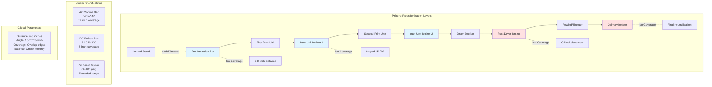

## Overview

Air ionization systems neutralize electrostatic charges on moving substrates through generation of bipolar ions (positive and negative) that migrate to charged surfaces under electric field forces. Unlike passive humidity control which relies on surface moisture conductivity, active ionization provides rapid charge neutralization within milliseconds at distances of 2-12 inches from emitter points, making it essential for non-hygroscopic materials (plastic films, coated papers) and high-speed operations where charge generation rates exceed natural decay.

## Ion Generation Physics

### Corona Discharge Mechanism

Corona ionizers generate ions through partial electrical breakdown of air molecules near high-voltage electrode points where electric field intensity exceeds the dielectric breakdown threshold.

**Electric Field at Sharp Point:**

The electric field strength $E$ at distance $r$ from a needle electrode follows:

$$E(r) = \frac{V}{r \ln(R/r_0)}$$

Where:
- $E$ = Electric field strength (V/m)
- $V$ = Applied voltage (V)
- $r$ = Distance from electrode tip (m)
- $R$ = Distance to ground plane (m)
- $r_0$ = Electrode tip radius (m)

**Critical Breakdown Voltage:**

Air ionization begins when $E$ exceeds the corona inception field:

$$E_c = 3.0 \times 10^6 \left(1 + \frac{0.308}{\sqrt{r_0}}\right) \text{ V/m}$$

For typical ionizer needle radius $r_0 = 0.1$ mm:

$$E_c \approx 3.98 \times 10^6 \text{ V/m}$$

At this threshold, electrons gain sufficient energy between collisions to ionize neutral air molecules through impact ionization.

### Ion Generation Rate

The ion production rate $N$ (ions/second) depends on corona current:

$$N = \frac{I_c}{e}$$

Where:
- $I_c$ = Corona current (A)
- $e$ = Elementary charge ($1.602 \times 10^{-19}$ C)

**Corona Current Equation:**

For positive corona discharge:

$$I_c = \frac{\mu V (V - V_0)}{d^2}$$

Where:
- $\mu$ = Air ion mobility ($2.1 \times 10^{-4}$ m²/V·s)
- $V$ = Applied voltage (V)
- $V_0$ = Corona onset voltage (V)
- $d$ = Gap distance (m)

Typical AC corona bar at 6 kV, 10 cm gap:
$$I_c \approx 50 \text{ μA/emitter point}$$
$$N \approx 3 \times 10^{14} \text{ ions/sec per point}$$

## Ion Transport and Neutralization

### Ion Mobility and Drift Velocity

Ions move toward charged surfaces under electric field forces, traveling at drift velocity:

$$v_d = \mu E$$

Where:
- $v_d$ = Ion drift velocity (m/s)
- $\mu$ = Ion mobility (m²/V·s)
- $E$ = Electric field strength (V/m)

**Ion Species and Mobility:**

| Ion Type | Chemical Formula | Mobility (m²/V·s) | Formation |
|----------|------------------|-------------------|-----------|
| Positive primary | N₂⁺, O₂⁺ | $2.8 \times 10^{-4}$ | Direct ionization |
| Negative primary | O₂⁻ | $2.5 \times 10^{-4}$ | Electron attachment |
| Positive cluster | H₃O⁺(H₂O)ₙ | $1.4 \times 10^{-4}$ | Hydration cascade |
| Negative cluster | O₂⁻(H₂O)ₙ | $1.3 \times 10^{-4}$ | Hydration cascade |

Primary ions rapidly form hydrated clusters in humid air, reducing mobility but increasing stability.

### Charge Neutralization Rate

When ions contact a charged surface, neutralization occurs through electron transfer. The surface voltage decay follows:

$$V(t) = V_0 e^{-t/\tau}$$

Where:
- $V(t)$ = Surface voltage at time $t$ (V)
- $V_0$ = Initial voltage (V)
- $\tau$ = Decay time constant (s)

**Decay Time Constant:**

$$\tau = \frac{\varepsilon_0 \varepsilon_r \rho}{1 + \frac{\rho I_i}{V_0 A}}$$

Where:
- $\varepsilon_0$ = Permittivity of free space ($8.854 \times 10^{-12}$ F/m)
- $\varepsilon_r$ = Relative permittivity of material
- $\rho$ = Surface resistivity (Ω/square)
- $I_i$ = Ion current density (A/m²)
- $A$ = Surface area (m²)

**Effective neutralization requires:**
- Ion current density $I_i > 10$ nA/cm²
- Ionizer distance < 30 cm for AC corona systems
- Air velocity < 2 m/s to prevent ion dispersion

## Ionizer Effectiveness Calculations

### Ion Density Distribution

The ion density $n(r)$ at distance $r$ from an ionizer bar decreases with distance due to recombination and diffusion:

$$n(r) = n_0 \exp\left(-\frac{r}{\lambda}\right)$$

Where:
- $n_0$ = Ion density at emitter surface (ions/m³)
- $\lambda$ = Effective range ($\approx$ 15-30 cm depending on airflow)

**Recombination Loss:**

Positive and negative ions recombine at rate:

$$\frac{dn}{dt} = -\alpha n^2$$

Where $\alpha$ = recombination coefficient ($1.6 \times 10^{-12}$ m³/s)

This quadratic dependence means ion density drops rapidly beyond optimal working distance.

### Neutralization Time

The time $t_n$ required to neutralize a charged substrate from voltage $V_0$ to $V_f$:

$$t_n = \frac{\varepsilon_0 A}{I_i} \ln\left(\frac{V_0}{V_f}\right)$$

**Example calculation:**

For 10 cm × 10 cm film at $V_0 = 5000$ V, neutralizing to $V_f = 500$ V:
- Area $A = 0.01$ m²
- Ion current $I_i = 100$ nA (typical at 6 inches)
- $\varepsilon_0 = 8.854 \times 10^{-12}$ F/m

$$t_n = \frac{8.854 \times 10^{-12} \times 0.01}{100 \times 10^{-9}} \ln(10) = 2.0 \text{ ms}$$

This demonstrates the rapid action of properly positioned ionizers.

### Ion Balance Calculation

Ion balance represents the offset voltage when equal positive and negative charges are applied. Ideal balance is 0 V, but practical systems achieve ±10-50 V.

$$V_{offset} = \frac{I_+ - I_-}{I_+ + I_-} \times V_{ref}$$

Where:
- $I_+$ = Positive ion current
- $I_-$ = Negative ion current
- $V_{ref}$ = Reference voltage (typically 1000 V)

**Balance specification:**
- Acceptable: $|V_{offset}| < 50$ V
- Good: $|V_{offset}| < 20$ V
- Excellent: $|V_{offset}| < 10$ V

## Ionizer Type Comparison

### Technology Overview

| Ionizer Type | Generation Method | Voltage Range | Ion Output | Maintenance | Safety | Cost |
|--------------|-------------------|---------------|------------|-------------|--------|------|
| **AC Corona** | Alternating polarity discharge | 5-7 kV AC | 10¹⁴ ions/s | Weekly cleaning | Ozone generation | Medium |
| **DC Pulsed Corona** | Synchronized DC pulses | 7-10 kV DC | 10¹⁴ ions/s | Biweekly cleaning | Low ozone | Medium-High |
| **Nuclear (Polonium-210)** | Alpha particle ionization | Passive | 10¹² ions/s | None (decay) | Radiation licensing | High |
| **Photoelectric** | UV photon ionization | 0.5-2 kV | 10¹³ ions/s | Lamp replacement | No ozone | High |
| **Soft X-ray** | X-ray photon ionization | 10-15 kV (tube) | 10¹³ ions/s | Minimal | Shielding required | Very High |

### AC Corona Ionizers

**Operating Principle:**

Alternating voltage (50-60 Hz) generates positive ions on positive half-cycle and negative ions on negative half-cycle.

**Advantages:**
- Inherently balanced bipolar output
- No separate positive/negative emitters required
- Simple power supply design
- Effective range 6-12 inches

**Disadvantages:**
- Ozone generation: 0.01-0.03 ppm at 6 inches
- Audible hiss at high voltages
- Emitter contamination requires frequent cleaning
- Performance degrades with airborne particulate

**Ion Output Characteristics:**

$$I_{AC} = I_{peak} \sin(2\pi f t)$$

Peak current $I_{peak}$ = 50-200 μA per emitter point

Time-averaged ion production provides continuous neutralization.

### DC Pulsed Corona Ionizers

**Operating Principle:**

Synchronized positive and negative DC pulses (typically 1-10 kHz) generate balanced ion streams from separate emitter arrays.

**Advantages:**
- Superior ion balance (±5 V achievable)
- Lower ozone production than AC
- Faster response time (<0.1 seconds)
- Better control over ion density

**Disadvantages:**
- More complex electronics
- Requires separate emitter maintenance
- Higher initial cost
- Sensitive to emitter spacing tolerances

**Pulse Characteristics:**

$$V_{DC}(t) = V_0 \left[\text{rect}\left(\frac{t}{T_{on}}\right) - \text{rect}\left(\frac{t-T/2}{T_{on}}\right)\right]$$

Where duty cycle $T_{on}/T$ = 10-30% optimizes ion production while minimizing power.

### Nuclear (Radioactive) Ionizers

**Operating Principle:**

Alpha particles from Polonium-210 decay ionize air molecules through direct collision without applied voltage.

**Ion Generation:**

$$N = \frac{A \cdot \Phi \cdot \epsilon}{W}$$

Where:
- $A$ = Activity (Becquerels)
- $\Phi$ = Geometric efficiency factor
- $\epsilon$ = Ionization efficiency
- $W$ = Energy per ion pair (34 eV for air)

**Advantages:**
- No power required
- Intrinsically balanced
- No ozone generation
- Immune to electrical interference

**Disadvantages:**
- Radioactive licensing (NRC in USA)
- Activity decays (half-life 138 days)
- Very short range (< 3 inches effective)
- Disposal regulations and liability
- Banned in many jurisdictions

**Modern Status:**

Nuclear ionizers are obsolete in new installations due to regulatory burden and superior alternatives, but remain in some legacy printing facilities.

### Photoelectric Ionizers

**Operating Principle:**

UV photons (typically 9.6-10.2 eV) ionize air through photoionization of trace contaminants and excited molecules.

**Key Reactions:**

$$\text{UV photon} + \text{O}_2 \rightarrow \text{O}_2^+ + e^-$$
$$e^- + \text{O}_2 + \text{M} \rightarrow \text{O}_2^- + \text{M}$$

Where M is a third-body molecule for energy absorption.

**Advantages:**
- Clean ion generation (no ozone)
- Long emitter life (8,000-12,000 hours)
- Good ion balance (±15 V)
- Safe low-voltage operation

**Disadvantages:**
- Lower ion output than corona
- Short effective range (4-8 inches)
- UV lamp replacement cost
- Sensitive to humidity and contamination

**Applications:**

Best suited for cleanroom printing and sensitive substrate applications where ozone is prohibited.

## System Layout and Placement

### Installation Strategy

### Positioning Calculations

**Optimal Distance from Substrate:**

The effective neutralization distance $d_{eff}$ depends on ion mobility and air velocity:

$$d_{eff} = \sqrt{\frac{\mu V t_{res}}{v_{air}}}$$

Where:
- $\mu$ = Ion mobility (m²/V·s)
- $V$ = Ionizer voltage (V)
- $t_{res}$ = Residence time (s)
- $v_{air}$ = Cross-flow air velocity (m/s)

**Example:**
- AC corona at 6 kV, $\mu = 1.5 \times 10^{-4}$ m²/V·s
- Web speed 500 fpm = 2.54 m/s, residence time 0.1 s
- Cross-flow air 0.5 m/s

$$d_{eff} = \sqrt{\frac{1.5 \times 10^{-4} \times 6000 \times 0.1}{0.5}} = 0.15 \text{ m} = 6 \text{ inches}$$

This confirms the empirical 6-8 inch placement standard.

### Multiple Ionizer Spacing

For wide webs requiring multiple ionizer bars in parallel:

$$S_{max} = 2 \times d_{eff} \times \cos(\theta)$$

Where:
- $S_{max}$ = Maximum spacing between bars
- $\theta$ = Mounting angle from perpendicular

For $d_{eff}$ = 8 inches and $\theta$ = 20°:

$$S_{max} = 2 \times 8 \times \cos(20°) = 15 \text{ inches}$$

Actual spacing typically 12-14 inches to ensure edge coverage overlap.

## Performance Verification

### Decay Time Testing

Standard test per IEC 61340-5-1 measures time to decay from 1000 V to 100 V (90% reduction):

**Test Setup:**
1. Charge test plate to +1000 V using high-voltage source
2. Activate ionizer at specified distance
3. Measure voltage vs. time with electrostatic voltmeter
4. Record $t_{10}$ (time to reach 100 V)

**Acceptance Criteria:**

| Distance | Excellent | Good | Acceptable | Marginal |
|----------|-----------|------|------------|----------|
| 4 inches | < 0.5 s | < 1.0 s | < 2.0 s | < 5.0 s |
| 6 inches | < 1.0 s | < 2.0 s | < 4.0 s | < 10.0 s |
| 12 inches | < 3.0 s | < 6.0 s | < 12.0 s | < 30.0 s |

**Exponential Decay Model:**

$$V(t) = V_0 e^{-t/\tau} + V_{offset}$$

Where $\tau$ is extracted by fitting:

$$\tau = -\frac{t}{\ln[(V(t) - V_{offset})/(V_0 - V_{offset})]}$$

### Ion Balance Measurement

**Charged Plate Monitor Method:**

1. Measure decay from +1000 V to record $V_{+}(t)$
2. Measure decay from -1000 V to record $V_{-}(t)$
3. Calculate offset at $t = 2$ seconds:

$$V_{offset} = \frac{V_+(2s) + V_-(2s)}{2}$$

**Balance Specification:**
- Offset < ±10 V: Excellent balance, no adjustment needed
- Offset ±10 to ±30 V: Good balance, typical for AC corona
- Offset ±30 to ±50 V: Marginal, check for emitter contamination
- Offset > ±50 V: Poor balance, maintenance required

### Field Strength Mapping

Use field mill or ion counter to map spatial distribution:

$$I_i(x,y) = I_0 \exp\left(-\frac{(x-x_0)^2 + (y-y_0)^2}{\sigma^2}\right)$$

Ion current density follows Gaussian distribution centered on emitter location. Map ensures uniform coverage across web width.

## Maintenance and Troubleshooting

### Emitter Cleaning

Corona discharge deposits airborne particulate and reaction products on emitter points, reducing field strength and shifting ion balance.

**Contamination Effect on Output:**

$$I_{dirty} = I_{clean} \exp\left(-\frac{d_{layer}}{d_{ref}}\right)$$

Where:
- $d_{layer}$ = Contamination thickness
- $d_{ref}$ = Reference thickness (≈ 10 μm for 50% reduction)

Dust accumulation of 20 μm reduces output by 75%, explaining weekly cleaning requirements in printing environments.

**Cleaning Protocol:**
1. De-energize and lockout ionizer power
2. Remove emitter assembly
3. Brush points with soft nylon brush
4. Compressed air (60-80 psig) removes particles
5. Isopropyl alcohol for organic residues
6. Inspect for bent or damaged points (replace if found)
7. Reinstall and verify high voltage output

### Performance Degradation Diagnosis

| Symptom | Probable Cause | Diagnostic Test | Solution |
|---------|----------------|-----------------|----------|
| Slow decay time | Low ion output | Measure HV with probe | Clean emitters, verify voltage |
| Ion balance offset | Unequal polarity wear | Charged plate test | Clean selectively or replace |
| Reduced range | Excessive air velocity | Smoke test airflow | Redirect air streams |
| Arcing/sparking | Damaged emitter point | Visual inspection | Replace emitter array |
| Intermittent operation | Power supply fault | Check output waveform | Repair/replace power supply |

### Air-Assist System Optimization

Air-assisted ionizers use compressed air jets to extend ion range but require careful balancing:

**Air Velocity Effect:**

$$d_{extended} = d_{normal} + \frac{v_{air} \cdot t_{flight}}{\ln(v_{air}/v_0)}$$

Excessive air velocity disperses ions before neutralization. Optimal flow:

$$Q_{opt} = 1.5 \text{ SCFM per foot of bar length}$$

At 80-100 psig supply pressure through 0.020-inch orifices.

## Integration with HVAC Systems

### Airflow Interaction

Press room air currents affect ion trajectories. The ion displacement due to cross-flow:

$$\Delta x = \frac{v_{air} \cdot d}{v_d} = \frac{v_{air} \cdot d}{\mu E}$$

For 0.5 m/s room air and 6-inch working distance:

$$\Delta x = \frac{0.5 \times 0.15}{\mu E} \approx 2-4 \text{ inches}$$

**Design Considerations:**
- Position ionizers upstream of prevailing airflow
- Avoid supply diffuser direct impingement
- Shield ionizers from exhaust pickup zones
- Coordinate with press hood ventilation systems

### Combined Humidity and Ionization

Relative humidity affects ion mobility through cluster formation:

$$\mu_{eff}(RH) = \mu_0 \left[1 - 0.5 \left(\frac{RH}{100}\right)\right]$$

At 50% RH, effective mobility drops 25% compared to dry air, requiring closer ionizer placement or higher voltage.

**Optimization Strategy:**
- Maintain 45-55% RH as baseline static control
- Add ionization for rapid neutralization and non-hygroscopic substrates
- Use humidification for bulk air conductivity
- Use ionization for point-of-use charge elimination

---

**Standards and References:**
- IEC 61340-5-1: Electrostatics - Protection of Electronic Devices from Electrostatic Phenomena
- ANSI/ESD S20.20: Protection of Electrical and Electronic Parts, Assemblies and Equipment
- IEC 61340-2-3: Electrostatics - Methods of Test for Determining the Resistance and Resistivity of Solid Planar Materials
- NFPA 77: Recommended Practice on Static Electricity (2019)
- TAPPI TIP 0404-62: Electrostatic Problems in Web Handling and Converting
