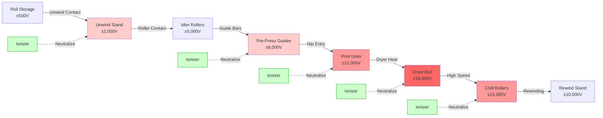

## Overview

Material handling generates the majority of static electricity in printing operations through triboelectric charging when dissimilar materials contact and separate. Paper, film, and foil substrates accumulate charge densities of 10⁻⁹ to 10⁻⁶ coulombs/m² when traveling over rollers, through nips, and across guide bars at velocities ranging from 100 to 2,000 feet per minute. Effective static control requires understanding contact mechanics, velocity-dependent charging rates, material selection based on resistivity, and coordinated ESD protocols throughout the material path.

## Triboelectric Charging Fundamentals

### Contact Electrification Physics

When two materials touch and separate, electron transfer occurs based on their position in the triboelectric series, creating surface charge imbalance.

**Charge Generation at Contact Interface:**

The volumetric charge density generated during contact-separation cycles follows:

$$Q = A \cdot \sigma_{contact} \cdot N$$

Where:
- $Q$ = Total charge transferred (coulombs)
- $A$ = Contact area (m²)
- $\sigma_{contact}$ = Charge density per contact (C/m²)
- $N$ = Number of contact-separation events

**Material-Dependent Charge Density:**

$$\sigma_{contact} = k_{mat} \cdot (W_1 - W_2) \cdot \frac{1}{\sqrt{\rho_s}}$$

Where:
- $k_{mat}$ = Material contact coefficient (10⁻⁹ to 10⁻⁷ C·Ω^{0.5}/m²·eV)
- $W_1, W_2$ = Work functions of materials (eV)
- $\rho_s$ = Surface resistivity (Ω/square)

Higher work function differences and lower surface resistivity increase charge generation.

### Velocity-Dependent Charge Accumulation

Static generation increases non-linearly with material handling speed due to increased contact frequency and reduced charge dissipation time between events.

**Speed-Dependent Charging Rate:**

$$\frac{dQ}{dt} = k_v \cdot v^{\alpha} \cdot L \cdot w$$

Where:
- $\frac{dQ}{dt}$ = Charge accumulation rate (C/s)
- $k_v$ = Velocity coefficient (material and surface dependent)
- $v$ = Web or sheet velocity (m/s)
- $\alpha$ = Velocity exponent (typically 1.3-1.8)
- $L$ = Contact length per roller (m)
- $w$ = Material width (m)

For paper over steel rollers: $\alpha \approx 1.5$
For polyester film over rubber rollers: $\alpha \approx 1.7$

**Practical Velocity Effects:**

| Web Speed | Relative Charge Generation | Static Control Requirements |
|-----------|---------------------------|----------------------------|
| 100 fpm (0.5 m/s) | 1.0× (baseline) | Humidity control sufficient |
| 300 fpm (1.5 m/s) | 3.4× | Ionization at critical points |
| 500 fpm (2.5 m/s) | 7.0× | Continuous ionization required |
| 1,000 fpm (5.1 m/s) | 17.5× | Multi-point ionization + grounding |
| 2,000 fpm (10.2 m/s) | 52× | Aggressive ionization + conductive rollers |

### Charge Dissipation Time Constants

Static charge bleeds off through material conductivity, air ionization, or grounded contact at rates determined by material resistivity.

**Exponential Decay Model:**

$$V(t) = V_0 \cdot e^{-t/\tau}$$

Where:
- $V(t)$ = Voltage at time $t$ (volts)
- $V_0$ = Initial voltage (volts)
- $\tau$ = Time constant (seconds)
- $\tau = \varepsilon_0 \cdot \varepsilon_r \cdot \rho_s$

For typical printing substrates:

$$\tau_{paper,50\%RH} = (8.85 \times 10^{-12}) \cdot (3.5) \cdot (10^9) \approx 0.31 \text{ seconds}$$

$$\tau_{PET\,film} = (8.85 \times 10^{-12}) \cdot (3.2) \cdot (10^{14}) \approx 28,300 \text{ seconds (7.9 hours)}$$

This dramatic difference explains why film substrates require aggressive ionization while paper responds well to humidity control.

## Static Generation Points in Material Path

**Critical Static Accumulation Zones:**

1. **Unwind Stand:** Initial charge from roll storage and first roller contact
2. **Guide Bars and Idlers:** Repeated contact-separation events accumulate charge
3. **Print Unit Entry:** Maximum charge before ink transfer requires neutralization
4. **Dryer Exit:** Heat reduces humidity, regenerates charge on dried substrate
5. **Rewind/Delivery:** Final accumulation affects stacking and subsequent handling

## Material Selection and Resistivity Control

### Substrate Anti-Static Treatments

Different printing substrates require specific treatments to manage surface resistivity and charge accumulation.

| Material Type | Untreated Resistivity | Treatment Method | Treated Resistivity | Charge Decay to 10% |
|---------------|----------------------|------------------|---------------------|---------------------|
| Coated Paper | 10¹¹-10¹³ Ω/sq | Humidity (50% RH) | 10⁹-10¹⁰ Ω/sq | 1-10 seconds |
| Uncoated Paper | 10¹⁰-10¹² Ω/sq | Humidity (50% RH) | 10⁸-10⁹ Ω/sq | 0.5-2 seconds |
| PET Film | 10¹⁴-10¹⁶ Ω/sq | Corona treatment | 10¹²-10¹³ Ω/sq | 30-300 seconds |
| BOPP Film | 10¹⁵-10¹⁷ Ω/sq | Anti-static coating | 10⁹-10¹¹ Ω/sq | 1-10 seconds |
| PE Film | 10¹⁶-10¹⁸ Ω/sq | Anti-static additive | 10¹⁰-10¹² Ω/sq | 5-50 seconds |
| Aluminum Foil | <10² Ω/sq | None required | <10² Ω/sq | <0.01 seconds |
| Metallized Film | 10⁴-10⁶ Ω/sq | None required | 10⁴-10⁶ Ω/sq | <0.1 seconds |

### Anti-Static Treatment Technologies

**1. Topical Anti-Static Agents:**

Hygroscopic chemicals applied to substrate surface attract atmospheric moisture, creating conductive layer:

$$\rho_{s,treated} = \rho_{s,base} \cdot e^{-k_{AS} \cdot C_{AS} \cdot RH}$$

Where:
- $\rho_{s,treated}$ = Treated surface resistivity (Ω/square)
- $\rho_{s,base}$ = Base material resistivity (Ω/square)
- $k_{AS}$ = Anti-static agent effectiveness coefficient
- $C_{AS}$ = Agent concentration (% by weight)
- $RH$ = Relative humidity (decimal)

Common agents:
- Quaternary ammonium compounds (most effective, >90% RH reduction)
- Ethoxylated amines (moderate, 70-85% reduction)
- Glycerol esters (mild, 50-70% reduction)

**2. Corona Surface Treatment:**

High-voltage corona discharge oxidizes polymer surface, creating polar groups that improve conductivity:

- Treatment level: 38-44 dynes/cm for polyolefins
- Surface oxidation increases hygroscopicity
- Temporary effect: degrades over 3-6 months
- Effective for PE, PP, PET films

**3. Anti-Static Additives (Internal):**

Conductive particles or ionic compounds blended into polymer during extrusion:

- Carbon black: 10⁹-10¹¹ Ω/square at 2-5% loading
- Conductive polymers: 10⁷-10⁹ Ω/square at 5-10% loading
- Permanent solution but may affect optical properties

## Roller Design and Material Selection

### Conductive Roller Requirements

Rollers that contact substrate must provide charge dissipation path to ground while maintaining process requirements.

**Roller Surface Resistivity Specifications:**

$$R_{total} = R_{roller} + R_{bearing} + R_{ground} < 10^6 \text{ Ω}$$

Where:
- $R_{roller}$ = Surface-to-core resistance (Ω)
- $R_{bearing}$ = Bearing insulation resistance (Ω)
- $R_{ground}$ = Ground path resistance (Ω)

**Roller Material Comparison:**

| Roller Type | Surface Material | Resistivity Range | Charge Dissipation | Application |
|-------------|------------------|-------------------|-------------------|-------------|
| Chrome-plated steel | Hard chrome | 10²-10⁴ Ω/sq | Excellent | Drive rollers, impression cylinders |
| Conductive rubber | Carbon-filled EPDM | 10⁶-10⁸ Ω/sq | Good | Nip rollers, pressure rollers |
| Static-dissipative | Conductive urethane | 10⁸-10¹⁰ Ω/sq | Moderate | Idler rollers, guide rollers |
| Ceramic-coated | Aluminum oxide | 10¹⁰-10¹² Ω/sq | Poor | Non-contact applications only |
| Standard rubber | Natural rubber | >10¹⁴ Ω/sq | None | Not suitable for static control |

### Grounding Brush Systems

High-speed rotating rollers require continuous electrical path to ground through bearing assemblies or shaft-mounted brushes.

**Carbon Fiber Brush Design:**

Brush resistance must remain below threshold despite shaft rotation:

$$R_{brush} = \frac{\rho_{fiber} \cdot L_{fiber}}{A_{contact} \cdot N_{fibers}}$$

Where:
- $\rho_{fiber}$ = Carbon fiber resistivity (10⁴-10⁶ Ω·cm)
- $L_{fiber}$ = Fiber length contacting shaft (cm)
- $A_{contact}$ = Contact area per fiber (cm²)
- $N_{fibers}$ = Number of fibers in brush

Target: $R_{brush} < 10^4$ Ω at all rotational speeds

**Installation Requirements:**

- Position brushes at 180° intervals around shaft
- Maintain 0.5-2 mm fiber compression for consistent contact
- Replace when resistance exceeds 10⁶ Ω or visible wear occurs
- Use stainless steel brush holder grounded via #6 AWG braided strap

## Web Handling Speed Control Strategies

### Speed-Dependent Static Management

Material handling speed directly affects static generation rate and requires adaptive control strategies.

**Critical Speed Thresholds:**

For standard coated paper at 50% RH:

- **<300 fpm:** Humidity control alone typically sufficient
- **300-800 fpm:** Ionization required at critical points (pre-press, post-dryer)
- **800-1,500 fpm:** Continuous ionization along entire web path
- **>1,500 fpm:** Multi-bar ionization + conductive rollers + speed ramping

**Acceleration/Deceleration Protocols:**

Static generation increases during speed changes due to roller slip:

$$Q_{slip} = k_{slip} \cdot \Delta v \cdot t_{accel} \cdot \mu \cdot F_N$$

Where:
- $Q_{slip}$ = Charge from slip (coulombs)
- $k_{slip}$ = Slip charging coefficient
- $\Delta v$ = Velocity change (m/s)
- $t_{accel}$ = Acceleration time (s)
- $\mu$ = Coefficient of friction
- $F_N$ = Normal force at nip (N)

**Best Practices:**

1. Program gradual acceleration: 100-200 fpm/second maximum ramp rate
2. Increase ionization output during speed changes
3. Monitor tension to prevent slip at driven rollers
4. Use dancer rolls to maintain constant tension through speed transitions

### Tension Control and Charge Minimization

Web tension affects contact pressure at rollers, directly influencing charge generation rate.

**Tension-Dependent Charging:**

$$\sigma_{tension} = k_t \cdot \sqrt{\frac{T}{w}}$$

Where:
- $\sigma_{tension}$ = Charge density from tension (C/m²)
- $k_t$ = Tension coefficient (material-dependent)
- $T$ = Web tension (N)
- $w$ = Web width (m)

**Optimal Tension Ranges:**

| Material Type | Minimum Tension | Optimal Tension | Maximum Tension | Static Impact |
|---------------|----------------|-----------------|-----------------|---------------|
| Thin paper (<60 gsm) | 2 PLI | 3-4 PLI | 6 PLI | Moderate at optimal |
| Coated paper (80-150 gsm) | 3 PLI | 5-7 PLI | 10 PLI | Low at optimal |
| Lightweight film (<50μm) | 1 PLI | 2-3 PLI | 5 PLI | High (ionization required) |
| Heavy film (>100μm) | 3 PLI | 5-8 PLI | 12 PLI | Very high (aggressive ionization) |

*PLI = Pounds per Linear Inch of width*

**Tension Monitoring:**

- Load cells on dancer rolls provide real-time feedback
- Maintain tension within ±10% of setpoint
- Automatic compensation during diameter changes at unwind/rewind
- Zone tension control for wide webs (>60 inches)

## ESD Control Protocols for Web Handling

### Electrostatic Discharge Prevention

Web handling operations must implement comprehensive ESD protocols to prevent damage to static-sensitive materials and equipment.

**ESD Protected Area (EPA) Requirements:**

Per ANSI/ESD S20.20 adapted for printing environments:

1. **Flooring:** Surface resistivity 1×10⁶ to 1×10⁹ Ω/square
2. **Work Surfaces:** Resistance to ground <1×10⁹ Ω
3. **Personnel Grounding:** Wrist straps with 1 MΩ ±10% resistance
4. **Packaging:** Static-shielding bags for electronic components near press controls
5. **Signage:** Clear EPA boundary marking and protocols

**Grounding Verification Testing:**

$$R_{system} = R_{operator} + R_{wrist\,strap} + R_{surface} + R_{ground} < 3.5 \times 10^7 \text{ Ω}$$

Test daily with calibrated wrist strap tester.

### Material Transfer Points

Static discharge occurs most frequently during material handoff between process stages.

**Transfer Zone Static Control:**

1. **Sheet-to-Sheet Transfer (Sheet-fed):**
   - Ionization bar 6-8 inches above transfer point
   - Grounded vacuum assist suction cups (if used)
   - Anti-static powder spray (calcium carbonate) on delivery pile

2. **Roll Splicing:**
   - Neutralize both web ends before splice
   - Use conductive splice tape (10⁴-10⁶ Ω/square)
   - Ground splice table and cutting blade

3. **Sheeting from Web:**
   - Ionize immediately before and after sheeter blade
   - Ground rotary knife and anvil roll
   - Static elimination on delivery conveyor

## Practical Implementation Guidelines

### Material Handling Equipment Specifications

**Unwind/Rewind Stand Requirements:**

- All metal components bonded and grounded: <10 Ω to facility ground
- Conductive expanding shafts: maintain <10⁴ Ω through full diameter range
- Shaft grounding brushes on both sides of roll
- Ionization bar positioned 6-12 inches before first web contact

**Roller System Design:**

- Maximum spacing between grounded contact rollers: 6 feet
- Ionization at midpoint if spacing exceeds 4 feet
- Conductive rubber durometer: 40-60 Shore A for most applications
- Replace rollers when surface resistivity exceeds 10¹⁰ Ω/square

**Guide Bar and Air Turn Configurations:**

- Prefer grounded contact rollers over air turns for static control
- If air turns required, install ionization immediately downstream
- Non-contact guide clearance: 3-6 mm to minimize electrostatic attraction
- Ground all metallic guides even if non-contact

### Maintenance and Verification Protocols

**Monthly Verification:**

1. Measure roller surface resistivity with megohmmeter at 100V DC
2. Verify grounding continuity: <10 Ω from roller surface to ground
3. Test ionizer output and balance with charged plate monitor
4. Check brush contact resistance on rotating shafts

**Quarterly Inspection:**

1. Inspect conductive roller surfaces for contamination or glaze
2. Clean rollers with isopropyl alcohol and lint-free cloth
3. Replace grounding brushes showing wear or >10⁶ Ω resistance
4. Verify flooring resistivity in EPA zones

**Annual Calibration:**

- Calibrate all static measurement instrumentation
- Document baseline performance for trending
- Update static control plan based on process changes
- Train personnel on ESD protocols and equipment operation

## Troubleshooting Material Handling Static Issues

| Symptom | Measurement | Root Cause | Corrective Action |
|---------|------------|------------|-------------------|
| Sheets stick together | >5 kV on sheet edges | Low humidity (<35% RH) | Increase RH to 45-55%, verify humidifier operation |
| Web clings to rollers | >8 kV at nip exit | Roller insulation, poor grounding | Test roller resistance, verify ground continuity |
| Increased web breaks | >15 kV on web | Excessive speed + low ionization | Reduce speed or add ionization bars |
| Dust attraction | >4 kV in print zone | Insufficient pre-press ionization | Add ionizer before first print unit |
| Operator shocks | Floor >10⁹ Ω/sq | Flooring failure | Test floor resistivity, apply topical treatment |
| Charge regeneration | Rapid recharge after ionization | Material too insulative | Switch to treated substrate or increase ionization |

**Static Measurement Techniques:**

- **Non-contact voltmeter:** Position 2-4 inches from web surface, measure voltage
- **Charged plate monitor:** Decay time testing per ESD STM11.31
- **Surface resistivity meter:** Two-point or concentric ring probe at 100V DC
- **Ion balance meter:** Verify bipolar ion output ±10V offset maximum

---

**Key Material Handling Principles:**

1. Static generation increases with speed raised to power 1.3-1.8
2. Paper responds to humidity; film requires ionization regardless of RH
3. All rollers in contact with substrate must provide path to ground <10⁶ Ω
4. Charge accumulates at every contact point requiring systematic neutralization
5. ESD protocols protect both product quality and electronic control systems

**Standards and References:**
- ANSI/ESD S20.20: Protection of Electrical and Electronic Parts, Assemblies and Equipment
- TAPPI TIP 0404-62: Electrostatic Problems in Web Handling and Converting
- NFPA 77: Recommended Practice on Static Electricity (2019 Edition)
- ESD STM11.31: Evaluating the Performance of Electrostatic Discharge Shielding Bags
- Web Handling Research Center (WHRC) Technical Papers on Static Control
