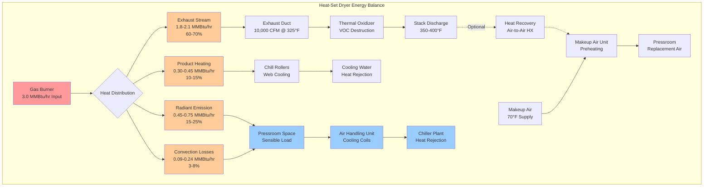

Web press dryers represent the dominant thermal load in high-speed printing facilities, introducing 1.5-4.0 MMBtu/hr per press unit into the production environment. Understanding the thermodynamics of heat generation, transfer, and removal is essential for proper HVAC system design that maintains production conditions while ensuring safety and energy efficiency.

## Dryer Heat Load Fundamentals

The total heat released from a web dryer distributes through multiple pathways governed by fundamental heat transfer principles. For a gas-fired heat-set dryer, the energy balance follows:

$$
Q_{input} = Q_{product} + Q_{exhaust} + Q_{radiation} + Q_{convection} + Q_{losses}
$$

where each term represents distinct heat transfer mechanisms requiring specific HVAC design responses.

**Heat Distribution Breakdown:**

The typical thermal energy partition for a heat-set dryer operating at steady state:

$$
\begin{aligned}
Q_{exhaust} &= 0.60 \text{ to } 0.70 \times Q_{input} \\
Q_{radiation} &= 0.15 \text{ to } 0.25 \times Q_{input} \\
Q_{product} &= 0.10 \text{ to } 0.15 \times Q_{input} \\
Q_{convection+losses} &= 0.03 \text{ to } 0.08 \times Q_{input}
\end{aligned}
$$

The radiant and convective components directly impact the pressroom cooling load, while exhaust heat requires makeup air conditioning to offset.

## Heat-Set Dryer Thermal Analysis

Heat-set dryers cure petroleum-based inks through forced convection heating at 400-500°F. The combustion process converts natural gas or propane fuel into thermal energy distributed throughout the dryer chamber.

**Burner Heat Input Calculation:**

For a web dryer, required burner capacity depends on web width, line speed, ink coverage, and substrate thermal properties:

$$
Q_{burner} = \frac{\dot{m}_{web} \cdot c_{p,web} \cdot \Delta T_{web}}{\eta_{thermal}} + Q_{solvent,evap} + Q_{losses}
$$

where:
- $\dot{m}_{web}$ = web mass flow rate (lb/hr) = $w_{web} \times v_{web} \times \rho_{web}$
- $c_{p,web}$ = specific heat of substrate (0.3-0.4 Btu/lb·°F for paper)
- $\Delta T_{web}$ = temperature rise of substrate (150-200°F typical)
- $\eta_{thermal}$ = dryer thermal efficiency (0.65-0.75)
- $Q_{solvent,evap}$ = heat of vaporization for solvents (300-500 Btu/lb solvent)
- $Q_{losses}$ = dryer casing losses (5-10% of input)

**Example Calculation:**

For a 70-inch web running at 1,500 feet per minute with 30 lb/MSF basis weight paper:

$$
\begin{aligned}
\dot{m}_{web} &= \frac{70 \text{ in} \times 1,500 \text{ ft/min} \times 30 \text{ lb/MSF}}{1,000 \text{ ft}^2/\text{MSF} \times 12 \text{ in/ft}} \times 60 \text{ min/hr} \\
&= 15,750 \text{ lb/hr}
\end{aligned}
$$

$$
\begin{aligned}
Q_{web} &= 15,750 \times 0.35 \times 180 / 0.70 \\
&= 1,417,500 \text{ Btu/hr}
\end{aligned}
$$

Adding solvent evaporation heat (assuming 2% ink coverage with 60% solvent):

$$
\begin{aligned}
Q_{solvent} &= 15,750 \times 0.02 \times 0.60 \times 400 \\
&= 75,600 \text{ Btu/hr}
\end{aligned}
$$

$$
Q_{burner,required} = 1,417,500 + 75,600 + 150,000 = 1,643,100 \text{ Btu/hr} \approx 1.65 \text{ MMBtu/hr}
$$

This aligns with typical 1.5-2.0 MMBtu/hr burner ratings for medium-width web presses.

## Dryer Exhaust Heat Load

The exhaust stream carries the majority of input energy away from the dryer, requiring substantial makeup air to replace the mass removed.

**Exhaust Energy Content:**

$$
Q_{exhaust} = \dot{m}_{exhaust} \cdot c_{p,mix} \cdot (T_{exhaust} - T_{ambient})
$$

Converting to volumetric flow:

$$
Q_{exhaust} = \frac{CFM_{exhaust} \times 60 \times \rho_{exhaust} \times c_{p,mix} \times \Delta T}{1,000}
$$

where density at exhaust temperature follows ideal gas law:

$$
\rho_{exhaust} = \frac{\rho_{standard} \times T_{standard}}{T_{exhaust}} = \frac{0.075 \times 530}{T_{exhaust}(°R)}
$$

**Example Calculation:**

For 10,000 CFM exhaust at 325°F (785°R):

$$
\begin{aligned}
\rho_{exhaust} &= \frac{0.075 \times 530}{785} = 0.0506 \text{ lb/ft}^3 \\
Q_{exhaust} &= \frac{10,000 \times 60 \times 0.0506 \times 0.24 \times (325-70)}{1,000} \\
&= 1,861,248 \text{ Btu/hr} \approx 1.86 \text{ MMBtu/hr}
\end{aligned}
$$

This represents approximately 60-65% of a 3.0 MMBtu/hr burner input, consistent with typical heat balance.

## Radiant Heat Emission

Dryer casing temperatures of 180-250°F produce significant radiant heat transfer to the surrounding pressroom. This component directly impacts cooling system sizing.

**Radiant Heat Transfer:**

From Stefan-Boltzmann law for gray body radiation between parallel surfaces:

$$
Q_{radiation} = \epsilon \cdot \sigma \cdot A_{surface} \cdot (T_{surface}^4 - T_{ambient}^4)
$$

where:
- $\epsilon$ = surface emissivity (0.85-0.95 for painted steel)
- $\sigma$ = Stefan-Boltzmann constant = $1.714 \times 10^{-9}$ Btu/hr·ft²·°R⁴
- $A_{surface}$ = dryer external surface area (ft²)
- Temperatures in absolute scale (°R = °F + 460)

For typical dryer geometry with 300 ft² external surface at 220°F average:

$$
\begin{aligned}
Q_{radiation} &= 0.90 \times 1.714 \times 10^{-9} \times 300 \times (680^4 - 530^4) \\
&= 0.90 \times 1.714 \times 10^{-9} \times 300 \times 1.342 \times 10^{11} \\
&= 62,100 \text{ Btu/hr}
\end{aligned}
$$

Combined with natural convection from the hot surfaces (approximately 40% of radiant heat), total sensible load to the space:

$$
Q_{space,dryer} = Q_{radiation} + Q_{convection} = 62,100 + 24,840 = 86,940 \text{ Btu/hr}
$$

Multiple press lines multiply this load accordingly.

## Comparison of Dryer Technologies

Different dryer technologies exhibit distinct thermal characteristics affecting HVAC design:

| Dryer Type | Operating Temp | Heat Input | Exhaust Volume | Radiant Emission | Space Heat Load |
|------------|----------------|------------|----------------|------------------|-----------------|
| Heat-set gas | 400-500°F | 1.5-4.0 MMBtu/hr | 8,000-15,000 CFM | High (200-350 kBtu/hr) | 150-300 kBtu/hr |
| Heat-set electric | 400-500°F | 440-1,170 kW | 8,000-15,000 CFM | Medium (150-250 kBtu/hr) | 120-250 kBtu/hr |
| UV mercury vapor | 100-150°F | 150-400 W/in | 1,000-3,000 CFM | Medium (80-150 kBtu/hr) | 50-120 kBtu/hr |
| UV LED | 80-110°F | 50-150 W/in | 500-2,000 CFM | Low (30-70 kBtu/hr) | 20-60 kBtu/hr |
| Infrared | 300-600°F | 50-150 kW/zone | 2,000-5,000 CFM | Very high (100-200 kBtu/hr) | 80-180 kBtu/hr |
| Electron beam | 100-120°F | 50-200 kW | 1,000-2,500 CFM | Low (40-80 kBtu/hr) | 30-70 kBtu/hr |

The table shows heat-set dryers impose the most severe HVAC demands, while UV LED technology minimizes thermal loads at the cost of specific ink chemistry requirements.

## UV Dryer Heat Considerations

UV curing systems generate substantially less heat than thermal dryers but still require cooling to prevent lamp overheating and maintain substrate temperature control.

**Mercury Vapor UV Lamps:**

Medium-pressure mercury vapor lamps convert 15-25% of input power to UV radiation, with 65-75% becoming waste heat:

$$
Q_{UV,waste} = P_{lamp} \times (1 - \eta_{UV}) = P_{lamp} \times 0.70
$$

For a 40-inch web with 300 W/inch lamp power:

$$
Q_{UV,waste} = 40 \times 300 \times 0.70 = 8,400 \text{ W} = 28,660 \text{ Btu/hr}
$$

Lamp cooling typically uses forced air at 1,000-2,000 CFM per lamp, with air temperature rise:

$$
\Delta T = \frac{Q_{waste}}{CFM \times \rho \times c_p \times 60} = \frac{28,660}{1,500 \times 0.075 \times 0.24 \times 60} = 17.7°F
$$

**LED UV Systems:**

LED UV arrays operate cooler with 40-50% electrical-to-UV conversion efficiency:

$$
Q_{LED,waste} = P_{LED} \times 0.55
$$

For equivalent curing energy with 50% efficiency:

$$
P_{LED} = \frac{40 \times 300 \times 0.20}{0.45} = 5,333 \text{ W}
$$

$$
Q_{LED,waste} = 5,333 \times 0.55 = 2,933 \text{ W} = 10,010 \text{ Btu/hr}
$$

This represents approximately 65% reduction in waste heat compared to mercury vapor systems.

## Dryer Exhaust System Design

Proper exhaust system sizing must account for both volumetric flow and thermal expansion effects.

**Exhaust Volume Calculation:**

The required exhaust flow rate depends on safety dilution requirements and heat removal capacity:

$$
CFM_{exhaust} = \max\left(\frac{Q_{removal}}{\rho \cdot c_p \cdot \Delta T \cdot 60}, \, CFM_{minimum,code}\right)
$$

NFPA 86 mandates minimum 8,000 CFM per dryer section regardless of calculated heat removal needs, establishing the lower bound for system design.

**Thermal Expansion Factor:**

Hot exhaust air occupies greater volume than cold makeup air, affecting pressure balance:

$$
\frac{V_{exhaust}}{V_{makeup}} = \frac{T_{exhaust}}{T_{makeup}}
$$

For 10,000 CFM exhaust at 325°F and makeup air at 70°F:

$$
V_{makeup,equivalent} = 10,000 \times \frac{530}{785} = 6,752 \text{ CFM}
$$

This 3,248 CFM difference (32.5%) must be accounted for in building pressurization calculations. The actual makeup air volume required at 70°F is less than the exhaust volume due to thermal expansion.

## Heat Recovery Opportunities

Despite contamination concerns, exhaust heat recovery can improve energy efficiency when economically justified.

**Air-to-Air Heat Exchanger:**

Sensible heat recovery effectiveness:

$$
\varepsilon = \frac{T_{makeup,outlet} - T_{makeup,inlet}}{T_{exhaust,inlet} - T_{makeup,inlet}}
$$

For 50% effectiveness with 325°F exhaust and 40°F makeup air:

$$
T_{makeup,outlet} = 40 + 0.50 \times (325 - 40) = 182.5°F
$$

Heat recovered:

$$
Q_{recovered} = \dot{m}_{makeup} \cdot c_p \cdot (T_{outlet} - T_{inlet})
$$

$$
Q_{recovered} = \frac{10,000 \times 60 \times 0.075 \times 0.24 \times (182.5 - 40)}{1,000} = 1,539 \text{ MBtu/hr}
$$

At 82% efficient makeup air heater, fuel savings:

$$
Q_{fuel,saved} = \frac{1,539,000}{0.82} = 1,877,000 \text{ Btu/hr}
$$

Annual savings at $0.40/therm with 6,000 operating hours:

$$
\text{Savings} = \frac{1,877,000 \times 6,000}{100,000} \times 0.40 = \$45,048 \text{ per year}
$$

Heat exchanger capital cost of $150,000-200,000 yields 3.3-4.4 year simple payback.

## Heat Removal Strategy Diagram

The following diagram illustrates heat flow pathways from web press dryers:

## Design Recommendations

Based on thermodynamic principles and practical experience, dryer heat management requires:

**1. Exhaust System Sizing:**
- Design for 1.5× calculated heat removal capacity to accommodate production variations
- Maintain negative pressure (-0.15 to -0.25 inches w.c.) at dryer chamber
- Specify high-temperature construction (18-gauge stainless steel minimum) for 400°F continuous duty
- Include thermal expansion joints every 40 feet of duct run

**2. Makeup Air Integration:**
- Account for thermal expansion factor in volumetric balance (typically 25-35% reduction)
- Provide independent makeup air zones for each press to allow selective operation
- Design makeup air delivery to avoid drafts on web path (maximum 50 FPM at press)
- Include HEPA filtration (95% efficiency) to prevent particulate contamination

**3. Space Cooling Design:**
- Calculate radiant heat loads using actual dryer surface temperatures measured during operation
- Design air distribution to capture thermal plumes rising from dryer assemblies
- Specify low-velocity displacement ventilation (30-40 FPM) to maintain temperature stratification
- Provide 20-25% cooling reserve capacity for summer peak conditions

**4. Heat Recovery Evaluation:**
- Justify heat exchangers when annual fuel savings exceed 20% of capital cost
- Specify bypass provisions for maintenance and contamination events
- Design for solvent vapor fouling with periodic cleaning access
- Monitor heat transfer performance degradation over time

**5. Controls Integration:**
- Interlock exhaust fans with burner operation per NFPA 86 requirements
- Modulate makeup air temperature to maintain space conditions ±2°F
- Trend dryer exhaust temperature as indicator of burner efficiency and maintenance needs
- Alarm on exhaust airflow deviation >15% from setpoint

The fundamental challenge in web press dryer HVAC design lies in managing massive heat quantities while maintaining precise environmental control, ensuring worker safety, and achieving acceptable energy efficiency. Success requires rigorous application of heat transfer principles, thorough understanding of process requirements, and careful integration of all system components into a cohesive design that balances competing technical and economic objectives.

Proper dryer heat load analysis establishes the foundation for makeup air sizing, space cooling capacity, and energy recovery evaluation. The engineering approach must recognize that dryer thermal output varies with production parameters, requiring flexible system design that performs reliably across the full operating range while maintaining code compliance and operational safety.
