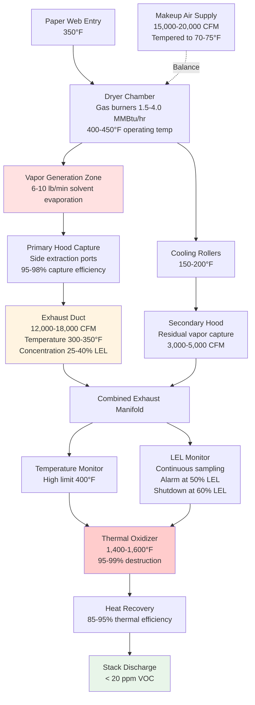

Solvent vapor control represents the most critical safety and environmental challenge in heat-set web press operations. Heat-set inks contain 50-75% petroleum-based solvents that vaporize during the drying process at 350-450°F, generating high-concentration vapor streams requiring immediate capture, dilution, and treatment. Proper control system design prevents explosive vapor accumulation while ensuring compliance with OSHA exposure limits and air quality regulations.

## Physical Basis of Solvent Evaporation

### Vapor-Liquid Equilibrium

Solvent evaporation from heat-set inks follows Raoult's Law for ideal solutions:

$$P_{solvent} = x_{solvent} \times P^{sat}_{solvent}(T)$$

Where:
- $P_{solvent}$ = Partial pressure of solvent vapor (psia)
- $x_{solvent}$ = Mole fraction of solvent in liquid ink
- $P^{sat}_{solvent}(T)$ = Saturation vapor pressure at temperature $T$

The vapor pressure increases exponentially with temperature per the Clausius-Clapeyron equation:

$$\ln\left(\frac{P_2}{P_1}\right) = \frac{\Delta H_{vap}}{R}\left(\frac{1}{T_1} - \frac{1}{T_2}\right)$$

Where:
- $\Delta H_{vap}$ = Heat of vaporization (Btu/lb-mol)
- $R$ = Universal gas constant = 1.986 Btu/(lb-mol·°R)
- $T_1, T_2$ = Absolute temperatures (°R)

**Common heat-set solvents vapor pressure data:**

| Solvent | Chemical Formula | MW | Vapor Pressure at 77°F (psia) | Vapor Pressure at 400°F (psia) | Boiling Point (°F) |
|---------|------------------|-----|-------------------------------|--------------------------------|-------------------|
| Toluene | C₇H₈ | 92 | 0.37 | 8.2 | 231 |
| Xylene | C₈H₁₀ | 106 | 0.13 | 6.4 | 281 |
| n-Heptane | C₇H₁₆ | 100 | 0.60 | 11.3 | 209 |
| Mineral spirits | C₉-C₁₂ mix | ~140 | 0.02 | 2.1 | 300-400 |

At typical dryer temperatures (350-450°F), vapor pressures approach or exceed atmospheric pressure, driving rapid complete evaporation as the ink film passes through the dryer zone.

### Evaporation Rate Calculation

Mass transfer from the ink film to the dryer airstream follows:

$$\dot{m}_{evap} = h_m \times A_{web} \times \rho_{film} \times (C_{sat} - C_{bulk})$$

Where:
- $\dot{m}_{evap}$ = Evaporation rate (lb/min)
- $h_m$ = Mass transfer coefficient (ft/min)
- $A_{web}$ = Web surface area in dryer (ft²)
- $C_{sat}$ = Saturation concentration at film surface (lb/ft³)
- $C_{bulk}$ = Bulk air concentration (lb/ft³)

The mass transfer coefficient depends on air velocity and turbulence:

$$h_m = 0.023 \times \frac{v^{0.8}}{L^{0.2}} \times Sc^{-0.33}$$

Where:
- $v$ = Air velocity over web surface (fpm), typically 400-800 fpm
- $L$ = Characteristic length (ft)
- $Sc$ = Schmidt number ≈ 2.0 for vapors in air

**Practical calculation approach:**

For production gravure or flexographic press:

$$G = W_{web} \times V_{web} \times C_{ink} \times f_{solvent} \times \eta_{evap}$$

Where:
- $G$ = Solvent evaporation rate (lb/min)
- $W_{web}$ = Web width (ft)
- $V_{web}$ = Web speed (fpm)
- $C_{ink}$ = Ink coating weight (lb/ft²), typically 0.0005-0.0012 lb/ft²
- $f_{solvent}$ = Solvent fraction of wet ink mass, typically 0.50-0.75
- $\eta_{evap}$ = Dryer evaporation efficiency, typically 0.95-0.99

**Example: Publication gravure press**

- Web width: 78 inches = 6.5 ft
- Web speed: 2,000 fpm
- Ink coverage: 0.0008 lb/ft²
- Solvent content: 65%
- Evaporation efficiency: 98%

$$G = 6.5 \times 2000 \times 0.0008 \times 0.65 \times 0.98 = 6.6 \text{ lb/min}$$

This represents approximately 400 lb/hr solvent emissions per press unit requiring capture and control.

## Lower Explosive Limit Design Criteria

### LEL Physics and Fire Triangle

Flammable vapor combustion requires three elements:
1. **Fuel** - Solvent vapor within flammable range
2. **Oxidizer** - Atmospheric oxygen (minimum 16% for propagation)
3. **Ignition source** - Energy exceeding minimum ignition energy

Vapor-air mixtures ignite only when concentration falls between LEL and UEL (Upper Explosive Limit). The flammable range represents stoichiometric combustion boundaries.

**Stoichiometric combustion for typical hydrocarbon:**

$$C_xH_y + \left(x + \frac{y}{4}\right)O_2 \rightarrow xCO_2 + \frac{y}{2}H_2O$$

For toluene (C₇H₈):

$$C_7H_8 + 9O_2 \rightarrow 7CO_2 + 4H_2O$$

Stoichiometric concentration in air (21% O₂):

$$C_{stoich} = \frac{1}{1 + 9/0.21} = 2.3\% \text{ by volume}$$

LEL occurs below stoichiometric point where insufficient fuel exists for flame propagation. UEL occurs above where insufficient oxygen exists.

**Heat-set solvent flammability data:**

| Solvent | LEL (% vol) | LEL (ppm) | UEL (% vol) | Flash Point (°F) | Auto-Ignition (°F) | Min Ignition Energy (mJ) |
|---------|-------------|-----------|-------------|------------------|-------------------|--------------------------|
| Toluene | 1.2 | 12,000 | 7.1 | 40 | 896 | 0.24 |
| Xylene | 1.0 | 10,000 | 7.0 | 63 | 867 | 0.20 |
| n-Heptane | 1.05 | 10,500 | 6.7 | 25 | 419 | 0.24 |
| Mineral spirits | 0.9 | 9,000 | 6.0 | 100-140 | 473 | 0.80 |
| MEK | 1.4 | 14,000 | 11.4 | 16 | 759 | 0.27 |

Critical observation: Lower LEL values (mineral spirits at 0.9%, heptane at 1.05%) require greater dilution ventilation for equivalent safety margin.

### LEL Mixture Calculations

For mixed solvent systems, calculate composite LEL using Le Chatelier's principle:

$$\frac{1}{LEL_{mix}} = \sum_{i=1}^{n} \frac{f_i}{LEL_i}$$

Where:
- $LEL_{mix}$ = Composite lower explosive limit
- $f_i$ = Volume fraction of component $i$ in vapor phase
- $LEL_i$ = Lower explosive limit of component $i$

**Example: Heat-set ink with mixed solvents**

Vapor composition (by volume):
- 60% toluene (LEL = 1.2%)
- 30% xylene (LEL = 1.0%)
- 10% mineral spirits (LEL = 0.9%)

$$\frac{1}{LEL_{mix}} = \frac{0.60}{1.2} + \frac{0.30}{1.0} + \frac{0.10}{0.9}$$

$$\frac{1}{LEL_{mix}} = 0.50 + 0.30 + 0.11 = 0.91$$

$$LEL_{mix} = 1.10\% = 11,000 \text{ ppm}$$

Design to the most conservative (lowest) LEL component to ensure safety across all operating conditions.

### Safety Factor Requirements

OSHA 29 CFR 1910.106(e)(2)(iii) mandates:

> "Ventilation shall be provided to prevent accumulation of flammable vapors. Concentration of flammable vapors shall not exceed 25 percent of the lower flammable limit."

This establishes minimum safety factor of 4.

NFPA 86 Section 5.7.2 for ovens and dryers reinforces:

> "Sufficient air circulation shall be provided within the oven to prevent formation of flammable concentrations exceeding 25% LEL."

**Recommended design criteria:**

$$C_{design} = \frac{LEL}{SF}$$

Where safety factor $SF$ depends on hazard assessment:

| Application | Safety Factor | Design Concentration | Rationale |
|-------------|--------------|---------------------|-----------|
| Minimum code compliance | 4 | 25% LEL | OSHA/NFPA minimum |
| Standard dryer exhaust | 6-8 | 12.5-17% LEL | Sensor accuracy, mixing variation |
| High-hazard areas | 10 | 10% LEL | Multiple ignition sources present |
| Critical safety applications | 20 | 5% LEL | Essential operations, high occupancy |

For typical heat-set dryer with toluene-based inks (LEL = 12,000 ppm), apply SF = 8:

$$C_{design} = \frac{12,000}{8} = 1,500 \text{ ppm}$$

This provides operating margin allowing concentration to double during upset conditions while remaining below 25% LEL regulatory limit.

## Primary Capture System Design

### Dryer Hood Exhaust Configuration

Heat-set dryers require dedicated exhaust hoods capturing vapors directly at the evaporation source. Hood design follows local exhaust ventilation principles with total enclosure preferred for maximum capture efficiency.

**Hood airflow calculation:**

Required exhaust volume based on vapor concentration limit:

$$Q_{exhaust} = \frac{G \times 387 \times T}{MW \times C_{target} \times 10^{-6}}$$

For toluene (MW = 92 g/mol) at 330°R (70°F outlet temperature after cooling):

$$Q_{exhaust} = \frac{6.6 \times 387 \times 530}{92 \times 30,000 \times 10^{-6}} = 12,400 \text{ CFM}$$

Where:
- $G$ = 6.6 lb/min solvent evaporation
- Target concentration = 30,000 ppm (30% LEL, allowing margin below 40% LEL design limit)
- 387 = Standard molar volume constant (ft³/lb-mol at 70°F)

**NFPA 86 minimum requirements:**

Section 5.7.1.3 specifies minimum 8,000 CFM exhaust per dryer section regardless of calculated requirement. For multi-section dryers, each section requires dedicated minimum airflow.

Actual design: 15,000 CFM to provide:
- Vapor dilution below 30% LEL
- Adequate capture velocity at hood faces (100-150 fpm)
- Sufficient thermal convection to prevent backdrafting
- Compliance with NFPA 86 minimums

### Capture Efficiency Factors

Primary hood capture efficiency depends on:

**Hood geometry:**
- Total enclosure (canopy + side curtains): 95-98% capture
- Canopy hood only: 80-90% capture
- Side exhaust slots: 85-95% capture

**Face velocity requirements:**

$$v_{face} = \frac{Q_{exhaust}}{A_{hood}}$$

Maintain minimum 100 fpm at all hood openings to prevent vapor escape.

**Thermal drafting effects:**

Hot dryer exhaust gases (300-350°F) exhibit strong buoyancy:

$$\Delta P_{thermal} = 7.64 \times h \times \left(\frac{1}{T_{cold}} - \frac{1}{T_{hot}}\right)$$

Where:
- $\Delta P_{thermal}$ = Thermal draft pressure (in w.c.)
- $h$ = Vertical height (ft)
- $T_{cold}, T_{hot}$ = Absolute temperatures (°R)

For 8-ft vertical rise from dryer to hood outlet, 350°F exhaust, 70°F ambient:

$$\Delta P_{thermal} = 7.64 \times 8 \times \left(\frac{1}{530} - \frac{1}{810}\right) = 0.026 \text{ in w.c.}$$

This natural draft assists exhaust fan, reducing required static pressure. Exhaust fan must overcome ductwork friction while accounting for thermal draft assistance.

## Dilution Ventilation Requirements

### Mass Balance for Fugitive Emissions

Fugitive emissions escaping primary capture (typically 2-5% of total) require dilution ventilation maintaining safe concentrations in occupied spaces.

$$Q_{dilution} = \frac{403 \times K \times G_{fugitive}}{C_{target}}$$

Where:
- $Q_{dilution}$ = Required dilution airflow (CFM)
- $K$ = Mixing efficiency factor, typically 3-6 for industrial spaces
- $G_{fugitive}$ = Fugitive emission rate (lb/min)
- $C_{target}$ = Target concentration (ppm), typically 1,000-2,000 ppm
- 403 = Combined conversion constant for standard conditions

**Example calculation:**

Press area with 5% fugitive emissions from 6.6 lb/min total:
- $G_{fugitive}$ = 0.33 lb/min
- $C_{target}$ = 1,500 ppm (12.5% LEL)
- $K$ = 4 for large press room with distributed supplies

$$Q_{dilution} = \frac{403 \times 4 \times 0.33}{1,500} = 354 \text{ CFM}$$

For 50,000 ft² press floor with 24-ft ceilings (1,200,000 ft³ volume):

$$ACH = \frac{354 \times 60}{1,200,000} = 0.018 \text{ ACH from fugitives alone}$$

Total building ventilation typically provides 4-8 ACH for thermal comfort and pressurization, far exceeding dilution requirements for fugitive emissions when primary capture systems function properly.

### Vapor Density Stratification

All heat-set solvents produce vapors heavier than air:

$$\rho_{vapor} = \rho_{air} \times \frac{MW_{solvent}}{MW_{air}} = 0.075 \times \frac{MW_{solvent}}{29}$$

**Vapor density comparison:**

| Solvent | Molecular Weight | Vapor Density (lb/ft³) | Relative Density | Settling Tendency |
|---------|------------------|----------------------|------------------|-------------------|
| Air | 29 | 0.075 | 1.00 | Reference |
| Acetone | 58 | 0.150 | 2.00 | Moderate |
| MEK | 72 | 0.186 | 2.48 | High |
| Toluene | 92 | 0.238 | 3.17 | High |
| Xylene | 106 | 0.274 | 3.66 | Very High |

Heavy vapors accumulate in low-lying areas without adequate air mixing. Design mitigation:

1. **Low-level exhaust points** - 12-18 inches above floor in pits, sumps, dead-end areas
2. **High-level supply air** - Overhead distribution creating downward displacement flow
3. **Floor-level air velocity** - Maintain 30-50 fpm sweep velocity toward exhaust points
4. **Multi-height LEL sensors** - Monitor both breathing zone (4-6 ft) and floor level (12-18 in)

## VOC Control Technologies

### Thermal Oxidation Systems

Thermal oxidizers destroy VOCs through high-temperature combustion:

$$\text{Hydrocarbon} + O_2 \xrightarrow{1400-1600°F} CO_2 + H_2O + \text{Heat}$$

**Regenerative Thermal Oxidizer (RTO) operation:**

Two or more ceramic media beds alternately absorb and release thermal energy, achieving 85-95% heat recovery while maintaining 95-99% VOC destruction efficiency.

**Performance parameters:**

| Parameter | Typical Value | Design Basis |
|-----------|--------------|--------------|
| Operating temperature | 1,450-1,550°F | Complete VOC oxidation |
| Residence time | 0.5-0.75 seconds | Reaction kinetics |
| Destruction efficiency | 95-99% | Regulatory requirement |
| Thermal efficiency | 85-95% | Heat recovery effectiveness |
| Pressure drop | 8-15 in w.c. | Ceramic bed resistance |
| Auxiliary fuel | 0-4 MMBtu/hr | Below autothermal point |

**Autothermal operation:**

Sufficient VOC concentration provides heat of combustion exceeding system heat losses, eliminating auxiliary fuel requirement:

$$Q_{combustion} = G_{VOC} \times HHV_{VOC}$$

Where:
- $Q_{combustion}$ = Heat release (Btu/hr)
- $G_{VOC}$ = VOC mass flow (lb/hr)
- $HHV_{VOC}$ = Higher heating value, typically 18,000-20,000 Btu/lb for hydrocarbons

For autothermal operation at 10% thermal efficiency losses:

$$G_{VOC} \times 18,000 \times 0.90 \geq Q_{heat\ loss}$$

Typical web press dryer exhaust at 30% LEL (30,000 ppm toluene) in 15,000 CFM:

VOC mass flow:

$$\dot{m}_{VOC} = \frac{15,000 \times 0.075 \times 30,000 \times 10^{-6} \times 92}{387} = 0.26 \text{ lb/min} = 15.6 \text{ lb/hr}$$

Heat release: $15.6 \times 18,000 = 281,000$ Btu/hr

This typically falls below autothermal point (varies by oxidizer design), requiring auxiliary natural gas firing of 1-3 MMBtu/hr to maintain temperature.

### Catalytic Oxidation

Catalytic oxidizers use precious metal catalysts (platinum, palladium) enabling VOC destruction at 600-800°F:

**Advantages:**
- Lower operating temperature reduces fuel consumption
- Suitable for low-concentration streams (5-15% LEL)
- Lower NOₓ formation at reduced temperature

**Disadvantages:**
- Catalyst poisoning by sulfur, halogens, silicones, particulates
- Regular catalyst replacement (2-5 year life)
- Higher capital cost
- Less robust to concentration spikes

**Comparison table of VOC control technologies:**

| Technology | Operating Temp (°F) | Destruction Efficiency | Capital Cost | Operating Cost | Best Application |
|------------|-------------------|----------------------|--------------|----------------|------------------|
| Regenerative Thermal Oxidizer (RTO) | 1,450-1,550 | 95-99% | High | Low-Medium | High VOC load, 24/7 operation |
| Thermal Recuperative Oxidizer | 1,400-1,600 | 95-98% | Medium | Medium | Moderate VOC load, steady flow |
| Catalytic Oxidizer | 600-800 | 90-95% | Medium-High | Low | Low VOC, no catalyst poisons |
| Regenerative Catalytic Oxidizer (RCO) | 700-900 | 95-99% | Very High | Very Low | High efficiency required, clean stream |
| Carbon Adsorption (recovery) | 80-120 | 85-95% capture | Medium | Medium | High-value solvents, batch operation |
| Condensation Recovery | 35-50 | 70-85% capture | High | Medium-High | Very high concentration (>60% LEL) |
| Biofiltration | 70-100 | 70-90% | Low | Very Low | Low concentration, biodegradable VOCs |

For heat-set web press applications, RTOs dominate due to:
- High VOC concentrations (25-40% LEL in dryer exhaust)
- Continuous 24/7 operation in most facilities
- Excellent thermal efficiency recovering heat for makeup air
- Proven reliability and minimal maintenance

### Heat Recovery Integration

High-temperature oxidizer exhaust (1,400-1,500°F after ceramic bed) enables substantial heat recovery for makeup air preheating:

**Air-to-air heat exchanger:**

$$Q_{recovered} = \epsilon \times Q_{exhaust} \times \rho \times c_p \times (T_{hot} - T_{cold})$$

Where:
- $\epsilon$ = Heat exchanger effectiveness, typically 0.50-0.70
- $Q_{exhaust}$ = Oxidizer exhaust flow (CFM)
- $\rho c_p$ = Air heat capacity = 0.018 Btu/(ft³·°F)

For 15,000 CFM oxidizer exhaust at 400°F after heat recovery, heating outdoor air from 10°F to 160°F:

$$Q_{recovered} = 0.60 \times 15,000 \times 0.018 \times (400-70) = 534,000 \text{ Btu/hr}$$

This offsets approximately 10% of typical facility heating load.

### Condensation Recovery Systems

High-concentration dryer exhaust streams (>40% LEL = >120,000 ppm) justify solvent recovery via refrigerated condensation:

**Condenser design equation:**

$$\dot{m}_{condensed} = Q \times \rho \times \Delta C \times \eta_{condenser}$$

Where:
- $\Delta C$ = Concentration reduction through condenser
- $\eta_{condenser}$ = Condensation efficiency, typically 0.70-0.85

Cooling exhaust from 300°F to 40°F condenses most solvent vapor (vapor pressure toluene drops from 8.2 psia to 0.07 psia).

**Economic analysis:**

Recovered toluene value: $4-6/gallon × 0.72 lb/gal = $3-4/lb

Press generating 6.6 lb/min = 400 lb/hr = 3,200,000 lb/yr at 80% runtime

Recovery system capturing 75% = 2,400,000 lb/yr

Annual value: 2,400,000 × $3.50/lb = $8,400,000

Condensation system capital cost: $800,000-1,200,000

Simple payback: 1.5-2.0 months

This exceptional payback applies only to high-concentration, high-volume operations. Most printing facilities send exhaust directly to thermal oxidation.

## OSHA Exposure Limits and Monitoring

### Permissible Exposure Limits (PEL)

OSHA 29 CFR 1910.1000 establishes time-weighted average limits:

| Solvent | 8-Hour TWA PEL (ppm) | Short-Term Exposure Limit (ppm) | Ceiling Limit (ppm) | Health Effects |
|---------|---------------------|--------------------------------|-------------------|----------------|
| Toluene | 200 | 300 (15-min STEL) | 500 | CNS depression, headache |
| Xylene | 100 | 150 (15-min STEL) | - | Respiratory irritation |
| n-Heptane | 500 | - | - | Narcosis, dermatitis |
| MEK | 200 | - | - | Eye/nose irritation |
| Mineral spirits | 100 (as stoddard solvent) | - | - | CNS effects |

**Exposure calculation:**

$$TWA = \frac{\sum (C_i \times t_i)}{8\ \text{hours}}$$

Where:
- $C_i$ = Concentration during period $i$ (ppm)
- $t_i$ = Duration of exposure at concentration $C_i$ (hours)

**Example exposure assessment:**

Press operator exposure profile:
- 6 hours at 50 ppm toluene (normal operation)
- 1 hour at 150 ppm (dryer door open for maintenance)
- 1 hour at 25 ppm (break/lunch away from press)

$$TWA = \frac{(50 \times 6) + (150 \times 1) + (25 \times 1)}{8} = \frac{475}{8} = 59.4 \text{ ppm}$$

This remains below 200 ppm PEL, but facility should implement engineering controls reducing peak exposures during maintenance activities.

### LEL Monitoring Systems

NFPA 86 Section 8.5.2 requires continuous vapor concentration monitoring with alarm at 25% LEL and automatic burner shutdown.

**Monitoring technology:**

1. **Catalytic bead sensors** - Measure heat of combustion on catalyzed element
2. **Infrared sensors** - Detect hydrocarbon absorption bands
3. **Photoionization detectors (PID)** - Measure ionization current

**Sensor placement strategy:**

- Primary sensor in dryer exhaust duct 3-5 duct diameters downstream of hood
- Secondary sensor in pressroom breathing zone (4-6 ft elevation)
- Low-level sensor near floor (12-18 in) in areas with heavy vapor potential
- Backup sensor at thermal oxidizer inlet

**Alarm and interlock logic:**

| Condition | LEL Reading | Response |
|-----------|-------------|----------|
| Normal operation | 0-40% LEL | No action, log data |
| Elevated concentration | 40-50% LEL | Warning alarm, notify operator |
| High concentration | 50-60% LEL | High alarm, increase exhaust airflow |
| Critical concentration | >60% LEL | Emergency shutdown of dryer burners, maintain exhaust |

**Sensor calibration:**

Quarterly calibration using certified span gas (typically 50% LEL certified mixture). Document calibration with before/after readings demonstrating accuracy within ±5% of certified value.

## Fire Safety Code Requirements

### NFPA 86: Ovens and Furnaces

**Key requirements for Class A ovens** (processing flammable materials):

**Section 5.7.1 - Ventilation:**
- Minimum 8,000 CFM per dryer section regardless of size
- Exhaust maintaining concentration below 25% LEL
- Interlocked burner control preventing operation on exhaust failure

**Section 6.4.3 - Purge Requirements:**

$$t_{purge} = \frac{4 \times V_{dryer}}{Q_{exhaust}} \times 60$$

Where:
- $t_{purge}$ = Minimum purge time (seconds)
- $V_{dryer}$ = Dryer internal volume (ft³)
- $Q_{exhaust}$ = Exhaust airflow (CFM)
- Factor 4 = Four complete air changes

For 500 ft³ dryer volume, 15,000 CFM exhaust:

$$t_{purge} = \frac{4 \times 500}{15,000} \times 60 = 8 \text{ seconds}$$

Actual purge cycles typically run 60-120 seconds providing safety margin.

**Section 8.1 - Explosion Relief:**

Dryer chambers require explosion relief venting per NFPA 68:

$$A_{vent} = C \times A_s \times \sqrt[3]{V}$$

Where:
- $A_{vent}$ = Required vent area (ft²)
- $C$ = Vent ratio constant, typically 0.1-0.15 for hydrocarbon vapors
- $A_s$ = Constant based on maximum pressure and vent static pressure
- $V$ = Enclosure volume (ft³)

Explosion relief panels (fusible plugs or spring-loaded doors) activate at 0.5-1.0 psig, venting combustion products before structural damage occurs.

### NFPA 91: Exhaust Systems

**Section 4.3.1 - Duct Construction:**

Ducts conveying flammable vapor concentrations >25% LEL require:
- Carbon steel construction minimum 16-gauge
- Welded or flanged joints (no screwed connections)
- Explosion relief panels at 15-20 ft intervals
- Grounding and bonding preventing static accumulation

**Section 5.2 - Duct Velocity:**

Maintain minimum 2,000 fpm to prevent vapor stratification and settling in horizontal runs. Maximum 4,000 fpm to limit pressure drop and erosion.

**Section 6.1 - Fan Construction:**

Exhaust fans handling flammable vapors require:
- Spark-resistant construction (non-ferrous or coated impeller)
- Class I, Division 2 electrical classification
- External motor mount with sealed shaft
- Explosion-proof motor if located in classified area

### Electrical Classification

Per NFPA 70 (National Electrical Code) Article 500, areas within 5 feet of dryer openings require Class I, Division 2 classification when handling vapors with flash points below 100°F.

**Classification requirements:**

- All electrical equipment explosion-proof or intrinsically safe
- Conduit runs sealed preventing vapor travel
- Junction boxes with sealing fittings
- Lighting fixtures enclosed and gasketed
- No arcing devices (switches, contactors) unless in approved enclosures

---

Effective solvent vapor control in heat-set web press operations requires integrated capture, dilution, and treatment systems maintaining concentrations below 25% LEL per OSHA 1910.106 while destroying 95-99% of VOCs through thermal oxidation. Proper design combines physics-based airflow calculations, redundant LEL monitoring, comprehensive fire protection, and heat recovery optimization to ensure worker safety, regulatory compliance, and operational efficiency across all operating conditions.
