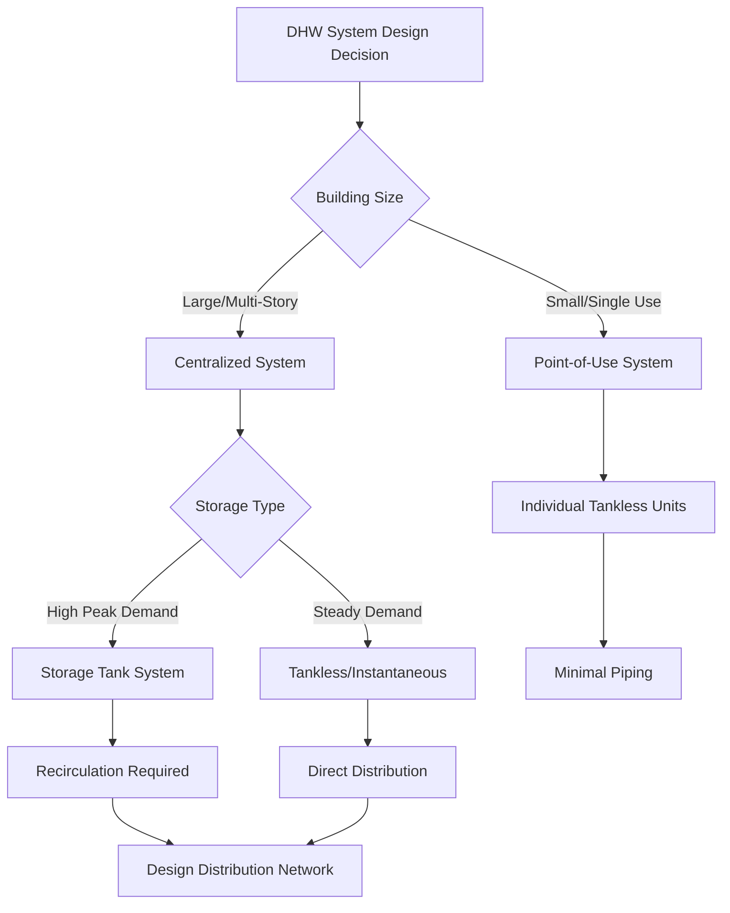

Domestic hot water (DHW) system design requires careful analysis of thermal energy transfer, fluid dynamics, and usage patterns to deliver heated water efficiently while minimizing energy waste and maintaining safe temperatures. The design process integrates heat generation capacity, thermal storage considerations, distribution network hydraulics, and control strategies to meet peak demands with acceptable recovery times.

## System Configuration Approaches

### Centralized Systems

Centralized DHW systems employ one or more large-capacity water heaters serving an entire building or facility through an extensive piping distribution network. The primary advantage lies in economies of scale—larger equipment typically achieves higher thermal efficiency and lower installed cost per unit capacity compared to multiple smaller units.

The heat transfer rate required from a centralized system is:

$$Q_{total} = \sum_{i=1}^{n} \dot{m}_i c_p (T_{hot} - T_{cold}) + Q_{losses}$$

where $\dot{m}_i$ represents mass flow rate to each fixture, $c_p = 4.186$ kJ/kg·K is water's specific heat, and $Q_{losses}$ accounts for standby and distribution losses. For properly insulated tanks, standby losses range from 1-3% of tank capacity per hour.

The critical design challenge involves distribution system heat loss. For a pipe of length $L$, diameter $D$, and insulation with thermal conductivity $k_{ins}$:

$$Q_{pipe} = \frac{2\pi k_{ins} L (T_{water} - T_{ambient})}{\ln(r_{outer}/r_{inner})}$$

Distribution losses can consume 10-30% of total DHW energy in large buildings, necessitating recirculation systems to maintain temperature at fixtures while increasing energy consumption.

### Point-of-Use Systems

Point-of-use (POU) water heaters install at or near individual fixtures, eliminating distribution losses but requiring multiple pieces of equipment. Tankless electric units dominate POU applications due to compact size and electrical availability at most fixture locations.

The instantaneous power requirement for a POU heater is:

$$P_{electric} = \frac{\dot{V} \rho c_p \Delta T}{3600 \eta}$$

For a typical handwashing sink requiring 0.5 gpm (1.89 L/min) with a 40°C temperature rise and 99% electric resistance efficiency:

$$P = \frac{(1.89/60)(1000)(4.186)(40)}{0.99} = 5.3 \text{ kW}$$

This substantial power draw (22 amps at 240V) limits POU applications to low-flow fixtures. High-demand fixtures like showers require 10-27 kW units, often exceeding available electrical service capacity.

## Load Calculation Methodology

ASHRAE Handbook—HVAC Applications provides fixture unit methods and probability-based calculations for DHW load estimation. The Hunter curve approach assigns fixture units based on demand and applies diversity factors recognizing that all fixtures never operate simultaneously.

The probable simultaneous demand is:

$$\dot{V}_{probable} = \dot{V}_{peak} \sqrt{\frac{n_{fixtures}}{100}}$$

This square-root relationship reflects statistical probability that coincident usage decreases as fixture count increases. For 100 fixtures each with 2.5 gpm peak flow:

$$\dot{V}_{probable} = 2.5 \times 100 \times \sqrt{\frac{100}{100}} = 250 \text{ gpm}$$

However, for 400 fixtures:

$$\dot{V}_{probable} = 2.5 \times 400 \times \sqrt{\frac{400}{100}} = 2000 \text{ gpm}$$

The diversity factor (ratio of probable to peak) improves from 1.0 to 0.5, significantly reducing equipment size requirements.

## Storage vs. Instantaneous Heating

### Storage Water Heaters

Storage systems maintain a reservoir of heated water, providing surge capacity exceeding heater input rate. The first-hour rating (FHR) quantifies delivery capacity:

$$FHR = V_{tank} \times 0.7 + \frac{Q_{input} \times 1\text{ hr}}{\rho c_p \Delta T}$$

The 0.7 factor represents usable fraction before mixing with cold water reduces temperature below acceptable levels. For a 50-gallon gas heater with 40,000 BTU/hr input and 70°F rise:

$$FHR = 50 \times 0.7 + \frac{40000}{8.33 \times 70} = 35 + 68.6 = 103.6 \text{ gallons}$$

Recovery time after depletion is:

$$t_{recovery} = \frac{V_{tank} \rho c_p \Delta T}{Q_{input} \eta}$$

### Instantaneous (Tankless) Heaters

Tankless heaters heat water on-demand through high-intensity heat exchangers without thermal storage. Maximum flow rate depends solely on heating capacity:

$$\dot{V}_{max} = \frac{Q_{input} \eta}{\rho c_p \Delta T}$$

A 199,000 BTU/hr condensing gas tankless heater (95% efficiency) providing 70°F rise delivers:

$$\dot{V}_{max} = \frac{199000 \times 0.95}{8.33 \times 60 \times 70} = 5.4 \text{ gpm}$$

This continuous capacity suits applications with steady demand but struggles with highly variable usage patterns where storage would buffer peaks.

## System Comparison Matrix

| Parameter | Centralized Storage | Centralized Tankless | Point-of-Use |
|-----------|-------------------|---------------------|--------------|
| **Distribution Loss** | 10-30% of total energy | 10-30% of total energy | <1% (minimal piping) |
| **Space Requirements** | Large mechanical room | Moderate (compact units) | Minimal per location |
| **Peak Capacity** | Excellent (storage buffer) | Limited by input rate | Limited per fixture |
| **Energy Efficiency** | 80-98% (gas/HP) | 95-99% (condensing) | 99% (electric resistance) |
| **Maintenance** | Periodic tank flushing | Descaling heat exchanger | Multiple units to service |
| **Capital Cost** | Medium | Medium-High | Low per unit, high total |
| **Operating Cost** | Medium | Low-Medium | High (electric rates) |
| **Legionella Risk** | Higher (stagnant water) | Lower (no storage) | Moderate (small volumes) |

## Distribution System Layout

Distribution network design follows three primary configurations:

**Trunk-and-Branch**: A main hot water trunk runs building length with branches to fixture groups. Simplest layout but requires recirculation for acceptable delivery times in large buildings.

**Reverse-Return**: Supply and return piping designed such that total pipe length to any fixture group equals others, naturally balancing flow without extensive valve throttling. The total pressure drop through any circuit path:

$$\Delta P_{total} = \Delta P_{supply} + \Delta P_{return} = \text{constant}$$

**Home-Run (Manifold)**: Individual pipes run from central manifold to each fixture, eliminating pressure interactions. Requires substantial piping but enables PEX installation methods and precise flow control.

Pipe sizing balances material cost against pumping energy. The Darcy-Weisbach equation governs pressure drop:

$$\Delta P = f \frac{L}{D} \frac{\rho v^2}{2}$$

where friction factor $f$ depends on Reynolds number and pipe roughness. Velocity should remain below 4-6 ft/s to minimize erosion and noise while staying above 2 ft/s to prevent stratification.

## Code Requirements

International Plumbing Code (IPC) Section 607 mandates maximum 140°F delivery temperature to fixtures without approved temperature-limiting devices, requiring thermostatic mixing valves for systems storing water at higher temperatures for Legionella control. ASHRAE Standard 188 establishes minimum DHW temperature of 140°F in storage and return, necessitating point-of-use tempering.

Uniform Plumbing Code (UPC) Table 610.3 specifies minimum fixture supply pressures (8-15 psi depending on fixture type), informing pump sizing for recirculation systems. Thermal expansion tanks are required per IPC Section 607.3 when backflow preventers or check valves prevent expansion relief back to water main.

ASHRAE 90.1-2019 Section 7.4.4 mandates automatic time or temperature-based controls for recirculation pumps, prohibiting continuous operation. Heat traps on storage tank connections reduce standby losses by preventing thermosiphon circulation when system is idle.

## Design Integration Considerations

Successful DHW system design coordinates with building occupancy patterns, available fuel sources, spatial constraints, and maintenance capabilities. High-rise buildings often employ intermediate mechanical floors with distributed storage to reduce pressure requirements and distribution losses. Healthcare facilities require dual-temperature systems (140°F for Legionella control, 105-110°F for patient safety). Facilities with on-site thermal cogeneration should prioritize storage systems to capture waste heat recovery opportunities.

The optimal configuration balances first-cost constraints, energy efficiency targets, maintenance resources, and user experience expectations while adhering to health and safety requirements.
