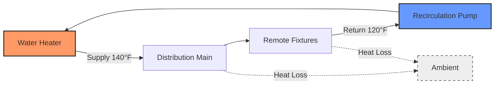

Centralized domestic hot water (DHW) systems consolidate heating equipment in a single mechanical room, distributing hot water throughout a building via piping networks. This architecture offers economies of scale for large facilities but requires careful analysis of storage capacity, heat loss, and recirculation strategies to ensure acceptable delivery temperatures and minimize energy waste.

## System Configuration

Centralized systems locate water heating equipment—boilers, storage tanks, heat exchangers, and pumps—in a dedicated mechanical space. Hot water flows through insulated distribution piping to remote fixtures, with return lines completing a recirculation loop to maintain temperature and reduce wait times.

**Advantages:**

- Centralized maintenance and monitoring
- Equipment redundancy through parallel units
- Higher efficiency prime movers (condensing boilers)
- Easier integration with renewable energy sources
- Professional-grade water treatment systems

**Disadvantages:**

- High distribution heat losses (10-30% typical)
- Extended piping runs increase first cost
- Recirculation pump energy consumption
- Delivery delays to remote fixtures without recirculation
- Single-point failure risk without redundancy

## Boiler Plant Integration

Centralized DHW systems commonly integrate with space heating boiler plants through indirect water heaters or dedicated DHW boilers. The physics of heat transfer dictates the effectiveness of each approach.

### Indirect Water Heaters

Indirect water heaters use a heat exchanger submerged in a storage tank, transferring energy from boiler water to potable water. Heat transfer rate follows:

$$Q = UA \cdot LMTD = UA \cdot \frac{\Delta T_1 - \Delta T_2}{\ln(\Delta T_1 / \Delta T_2)}$$

where $U$ is overall heat transfer coefficient (100-200 Btu/hr·ft²·°F for coil-in-tank designs), $A$ is coil surface area, and LMTD is log mean temperature difference between boiler water and stored water.

**Design Considerations:**

- Boiler supply temperature must exceed DHW setpoint by 20-40°F for adequate heat transfer
- Tankless coils in fire-tube boilers: 500-2000 ft² coil area, immediate response
- External storage tanks with coils: 50-500 gallon capacity, improved recovery
- ASHRAE 90.1 requires minimum 0.95 thermal efficiency for storage units

### Dedicated DHW Boilers

Separate boilers for DHW allow optimization independent of space heating requirements. Condensing boilers achieve 95-98% thermal efficiency when return water temperature drops below 130°F, recovering latent heat from flue gases.

The temperature drop across the DHW heat exchanger determines condensing potential:

$$\eta_{cond} = \eta_{sensible} + \frac{\dot{m}_{fg} \cdot h_{fg}}{\dot{m}_{fuel} \cdot LHV}$$

where $\dot{m}_{fg}$ is flue gas mass flow, $h_{fg}$ is water vapor enthalpy of condensation (≈1000 Btu/lb at atmospheric pressure), and LHV is fuel lower heating value.

## Storage Tank Sizing Methodology

Storage capacity balances peak demand against heater recovery rate. Undersized tanks cause temperature decay during draw events; oversized tanks waste energy through standby losses.

### Peak Demand Analysis

ASHRAE Handbook—HVAC Applications Chapter 51 provides fixture unit methods and probability-based calculations. For known demand profiles, the storage tank must supply the deficit between instantaneous demand and heater input:

$$V_{storage} = \frac{Q_{peak} \cdot t_{peak} - Q_{input} \cdot t_{peak}}{\rho \cdot c_p \cdot \Delta T}$$

where:
- $Q_{peak}$ = peak demand rate (Btu/hr)
- $Q_{input}$ = heater input rate (Btu/hr)
- $t_{peak}$ = peak duration (hr)
- $\rho$ = water density (8.33 lb/gal)
- $c_p$ = specific heat (1.0 Btu/lb·°F)
- $\Delta T$ = usable temperature difference (storage temp - minimum delivery temp)

### Recovery Rate Sizing

Recovery rate defines the time required to reheat depleted storage:

$$t_{recovery} = \frac{V_{storage} \cdot \rho \cdot c_p \cdot \Delta T}{Q_{input} \cdot \eta}$$

ASHRAE 90.1 mandates first-hour rating (FHR) labeling, combining storage capacity and recovery:

$$FHR = V_{storage} \cdot 0.7 + \frac{Q_{input} \cdot \eta}{c_p \cdot \Delta T}$$

The 0.7 factor accounts for stratification—only 70% of tank volume at full temperature during draw.

## Distribution Piping Design

Distribution piping must deliver adequate flow while minimizing heat loss and pressure drop. Pipe sizing follows the continuity equation and Darcy-Weisbach friction relationship.

### Pipe Sizing

Velocity limits prevent erosion and noise while maintaining pressure:

$$v = \frac{4\dot{V}}{\pi D^2}$$

**Design velocities:**
- Mains: 4-8 ft/s (residential), 8-12 ft/s (commercial)
- Branches: 2-4 ft/s
- Recirculation: 2-4 ft/s

Pressure drop calculation:

$$\Delta P = f \cdot \frac{L}{D} \cdot \frac{\rho v^2}{2} + K \cdot \frac{\rho v^2}{2}$$

where $f$ is Darcy friction factor (0.015-0.025 for copper), $L$ is pipe length, $D$ is diameter, and $K$ represents fitting losses.

### Heat Loss Mitigation

Uninsulated copper pipe loses heat through convection and radiation:

$$Q_{loss} = \frac{2\pi L (T_{water} - T_{amb})}{\frac{1}{h_i r_i} + \frac{\ln(r_o/r_i)}{k_{pipe}} + \frac{\ln(r_{ins}/r_o)}{k_{ins}} + \frac{1}{h_o r_{ins}}}$$

For 1-inch copper pipe at 140°F in 70°F ambient:
- Bare pipe: 40-60 Btu/hr·ft
- 1-inch fiberglass insulation: 8-12 Btu/hr·ft
- 2-inch fiberglass insulation: 4-6 Btu/hr·ft

ASHRAE 90.1 requires minimum insulation thickness based on pipe size and operating temperature. For DHW piping ≤1.5 inches at 120-200°F: 1-inch minimum thickness.

## Recirculation System Requirements

Recirculation maintains hot water temperature throughout distribution piping, eliminating wait times but consuming pump energy and increasing heat loss.

### Temperature Maintenance

Acceptable delivery temperature dictates maximum pipe length without recirculation. For uninsulated pipe, temperature decay follows:

$$T(x) = T_{amb} + (T_0 - T_{amb}) \cdot e^{-\frac{UA}{\dot{m} c_p}x}$$

where $x$ is distance from heater. Recirculation loops prevent this decay but introduce energy penalties.

### Pump Sizing

Recirculation pump flow rate must overcome heat loss:

$$\dot{m}_{recirc} = \frac{Q_{loss,total}}{c_p \cdot \Delta T_{loop}}$$

For typical 20°F temperature drop in recirculation loop, a 100-ft system with 10 Btu/hr·ft heat loss requires:

$$\dot{m}_{recirc} = \frac{100 \text{ ft} \times 10 \text{ Btu/hr·ft}}{1.0 \text{ Btu/lb·°F} \times 20°F} = 50 \text{ lb/hr} \approx 0.1 \text{ gpm}$$

### Control Strategies

| Strategy | Energy Use | Comfort | Complexity |
|----------|------------|---------|------------|
| Continuous | High | Excellent | Low |
| Time clock | Medium | Good | Low |
| Aquastat | Medium | Good | Medium |
| Temperature + timer | Low | Good | Medium |
| Demand-based | Lowest | Fair | High |

ASHRAE 90.1-2019 requires recirculation pumps ≤2 HP to use ECM motors or VFDs, and temperature-based or time-based controls to reduce runtime during low-demand periods.

## Design Comparison

| Parameter | Centralized | Distributed | Point-of-Use |
|-----------|-------------|-------------|--------------|
| Equipment efficiency | 90-98% | 80-95% | 75-90% |
| Distribution loss | 10-30% | 5-15% | 0-2% |
| First cost | High | Medium | Low |
| Maintenance cost | Low | Medium | High |
| Temperature control | ±5°F | ±3°F | ±2°F |
| Scalability | Excellent | Good | Poor |

## System Capacity Example

For a 200-unit apartment building:
- Peak demand: 6 gpm per unit × 200 × 0.3 diversity = 360 gpm
- Temperature rise: 140°F - 50°F = 90°F
- Peak load: $360 \text{ gpm} \times 8.33 \text{ lb/gal} \times 1.0 \text{ Btu/lb·°F} \times 90°F \times 60 \text{ min/hr} = 16.2 \text{ MMBtu/hr}$

With 2 MMBtu/hr boilers (8 total) and 4000-gallon storage:
- Recovery time: $\frac{4000 \text{ gal} \times 8.33 \text{ lb/gal} \times 90°F}{16 \text{ MMBtu/hr} \times 0.95} / 1,000,000 = 0.20 \text{ hr} = 12 \text{ min}$

This configuration provides redundancy (N+1) and rapid recovery suitable for multi-family residential applications per ASHRAE design guidance.

## References

- ASHRAE Handbook—HVAC Applications, Chapter 51: Service Water Heating
- ASHRAE Standard 90.1-2019: Energy Standard for Buildings
- ASPE Domestic Water Heating Design Manual
