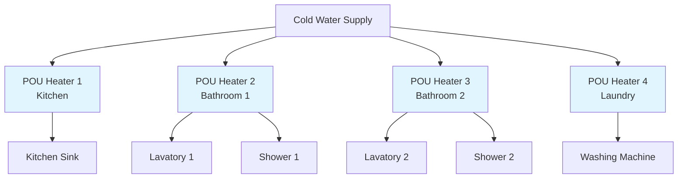
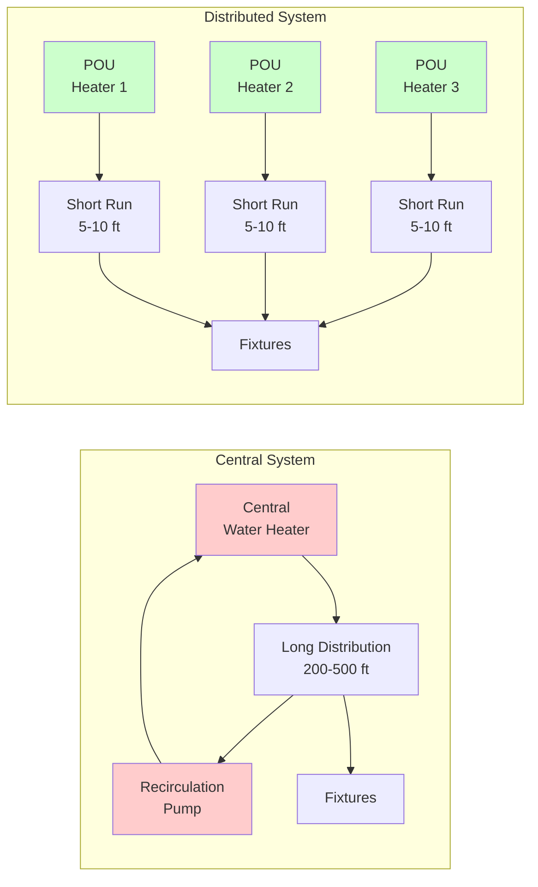

## System Architecture

Distributed domestic hot water systems employ multiple point-of-use (POU) heaters located near fixtures rather than a single central water heating plant. This configuration minimizes distribution piping length, eliminates recirculation requirements, and reduces thermal losses in the distribution network.

### Primary Components

**Point-of-Use Water Heaters**
- Electric tankless heaters (3-36 kW)
- Small storage tank heaters (2-20 gallons)
- Gas-fired instantaneous heaters (15,000-199,000 BTU/hr)
- Heat pump units for larger POU applications

**Distribution Configuration**
- Cold water supply to each heater location
- Short hot water piping runs (typically < 10 feet)
- Individual temperature controls per zone
- Minimal thermal mass in piping

## Sizing Methodology

### Individual Heater Capacity

For tankless POU heaters, required heating capacity depends on flow rate and temperature rise:

$$Q = \dot{m} c_p \Delta T = \frac{\dot{V} \rho c_p (T_{out} - T_{in})}{3412}$$

Where:
- $Q$ = heating capacity (kW)
- $\dot{V}$ = volumetric flow rate (GPM)
- $\rho$ = water density (8.33 lb/gal at 60°F)
- $c_p$ = specific heat of water (1.0 BTU/lb·°F)
- $T_{out}$ = desired outlet temperature (°F)
- $T_{in}$ = inlet water temperature (°F)
- 3412 = conversion factor (BTU/hr to kW)

**Simplified form for electric heaters:**

$$Q_{kW} = \frac{\dot{V} \times (T_{out} - T_{in})}{410}$$

### Storage Tank Sizing

For small storage-type POU heaters:

$$V_{storage} = \frac{Q_{peak} \times t_{draw}}{c_p \rho (T_{tank} - T_{mixed})} - \frac{Q_{input} \times t_{draw}}{c_p \rho (T_{tank} - T_{in})}$$

Where:
- $V_{storage}$ = required storage volume (gallons)
- $Q_{peak}$ = peak draw rate (GPM)
- $t_{draw}$ = draw duration (minutes)
- $T_{tank}$ = tank storage temperature (°F)
- $T_{mixed}$ = mixed delivery temperature (°F)
- $Q_{input}$ = heater input capacity (BTU/hr or kW)

## Heat Loss Analysis

### Distribution Piping Losses

Total heat loss from distribution piping:

$$q_{loss} = U A (T_{water} - T_{ambient}) \times L$$

Where:
- $q_{loss}$ = heat loss rate (BTU/hr)
- $U$ = overall heat transfer coefficient (BTU/hr·ft²·°F)
- $A$ = pipe surface area per unit length (ft²/ft)
- $L$ = total piping length (ft)
- $T_{water}$ = water temperature (°F)
- $T_{ambient}$ = surrounding air temperature (°F)

**Distributed systems achieve 60-85% reduction in piping heat loss compared to central systems due to:**
- Reduced total piping length (typically 20-40 ft vs 200-500 ft)
- Elimination of recirculation loops
- Lower thermal mass requiring heating

### Standby Losses

For storage-type POU heaters, standby loss per ASHRAE Standard 118.2:

$$q_{standby} = UA_{tank}(T_{tank} - T_{ambient})$$

Energy factor accounting for standby losses:

$$EF = \frac{V \times 8.33 \times c_p \times \Delta T}{Q_{input} \times t_{test}}$$

## System Comparison

| Parameter | Distributed System | Central System |
|-----------|-------------------|----------------|
| Total piping length | 20-50 ft | 200-600 ft |
| Recirculation required | No | Yes (for large systems) |
| Wait time for hot water | < 5 seconds | 15-120 seconds |
| Distribution heat loss | 100-500 BTU/hr | 2,000-15,000 BTU/hr |
| Equipment cost | Higher (multiple units) | Lower (single unit) |
| Installation labor | Lower | Higher |
| Maintenance complexity | Distributed locations | Single location |
| System redundancy | High | Low |
| Temperature control | Individual zones | Centralized |
| Energy efficiency (distribution) | 85-95% | 60-80% |

## Design Considerations

### Applications

**Optimal Applications:**
- Low-density fixture layouts (residential, small commercial)
- Retrofits where adding recirculation is impractical
- Buildings with sporadic hot water demand
- Facilities requiring zone-specific temperature control
- Healthcare facilities (infection control through reduced piping)

**Less Suitable Applications:**
- High-density fixture clusters
- Industrial processes requiring large continuous flows
- Central thermal storage integration
- Combined heating and DHW systems

### Pipe Sizing

Maximum pipe length from POU heater to fixture per ASHRAE Standard 90.1:

| Nominal Pipe Diameter | Maximum Length |
|-----------------------|----------------|
| ≤ 1/2 inch | 25 feet |
| 5/8 inch | 35 feet |
| 3/4 inch | 50 feet |
| > 3/4 inch | Not recommended for POU |

### Electrical Requirements

For electric POU heaters, verify branch circuit capacity:

$$I = \frac{P}{V \times \sqrt{3} \times PF}$$ (three-phase)

$$I = \frac{P}{V}$$ (single-phase resistive)

Where:
- $I$ = current draw (amperes)
- $P$ = heater power (watts)
- $V$ = supply voltage (volts)
- $PF$ = power factor (1.0 for resistive loads)

## Energy Performance

### Annual Energy Consumption

Total annual energy for distributed systems:

$$E_{annual} = \sum_{i=1}^{n} (Q_{draw,i} + Q_{standby,i} + Q_{dist,i}) \times 8760$$

Where each heater contributes:
- $Q_{draw,i}$ = water heating load (BTU/hr average)
- $Q_{standby,i}$ = tank standby losses (BTU/hr)
- $Q_{dist,i}$ = distribution losses from heater to fixture (BTU/hr)

**Efficiency advantages:**
- Eliminated recirculation pump energy (150-800 watts continuous)
- Reduced distribution losses (60-85% reduction)
- Improved part-load efficiency (heaters cycle independently)

### Lifecycle Cost Considerations

- Higher initial equipment cost offset by reduced installation labor
- Lower operating costs in most applications (reduced thermal losses)
- Simplified maintenance but multiple service locations
- Improved system reliability through redundancy

## Code and Standards

**ASHRAE Standard 90.1:** Section 7.4.4 addresses service water heating distribution efficiency, limiting pipe length for distributed systems.

**ASHRAE Standard 118.2:** Method of testing for rating residential water heaters, including storage and instantaneous types.

**Uniform Plumbing Code (UPC):** Chapter 5 covers water heater installation requirements, clearances, and safety devices.

**International Mechanical Code (IMC):** Chapter 5 addresses exhaust venting for gas-fired POU heaters.

## Design Procedure

1. Identify fixture groups and calculate peak demand per location
2. Determine required capacity for each POU heater using flow and temperature rise
3. Select heater type (tankless vs storage) based on load profile
4. Verify electrical or gas service capacity at each location
5. Size cold water supply piping to each POU location
6. Minimize hot water piping runs (target < 10 ft where practical)
7. Specify insulation for any piping runs exceeding 3 feet
8. Verify compliance with pipe length limits per ASHRAE 90.1
