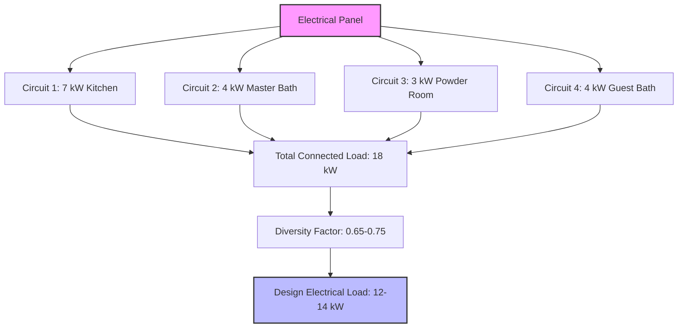
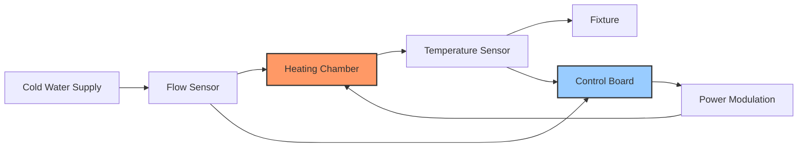
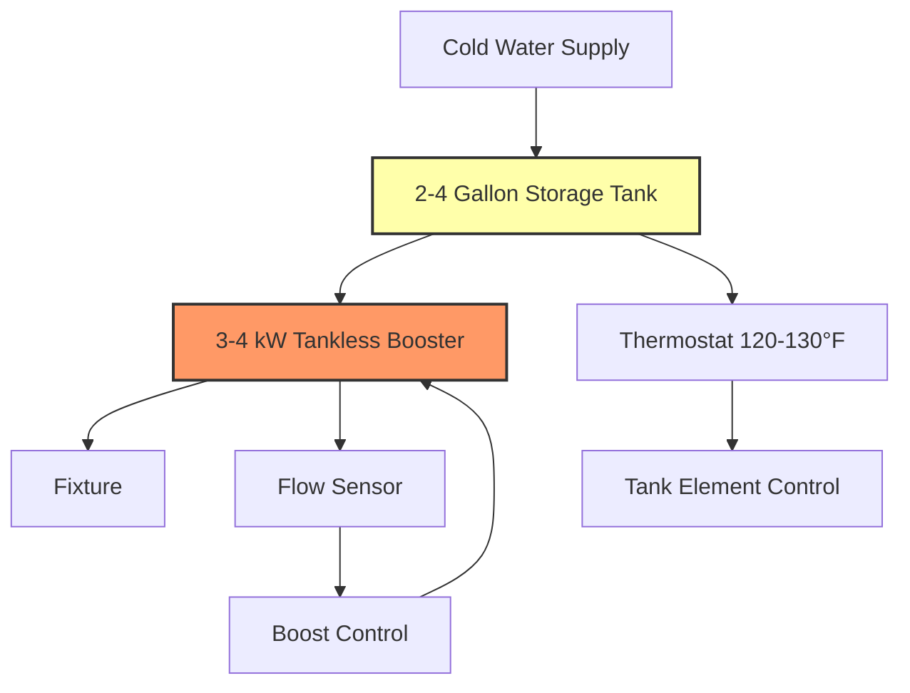

## Fundamental Principles

Point-of-use (POU) water heating systems locate heat generation at or near the point of consumption, fundamentally altering the thermal and hydraulic characteristics of domestic hot water delivery. This decentralized approach eliminates the distribution losses inherent in central systems where hot water travels through extensive piping networks.

The energy savings derive from two primary mechanisms:

**Elimination of Distribution Losses**

Heat loss from piping follows Fourier's law of conduction through the pipe wall and insulation, combined with convective and radiative losses from the external surface:

$$Q_{loss} = \frac{2\pi L k}{\ln(r_o/r_i)} (T_{water} - T_{ambient}) + h A_{surface} (T_{surface} - T_{ambient})$$

Where:
- $L$ = pipe length (ft)
- $k$ = thermal conductivity of pipe and insulation (Btu/hr·ft·°F)
- $r_o$, $r_i$ = outer and inner radii (ft)
- $h$ = convective heat transfer coefficient (Btu/hr·ft²·°F)
- $A_{surface}$ = external surface area (ft²)

For a typical central system with 50 feet of 3/4" copper pipe at 120°F in a 70°F environment, uninsulated pipe loses approximately 15-20 Btu/hr·ft. Over 8 hours of standby, this represents 6,000-8,000 Btu of waste heat.

**Elimination of Water Waste**

The volume of water wasted waiting for hot water delivery equals the pipe volume between heater and fixture:

$$V_{waste} = \frac{\pi d^2}{4} L$$

For 50 feet of 3/4" pipe: $V_{waste} = \frac{\pi (0.75/12)^2}{4} \times 50 = 0.153$ ft³ = 1.14 gallons per draw.

## Point-of-Use System Types

### Electric Tankless (Instantaneous) Heaters

Electric tankless POU heaters provide on-demand heating with no storage volume. The instantaneous temperature rise depends on electrical power input and water flow rate:

$$\Delta T = \frac{P \times 3412}{500 \times GPM}$$

Where:
- $P$ = electrical power (kW)
- $GPM$ = water flow rate (gallons per minute)
- 3412 = conversion factor (Btu/kWh)
- 500 = specific heat factor for water (Btu/gal·°F)

Simplified:

$$\Delta T = \frac{P \times 6.824}{GPM}$$

| Power (kW) | Flow Rate (GPM) | Temperature Rise (°F) | Application |
|------------|-----------------|----------------------|-------------|
| 3.0 | 0.5 | 41 | Hand washing |
| 4.0 | 0.5 | 55 | Hand washing, low-flow sink |
| 6.0 | 1.0 | 41 | Bathroom sink |
| 7.0 | 1.5 | 32 | Kitchen sink |
| 9.0 | 2.0 | 31 | Multiple sinks |
| 12.0 | 2.5 | 33 | Light-duty shower |

**Electrical Requirements**

The required circuit amperage follows Ohm's law:

$$I = \frac{P \times 1000}{V}$$

For a 7 kW unit at 240V: $I = \frac{7000}{240} = 29.2$ A, requiring a 40A circuit with #8 AWG copper conductors per NEC Article 422.13.

### Under-Sink Storage Heaters

Small electric storage heaters (2-20 gallons) provide a thermal buffer, allowing lower power draw while meeting intermittent peak demands. The usable hot water capacity exceeds the tank volume due to mixing:

$$V_{usable} = V_{tank} \times \frac{T_{tank} - T_{cold}}{T_{delivery} - T_{cold}}$$

For a 6-gallon heater at 140°F delivering 105°F water with 50°F cold water:

$$V_{usable} = 6 \times \frac{140 - 50}{105 - 50} = 6 \times \frac{90}{55} = 9.8 \text{ gallons}$$

**Standby Loss Characteristics**

Despite insulation, small tanks exhibit proportionally higher standby losses due to unfavorable surface-area-to-volume ratios. For a cylindrical tank:

$$\frac{A}{V} \propto \frac{1}{r}$$

A 6-gallon tank has approximately 3-4 times higher surface-area-to-volume ratio than a 50-gallon tank, increasing standby loss percentage.

Typical standby losses for well-insulated units:
- 2-6 gallon: 20-30 Btu/hr (0.4-0.6% per hour)
- 10-15 gallon: 30-40 Btu/hr (0.3-0.4% per hour)
- 20 gallon: 40-50 Btu/hr (0.2-0.3% per hour)

## Fixture-Specific Sizing Methodology

### Flow Rate Determination

Modern water-efficient fixtures have significantly reduced flow rates per EPA WaterSense and DOE standards:

| Fixture Type | Flow Rate (GPM) | Temperature (°F) | Notes |
|--------------|-----------------|------------------|-------|
| Bathroom lavatory | 0.5-1.5 | 105 | WaterSense max 1.5 GPM |
| Kitchen sink | 1.5-2.2 | 110-120 | Standard aerator |
| Bar sink | 0.5-1.0 | 105 | Low-flow application |
| Handwash sink | 0.5 | 95 | Commercial restroom |
| Pot filler | 2.0-3.0 | 180-190 | Commercial kitchen |
| Emergency eyewash | 0.4 | 60-90 | ANSI Z358.1 tepid water |

### Required Power Calculation

Given inlet temperature $T_{in}$, desired outlet temperature $T_{out}$, and fixture flow rate $GPM_{fixture}$:

$$P_{required} = \frac{GPM_{fixture} \times (T_{out} - T_{in}) \times 500}{3412} \text{ kW}$$

**Example: Kitchen Sink**

- Fixture flow: 2.0 GPM
- Inlet temperature: 50°F (winter condition)
- Outlet temperature: 115°F
- Temperature rise: 65°F

$$P_{required} = \frac{2.0 \times 65 \times 500}{3412} = \frac{65000}{3412} = 19.1 \text{ kW}$$

This requires a substantial electrical service. However, if inlet water temperature averages 60°F:

$$P_{required} = \frac{2.0 \times 55 \times 500}{3412} = 16.1 \text{ kW}$$

For installations with limited electrical capacity, restrict flow to 1.5 GPM:

$$P_{required} = \frac{1.5 \times 65 \times 500}{3412} = 14.3 \text{ kW}$$

### Diversity and Simultaneous Use

When sizing multiple POU heaters, apply diversity factors based on usage patterns. Unlike central systems where simultaneity factors apply to peak load calculations, POU systems benefit from distributed loads:

## System Configuration Strategies

### Tankless Configuration

**Control Algorithm**

Modern tankless POU heaters modulate power to maintain setpoint temperature:

$$P_{mod} = \min\left(P_{max}, \frac{GPM_{actual} \times \Delta T_{target} \times 500}{3412}\right)$$

### Hybrid Configuration

Combining small storage with tankless provides both instant delivery and reduced power demand:

This configuration uses the tank for initial demand and the tankless booster for sustained flow, reducing required tankless capacity by 40-60%.

## Distribution Loss Comparison

The energy saved by eliminating distribution losses depends on pipe length, insulation, and usage patterns:

| Configuration | Pipe Length (ft) | Daily Standby Loss (Btu/day) | Water Waste (gal/day) | Annual Energy (kWh/yr) |
|---------------|------------------|------------------------------|------------------------|------------------------|
| Central system, uninsulated | 50 | 4,800 | 8-12 | 1,750 |
| Central system, R-4 insulation | 50 | 1,600 | 8-12 | 585 |
| Central + recirculation | 50 | 7,200 | 0 | 2,630 |
| Point-of-use tankless | 3 | 0 | 0 | 0 |
| Point-of-use 6-gal storage | 3 | 600 | 0 | 220 |

**Assumptions**: 70°F ambient, 120°F supply temperature, 10 draws/day

## Code Requirements and Standards

**Plumbing Codes**

IPC Section 607.1 requires point-of-use heaters to comply with temperature and pressure relief valve requirements when storage capacity exceeds 1.5 gallons or power input exceeds 100,000 Btu/hr. Electric storage heaters require T&P valves rated for working pressure and temperature, discharging to approved location per IPC 504.6.

**Electrical Codes**

NEC Article 422.13 requires tankless water heaters to be considered continuous loads, sizing branch circuits at 125% of rated load:

$$I_{circuit} = 1.25 \times I_{rated}$$

For a 9 kW, 240V unit: $I_{circuit} = 1.25 \times \frac{9000}{240} = 46.9$ A, requiring 50A breaker and #6 AWG conductors.

**DOE Efficiency Standards**

10 CFR 430 Subpart B establishes efficiency standards for small electric storage heaters. Point-of-use heaters ≤20 gallons must meet:

$$EF \geq 0.93 - 0.00132 \times V_{rated}$$

Where $EF$ is energy factor and $V_{rated}$ is rated volume in gallons.

For a 6-gallon unit: $EF \geq 0.93 - 0.00132 \times 6 = 0.922$ (92.2% efficiency)

## Application Selection Matrix

| Application | Recommended Type | Capacity | Advantages |
|-------------|-----------------|----------|------------|
| Remote bathroom lavatory | Tankless 3-4 kW | 0.5 GPM | No maintenance, long life |
| Kitchen sink (sole use) | Tankless 7-9 kW | 1.5-2.0 GPM | High efficiency, unlimited supply |
| Bar sink | Storage 2-4 gal | 1.5 kW | Low power draw, buffer capacity |
| Commercial handwash | Tankless 3 kW | 0.5 GPM | Sanitation, adjustable temp |
| Emergency eyewash | Storage 6-10 gal | 2 kW | Tempering capability, code compliance |
| Break room sink | Storage 6 gal | 1.5 kW | Multiple users, cost-effective |

The optimal selection balances electrical infrastructure constraints, usage patterns, and life-cycle costs. Tankless units excel in continuous-use applications with adequate electrical capacity, while small storage heaters suit intermittent-use locations with limited power availability.

## Performance Verification

Field verification confirms proper sizing and operation:

1. **Temperature verification**: Measure outlet temperature at full fixture flow
2. **Flow rate confirmation**: Verify actual GPM matches fixture specifications
3. **Power draw measurement**: Confirm amperage matches nameplate rating
4. **Response time**: Tankless units should reach setpoint within 3-5 seconds

Proper commissioning ensures the POU system delivers design performance while optimizing energy efficiency through elimination of distribution losses and water waste.
