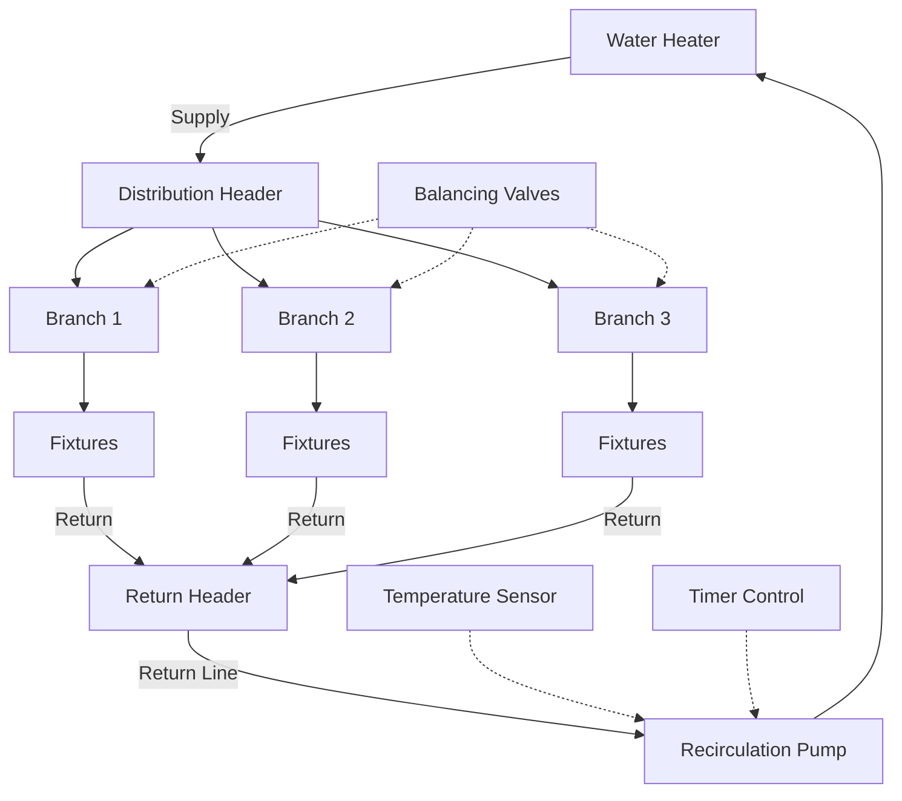

## Overview

Recirculation systems maintain hot water availability at fixtures by continuously or periodically circulating heated water through supply and return piping loops. These systems eliminate wait times for hot water delivery but introduce significant energy penalties through pipe heat loss and pump operation. Proper design requires balancing convenience, energy efficiency, and code compliance.

## System Configurations

### Configuration Types

**Continuous Circulation:** Pump operates 24/7, providing instant hot water but maximum energy consumption. Used in hospitals and commercial facilities where immediate availability is critical.

**Timer-Based Control:** Pump operates during scheduled occupancy periods. Reduces energy use by 40-60% compared to continuous operation while maintaining availability during peak demand.

**Temperature-Based Control:** Thermostat at farthest fixture activates pump when return water temperature drops below setpoint (typically 105-110°F). Balances energy savings with on-demand availability.

**Demand Control:** Push-button or motion sensor activation. Highest energy efficiency but requires user interaction and introduces short wait times.

## Pipe Heat Loss Calculations

Heat loss from recirculation piping drives system energy consumption. Calculate using:

$$Q_{loss} = U \cdot A \cdot \Delta T$$

Where:
- $Q_{loss}$ = heat loss rate (Btu/hr)
- $U$ = overall heat transfer coefficient (Btu/hr·ft²·°F)
- $A$ = pipe surface area (ft²)
- $\Delta T$ = temperature difference between water and ambient (°F)

For insulated pipe, the overall heat transfer coefficient:

$$U = \frac{1}{\frac{r_1}{k_{pipe}} \ln\left(\frac{r_2}{r_1}\right) + \frac{r_2}{k_{ins}} \ln\left(\frac{r_3}{r_2}\right) + \frac{1}{h_{air}}}$$

Where:
- $r_1, r_2, r_3$ = inner pipe radius, outer pipe radius, outer insulation radius (ft)
- $k_{pipe}, k_{ins}$ = thermal conductivity of pipe and insulation (Btu/hr·ft·°F)
- $h_{air}$ = convective heat transfer coefficient (Btu/hr·ft²·°F)

**Simplified approach for standard insulation:**

$$Q_{loss} = L \cdot F_{HL}$$

Where:
- $L$ = total pipe length (ft)
- $F_{HL}$ = heat loss factor from ASHRAE tables (Btu/hr·ft)

| Pipe Size | Uninsulated (Btu/hr·ft) | 1" Insulation (Btu/hr·ft) | 1.5" Insulation (Btu/hr·ft) |
|-----------|-------------------------|---------------------------|------------------------------|
| 3/4"      | 15.2                    | 4.8                       | 3.2                          |
| 1"        | 18.6                    | 5.6                       | 3.7                          |
| 1-1/4"    | 22.4                    | 6.5                       | 4.3                          |
| 1-1/2"    | 25.8                    | 7.2                       | 4.7                          |
| 2"        | 32.5                    | 8.6                       | 5.5                          |

*Assumes 140°F water temperature, 70°F ambient, fiberglass insulation*

## Recirculation Pump Sizing

Pump must overcome friction losses while maintaining design flow rate. Flow rate determined by:

$$\dot{m} = \frac{Q_{loss}}{c_p \cdot \Delta T_{drop}}$$

Where:
- $\dot{m}$ = mass flow rate (lbm/hr)
- $c_p$ = specific heat of water = 1.0 Btu/lbm·°F
- $\Delta T_{drop}$ = allowable temperature drop in loop (typically 5-10°F)

Convert to volumetric flow:

$$Q_{gpm} = \frac{\dot{m}}{500 \cdot \Delta T_{drop}}$$

For typical systems: $Q_{gpm} = \frac{Q_{loss}}{500 \times 5} = \frac{Q_{loss}}{2500}$

**Pressure drop calculation:**

$$\Delta P = f \cdot \frac{L}{D} \cdot \frac{\rho v^2}{2} + \sum K \cdot \frac{\rho v^2}{2}$$

Where:
- $f$ = Darcy friction factor (0.015-0.025 for typical flows)
- $L/D$ = length-to-diameter ratio
- $K$ = fitting loss coefficients
- $\rho$ = water density (62.4 lbm/ft³)
- $v$ = velocity (ft/sec)

**Simplified method using equivalent length:**

$$\Delta P_{psi} = \frac{(L + L_{eq}) \cdot C \cdot Q^{1.85}}{100 \cdot D^{4.87}}$$

Where $C$ = 0.442 for water at 140°F, $L_{eq}$ = equivalent length of fittings.

## System Balancing Requirements

Unbalanced recirculation systems result in short-circuiting where flow preferentially takes the path of least resistance, leaving distant branches with inadequate flow and cold water.

### Balancing Valve Selection

**Automatic Balancing Valves:** Maintain constant flow regardless of pressure fluctuations. Suitable for systems with varying pressure conditions or multiple zones.

**Manual Balancing Valves:** Require commissioning but provide reliable flow control at lower cost. Acceptable for most residential and small commercial applications.

**Thermostatic Balancing Valves:** Self-regulate based on return temperature. Close when branch reaches setpoint, forcing flow to cooler branches. Most common approach.

### Balancing Procedure

1. Calculate required flow for each branch based on pipe length and heat loss
2. Measure or calculate pressure drop for each branch
3. Install balancing valves on branches with lower resistance
4. Commission system by measuring return temperatures at all branches
5. Adjust valves to achieve uniform return temperature (±3°F)

| System Type | Balancing Method | Typical Accuracy | Commissioning Required |
|-------------|------------------|------------------|------------------------|
| Manual Valves | Flow measurement | ±10% | Yes |
| Automatic Valves | Pressure compensating | ±5% | Minimal |
| Thermostatic Valves | Temperature sensing | ±3°F | Self-balancing |
| Orifice Plates | Fixed restriction | ±15% | Yes |

## Insulation Requirements

ASHRAE 90.1 mandates minimum insulation thickness based on pipe size and operating temperature. For recirculation systems operating at 120-160°F:

| Pipe Size | Minimum Insulation Thickness | R-Value Requirement |
|-----------|------------------------------|---------------------|
| < 1"      | 1.0"                         | 4.0 hr·ft²·°F/Btu   |
| 1" - 1.5" | 1.0"                         | 4.0 hr·ft²·°F/Btu   |
| 2" - 4"   | 1.5"                         | 5.8 hr·ft²·°F/Btu   |
| > 4"      | 2.0"                         | 7.5 hr·ft²·°F/Btu   |

Vapor retarder jackets required in locations subject to condensation. Use all-service jacket (ASJ) in mechanical spaces, PVC jacket in concealed locations.

## Energy Impact Analysis

Recirculation systems represent 15-30% of total water heating energy in commercial buildings. Annual energy consumption:

$$E_{annual} = Q_{loss} \cdot t_{operation} + P_{pump} \cdot t_{operation}$$

Where:
- $E_{annual}$ = annual energy consumption (kWh or therms)
- $t_{operation}$ = hours of operation per year

**Comparative energy consumption for 200 ft loop (1" pipe, 140°F water):**

| Control Strategy | Operating Hours | Pipe Loss (kWh/yr) | Pump Energy (kWh/yr) | Total (kWh/yr) | Cost @ $0.12/kWh |
|------------------|-----------------|--------------------|--------------------|----------------|------------------|
| Continuous       | 8,760           | 29,200             | 438                | 29,638         | $3,557           |
| Timer (12 hr/day)| 4,380           | 14,600             | 219                | 14,819         | $1,778           |
| Temperature      | 2,920           | 9,733              | 146                | 9,879          | $1,185           |
| Demand           | 730             | 2,433              | 37                 | 2,470          | $296             |

*Assumes 1.5" insulation, 70°F ambient, 0.05 HP pump*

## Code Requirements

**ASHRAE 90.1:** Requires automatic shut-off controls for recirculation systems. Continuous operation prohibited unless justified by occupancy patterns. Temperature-based or time-based control mandatory.

**International Plumbing Code (IPC):** Recirculation systems must maintain minimum 120°F at fixtures for Legionella control. Return temperature must not exceed 110-115°F to prevent thermal discomfort.

**Uniform Plumbing Code (UPC):** Balancing devices required on branch returns when total system length exceeds 100 feet or serves more than three fixture groups.

## Design Recommendations

1. **Minimize loop length:** Each additional 10 feet adds 56-86 Btu/hr heat loss
2. **Upsize supply, not return:** Use next larger supply pipe size to reduce velocity and allow future expansion
3. **Zone large systems:** Multiple smaller loops with individual pumps reduce balancing complexity
4. **Specify ECM pumps:** Electronically commutated motors reduce pump energy by 50-70%
5. **Insulate aggressively:** Increasing insulation from 1" to 1.5" reduces heat loss by 25-35%
6. **Implement time-of-day control:** Reduce or stop circulation during low-demand periods
7. **Monitor return temperature:** Install thermometers at critical points for troubleshooting

Properly designed recirculation systems deliver comfort while minimizing energy waste through careful loop layout, appropriate control strategies, and thorough balancing during commissioning.
