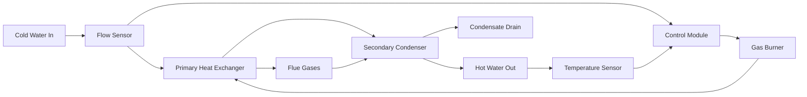

Tankless water heaters eliminate standby thermal losses by heating water only when demand occurs. These systems pass water through a heat exchanger activated by flow detection, delivering continuous hot water without storage tank limitations.

## Operating Principles

Flow-activated heating relies on a pressure differential switch or flow sensor that detects water movement and initiates the heating sequence. The fundamental energy balance governs instantaneous heating:

$$Q = \dot{m} c_p \Delta T$$

Where:
- $Q$ = heat transfer rate (Btu/hr or kW)
- $\dot{m}$ = mass flow rate (lb/hr or kg/s)
- $c_p$ = specific heat of water (1.0 Btu/lb·°F or 4.186 kJ/kg·K)
- $\Delta T$ = temperature rise (°F or K)

Converting to practical units for water heating:

$$Q_{Btu/hr} = \text{GPM} \times 500 \times \Delta T_F$$

$$Q_{kW} = \text{L/min} \times 0.07 \times \Delta T_C$$

The coefficient 500 represents the product of water density (8.34 lb/gal), specific heat (1.0 Btu/lb·°F), and time conversion (60 min/hr).

## Gas Tankless Systems

Gas-fired units employ modulating burners that adjust firing rate based on flow and inlet temperature. Modern condensing models achieve thermal efficiencies exceeding 95% by extracting latent heat from combustion products.

### Heat Exchanger Configuration

The primary heat exchanger operates above the dew point of combustion gases (approximately 135°F for natural gas), while the secondary condenser recovers additional energy by cooling flue gases below this threshold.

### Performance Characteristics

Gas tankless capacity depends on burner input and efficiency:

$$\text{GPM} = \frac{Q_{input} \times \eta}{500 \times \Delta T}$$

For a 199,000 Btu/hr unit at 96% efficiency with 45°F inlet temperature:

$$\text{GPM} = \frac{199,000 \times 0.96}{500 \times (120 - 45)} = \frac{191,040}{37,500} = 5.1 \text{ GPM}$$

| Input Capacity | Efficiency | Temperature Rise | Max Flow Rate |
|----------------|------------|------------------|---------------|
| 120,000 Btu/hr | 82% | 75°F | 1.3 GPM |
| 160,000 Btu/hr | 96% | 75°F | 2.0 GPM |
| 199,000 Btu/hr | 96% | 75°F | 2.5 GPM |
| 199,000 Btu/hr | 96% | 45°F | 5.1 GPM |

## Electric Tankless Systems

Electric units use resistive heating elements immersed in water flow passages. Multiple elements activate sequentially as flow rate increases, providing modulation without combustion controls.

### Power Requirements

Electric tankless systems require substantial electrical service:

$$P_{kW} = \frac{\text{GPM} \times 500 \times \Delta T}{3412}$$

The conversion factor 3412 translates Btu/hr to kW. For 2.5 GPM at 70°F rise:

$$P_{kW} = \frac{2.5 \times 500 \times 70}{3412} = \frac{87,500}{3412} = 25.6 \text{ kW}$$

This power level demands 240V service with multiple circuits:

| Power Level | Voltage | Current (A) | Circuit Breaker | Flow @ 70°F Rise |
|-------------|---------|-------------|-----------------|------------------|
| 12 kW | 240V | 50A | 60A | 1.2 GPM |
| 18 kW | 240V | 75A | 90A | 1.8 GPM |
| 24 kW | 240V | 100A | 125A | 2.4 GPM |
| 36 kW | 240V | 150A | 175A | 3.6 GPM |

Electric efficiency reaches 99% due to direct resistance heating without combustion losses, but high electricity costs typically offset this advantage.

## Temperature Rise Calculations

Inlet water temperature significantly affects capacity. The required temperature rise varies geographically based on groundwater temperature:

| Region | Inlet Temp (°F) | Rise to 120°F | Rise to 140°F |
|--------|-----------------|---------------|---------------|
| Southern US | 65°F | 55°F | 75°F |
| Central US | 50°F | 70°F | 90°F |
| Northern US | 40°F | 80°F | 100°F |

A unit rated at 4.0 GPM with 45°F rise delivers only 2.25 GPM with 80°F rise:

$$\text{GPM}_2 = \text{GPM}_1 \times \frac{\Delta T_1}{\Delta T_2} = 4.0 \times \frac{45}{80} = 2.25 \text{ GPM}$$

## Sizing Methodology

Proper sizing requires simultaneous fixture demand analysis. ASHRAE establishes fixture flow rates:

- Shower: 2.0-2.5 GPM
- Lavatory faucet: 0.5-1.0 GPM
- Kitchen sink: 1.5-2.0 GPM
- Dishwasher: 1.0-1.5 GPM
- Clothes washer: 2.0-3.0 GPM

For simultaneous use of one shower and one sink (peak residential demand):

$$\text{Total GPM} = 2.5 + 1.5 = 4.0 \text{ GPM}$$

With 70°F rise required, the minimum capacity becomes:

$$Q = 4.0 \times 500 \times 70 = 140,000 \text{ Btu/hr}$$

At 95% efficiency, burner input must be:

$$Q_{input} = \frac{140,000}{0.95} = 147,400 \text{ Btu/hr}$$

## Gas versus Electric Comparison

| Factor | Gas Tankless | Electric Tankless |
|--------|--------------|-------------------|
| Efficiency | 82-96% (thermal) | 99% (at element) |
| Operating cost | Lower (natural gas) | Higher (electric rates) |
| Installation cost | Higher (venting required) | Lower (no venting) |
| Service requirements | 3/4" gas line typical | 100-200A electrical |
| Capacity range | 140,000-380,000 Btu/hr | 12-36 kW (40,000-120,000 Btu/hr) |
| Maintenance | Annual descaling, combustion check | Minimal, element replacement |
| Lifespan | 15-20 years | 10-15 years |

## Efficiency Advantages

Tankless systems eliminate standby losses that consume 10-20% of storage tank energy. The Department of Energy estimates annual energy savings of $100-$150 for gas units and $44-$80 for electric units compared to standard storage tanks.

Energy Factor (EF) ratings quantify overall efficiency including cycling losses. AHRI-certified gas tankless models achieve EF ratings from 0.82 to 0.96, while electric units reach 0.99. However, Uniform Energy Factor (UEF), which better represents real-world performance, shows gas condensing tankless at 0.90-0.96 UEF.

The absence of tank standby loss becomes more valuable in applications with intermittent demand patterns, where storage tanks continuously lose heat during idle periods. Conversely, high-volume continuous demand may favor storage systems that pre-heat large quantities during off-peak hours.

## Minimum Flow Requirements

Flow switches typically activate at 0.4-0.6 GPM to prevent short cycling and ensure adequate heat exchanger velocity. This threshold creates "cold water sandwich" effects when brief low-flow events fail to maintain heating, particularly problematic in point-of-use applications with single low-flow fixtures.

Advanced models incorporate buffer tanks or recirculation pumps to eliminate this limitation, though these additions reintroduce minor standby losses.
