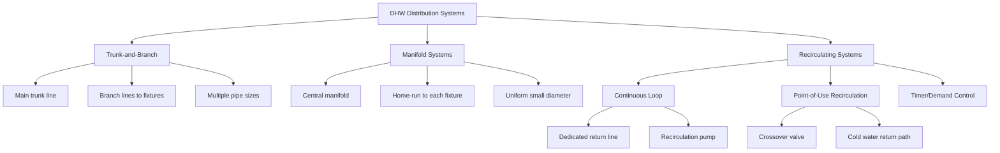

Domestic hot water (DHW) distribution systems transport heated water from the source equipment to end-use fixtures. The design of these systems fundamentally impacts water waste, energy consumption, installation cost, and occupant satisfaction. Selection depends on building type, fixture count, usage patterns, and applicable code requirements.

## Distribution System Types

DHW distribution systems fall into three primary categories based on pipe configuration and flow control methodology.

## Heat Loss and Wait Time Calculations

The heat loss from uninsulated piping represents both energy waste and the cause of delivery delays. For a horizontal pipe segment:

$$Q_{loss} = \frac{2\pi L (T_w - T_a)}{\frac{1}{h_i r_i} + \frac{\ln(r_o/r_i)}{k_{pipe}} + \frac{\ln(r_{ins}/r_o)}{k_{ins}} + \frac{1}{h_o r_{ins}}}$$

where:
- $Q_{loss}$ = heat loss rate (W)
- $L$ = pipe length (m)
- $T_w$ = water temperature (°C)
- $T_a$ = ambient temperature (°C)
- $r_i$, $r_o$, $r_{ins}$ = inside radius, outside radius, insulation outer radius (m)
- $k_{pipe}$, $k_{ins}$ = thermal conductivity of pipe and insulation (W/m·K)
- $h_i$, $h_o$ = inside and outside convection coefficients (W/m²·K)

The water volume that must be purged before hot water arrives determines waste and wait time:

$$V_{waste} = \sum_{i=1}^{n} \frac{\pi d_i^2}{4} L_i$$

$$t_{wait} = \frac{V_{waste}}{\dot{V}_{fixture}}$$

where $d_i$ and $L_i$ are the diameter and length of each pipe segment, and $\dot{V}_{fixture}$ is the fixture flow rate.

## System Comparison

| Parameter | Trunk-and-Branch | Manifold | Recirculating |
|-----------|------------------|----------|---------------|
| **Pipe material cost** | Low | Medium | High |
| **Installation labor** | Medium | Low | High |
| **Water waste per draw** | High (3-10 L) | Medium (1-3 L) | Minimal (<0.5 L) |
| **Energy loss (standby)** | Low | Low | High (pump + pipe loss) |
| **Delivery time** | 30-90 s | 15-45 s | Immediate |
| **Fixture independence** | Low | High | Medium |
| **Pipe sizing complexity** | High | Low | High |
| **Retrofit difficulty** | Medium | High | Medium |
| **Pressure balancing** | Difficult | Excellent | Good |

## Trunk-and-Branch Systems

This conventional approach uses progressively smaller pipe diameters as branches split from the main trunk line. Sizing follows the Hunter fixture unit method per the International Plumbing Code (IPC).

**Advantages:**
- Minimal piping material cost
- Familiar to installers
- Accommodates traditional rough-in locations

**Limitations:**
- Long pipe runs from heater to distant fixtures
- Significant water waste before hot water arrival
- Difficult to balance pressures
- Higher heat loss due to large-diameter trunk lines

Typical residential trunk sizing: 3/4" to 1" copper or PEX trunk, reducing to 1/2" branches.

## Manifold Systems

Parallel distribution routes individual small-diameter lines (typically 3/8" or 1/2" PEX) from a central manifold to each fixture. This configuration minimizes water volume in each line.

**Advantages:**
- Reduced water waste (smaller line volumes)
- Excellent pressure balancing
- Simplified rough-in
- Fewer fittings (reduced leak points)

**Limitations:**
- Higher material cost
- Requires accessible manifold location
- Longer total pipe length
- Greater aggregate heat loss surface area

Best suited for residential and light commercial applications with PEX-compatible piping.

## Recirculating Systems

Continuous or demand-controlled circulation maintains hot water at or near fixtures, eliminating delivery delays. Systems require either a dedicated return line or utilize crossover valves that return through cold water piping.

### Dedicated Return Loop

A pump circulates water from the furthest fixture back to the water heater. ASHRAE 90.1-2019 Section 7.4.4.3 mandates:
- Automatic controls (temperature, timer, or occupancy-based)
- Pipe insulation meeting Section 6.4.4 requirements
- Flow-balancing valves on branch returns

Energy consumption includes pump power (typically 20-100 W) and continuous standby heat loss from the entire loop.

### Point-of-Use Recirculation

A small pump at a single fixture location activates on demand, returning cooled water to the water heater via the cold water line through a thermostatic crossover valve. This approach eliminates dedicated return piping.

**Code Considerations:**
- IPC Section 607.2: Protection from backflow
- IPC Section 504.7: Maximum developed length constraints
- ASHRAE 90.1 Section 7.4.4.4: Mandatory controls for demand recirculation

## Pipe Sizing Methodology

Proper sizing balances pressure drop, flow velocity, and erosion concerns:

$$\Delta P = f \frac{L}{D} \frac{\rho v^2}{2} + \sum K \frac{\rho v^2}{2}$$

where:
- $\Delta P$ = pressure drop (Pa)
- $f$ = Darcy friction factor (dimensionless)
- $L$ = pipe length (m)
- $D$ = pipe diameter (m)
- $\rho$ = water density (kg/m³)
- $v$ = flow velocity (m/s)
- $K$ = fitting loss coefficients (dimensionless)

**Velocity limits:**
- Maximum: 2.4 m/s (8 ft/s) to prevent erosion and water hammer
- Minimum in recirculation: 0.3 m/s (1 ft/s) for proper heat transfer

IPC Table 604.3 provides fixture unit assignments. Use ASHRAE Fundamentals Chapter 22 for detailed pressure drop calculations.

## Design Selection Criteria

**Select trunk-and-branch when:**
- Budget constraints prioritize low first cost
- Building layout permits short runs to fixtures
- Water waste is not a primary concern

**Select manifold when:**
- Pressure balancing is critical
- PEX piping is acceptable
- Water conservation is prioritized
- Accessible manifold location exists

**Select recirculating when:**
- Immediate hot water delivery is required
- Long pipe runs are unavoidable
- Operating cost justifies capital investment
- Code mandates maximum wait time compliance

## Energy Efficiency Requirements

ASHRAE 90.1-2019 establishes mandatory provisions:
- Pipe insulation thickness per Table 6.8.3
- Automatic time or temperature-based recirculation control
- Heat traps on storage tank connections
- Maximum recirculation system temperature drop: 10°F

The International Energy Conservation Code (IECC) similarly requires insulation and controls. High-performance buildings may pursue additional measures: insulation upgrades, demand-controlled pumping, or distributed point-of-use heaters.

## Installation Considerations

Critical factors affecting long-term performance:

- **Pipe material selection:** Copper (corrosion-resistant, higher cost), PEX (flexible, lower cost, temperature limits), CPVC (economical, support spacing)
- **Expansion compensation:** Thermal expansion loops or flexible connectors for long runs
- **Air elimination:** High-point vents in recirculation loops
- **Support spacing:** Per manufacturer specifications to prevent sagging
- **Accessibility:** Isolation valves at branches for maintenance

Proper installation per manufacturer guidelines and code requirements ensures design performance objectives are achieved throughout the system service life.
