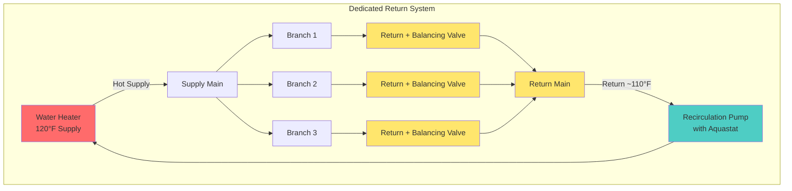

Domestic hot water (DHW) recirculation systems continuously or periodically circulate heated water through distribution piping to eliminate the delay inherent in dead-leg systems. While recirculation provides instant hot water at fixtures, it introduces ongoing thermal losses and pumping energy consumption that require careful design consideration.

## System Types and Configurations

### Dedicated Return Line Systems

Traditional recirculation systems incorporate a dedicated return pipe that runs parallel to the hot water supply mains, creating a closed loop back to the water heater or heat exchanger. A circulating pump located at the water heater maintains flow through this loop.

**Key components:**
- Supply mains (sized for fixture demand flow rates)
- Return mains (typically 1-2 pipe sizes smaller than supply)
- Recirculation pump (sized for heat loss, not fixture demand)
- Balancing valves at branch terminations
- Aquastat or temperature sensor control

### Demand Recirculation Systems

Demand systems utilize the cold water line as the return path, eliminating dedicated return piping. A pump located at the farthest fixture activates on demand (push-button or motion sensor) and circulates water until a threshold temperature is detected at the fixture.

**Operational characteristics:**
- Pump runs only when activated by user
- Lower installation cost (no return piping)
- Introduces warm water into cold supply during circulation
- Limited to residential and small commercial applications

### Reverse Return Configuration

For large systems requiring balanced flow, reverse return piping ensures equal pipe lengths to all branches, improving temperature uniformity without extensive balancing valve adjustment.

## Heat Loss and Pump Sizing

The recirculation pump must overcome system pressure drop while moving sufficient water to offset thermal losses from the piping system.

### Heat Loss Calculation

Total system heat loss depends on pipe surface area, insulation properties, and temperature differential:

$$Q_{loss} = U \cdot A \cdot \Delta T$$

Where:
- $Q_{loss}$ = heat loss rate (Btu/hr)
- $U$ = overall heat transfer coefficient (Btu/hr·ft²·°F)
- $A$ = total pipe surface area (ft²)
- $\Delta T$ = temperature difference between water and ambient (°F)

For insulated copper pipe, typical $U$ values range from 0.15 to 0.30 Btu/hr·ft²·°F depending on insulation thickness and quality.

### Recirculation Flow Rate

The required circulation flow rate maintains acceptable temperature drop around the loop:

$$GPM = \frac{Q_{loss}}{500 \cdot \Delta T_{loop}}$$

Where:
- $GPM$ = recirculation flow rate (gallons per minute)
- $Q_{loss}$ = total system heat loss (Btu/hr)
- $\Delta T_{loop}$ = allowable temperature drop in loop (°F), typically 5-10°F
- $500$ = constant (Btu/hr per GPM·°F for water)

**Example Calculation:**

For a system with 400 ft of 1.5" copper pipe, 1" insulation, operating at 120°F in a 70°F ambient:

- Pipe surface area: $A = \pi \cdot (0.146) \cdot 400 = 183.5 \text{ ft}^2$
- Heat loss: $Q_{loss} = 0.20 \cdot 183.5 \cdot (120-70) = 1,835 \text{ Btu/hr}$
- Flow rate for 10°F drop: $GPM = 1,835 / (500 \cdot 10) = 0.37 \text{ GPM}$

### Pump Head Calculation

The recirculation pump must provide sufficient head to overcome friction losses through supply and return piping, fittings, and valves. Use standard friction loss tables for hot water at system operating temperature.

$$H_{pump} = H_{friction} + H_{fittings} + H_{valves}$$

Typical residential recirculation systems require 5-15 ft of head; larger commercial systems may require 20-40 ft depending on piping length and configuration.

## Control Strategies

### Continuous Operation

Simplest control method maintains constant circulation 24/7. Provides instant hot water but maximizes energy consumption and thermal losses.

**Energy penalty:** All heat loss from piping must be continuously replaced by the water heater, typically adding 10-30% to DHW energy consumption depending on system size and insulation quality.

### Aquastat Control

Temperature-sensing aquastat mounted on the return line cycles the pump to maintain return water temperature above a setpoint (typically 95-105°F for 120°F supply).

**Advantages:**
- Reduces pump runtime compared to continuous operation
- Maintains hot water availability
- Simple, reliable control

**Typical cycling:** Pump runs 30-50% of the time with proper insulation and sizing.

### Time Clock Control

Scheduled operation during peak demand periods (morning, evening) reduces energy waste during low-demand hours.

**Considerations:**
- May result in delay during off-hours
- Effective for predictable occupancy patterns
- Can combine with aquastat for temperature backup

### Demand-Initiated Control

Motion sensors, push-buttons, or fixture activation signals trigger pump operation only when hot water is anticipated.

**Optimal for:**
- Residential applications
- Facilities with irregular occupancy
- Maximum energy savings (70-90% reduction versus continuous)

## Balancing and Temperature Uniformity

### Balancing Valve Installation

Install calibrated balancing valves at the end of each branch circuit to regulate flow distribution. Branches closer to the pump receive less flow resistance and require throttling to ensure adequate flow to distant branches.

**Balancing procedure:**
1. Fully open all balancing valves
2. Measure return temperature at each branch
3. Progressively close valves on warm branches
4. Re-measure and iterate until all branches within 2-3°F

### Flow Velocities

Maintain flow velocities between 2-4 ft/s in recirculation mains to ensure adequate heat transport while minimizing erosion and noise.

$$V = \frac{0.408 \cdot GPM}{d^2}$$

Where:
- $V$ = velocity (ft/s)
- $GPM$ = flow rate
- $d$ = inside diameter (inches)

## ASHRAE 90.1 Requirements

ASHRAE Standard 90.1 Section 7.4.4.3 mandates energy efficiency measures for recirculation systems:

**Mandatory provisions:**
- Automatic controls to shut off or modulate recirculation pump when building is unoccupied or during low-demand periods
- Dead-leg length limits (maximum 50 ft for 3/8" pipe, 25 ft for 1/2", 10 ft for larger)
- Pipe insulation minimums (R-3 for piping ≤1.5", R-4 for larger)

**Temperature maintenance circulation loops** must be controlled by:
- Time clock with an automatic override, or
- Temperature modulation sensing return temperature

These requirements typically reduce annual recirculation energy consumption by 30-50% compared to uncontrolled continuous operation.

## System Comparison

| Feature | Dedicated Return | Demand Recirculation |
|---------|------------------|----------------------|
| **Installation cost** | Higher (return piping required) | Lower (uses existing cold line) |
| **Operating cost** | Higher (continuous or aquastat) | Lowest (on-demand only) |
| **Response time** | Instant (maintained circulation) | 10-60 seconds (pump activation) |
| **Temperature uniformity** | Excellent (proper balancing) | Variable (location dependent) |
| **Application** | Commercial, multi-story residential | Single-family, small buildings |
| **Cold water contamination** | None | Temporary warming during cycles |
| **Maintenance** | Balancing adjustment, pump service | Minimal, sensor/pump replacement |
| **Energy code compliance** | Requires controls per ASHRAE 90.1 | Inherently compliant (demand-based) |

## Design Recommendations

1. **Minimize piping length:** Shorter loops reduce heat loss and improve efficiency
2. **Insulate thoroughly:** Exceed code minimums where economically justified
3. **Right-size the pump:** Oversized pumps waste energy and cause balancing difficulties
4. **Implement smart controls:** Temperature and time-based controls typically provide best balance of performance and efficiency
5. **Design for balancing:** Include balancing valves at design stage rather than retrofitting
6. **Monitor return temperature:** Install temperature gauges to verify system performance and identify problems

## Piping Configuration Diagram

Properly designed recirculation systems balance occupant comfort with energy efficiency. The selection between dedicated return and demand systems depends on building type, occupancy patterns, budget constraints, and performance expectations. All systems benefit from intelligent controls that minimize pump operation and thermal losses while maintaining acceptable hot water delivery times.
