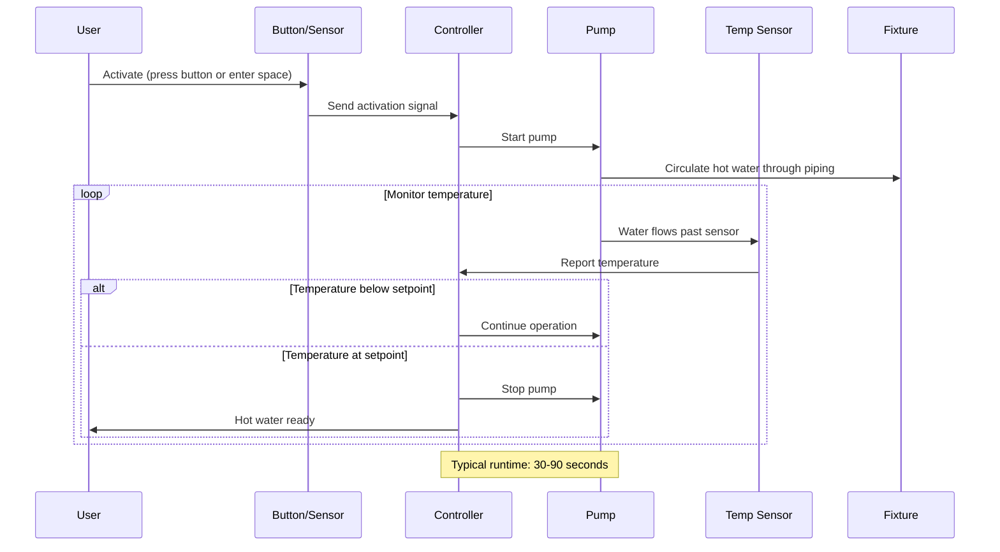

## Overview

On-demand recirculation systems activate the circulation pump only when hot water is needed, rather than operating continuously. This approach delivers hot water quickly at fixtures while significantly reducing the energy losses associated with continuous recirculation. The pump runs until a target temperature is reached at the fixture or return location, then shuts off until the next demand event.

These systems are particularly effective in residential applications and small commercial buildings where hot water demand is intermittent and predictable. By eliminating continuous heat loss from distribution piping, on-demand systems typically reduce recirculation energy consumption by 50-70% compared to continuous operation.

## Activation Methods

### Push-Button Control

The most common activation method uses momentary push-buttons installed at key fixture locations. The user presses the button before needing hot water, and the pump runs for a preset duration or until a temperature sensor indicates hot water has arrived. Typical button locations include:

- Master bathroom vanities
- Kitchen sinks
- Remote fixture groups

Installation requires low-voltage wiring from the button to the pump controller. Wireless push-button systems are available that eliminate wiring requirements.

### Occupancy Sensor Activation

Motion sensors detect occupancy in bathrooms or kitchens and automatically activate the recirculation pump. The system anticipates demand based on presence, starting the pump before the user turns on the fixture. Key considerations:

- Sensor placement must detect occupancy early enough to deliver hot water when needed
- False activations (someone entering the space without using hot water) waste energy
- Most effective in spaces with predictable hot water use patterns

### Timer-Controlled Operation

Programmable timers activate recirculation during high-demand periods (morning and evening hours in residential applications). While not truly "on-demand," timer control dramatically reduces runtime compared to continuous operation. Advanced controllers combine timer operation with push-button override for unexpected demand.

## Wait Time Analysis

The delay between activation and hot water arrival depends on pipe volume, flow rate, and temperature differential. The wait time can be calculated:

$$t_{\text{wait}} = \frac{V_{\text{pipe}}}{Q_{\text{pump}}}$$

Where:
- $t_{\text{wait}}$ = wait time (min)
- $V_{\text{pipe}}$ = volume of piping from water heater to fixture (gal)
- $Q_{\text{pump}}$ = pump flow rate (gpm)

For a system with 100 feet of 3/4-inch copper pipe:

$$V_{\text{pipe}} = 100 \text{ ft} \times 0.0192 \frac{\text{gal}}{\text{ft}} = 1.92 \text{ gal}$$

At a pump flow rate of 3 gpm:

$$t_{\text{wait}} = \frac{1.92 \text{ gal}}{3 \text{ gpm}} = 0.64 \text{ min} = 38 \text{ seconds}$$

This wait time must be acceptable to users. Systems with wait times exceeding 60 seconds often receive complaints, particularly in residential applications.

## Pump Sizing

On-demand recirculation pumps must move water quickly enough to minimize wait time while overcoming system pressure drop. The required pump head is:

$$H_{\text{pump}} = \Delta P_{\text{pipe}} + \Delta P_{\text{fittings}} + \Delta P_{\text{valve}}$$

Where pressure drops are calculated using the Darcy-Weisbach equation. Most residential on-demand systems use small circulator pumps (15-50 watts) with the following typical specifications:

- Flow rate: 2-6 gpm
- Head: 5-15 feet of water
- Power consumption: 15-50 watts

Higher flow rates reduce wait time but increase pressure drop, requiring larger pumps and more energy per activation cycle.

## System Operation Diagram

## Comparison: On-Demand vs. Continuous Recirculation

| Parameter | On-Demand Recirculation | Continuous Recirculation |
|-----------|-------------------------|--------------------------|
| **Pump Runtime** | 5-30 min/day typical | 24 hours/day |
| **Annual Pump Energy** | 25-150 kWh | 300-800 kWh |
| **Pipe Heat Loss** | Only during operation | Continuous 24/7 |
| **Annual Heat Loss** | 500-2,000 kWh | 3,000-10,000 kWh |
| **Total Energy Savings** | 50-70% vs. continuous | Baseline |
| **Hot Water Wait Time** | 30-90 seconds | Instant (0-5 seconds) |
| **User Interaction** | Button press or motion | None required |
| **Installation Cost** | Moderate (adds controls) | Lower (simple pump) |
| **Maintenance** | Low (reduced pump runtime) | Moderate (continuous operation) |
| **Best Application** | Residential, intermittent demand | Hotels, healthcare, continuous demand |

## Energy Savings Calculations

The energy saved by on-demand operation compared to continuous recirculation comes from two sources: reduced pump runtime and reduced pipe heat loss.

### Pump Energy Savings

$$E_{\text{pump,saved}} = P_{\text{pump}} \times (t_{\text{continuous}} - t_{\text{on-demand}})$$

For a 30-watt pump operating continuously (8,760 hours/year) vs. on-demand (250 hours/year):

$$E_{\text{pump,saved}} = 0.03 \text{ kW} \times (8760 - 250) \text{ hr} = 255 \text{ kWh/year}$$

### Pipe Heat Loss Savings

Pipe heat loss during non-circulation periods is minimal in on-demand systems. The heat loss from continuously circulated piping:

$$Q_{\text{pipe}} = U \times A_{\text{pipe}} \times \Delta T \times t$$

Where:
- $U$ = overall heat transfer coefficient (Btu/hr·ft²·°F)
- $A_{\text{pipe}}$ = pipe surface area (ft²)
- $\Delta T$ = temperature difference between pipe and ambient (°F)
- $t$ = operating time (hr)

For 200 feet of uninsulated 3/4-inch copper pipe at 120°F in a 70°F space:

- $U \approx 1.5$ Btu/hr·ft²·°F (natural convection + radiation)
- $A_{\text{pipe}} = 200 \text{ ft} \times 0.262 \frac{\text{ft}^2}{\text{ft}} = 52.4 \text{ ft}^2$
- $\Delta T = 120 - 70 = 50°\text{F}$

Annual continuous heat loss:

$$Q_{\text{continuous}} = 1.5 \times 52.4 \times 50 \times 8760 = 34.4 \times 10^6 \text{ Btu/year}$$

On-demand operation (250 hours/year circulation, pipe cools between cycles):

$$Q_{\text{on-demand}} \approx 1.5 \times 52.4 \times 50 \times 250 = 0.98 \times 10^6 \text{ Btu/year}$$

Heat loss savings: $33.4 \times 10^6$ Btu/year = 9,800 kWh thermal equivalent

## Code and Standard Requirements

### ASHRAE 90.1 (Commercial Buildings)

Section 7.4.4.3 requires automatic controls for recirculation pumps, including:
- Time-of-day scheduling reducing operation during unoccupied periods
- Water temperature monitoring to shut off pumps when not needed
- On-demand systems comply when properly configured

### International Plumbing Code (IPC)

Section 607.2 addresses recirculation systems but does not mandate on-demand vs. continuous operation. Local amendments may require energy-saving controls.

### California Title 24

Part 6 (Energy Code) and Part 11 (CALGreen) include specific requirements:
- Recirculation systems must include controls limiting operation
- Temperature sensors or timers required to prevent unnecessary operation
- On-demand systems meet these requirements by design

### ASHRAE 90.2 (Residential Buildings)

Section 9.2.2 recommends controls to limit recirculation pump operation to periods of expected use, aligning with on-demand system operation.

## Design Considerations

### System Layout

On-demand systems work best with:
- Dedicated return lines (not through cold water pipes)
- Temperature sensors at the farthest fixture or return point
- Minimal pipe volume between heater and fixtures
- Insulated distribution piping to reduce heat loss

### Control Strategy

The controller must balance user convenience and energy savings:
- **Activation threshold**: How long after last use before pump stops
- **Temperature setpoint**: Target temperature at sensor location (typically 105-110°F)
- **Timeout**: Maximum pump runtime to prevent continuous operation if temperature not reached
- **Learn mode**: Some controllers learn usage patterns and pre-activate pump

### User Education

On-demand systems require user understanding:
- Press button 30-60 seconds before needing hot water
- Avoid repeated short activation cycles
- Understand that immediate hot water is not available (trade-off for energy savings)

### Sensor Placement

Temperature sensors must be located where they accurately detect hot water arrival:
- At the furthest fixture from the water heater
- In the return line near the pump inlet
- Protected from ambient temperature variations
- Accessible for maintenance and verification

## Advantages and Limitations

### Advantages

- **Energy savings**: 50-70% reduction vs. continuous recirculation
- **Lower operating cost**: Reduced pump and heating energy
- **Extended pump life**: Fewer operating hours
- **Reduced pipe heat loss**: Pipes cool between activation cycles
- **Flexibility**: Can add on-demand to existing systems

### Limitations

- **Wait time**: 30-90 seconds typical, which may be unacceptable in some applications
- **User interaction**: Requires button press or relies on occupancy sensing
- **Control complexity**: More sophisticated than simple continuous operation
- **Initial cost**: Higher than basic continuous systems due to controls
- **False activations**: Occupancy sensors may activate unnecessarily

## Application Guidelines

On-demand recirculation is most appropriate for:
- Single-family and small multi-family residential buildings
- Office buildings with intermittent hot water demand
- Retail facilities with predictable usage patterns
- Retrofit applications where energy savings justify control upgrades

Continuous recirculation remains preferable for:
- Healthcare facilities requiring immediate hot water availability
- Hotels and dormitories with high occupancy
- Commercial kitchens with constant hot water demand
- Applications where Legionella control requires continuous elevated temperatures

## Commissioning and Verification

Proper commissioning ensures on-demand systems operate as intended:

1. **Verify activation**: Test all push-buttons and sensors
2. **Measure wait time**: Time from activation to hot water delivery at each fixture
3. **Check temperature setpoint**: Confirm pump stops at correct temperature
4. **Test timeout**: Verify pump stops after maximum runtime
5. **Confirm energy savings**: Compare pump runtime and heating energy to baseline

Document actual wait times at each fixture location and confirm they meet user expectations before system acceptance.
