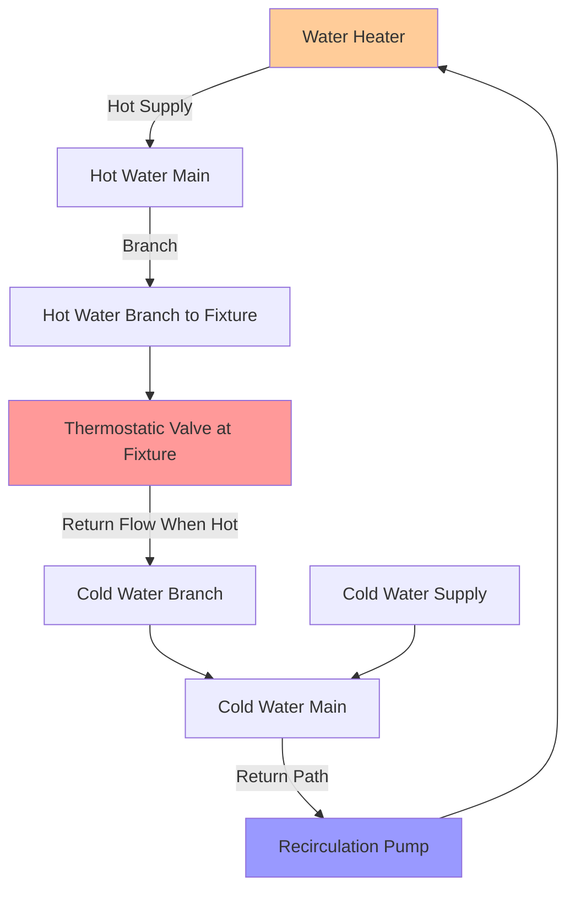

## Overview

Swing return recirculation systems represent a cost-effective alternative to dedicated return piping in domestic hot water (DHW) distribution systems. Instead of installing separate return lines from each fixture back to the water heater, swing return systems utilize existing cold water branch lines as the return path. A thermostatic valve at the fixture endpoint controls when hot water "swings" back through the cold water line to maintain circulation.

This configuration reduces installation costs but introduces technical challenges related to flow control, temperature maintenance, and potential mixing of hot and cold water supplies.

## System Configuration

The thermostatic valve serves as the critical control point. When water temperature at the fixture drops below the valve setpoint (typically 95-105°F), the valve opens, allowing hot water to flow through the cold water branch back to the recirculation pump. Once the setpoint is reached, the valve closes, preventing continuous mixing.

## Flow Dynamics and Crossover Prevention

The pressure differential driving flow through the swing return path must overcome both friction losses and the valve cracking pressure:

$$\Delta P_{available} = P_{hot} - P_{cold} > \Delta P_{friction} + \Delta P_{valve}$$

Where:
- $P_{hot}$ = pressure in hot water branch (Pa)
- $P_{cold}$ = pressure in cold water return branch (Pa)
- $\Delta P_{friction}$ = friction losses in return path (Pa)
- $\Delta P_{valve}$ = thermostatic valve pressure drop (Pa)

The maximum allowable return flow rate to prevent cold water contamination is governed by:

$$Q_{return,max} = \frac{\pi d^2}{4} \cdot v_{max}$$

Where:
- $d$ = cold water branch diameter (m)
- $v_{max}$ = maximum velocity to prevent backflow (typically 0.3-0.6 m/s)

Check valves on cold water branches are essential to prevent hot water from entering cold water fixtures during periods of low cold water demand.

## Component Requirements

**Thermostatic Recirculation Valves:**
- Temperature setpoint range: 95-115°F
- Automatic closure to prevent continuous mixing
- Typically installed under the furthest fixture from the water heater
- Must be accessible for maintenance and adjustment

**Check Valves:**
- Required on all cold water branches not serving as return paths
- Prevents hot water migration to cold fixtures
- Must be installed with proper orientation
- Spring-loaded type preferred for positive seating

**Recirculation Pump:**
- Lower flow rates than dedicated return systems
- Variable speed operation recommended
- Must overcome branch line resistance plus valve pressure drop

## Performance Comparison

| Parameter | Swing Return System | Dedicated Return System |
|-----------|---------------------|-------------------------|
| Installation Cost | 30-50% lower | Baseline (100%) |
| Piping Material | Uses existing cold lines | Requires additional pipe runs |
| Response Time | 15-45 seconds | 5-15 seconds |
| Energy Efficiency | Lower (larger water volume in loop) | Higher (optimized loop volume) |
| Temperature Stability | Moderate (depends on valve quality) | Excellent (isolated loop) |
| Maintenance | Thermostatic valve requires periodic check | Minimal |
| Code Compliance | Restricted in some jurisdictions | Universally accepted |
| Cold Water Warming Risk | Higher (requires check valves) | Minimal |

## Code Requirements and Limitations

**International Plumbing Code (IPC):**
- Section 607.2 addresses hot water distribution systems
- Requires protection against crossover between hot and cold supplies
- Mandates check valves where swing returns are used

**Uniform Plumbing Code (UPC):**
- Section 609.3 covers recirculation system requirements
- Specifies minimum pipe sizing for combined use/return lines
- Requires thermostatic controls to prevent continuous circulation

**Key Limitations:**
1. Not permitted in healthcare facilities where precise temperature control is critical
2. Restricted in high-rise buildings due to pressure differential challenges
3. May not meet requirements for instant hot water delivery in luxury applications
4. Some jurisdictions prohibit swing returns entirely due to contamination concerns

## Design Considerations

**Cold Water Branch Sizing:**

The cold water line must accommodate both normal cold water flow and return flow. The minimum diameter is:

$$d_{min} = \sqrt{\frac{4(Q_{cold} + Q_{return})}{\pi v_{max}}}$$

Where $Q_{cold}$ is peak cold water demand and $Q_{return}$ is recirculation flow rate.

**System Balancing:**

Multiple swing return points in a building require flow balancing to ensure uniform heat delivery. The furthest fixture should reach setpoint first, with closer fixtures following in sequence. This may require:
- Different thermostatic valve setpoints at various locations
- Flow restrictors on shorter return paths
- Adjustable balancing valves in the return main

**Energy Impact:**

Swing return systems circulate heat through a larger water volume (entire cold water branch) compared to dedicated returns. Heat loss increases proportionally:

$$Q_{loss,swing} = Q_{loss,dedicated} \cdot \frac{V_{total}}{V_{return}}$$

Where $V_{total}$ is the combined hot and cold branch volume, and $V_{return}$ is the dedicated return pipe volume.

## Installation Best Practices

1. **Valve Placement:** Install thermostatic valves at the hydraulically furthest point from the water heater, not necessarily the physically furthest point.

2. **Check Valve Locations:** Place check valves immediately downstream of cold water branch tees to prevent hot water migration during low-flow periods.

3. **Pipe Insulation:** Insulate both hot supply and cold return branches to minimize heat loss and reduce energy consumption.

4. **Access Panels:** Provide access to thermostatic valves for temperature adjustment and maintenance without fixture removal.

5. **Labeling:** Clearly mark swing return branches and valve locations for future service personnel.

## Troubleshooting Common Issues

**Lukewarm Cold Water at Fixtures:**
- Indicates check valve failure or absence
- Verify check valve installation and operation
- Confirm proper flow direction marking

**Inadequate Hot Water Circulation:**
- Thermostatic valve setpoint too high
- Insufficient pump pressure
- Excessive friction losses in return path
- Valve stuck closed due to sediment

**Continuous Circulation:**
- Thermostatic valve failed open
- Setpoint too low
- Cold water supply temperature exceeds valve threshold

## Applicability

Swing return systems offer economic advantages in:
- Residential retrofit applications where dedicated return installation is cost-prohibitive
- Small commercial buildings with short branch runs
- Single-family homes with 1-2 bathrooms
- Projects with limited wall cavity access

They are inappropriate for:
- Healthcare facilities requiring precise temperature control
- High-volume commercial applications
- Buildings with complex distribution networks
- Jurisdictions where prohibited by code

Proper design, component selection, and installation practices ensure swing return systems provide acceptable performance while maintaining plumbing code compliance and preventing cross-contamination between hot and cold water supplies.
