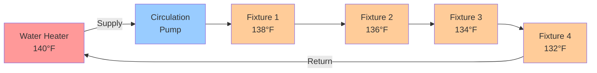

## Overview

Series loop distribution systems route domestic hot water through a continuous loop that passes sequentially through all fixtures before returning to the water heater. A circulation pump maintains constant flow, ensuring hot water remains immediately available at all points of use. This configuration minimizes wait time but introduces progressive temperature drop along the loop and continuous heat loss.

The series loop represents the simplest recirculation topology, historically common in small residential applications and still used where fixture count is limited and temperature uniformity requirements are modest.

## System Configuration

### Physical Layout

The series loop consists of:

1. **Supply line** - Exits water heater at full supply temperature
2. **Loop piping** - Continuous run connecting all fixtures sequentially
3. **Fixture connections** - Tee connections at each point of use
4. **Return line** - Completes circuit back to water heater inlet or dedicated return connection
5. **Circulation pump** - Maintains continuous flow (typically 0.5-2 gpm total loop flow)

## Temperature Drop Analysis

Water temperature decreases progressively along the series loop due to heat loss through pipe walls. The temperature at any point depends on cumulative heat loss from the water heater to that location.

### Temperature Drop Equation

The temperature drop from the water heater to fixture $n$ is:

$$\Delta T_n = \sum_{i=1}^{n} \frac{q_i \cdot L_i}{\dot{m} \cdot c_p}$$

Where:
- $\Delta T_n$ = Temperature drop to fixture $n$ (°F)
- $q_i$ = Heat loss per unit length for pipe segment $i$ (BTU/hr·ft)
- $L_i$ = Length of pipe segment $i$ (ft)
- $\dot{m}$ = Mass flow rate (lb/hr)
- $c_p$ = Specific heat of water = 1.0 BTU/lb·°F

### Heat Loss Per Unit Length

For insulated pipe:

$$q = \frac{2\pi \cdot k_{ins} \cdot (T_w - T_a)}{\ln(r_o / r_i)}$$

Where:
- $k_{ins}$ = Thermal conductivity of insulation (BTU/hr·ft·°F)
- $T_w$ = Water temperature (°F)
- $T_a$ = Ambient temperature (°F)
- $r_o$ = Outer radius of insulation (ft)
- $r_i$ = Inner radius of insulation (pipe outer radius) (ft)

### Practical Temperature Drop

For typical residential installation with 1/2" copper pipe, 1/2" fiberglass insulation, 70°F ambient:

| Loop Length (ft) | Flow Rate (gpm) | Temperature Drop (°F) |
|------------------|-----------------|----------------------|
| 50 | 0.5 | 8-12 |
| 100 | 0.5 | 16-24 |
| 50 | 1.0 | 4-6 |
| 100 | 1.0 | 8-12 |

Higher flow rates reduce temperature drop but increase pumping energy.

## Pipe Sizing

Series loop piping must accommodate total circulation flow plus simultaneous fixture demand. Size based on:

### Velocity Constraint

$$v = \frac{Q}{A} = \frac{Q}{\pi r^2}$$

Maintain velocity below 8 ft/s to limit noise and erosion. For circulation-only flow:

| Pipe Size | Maximum Flow (gpm) | Velocity at Max (ft/s) |
|-----------|-------------------|------------------------|
| 1/2" | 3 | 7.8 |
| 3/4" | 6 | 7.5 |
| 1" | 12 | 7.9 |

### Pressure Drop

Minimize total loop pressure drop to reduce pumping energy:

$$\Delta P = f \cdot \frac{L}{D} \cdot \frac{\rho v^2}{2} + K \cdot \frac{\rho v^2}{2}$$

Target total loop pressure drop under 10 ft of head for residential applications.

## Series vs Parallel Comparison

| Parameter | Series Loop | Parallel (Home Run) |
|-----------|-------------|---------------------|
| **Piping complexity** | Simple continuous loop | Multiple dedicated lines |
| **Material cost** | Low | High |
| **Temperature uniformity** | Poor (progressive drop) | Excellent (equal supply) |
| **Flow balancing** | Not required | May require balancing valves |
| **Last fixture temperature** | Lowest in system | Equal to first fixture |
| **Heat loss** | Continuous from all piping | Continuous from trunk + branches |
| **Typical applications** | Small residential, ≤6 fixtures | Large residential, commercial |
| **Code compliance** | Limited by temperature requirements | Meets all temperature requirements |

## Applications and Limitations

### Appropriate Applications

Series loop systems work effectively when:
- Total loop length under 100 feet
- Fixture count under 6-8
- Temperature drop of 10-15°F is acceptable
- Simple installation is priority
- Residential buildings with compact layout

### Critical Limitations

1. **Progressive temperature drop** - Last fixture receives coolest water, may not meet code requirements (ASSE 1070 requires ≥120°F at fixtures for Legionella control)
2. **Poor load response** - Heavy draw at first fixture reduces temperature at downstream fixtures
3. **No redundancy** - Single circulation pump failure eliminates instant hot water at all fixtures
4. **Difficult expansion** - Adding fixtures requires loop modification
5. **Balancing impossible** - Cannot independently control temperature at different fixtures

## Design Considerations

### Insulation Requirements

All series loop piping must be insulated to R-4 minimum per IECC and ASHRAE 90.1. Higher insulation (R-6 to R-8) significantly reduces:
- Temperature drop along loop
- Operating cost (reduced heat loss)
- Required circulation flow rate

### Circulation Pump Selection

Select pump to provide:
- Flow rate: 0.5-2 gpm for residential loops
- Head: Overcome total loop pressure drop (typically 5-15 ft)
- Controls: Timer or aquastat for demand-based operation
- Efficiency: ECM motor for continuous operation

### Code Compliance

Check local plumbing code for:
- Minimum temperature at furthest fixture (typically 120°F within reasonable time)
- Maximum temperature at fixtures (120°F recommended, 140°F maximum per IPC)
- Backflow prevention requirements
- Legionella risk mitigation (ASHRAE 188)

## Operational Characteristics

Series loops provide instant hot water availability with continuous heat loss. Annual energy penalty for heat loss typically ranges from 1,500 to 4,000 kWh for residential installations, representing 20-40% of total water heating energy use. Timer-based or demand-activated circulation reduces this penalty by 40-70%.

Temperature variation along the loop creates user comfort issues when the last fixture experiences noticeably cooler water than the first. This limitation restricts series loop application to buildings where all fixtures are within close proximity and total loop length remains under 100 feet.
