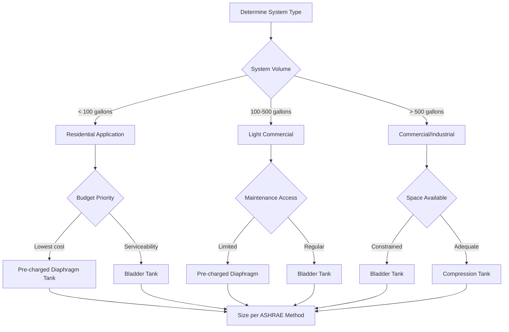
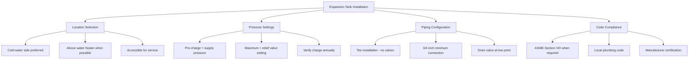

## Overview

Thermal expansion tanks protect domestic hot water systems from excessive pressure caused by volumetric expansion when water is heated. In closed systems with backflow preventers or check valves, heated water cannot expand back into the supply piping, creating potentially dangerous pressure conditions. Expansion tanks absorb this volume change, maintaining safe operating pressures and preventing relief valve discharge, equipment damage, and premature system failure.

## Physics of Thermal Expansion

Water exhibits significant volumetric expansion when heated. The coefficient of volumetric expansion for water varies with temperature but averages approximately 0.0002 per °F in the operating range of domestic hot water systems.

**Volumetric Expansion Calculation:**

$$\Delta V = V_0 \cdot \beta \cdot \Delta T$$

Where:
- $\Delta V$ = volume expansion (gallons)
- $V_0$ = initial water volume (gallons)
- $\beta$ = coefficient of volumetric expansion (1/°F)
- $\Delta T$ = temperature rise (°F)

**Simplified Expansion Factor:**

$$e = \frac{\Delta V}{V_0} = 0.00041 \cdot \Delta T$$

For typical residential systems heating from 40°F to 140°F:

$$e = 0.00041 \times (140 - 40) = 0.041 \text{ or } 4.1\%$$

A 50-gallon water heater generates approximately 2.05 gallons of expansion volume under these conditions.

## Tank Types and Selection

### Comparison of Expansion Tank Designs

| Tank Type | Construction | Pressure Range | Applications | Advantages | Limitations |
|-----------|-------------|----------------|--------------|------------|-------------|
| Diaphragm (Bladder) | Rubber diaphragm separates air/water | 25-150 psi | Residential, light commercial | No air absorption, compact | Limited life, temperature sensitive |
| Compression (Plain Steel) | Open steel tank, no separator | 25-125 psi | Large commercial systems | Durable, serviceable | Requires air charging, larger footprint |
| Bladder | Replaceable rubber bladder | 25-150 psi | Commercial, high-cycling | Field-serviceable bladder | Higher initial cost |
| Thermal Expansion (Pre-charged) | Fixed diaphragm, factory charged | 40-150 psi | Residential DHW only | Maintenance-free, compact | Non-serviceable, specific application |

### Tank Selection Decision Flow

## Expansion Tank Sizing

### ASHRAE Sizing Method

The required tank acceptance volume must accommodate the system's thermal expansion:

$$V_t = \frac{e \cdot V_s \cdot (P_f + 14.7)}{(P_f + 14.7) - (P_i + 14.7)}$$

Where:
- $V_t$ = minimum tank volume (gallons)
- $e$ = expansion factor (dimensionless)
- $V_s$ = system water volume (gallons)
- $P_f$ = maximum system pressure (psig)
- $P_i$ = tank pre-charge pressure (psig)

**Simplified Form:**

$$V_t = \frac{e \cdot V_s \cdot P_f}{P_f - P_i}$$

### Practical Sizing Example

**Given:**
- Water heater capacity: 80 gallons
- Temperature rise: 40°F to 140°F (ΔT = 100°F)
- Relief valve setting: 150 psig
- Supply pressure: 60 psig
- Pre-charge pressure: 40 psig (typical for residential)

**Solution:**

1. Calculate expansion factor:
   $$e = 0.00041 \times 100 = 0.041$$

2. Calculate expanded volume:
   $$\Delta V = 80 \times 0.041 = 3.28 \text{ gallons}$$

3. Calculate minimum tank size:
   $$V_t = \frac{0.041 \times 80 \times 150}{150 - 40} = \frac{492}{110} = 4.47 \text{ gallons}$$

**Recommendation:** Select a 5-gallon expansion tank with appropriate pressure rating.

## Installation Requirements

### Critical Installation Parameters

### Standards and Code Requirements

**ASME Boiler and Pressure Vessel Code:**
- Section VIII Division 1: Expansion tanks exceeding 120 gallons and 50 psig require ASME certification
- Stamp indicates third-party inspection and code compliance
- Pressure relief devices required per UG-125 through UG-136

**ASHRAE Applications Handbook:**
- Chapter 51 (Service Water Heating): Expansion tank sizing methodology
- Recommends safety factor of 1.1-1.25 on calculated volume
- Pre-charge pressure should equal static fill pressure

**Uniform Plumbing Code (UPC) and International Plumbing Code (IPC):**
- Mandatory expansion tank installation in closed systems
- Must be sized for system volume and temperature differential
- Installation on cold water side recommended but not always required

### Pre-charge Pressure Optimization

Proper pre-charge pressure maximizes tank acceptance volume:

$$P_i = P_{static} + 5 \text{ psi}$$

Where $P_{static}$ is the static fill pressure at the tank location. For multi-story buildings:

$$P_{static} = P_{street} - \frac{h}{2.31}$$

Where:
- $P_{street}$ = supply pressure (psig)
- $h$ = height above supply (feet)
- 2.31 = conversion factor (ft of water per psi)

## Operational Considerations

**Failure Modes and Diagnostics:**

1. **Waterlogged tank:** Pre-charge pressure lost, no cushion effect, relief valve discharge
2. **Undersized tank:** Frequent relief valve operation, high system pressure
3. **Failed diaphragm:** Water in air chamber, reduced acceptance volume
4. **Incorrect pre-charge:** Inefficient operation, pressure fluctuations

**Testing Procedure:**

1. Isolate system, drain pressure
2. Check air-side pressure with tire gauge at Schrader valve
3. Compare to specification (typically 40-50 psi residential)
4. Recharge if low using standard air compressor
5. Never exceed maximum rated pressure

**Maintenance Schedule:**

- Annual pre-charge verification
- Quarterly visual inspection for leaks, corrosion
- Check system pressure during heat-up cycle
- Replace diaphragm tanks every 5-10 years depending on cycling

## Safety and Protection

Expansion tanks work in conjunction with temperature and pressure relief valves, not as replacements. The T&P valve provides ultimate overpressure protection if the expansion tank fails or is undersized. Proper system design includes both components as defense-in-depth against catastrophic failure.

The expansion tank prevents nuisance relief valve discharge and water waste while extending equipment life by controlling pressure cycling. In potable water systems, tanks must be rated for drinking water service with appropriate NSF certification or equivalent.

---

**Related Topics:**
- Pressure Relief Valve Sizing and Selection
- Backflow Prevention Devices
- Water Heater System Design
- Closed-Loop Hydronic Expansion Control