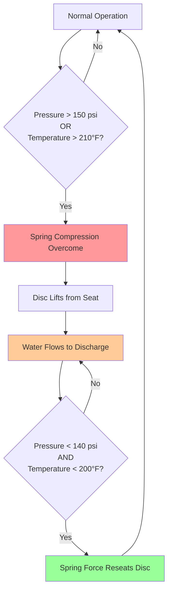
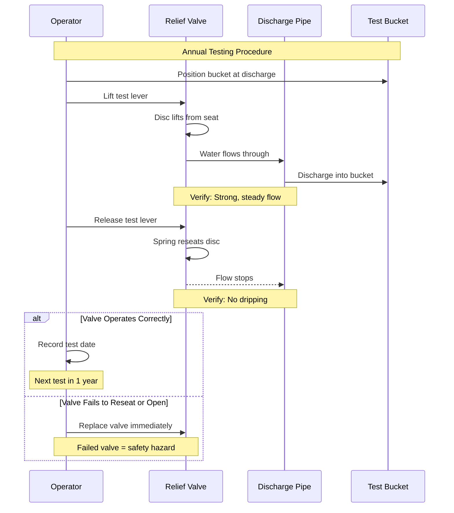

## Overview

Temperature and pressure (T&P) relief valves represent the primary safety device protecting domestic hot water systems from catastrophic failure due to excessive pressure or temperature. ASME Section IV and plumbing codes mandate these devices on all water heaters and storage tanks to prevent vessel rupture from thermal expansion, pressure buildup, or control failures.

The relief valve operates on two independent principles: opening at a preset pressure (typically 150 psi for residential applications) or at a preset temperature (210°F standard), whichever occurs first. This dual-function design ensures protection against both pressure vessel overpressure conditions and runaway temperature scenarios where controls fail.

## Operating Principles and Physics

### Pressure Relief Mechanism

The pressure relief function operates via spring-loaded mechanism where system pressure acts on the valve disc area:

$$F_{system} = P_{system} \cdot A_{disc}$$

When system pressure force exceeds spring force, the valve opens:

$$P_{system} \cdot A_{disc} > F_{spring}$$

The valve is calibrated to open at the set pressure with tolerance of ±3 psi per ASME standards.

### Temperature Relief Mechanism

Temperature relief utilizes a fusible element or thermal expansion actuator positioned to sense tank temperature directly. When water temperature reaches 210°F, thermal expansion of the sensing element overcomes spring force independently of pressure:

$$\Delta L = \alpha \cdot L_0 \cdot \Delta T$$

Where:
- $\Delta L$ = element expansion length
- $\alpha$ = coefficient of thermal expansion
- $L_0$ = original element length
- $\Delta T$ = temperature rise above calibration point

## Relief Capacity Calculations

### Required Relief Capacity

ASME Section IV specifies minimum relieving capacity based on heat input rate:

$$Q_{relief} = \frac{Q_{input}}{c \cdot \rho \cdot \Delta T}$$

Where:
- $Q_{relief}$ = required relief capacity (lb/hr or gpm)
- $Q_{input}$ = maximum heat input (BTU/hr)
- $c$ = specific heat of water (1.0 BTU/lb·°F)
- $\rho$ = water density (8.33 lb/gal)
- $\Delta T$ = temperature rise (typically 150°F)

For water heaters, minimum capacity:

$$C_{min} = \frac{4000 \text{ BTU/hr per kW}}{1000} = 4 \text{ BTU/hr per kW input}$$

### Flow Rate Through Relief Valve

Actual flow through an open relief valve follows orifice flow equations:

$$Q = K \cdot A \cdot \sqrt{2g \cdot h_{pressure}}$$

Converting to pressure head:

$$Q = 0.6 \cdot A \cdot \sqrt{\frac{2 \cdot P \cdot 144}{\rho}}$$

Where:
- $Q$ = flow rate (ft³/s)
- $A$ = orifice area (ft²)
- $P$ = relief pressure (psi)
- $\rho$ = water density (62.4 lb/ft³)



## Standard Pressure and Temperature Settings

| Application | Pressure Setting | Temperature Setting | ASME Rating |
|-------------|------------------|---------------------|-------------|
| Residential Water Heater | 150 psi | 210°F | Section IV |
| Commercial Water Heater | 150 psi | 210°F | Section IV |
| Boiler w/ DHW Coil | 30-125 psi | 210°F | Section IV |
| Storage Tank Only | 150 psi | 210°F | Section IV |
| High-Rise Building | 150-175 psi | 210°F | Section IV |

## Sizing Requirements

### Valve Size Selection

Relief valve sizing depends on heat input rate and tank capacity. Minimum sizes per ASME Section IV:

| Heat Input Rate | Minimum Valve Size | Relief Capacity (BTU/hr) |
|-----------------|-------------------|--------------------------|
| Up to 200,000 BTU/hr | 3/4 inch | 200,000 |
| 200,001-300,000 BTU/hr | 3/4 inch | 300,000 |
| 300,001-400,000 BTU/hr | 1 inch | 400,000 |
| 400,001-500,000 BTU/hr | 1 inch | 500,000 |
| 500,001-750,000 BTU/hr | 1-1/4 inch | 750,000 |
| 750,001-1,000,000 BTU/hr | 1-1/2 inch | 1,000,000 |

### Capacity Verification

Verify relief valve capacity exceeds heat input:

$$\frac{Q_{valve}}{Q_{input}} \geq 1.0$$

For gas-fired heaters with total input $Q_{gas}$:

$$Q_{valve} \geq Q_{gas} \times 0.8 \times 1.1$$

The 0.8 factor accounts for combustion efficiency, 1.1 provides 10% safety margin.

## Discharge Piping Requirements

### Pipe Sizing

Discharge pipe size must equal or exceed valve outlet size. **Never reduce discharge pipe diameter.** Pressure drop through discharge piping must not exceed 3% of set pressure.

Maximum discharge pipe length calculation:

$$L_{max} = \frac{\Delta P_{allow} \cdot d^5}{f \cdot Q^2 \cdot \rho}$$

For practical applications, limit discharge runs:

| Valve Size | Maximum Discharge Length | Minimum Pipe Size |
|------------|-------------------------|-------------------|
| 3/4 inch | 30 feet | 3/4 inch |
| 1 inch | 30 feet | 1 inch |
| 1-1/4 inch | 30 feet | 1-1/4 inch |
| 1-1/2 inch | 30 feet | 1-1/2 inch |

### Discharge Termination

Plumbing codes (IPC, UPC, IRC) mandate specific discharge termination:

- **Height**: 6 to 24 inches above floor or ground level
- **Location**: Visible location where discharge is observable
- **Protection**: Protected from freezing in cold climates
- **Drainage**: Must not create slip hazard or property damage
- **Air gap**: No direct connection to drainage system
- **Material**: Approved piping material (copper, CPVC, PEX where approved)

```mermaid
flowchart TB
    subgraph Tank["Water Heater/Storage Tank"]
        A[Hot Water] --> B[T&P Valve Sensor<br/>210°F / 150 psi]
    end

    subgraph Valve["Relief Valve Body"]
        B --> C{Activation<br/>Condition Met?}
        C -->|Normal| D[Valve Closed]
        C -->|T>210°F or P>150psi| E[Valve Opens]
    end

    subgraph Discharge["Discharge Piping"]
        E --> F[Full-Size Discharge Pipe]
        F --> G[No Valves or Restrictions]
        G --> H[Drain to Approved Location]
        H --> I[Termination:<br/>6-24" Above Floor<br/>Visible Location]
    end

    D -.Monitoring.-> B
    I --> J[Drainage/Safe Disposal]

    style E fill:#ff9999
    style F fill:#ffcc99
    style I fill:#99ccff
```

## Code Requirements

### ASME Section IV

- Relief valve required on all water heaters and storage tanks
- Valve must be ASME stamped and certified
- Set pressure not to exceed maximum allowable working pressure (MAWP)
- Temperature element must sense water temperature directly
- No shutoff valve permitted between tank and relief valve

### International Plumbing Code (IPC)

Section 504.6 specifies:
- Relief valve required on water supply systems exceeding 80 psi
- T&P relief valve required on all water heaters
- Discharge to approved location preventing scalding or property damage
- Discharge pipe same size as valve outlet, no threads on termination end

### Uniform Plumbing Code (UPC)

Section 608.3 requirements:
- Relief valve capacity matches or exceeds heat input
- Discharge piping pitch minimum 1/4 inch per foot toward termination
- Material compatible with 210°F water
- No check valves or shutoff valves in discharge line

## Installation Requirements

### Valve Location

Install T&P relief valve in tank top 6 inches of water space where highest temperature occurs. For horizontal tanks, install at end of tank in top portion.

Sensing element must contact water directly - not vapor space above water line.

### Piping Connections

- Use dielectric unions where dissimilar metals contact
- Apply pipe dope or PTFE tape to male threads only
- Torque to manufacturer specifications (typically 25-30 ft-lb for 3/4" valve)
- Support discharge piping independently - do not use valve body for support

### Common Installation Errors

**Never:**
- Install valve sideways or upside down
- Cap or plug discharge piping
- Reduce discharge pipe size below valve outlet size
- Install unions, valves, or tees in discharge line
- Extend discharge pipe beyond code maximum (typically 30 feet)
- Thread the discharge pipe termination end

## Testing and Maintenance

### Manual Testing Procedure

Annual testing recommended, required by some jurisdictions:

1. **Place bucket** under discharge pipe termination
2. **Lift test lever** slowly to open position
3. **Observe flow** - water should flow freely from discharge
4. **Release lever** - valve should reseat completely with no dripping
5. **Check for leaks** at valve body connections

**If valve fails to operate or reseat properly, replace immediately.**

### Automatic Test Verification

For critical applications, install pressure gauge and thermometer to verify:

$$P_{test} = P_{set} \pm 3 \text{ psi}$$

$$T_{test} = 210°F \pm 5°F$$

Test pressure should cause valve opening within tolerance band.

### Replacement Schedule

Replace relief valves:
- Every 5 years in high-hardness water areas (>180 mg/L CaCO₃)
- Every 10 years in moderate water quality conditions
- Immediately if mineral deposits visible on seat area
- Immediately if valve drips continuously (seat damaged)
- After any discharge event (thermal expansion may damage seat)



## Troubleshooting

### Continuous Dripping

**Cause**: Mineral deposits on seat, thermal expansion lifting valve slightly, damaged seat

**Solution**:
1. Check system pressure - install expansion tank if >80 psi
2. Verify pressure reducing valve functioning
3. Replace relief valve if dripping persists

### No Flow During Test

**Cause**: Valve seized from mineral deposits, incorrect installation, defective valve

**Solution**: Replace valve immediately - valve failure risk

### Discharge During Normal Operation

**Cause**: Excessive pressure from thermal expansion, PRV failure, undersized expansion tank

**Solution**:
1. Install or resize expansion tank: $V_{tank} = V_{water} \times \frac{\Delta T}{T_0} \times \frac{P_{max}}{P_{accept}}$
2. Verify PRV setting and operation
3. Check for heat source overheating (thermostat failure)

## Safety Considerations

Relief valve discharge represents 210°F water at high flow rates - scalding hazard. Route discharge to safe location:

- Not directed at personnel traffic areas
- Protected from contact during discharge
- Adequate drainage to handle full relief capacity
- Visible to indicate activation requiring investigation

**Critical**: Relief valve protects pressure vessel from rupture. A 50-gallon water heater at 210°F contains approximately 450,000 BTU of energy. Vessel rupture releases this energy explosively - relief valve prevents this catastrophic failure mode.

Ensure relief valve remains operational through regular testing and timely replacement. This single device prevents injuries, fatalities, and property damage from water heater explosions.

## Design Checklist

- [ ] Relief valve ASME Section IV certified and stamped
- [ ] Pressure setting ≤ MAWP of tank (typically 150 psi)
- [ ] Temperature setting = 210°F standard
- [ ] Valve capacity ≥ heat input rate
- [ ] Valve located in top 6 inches of tank
- [ ] Sensing element contacts water directly
- [ ] Discharge pipe size ≥ valve outlet size
- [ ] No valves or restrictions in discharge line
- [ ] Discharge terminates 6-24 inches above floor
- [ ] Discharge location visible and safe
- [ ] Discharge piping protected from freezing
- [ ] No threads on discharge termination
- [ ] Testing schedule established
- [ ] Expansion tank sized and installed (closed systems)
