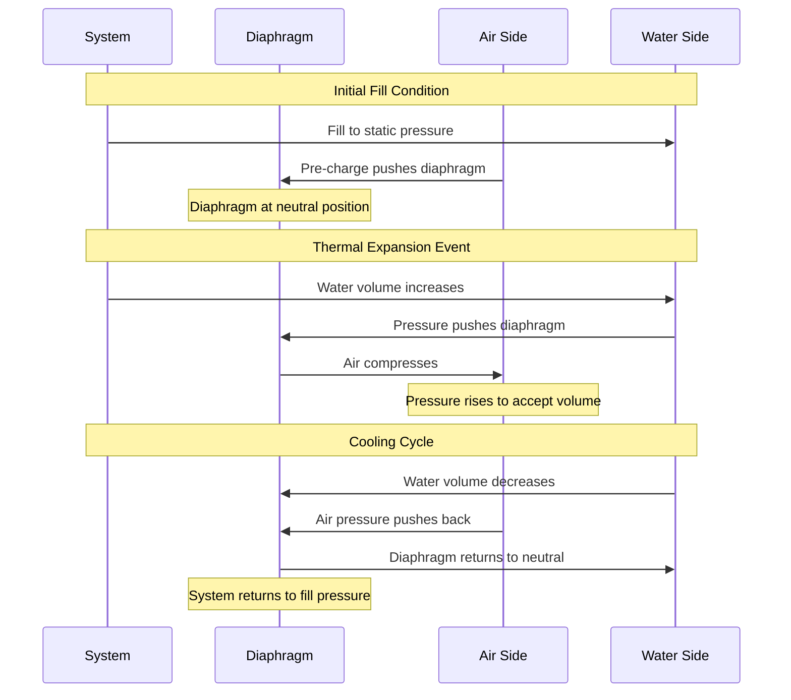

## Overview

Pre-charge pressure is the air pressure established on the air side of an expansion tank diaphragm or bladder before the system is filled with water. Proper pre-charge pressure ensures optimal tank performance, prevents waterlogging, and maximizes the tank's acceptance volume. The pre-charge must be precisely matched to system conditions to prevent premature pressure relief valve operation or inadequate thermal expansion accommodation.

## Pre-Charge Pressure Fundamentals

### Basic Principle

The pre-charge pressure must equal the static water pressure at the tank connection point when the system is cold and filled. This relationship ensures that the diaphragm or bladder remains in neutral position at fill conditions, providing maximum available expansion volume.

**Pre-Charge Pressure Formula:**

$$P_{pc} = P_{static} + P_{atm}$$

Where:
- $P_{pc}$ = pre-charge pressure (psig)
- $P_{static}$ = static water pressure at tank location (psig)
- $P_{atm}$ = atmospheric pressure (0 psig at gauge reference)

### Static Pressure Calculation

Static pressure at the tank connection depends on the vertical distance between the system fill point and the tank location:

$$P_{static} = P_{fill} + \frac{h \cdot \rho \cdot g}{144}$$

Where:
- $P_{fill}$ = system fill pressure (psig)
- $h$ = vertical height from fill point to tank (ft)
- $\rho$ = water density (62.4 lb/ft³ at 60°F)
- $g$ = gravitational acceleration (32.2 ft/s²)
- 144 = conversion factor (in²/ft²)

**Simplified form:**

$$P_{static} = P_{fill} + 0.433 \cdot h$$

For tanks below the fill point, h is negative, reducing static pressure.

## Typical Pre-Charge Pressures

| Application | Pre-Charge Range | Notes |
|------------|------------------|-------|
| Single-family residential | 40-50 psig | Matches typical municipal supply |
| Multi-story residential | 50-80 psig | Varies with floor level |
| Commercial low-rise | 45-60 psig | Ground floor installations |
| Commercial high-rise | 60-125 psig | Zone-dependent, upper floors |
| Institutional | 50-100 psig | Based on system design pressure |

## ASME Standards and Code Requirements

### ASME Section VIII

Expansion tanks used in domestic hot water systems must comply with ASME Boiler and Pressure Vessel Code Section VIII, Division 1 for unfired pressure vessels. Key requirements include:

- Maximum allowable working pressure (MAWP) rating
- Pressure relief device coordination
- Nameplate documentation of design pressure
- Hydrostatic test pressure (minimum 1.5× MAWP)

### Pre-Charge Safety Factor

Pre-charge pressure must not exceed 80% of the pressure relief valve set point to ensure adequate margin before relief operation:

$$P_{pc} \leq 0.80 \cdot P_{relief}$$

For standard 150 psig relief valves in residential systems:

$$P_{pc} \leq 0.80 \times 150 = 120 \text{ psig (maximum)}$$

## Tank Operation Sequence

## Diaphragm vs. Bladder Tank Considerations

### Diaphragm-Type Tanks

**Characteristics:**
- Fixed diaphragm divides tank into air and water chambers
- Air pre-charge on top chamber (typically)
- Water enters bottom chamber
- Pre-charge accessible via Schrader valve on air side

**Pre-Charge Verification:**
1. Isolate tank from system
2. Drain water side completely
3. Check air pressure with tire gauge
4. Adjust to specified pre-charge

### Bladder-Type Tanks

**Characteristics:**
- Replaceable bladder contains water
- Air surrounds bladder in shell
- Pre-charge accessible via Schrader valve on shell
- Complete isolation between air and water

**Pre-Charge Verification:**
1. System may remain pressurized
2. Close isolation valve
3. Check air pressure at shell valve
4. Adjust to match static pressure

## Pre-Charge Adjustment Procedure

### Required Tools
- Tire pressure gauge (0-100 psig minimum)
- Air compressor or hand pump
- System pressure gauge
- Valve core tool (if replacement needed)

### Step-by-Step Adjustment

**For New Installation:**

1. **Determine Target Pre-Charge**
   - Measure vertical distance from PRV to tank
   - Calculate static pressure: $P_{static} = P_{fill} + 0.433h$
   - Set target pre-charge equal to static pressure

2. **Pre-Charge Tank Before Installation**
   - Connect pressure gauge to air valve
   - Add air to reach target pressure
   - Verify pressure stabilizes
   - Install tank in system

3. **Verify After Fill**
   - Fill system to design pressure
   - Check tank water side pressure matches system
   - Confirm no water discharge from air valve

**For Existing Installation:**

1. **Isolate and Drain**
   - Close tank isolation valve
   - Open drain valve on water side
   - Drain completely (no water from air valve)

2. **Check Current Pre-Charge**
   - Connect gauge to air valve
   - Record pressure
   - Compare to calculated target

3. **Adjust Pressure**
   - Add air if below target
   - Release air if above target
   - Verify final pressure

4. **Refill and Test**
   - Close drain valve
   - Open isolation valve
   - Verify system pressure stabilizes
   - Check for proper operation

## Pressure Setting Table

| System Fill Pressure | Tank Location | Height Difference | Required Pre-Charge |
|---------------------|---------------|-------------------|---------------------|
| 50 psig | Above PRV | +20 ft | 58.7 psig |
| 50 psig | At PRV level | 0 ft | 50.0 psig |
| 50 psig | Below PRV | -20 ft | 41.3 psig |
| 60 psig | Above PRV | +30 ft | 73.0 psig |
| 60 psig | At PRV level | 0 ft | 60.0 psig |
| 60 psig | Below PRV | -15 ft | 53.5 psig |

## Common Pre-Charge Errors

### Over-Pressurization
**Symptoms:** Insufficient expansion acceptance, frequent PRV discharge
**Cause:** Pre-charge exceeds static pressure
**Solution:** Bleed air to correct pressure

### Under-Pressurization
**Symptoms:** Waterlogging, reduced acceptance volume, system pressure fluctuations
**Cause:** Pre-charge below static pressure
**Solution:** Add air to match static pressure

### Pressure Loss Over Time
**Symptoms:** Gradual performance degradation
**Cause:** Air valve leakage, diaphragm permeation
**Solution:** Annual pre-charge verification and adjustment

## Field Verification Methods

### Static Pressure Test
1. Record system cold fill pressure at tank location
2. Isolate and drain tank
3. Measure pre-charge pressure
4. Compare values—should match within ±2 psi

### Acceptance Volume Test
1. Note initial system pressure (cold)
2. Heat water to operating temperature
3. Record maximum system pressure
4. Calculate pressure rise—should remain below PRV setting

$$\Delta P = P_{hot} - P_{cold} < (P_{relief} - P_{static})$$

## Maintenance Requirements

**Annual Inspection:**
- Verify pre-charge pressure matches system static pressure
- Check for air valve leakage
- Inspect for external corrosion or damage
- Document pressure readings

**5-Year Service:**
- Complete system drain and pre-charge verification
- Internal inspection (if accessible)
- Diaphragm/bladder condition assessment
- Replace if pressure loss exceeds 10% annually

## Summary

Proper pre-charge pressure setting is critical for expansion tank performance in domestic hot water systems. The pre-charge must equal the static water pressure at the tank location to ensure neutral diaphragm position at fill conditions. Field adjustment requires system isolation, complete drainage of the water side, and precise pressure measurement using calibrated gauges. Compliance with ASME standards and regular maintenance verification ensure reliable thermal expansion accommodation and system protection.
