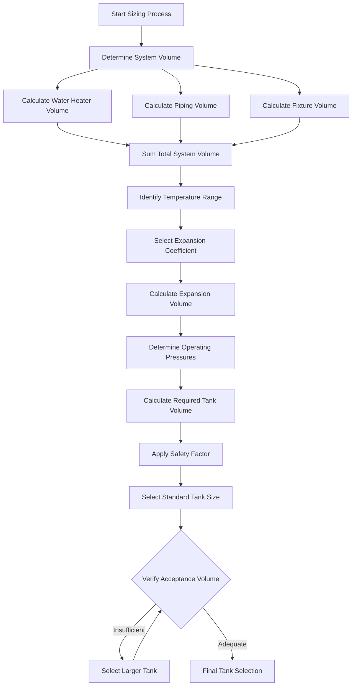

## Overview

Expansion tank sizing for domestic hot water systems requires precise calculation of thermal expansion volume and proper selection of tank acceptance volume. Undersized tanks cause relief valve discharge and system damage, while oversized tanks represent unnecessary capital expense.

## Fundamental Sizing Equation

The basic expansion tank sizing equation per ASME Section IV and ASHRAE guidelines:

$$V_t = \frac{V_s \times e}{1 - \frac{P_1}{P_2}}$$

Where:
- $V_t$ = Required tank volume (gallons)
- $V_s$ = Total system water volume (gallons)
- $e$ = Coefficient of thermal expansion (dimensionless)
- $P_1$ = System fill pressure (absolute, psia)
- $P_2$ = Maximum allowable pressure (absolute, psia)

## Thermal Expansion Coefficient

Water density change drives expansion volume. The coefficient depends on temperature rise:

$$e = \frac{\rho_{cold} - \rho_{hot}}{\rho_{cold}}$$

**Thermal Expansion Coefficients by Temperature:**

| Initial Temp (°F) | Final Temp (°F) | Expansion Coefficient (e) | Volume Increase (%) |
|-------------------|-----------------|---------------------------|---------------------|
| 40 | 140 | 0.0247 | 2.47 |
| 50 | 140 | 0.0225 | 2.25 |
| 60 | 140 | 0.0204 | 2.04 |
| 40 | 160 | 0.0322 | 3.22 |
| 50 | 160 | 0.0301 | 3.01 |
| 60 | 160 | 0.0280 | 2.80 |
| 40 | 180 | 0.0393 | 3.93 |

## System Volume Determination

Accurate system volume calculation includes all water-containing components:

1. **Water Heater Tank Volume**: Manufacturer nameplate capacity
2. **Piping Volume**: Internal diameter-based calculation
3. **Fixture Connections**: Nominal volume in distribution piping

$$V_{pipe} = \frac{\pi d^2 L}{4 \times 231}$$

Where:
- $d$ = Internal pipe diameter (inches)
- $L$ = Total pipe length (inches)
- 231 = Conversion factor (cubic inches per gallon)

**Typical Pipe Volumes:**

| Nominal Size | Internal Diameter (in) | Volume (gal/ft) |
|--------------|------------------------|-----------------|
| 1/2" | 0.622 | 0.0157 |
| 3/4" | 0.824 | 0.0277 |
| 1" | 1.049 | 0.0449 |
| 1-1/4" | 1.380 | 0.0778 |
| 1-1/2" | 1.610 | 0.1059 |
| 2" | 2.067 | 0.1744 |

## Acceptance Volume Calculation

Tank acceptance volume represents the usable expansion capacity between operating pressures:

$$V_a = V_t \left(1 - \frac{P_1}{P_2}\right)$$

This must equal or exceed the thermal expansion volume:

$$V_a \geq V_s \times e$$

## Sizing Methodology

## Pressure Considerations

**Absolute Pressure Conversion:**

$$P_{absolute} = P_{gauge} + P_{atmospheric}$$

For standard conditions: $P_{atmospheric} = 14.7 \text{ psia}$

**Typical Pressure Values:**

| Parameter | Residential (psig) | Commercial (psig) |
|-----------|-------------------|-------------------|
| Fill Pressure | 40-50 | 50-80 |
| Maximum Operating | 125 | 150 |
| Relief Valve Setting | 150 | 150-200 |
| Design Pressure | 150 | 200-300 |

## Worked Example

**System Parameters:**
- Water heater: 80 gallons
- Piping: 100 ft of 3/4" copper
- Temperature: 50°F to 140°F
- Fill pressure: 50 psig
- Maximum pressure: 125 psig

**Calculation Steps:**

1. **System Volume:**
   - Heater: 80 gallons
   - Piping: $100 \times 0.0277 = 2.77$ gallons
   - Total: $V_s = 82.77$ gallons

2. **Expansion Coefficient:**
   - From table: $e = 0.0225$

3. **Pressure Terms:**
   - $P_1 = 50 + 14.7 = 64.7$ psia
   - $P_2 = 125 + 14.7 = 139.7$ psia

4. **Tank Volume:**

$$V_t = \frac{82.77 \times 0.0225}{1 - \frac{64.7}{139.7}} = \frac{1.862}{0.537} = 3.47 \text{ gallons}$$

5. **Safety Factor (1.15):**
   - Required: $3.47 \times 1.15 = 3.99$ gallons
   - Select: 4.5-gallon standard tank

## Design Verification

## Standards and Code Requirements

**ASME Boiler and Pressure Vessel Code:**
- Section IV: Heating boilers (applicable to DHW systems)
- Section VIII: Pressure vessels (expansion tank construction)

**Key Requirements:**
- Tanks must be ASME-rated for system design pressure
- Precharge pressure must be set to system fill pressure
- Installation requires isolation valve and drain connection
- Location must prevent waterlogging

**ASHRAE Applications Handbook:**
- Chapter 50: Service Water Heating
- Provides expansion coefficients and sizing methodology
- Recommends 10-15% safety factor for residential applications

## Safety Factor Application

Apply safety factors to account for:

| Condition | Recommended Factor |
|-----------|-------------------|
| Residential systems | 1.10-1.15 |
| Commercial systems | 1.15-1.25 |
| High-temperature systems (>180°F) | 1.25-1.35 |
| Systems with poor volume data | 1.30-1.50 |

## Common Sizing Errors

1. **Using gauge pressure instead of absolute pressure** in calculations
2. **Neglecting piping volume** in large distribution systems
3. **Incorrect expansion coefficient** for actual temperature range
4. **Undersizing for high static pressure** installations
5. **Ignoring precharge pressure requirements** leading to waterlogging

---

**Engineering Note:** This sizing methodology applies to closed DHW systems with check valves or backflow preventers that isolate the system from municipal supply. Open systems without isolation do not require expansion tanks as thermal expansion relieves back to the supply.