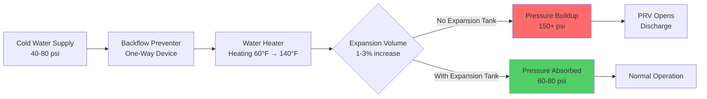
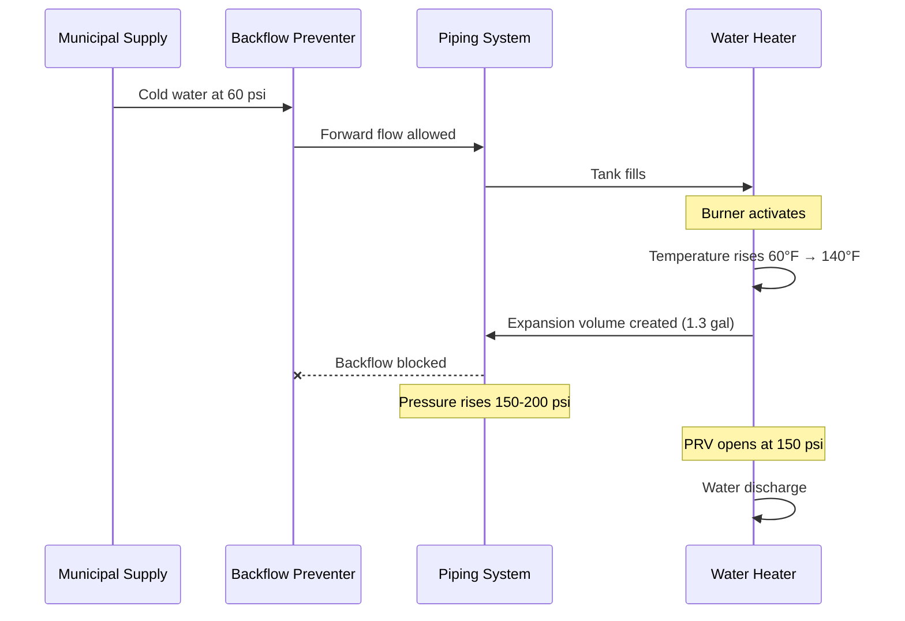
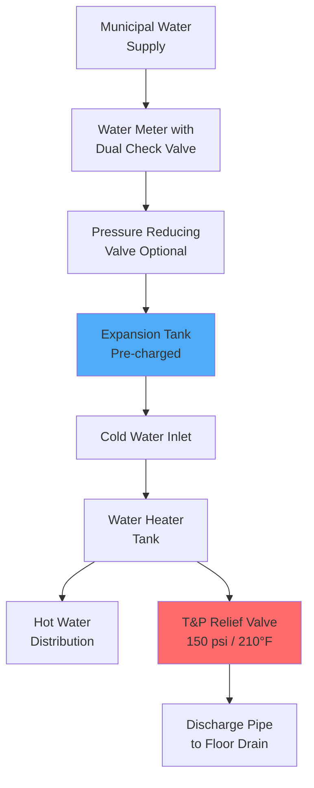

## Water Expansion Physics

Water exhibits volumetric expansion when heated, creating substantial pressure increases in closed plumbing systems. This phenomenon occurs because water molecules gain kinetic energy and occupy greater volume as temperature rises.

### Volumetric Expansion Equation

The volume change of heated water follows:

$$\Delta V = V_0 \beta \Delta T$$

Where:
- $\Delta V$ = volume increase (gal or L)
- $V_0$ = initial water volume (gal or L)
- $\beta$ = coefficient of volumetric expansion (1/°F or 1/°C)
- $\Delta T$ = temperature change (°F or °C)

### Water Expansion Coefficients

| Temperature Range | β (×10⁻⁴ per °F) | β (×10⁻⁴ per °C) | Volume Increase (%) |
|-------------------|-------------------|-------------------|---------------------|
| 40°F to 140°F | 3.83 | 6.89 | 3.83% |
| 50°F to 140°F | 3.51 | 6.32 | 3.16% |
| 60°F to 140°F | 3.20 | 5.76 | 2.56% |
| 40°F to 160°F | 4.78 | 8.60 | 5.74% |
| 60°F to 180°F | 5.12 | 9.22 | 6.14% |

For a typical 50-gallon water heater heated from 60°F to 140°F, expansion volume:

$$\Delta V = 50 \text{ gal} \times 0.0256 = 1.28 \text{ gal}$$

## Closed System Pressure Buildup

### Pressure-Volume Relationship

In a completely closed system, water's near-incompressibility causes rapid pressure escalation. The pressure increase follows:

$$\Delta P = \frac{\beta \Delta T}{k}$$

Where:
- $\Delta P$ = pressure increase (psi)
- $k$ = water compressibility (approximately 3.0 × 10⁻⁶ per psi at 100°F)
- $\beta$ = volumetric expansion coefficient

**Critical result**: Heating water from 60°F to 140°F in a completely rigid, closed system generates pressures exceeding 1,000 psi, far beyond the 150 psi rating of residential water heaters and 80 psi typical pressure relief valve settings.

### System Pressure Flow

## Backflow Preventer Impact

Backflow prevention devices create closed systems by preventing reverse flow to municipal water supplies. Once installed, thermal expansion cannot return to the supply piping.

### Types Creating Closed Systems

1. **Check valves** - spring-loaded or swing type
2. **Dual check valve assemblies** - residential water meters
3. **Reduced pressure zone (RPZ) assemblies** - commercial installations
4. **Pressure vacuum breakers** - irrigation backflow prevention

### Pressure Escalation Mechanism

## Consequences of Uncontrolled Expansion

### Pressure Relief Valve Operation

Temperature and pressure relief valves (T&P or TPR valves) rated at 150 psi and 210°F serve as last-resort safety devices per ASME CSD-1. Frequent discharge indicates undersized expansion control.

**Problems from repeated PRV discharge:**
- Valve seat degradation leading to leakage
- Mineral deposit accumulation preventing proper sealing
- Premature valve failure requiring replacement
- Water damage from discharge piping leaks
- Energy waste from hot water loss

### System Component Stress

Elevated pressures stress:
- Water heater tank seams and welds
- Threaded pipe connections
- Fixture supply lines and valves
- Appliance inlet connections
- Pressure-rated component longevity

## Code-Mandated Solutions

### Expansion Tank Requirements

**Uniform Plumbing Code (UPC) Section 608.3**: "Where a backflow prevention device, check valve, or other device is installed that prevents dissipation of building pressure back into the water main, an approved listed expansion tank or other approved device having a similar function shall be installed."

**International Plumbing Code (IPC) Section 607.3**: Similar requirement mandating thermal expansion control when backflow prevention creates closed systems.

**ASME Section IV**: Establishes safety requirements for hot water storage vessels including maximum working pressure (160 psi for residential units) and mandatory pressure relief device installation.

### Expansion Tank Sizing

Minimum tank size calculation:

$$V_t = \frac{V_s \times \beta \times \Delta T}{1 - \frac{P_1}{P_2}}$$

Where:
- $V_t$ = expansion tank volume (gal)
- $V_s$ = system water volume (gal)
- $\beta$ = volumetric expansion coefficient
- $P_1$ = initial system pressure (psi absolute)
- $P_2$ = maximum allowable pressure (psi absolute)

**Typical sizing** for residential water heaters:
- 40-50 gallon heater: 2-gallon expansion tank
- 60-80 gallon heater: 4.5-gallon expansion tank
- 100-120 gallon heater: 8-gallon expansion tank

### Installation Requirements

1. **Location**: Cold water supply line between backflow preventer and water heater
2. **Orientation**: Vertical preferred, air chamber upward
3. **Pre-charge pressure**: Match static water pressure (typically 50-60 psi)
4. **Support**: Adequate piping support to prevent stress on connections
5. **Accessibility**: Serviceable location for pressure verification and replacement

## System Configuration

## Diagnostic Procedures

### Identifying Closed System Conditions

1. Observe T&P valve discharge during heating cycles
2. Install pressure gauge on drain valve during heating
3. Check for backflow prevention devices at meter or main shutoff
4. Verify expansion tank presence and pre-charge pressure
5. Monitor pressure fluctuations between cold and heated states

### Pre-charge Pressure Verification

Correct expansion tank pre-charge equals static water pressure:

1. Shut off water supply to heater
2. Open hot water fixture to drain system pressure
3. Measure air pressure at tank Schrader valve
4. Adjust to match static supply pressure (typically 50-60 psi)
5. Restore water supply and verify operation

Waterlogged expansion tanks (diaphragm failure) lose all functionality and require immediate replacement to prevent system overpressure conditions.

## Conclusion

Thermal expansion control represents a critical safety and longevity consideration in modern domestic hot water systems. The installation of backflow prevention devices transforms open systems into closed systems where water expansion generates destructive pressures. Proper expansion tank sizing, installation, and maintenance per ASME and plumbing code requirements prevents component damage, ensures safe operation, and extends equipment service life. All closed domestic hot water systems require expansion control as both an engineering necessity and code mandate.
