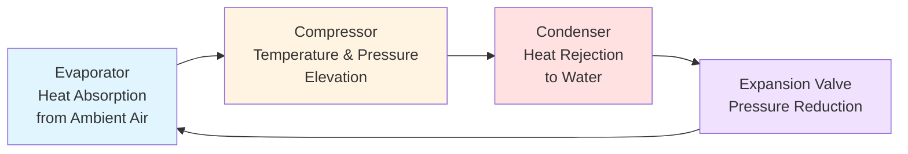
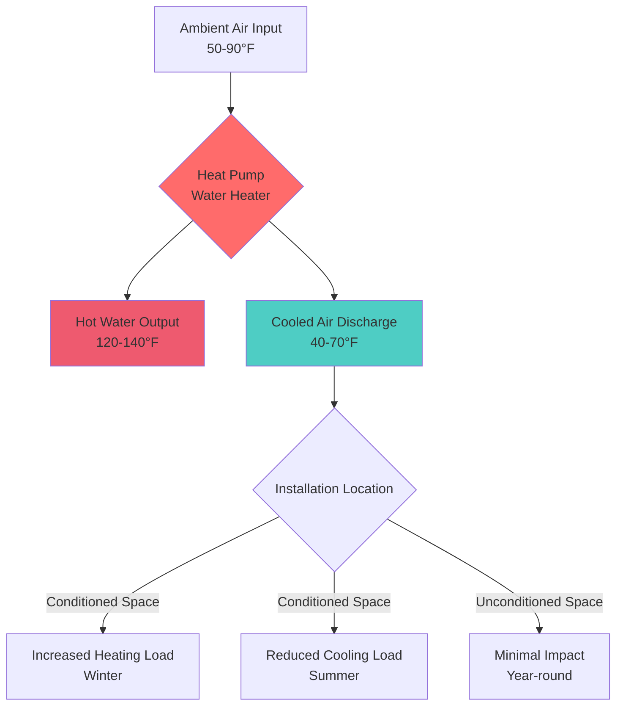

Heat pump water heaters (HPWHs) represent a fundamental departure from traditional resistance heating by leveraging vapor compression refrigeration cycles to transfer thermal energy from ambient air to domestic hot water. This technology achieves coefficient of performance (COP) values of 2.0–4.0, meaning 2–4 units of thermal energy delivered per unit of electrical energy consumed—a thermodynamic advantage impossible with resistance heating where COP is limited to 1.0.

## Thermodynamic Operating Principle

HPWHs extract thermal energy from surrounding air using the same vapor compression cycle employed in air conditioning and refrigeration systems, but with the condenser configured to reject heat into the water storage tank rather than outdoors.

### Vapor Compression Cycle for Water Heating

The refrigerant absorbs heat at the evaporator coil where ambient air is forced across finned tubes. At typical evaporator conditions, refrigerant vaporizes at temperatures of 0–10°F (-18 to -12°C), well below ambient air temperature of 50–90°F (10–32°C), creating a temperature difference that drives heat transfer according to:

$$Q_{evap} = \dot{m}_a c_{p,a} (T_{a,in} - T_{a,out})$$

where $\dot{m}_a$ is the air mass flow rate, $c_{p,a}$ is the specific heat of air (approximately 0.24 Btu/lb·°F or 1.005 kJ/kg·K), and the temperature differential typically ranges from 10–20°F (5.5–11°C).

The compressor elevates refrigerant pressure and temperature, delivering superheated vapor at 140–180°F (60–82°C) to the condenser coil wrapped around or immersed in the water storage tank. Heat rejection to water occurs through:

$$Q_{cond} = \dot{m}_w c_{p,w} (T_{w,out} - T_{w,in})$$

For water, $c_{p,w}$ = 1.0 Btu/lb·°F (4.186 kJ/kg·K). To heat 40 gallons (151 liters) from 55°F to 135°F (12.8°C to 57.2°C) requires:

$$Q_{total} = m_w c_{p,w} \Delta T = (40 \text{ gal} \times 8.34 \text{ lb/gal}) \times 1.0 \times (135 - 55) = 26,688 \text{ Btu}$$

At COP = 3.0, electrical energy required is $26,688 / 3.0 = 8,896$ Btu or 2.6 kWh. An equivalent resistance heater at COP = 1.0 would consume 7.8 kWh—three times the energy.

## Coefficient of Performance Analysis

The actual COP depends on the temperature lift between heat source (ambient air) and heat sink (water):

$$COP_{actual} = \frac{Q_{delivered}}{W_{compressor} + W_{fan}}$$

Theoretical maximum efficiency is bounded by the Carnot COP:

$$COP_{Carnot} = \frac{T_{cond}}{T_{cond} - T_{evap}}$$

where temperatures are absolute (Rankine or Kelvin). For $T_{evap}$ = 460°R (0°F) and $T_{cond}$ = 595°R (135°F):

$$COP_{Carnot} = \frac{595}{595 - 460} = 4.4$$

Practical HPWHs achieve 50–75% of Carnot efficiency, yielding COP values of 2.2–3.3 under standard rating conditions.

### COP Performance Comparison

| Water Heating Technology | Typical COP | Energy Factor (EF) | Annual Operating Cost* |
|--------------------------|-------------|--------------------|-----------------------|
| Electric Resistance | 1.0 | 0.90–0.95 | $550–$600 |
| Standard Heat Pump WH | 2.5–3.0 | 2.0–2.5 | $200–$250 |
| High-Efficiency HPWH | 3.5–4.0 | 3.0–3.5 | $150–$180 |
| Hybrid (HP + Resistance) | 2.2–2.8 | 2.2–2.8 | $220–$270 |

*Based on 64 gallons/day usage, $0.12/kWh electricity rate

DOE ENERGY STAR certification requires a Uniform Energy Factor (UEF) ≥ 2.0 for heat pump water heaters in the medium draw pattern, ensuring at least double the efficiency of resistance units.

## Installation Requirements and Spatial Considerations

HPWHs impose unique installation constraints due to their air-source heat transfer mechanism.

### Air Volume and Ventilation Requirements

The evaporator extracts approximately 4,000–5,000 Btu/hr from ambient air during operation. This thermal extraction causes measurable air temperature depression:

$$\Delta T_{space} = \frac{Q_{extracted}}{V_{space} \times \rho_a \times c_{p,a} \times ACH}$$

For a confined space of 750 ft³ (minimum recommended volume), air density $\rho_a$ = 0.075 lb/ft³, and air change rate ACH = 0.5:

$$\Delta T_{space} = \frac{4,500}{750 \times 0.075 \times 0.24 \times 0.5} = 667°F \text{ per hour}$$

This calculation demonstrates why continuous fresh air supply is essential. Manufacturer specifications typically require:

- **Minimum space volume**: 700–1,000 ft³ (20–28 m³)
- **Ambient temperature range**: 45–95°F (7–35°C)
- **Adequate ventilation**: 700 ft³/min outdoor air or ducted configuration

### Space Cooling Byproduct

The thermal energy extracted from ambient air produces a dehumidification and cooling effect equivalent to approximately 3,500–4,500 Btu/hr (1.0–1.3 kW) of space cooling during operation. This byproduct yields benefits in cooling-dominated climates but represents a heat loss in heating-dominated regions.

Annual cooling contribution in a mixed climate (2,000 hours/year operation):

$$Q_{cooling,annual} = 4,000 \text{ Btu/hr} \times 2,000 \text{ hr} = 8,000,000 \text{ Btu} = 8.0 \text{ MMBtu}$$

At a typical cooling COP of 3.0 for central AC, this represents avoided compressor energy of:

$$E_{avoided} = \frac{8,000,000}{3.0 \times 3,412} = 782 \text{ kWh}$$

Conversely, in heating season, this cooling effect increases space heating loads by the same magnitude.

## Configuration Options and Hybrid Operation

Modern HPWHs incorporate multiple operating modes to balance efficiency with recovery performance.

### Operating Mode Selection

1. **Heat Pump Only**: Maximum efficiency (COP 2.5–4.0), slower recovery (typically 2–3 hours for full tank)
2. **Hybrid Mode**: Automatic switching to resistance elements during high demand
3. **Electric Mode**: Resistance-only heating for maximum recovery speed
4. **Vacation Mode**: Reduced setpoint during extended absence

Recovery rate for heat pump mode:

$$\dot{V}_{recovery} = \frac{Q_{HP} \times \eta_{transfer}}{c_{p,w} \times \rho_w \times \Delta T}$$

For a 4,500 Btu/hr heat pump unit with 90% heat transfer efficiency:

$$\dot{V}_{recovery} = \frac{4,500 \times 0.90}{1.0 \times 8.34 \times 80} = 6.1 \text{ gal/hr}$$

This recovery rate is 50–70% lower than resistance units (12–18 gal/hr), necessitating larger tank capacities (typically 50–80 gallons vs. 40–50 gallons for resistance).

## Installation Location Optimization

Strategic placement maximizes efficiency and minimizes adverse interactions with building systems:

**Optimal Locations:**
- Unconditioned basement spaces (access to moderate-temperature air year-round)
- Utility rooms with adequate ventilation to outdoors
- Garages in mild climates (supplemental ventilation required)

**Avoid:**
- Small confined closets without ventilation
- Frequently occupied living spaces (noise considerations: 45–55 dBA)
- Extremely cold environments (<45°F reduces COP significantly)

## Energy and Environmental Performance

ENERGY STAR certified HPWHs reduce water heating energy consumption by 50–65% compared to standard electric resistance units. For a typical household using 64 gallons/day:

- **Annual energy savings**: 2,000–3,000 kWh
- **CO₂ reduction** (at 0.92 lb CO₂/kWh): 1,840–2,760 lb/year
- **Simple payback period**: 3–6 years (including utility rebates)

The DOE estimates that widespread HPWH adoption could reduce national residential water heating energy consumption by 30%, representing significant primary energy and emissions reductions.

---

**File**: `/Users/evgenygantman/Documents/github/gantmane/hvac/content/specialty-applications-testing/specialty-hvac-applications/service-water-heating-domestic-hot-water/heat-pump-water-heaters/_index.md`
