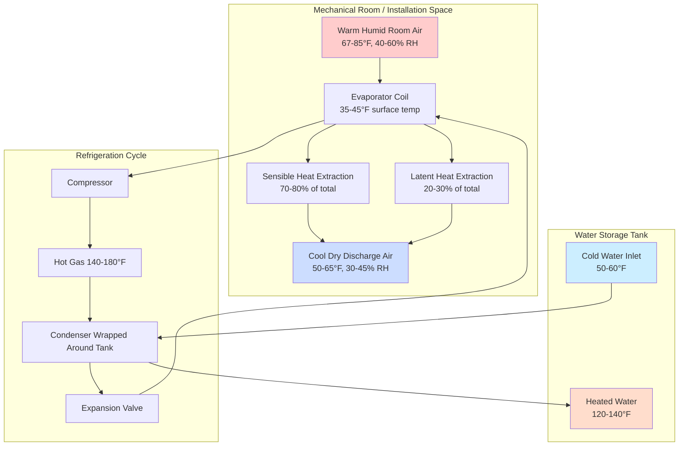

## Operating Principles

Ambient air source heat pump water heaters extract thermal energy from the surrounding indoor air to heat domestic hot water. The evaporator coil absorbs heat from room air, producing cool, dehumidified discharge air as a byproduct. This operational characteristic creates a space cooling effect of 1,200 to 3,600 BTU/hr depending on unit capacity and ambient conditions.

The thermodynamic cycle operates identically to refrigeration systems, with the condenser rejecting heat to the water storage tank. The relationship between coefficient of performance and ambient temperature follows the Carnot efficiency principles, with practical COP values ranging from 1.8 to 4.2 depending on operating conditions.

## Performance vs Ambient Temperature

COP deteriorates as ambient temperature decreases due to reduced refrigerant pressure differential and decreased heat transfer effectiveness at the evaporator. The relationship approximates:

$$\text{COP}_{\text{actual}} = \text{COP}_{\text{rated}} \times \left(1 - k \cdot \Delta T_{\text{ambient}}\right)$$

Where:
- $k$ = temperature correction factor (typically 0.012 to 0.018 per °F)
- $\Delta T_{\text{ambient}}$ = deviation from rated temperature (67°F)
- $\text{COP}_{\text{rated}}$ = rated coefficient of performance at standard conditions

The heating capacity also decreases with ambient temperature:

$$Q_{\text{heating}} = Q_{\text{rated}} \times \left(\frac{T_{\text{ambient}} - T_{\text{evap}}}{T_{\text{rated}} - T_{\text{evap}}}\right)^{n}$$

Where $n$ typically ranges from 1.2 to 1.5 for air source systems, and $T_{\text{evap}}$ represents the evaporator operating temperature (approximately 20-30°F below ambient).

### Performance Comparison Table

| Ambient Temperature (°F) | COP | Heating Capacity (%) | Recovery Time Multiplier | Space Cooling Effect (BTU/hr) |
|-------------------------|-----|---------------------|-------------------------|-------------------------------|
| 40 | 1.8-2.1 | 65-70 | 1.45-1.55 | 900-1,400 |
| 50 | 2.2-2.6 | 75-82 | 1.25-1.35 | 1,100-1,800 |
| 60 | 2.8-3.3 | 88-95 | 1.08-1.15 | 1,400-2,400 |
| 67 (rated) | 3.2-3.8 | 100 | 1.00 | 1,600-2,800 |
| 75 | 3.5-4.0 | 105-108 | 0.93-0.96 | 1,900-3,200 |
| 85 | 3.8-4.2 | 108-112 | 0.89-0.93 | 2,200-3,600 |

## Heat Extraction Process

## Space Conditioning Effects

The cooling and dehumidification produced by ambient air source HPWHs creates beneficial or detrimental effects depending on installation location and climate:

**Beneficial Applications:**
- Mechanical rooms in cooling-dominated climates reduce sensible cooling load by 1,200-3,600 BTU/hr
- Basement installations reduce cooling season humidity by removing 1.5-3.5 pints/hr of moisture
- Locations with internal heat gains (adjacent to refrigeration equipment, laundry rooms) benefit from heat removal

**Detrimental Impacts:**
- Heating-dominated climates experience increased space heating energy by extracting heat from conditioned spaces
- Cold ambient temperatures below 50°F reduce COP below 2.5, potentially making resistance heating more cost-effective
- Excessive cooling of small mechanical rooms can cause discomfort or freeze protection issues

## Minimum Volume Requirements

DOE standards and manufacturer specifications establish minimum room volume requirements to prevent excessive temperature depression and maintain adequate COP. The room must provide sufficient thermal mass and air volume for continuous operation.

Minimum volume calculation:

$$V_{\text{min}} = \frac{Q_{\text{cooling}} \times t_{\text{cycle}}}{\rho \times c_p \times \Delta T_{\text{allowable}}}$$

Where:
- $V_{\text{min}}$ = minimum room volume (ft³)
- $Q_{\text{cooling}}$ = cooling effect (BTU/hr)
- $t_{\text{cycle}}$ = operating cycle duration (hr)
- $\rho$ = air density (0.075 lb/ft³ at standard conditions)
- $c_p$ = specific heat of air (0.24 BTU/lb·°F)
- $\Delta T_{\text{allowable}}$ = acceptable temperature depression (typically 5-8°F)

Typical minimum volumes range from 700 to 1,000 ft³ for residential units. Rooms smaller than minimum require ventilation air from adjacent conditioned spaces or outdoors.

## Ventilation Requirements

When installed in confined spaces below minimum volume, mechanical or passive ventilation must supply makeup air. Required airflow:

$$\dot{V}_{\text{vent}} = \frac{Q_{\text{cooling}}}{60 \times \rho \times c_p \times \Delta T_{\text{max}}}$$

Typical ventilation rates range from 100 to 250 CFM for residential HPWHs when the installation space cannot accommodate the full 700-1,000 CFM unit airflow in recirculation mode.

Ventilation strategies include:
- Transfer grilles to adjacent conditioned spaces (minimum 100-150 in² free area)
- Ducted outdoor air intake with dampered control
- Louvered door or wall penetrations with backdraft dampers
- Mechanical exhaust with makeup air path

## Acoustic Considerations

Compressor and fan operation generates 45 to 55 dBA at 3 feet, comparable to a refrigerator but noticeable in quiet residential environments. Installation in mechanical rooms, basements, or garages isolated from occupied spaces minimizes noise transmission.

Sound attenuation strategies:
- Vibration isolation pads beneath unit (reduce structure-borne transmission)
- Acoustic treatment of mechanical room surfaces
- Flexible duct connections if ducted configuration used
- Avoidance of installation directly below bedrooms or quiet spaces

## DOE Standards and Efficiency Requirements

The Department of Energy establishes minimum Uniform Energy Factor (UEF) requirements for heat pump water heaters under 10 CFR 430. Current standards effective as of April 2024 require:

| Capacity (gallons) | Minimum UEF |
|-------------------|-------------|
| 50 | 3.30 |
| 55 | 3.35 |
| 65 | 3.45 |
| 80 | 3.55 |

UEF testing occurs at standardized conditions: 67.5°F ambient, incoming water at 58°F, outlet temperature set to 125°F. Field performance varies based on actual ambient temperature, inlet water temperature, and usage patterns.

## Installation Requirements

Proper installation ensures rated performance and longevity:

1. **Clearances:** Maintain manufacturer-specified clearances for airflow (typically 6-12 inches on air intake sides, 24 inches for service access)

2. **Condensate Drain:** Provide trapped drain line for 1.5-3.5 pints/hr condensate removal, pitched minimum 1/4 inch per foot

3. **Electrical:** Dedicated 30A, 240V circuit for typical residential units (verify actual requirements)

4. **Tempering Valve:** Install ASSE 1017 thermostatic mixing valve when outlet temperature exceeds 120°F to prevent scalding

5. **Water Connections:** Use dielectric unions between dissimilar metals, install thermal expansion tank if required by code

6. **Ambient Conditions:** Verify installation location maintains 40-120°F operational range year-round

## Operational Limitations

Ambient air source HPWHs experience reduced performance or operational shutdown under certain conditions:

- Ambient temperature below 40°F triggers defrost cycles or switches to resistance heating
- Ambient temperature above 120°F may cause high-pressure cutout
- Insufficient airflow due to blocked filters or inadequate room volume reduces capacity by 15-30%
- Frequent short cycling in oversized applications degrades efficiency and component life

Resistance heating elements provide backup heating when heat pump operation cannot meet demand or ambient conditions fall outside acceptable range. This hybrid operation maintains hot water availability but reduces overall system efficiency to COP of 1.0 during resistance heating periods.
