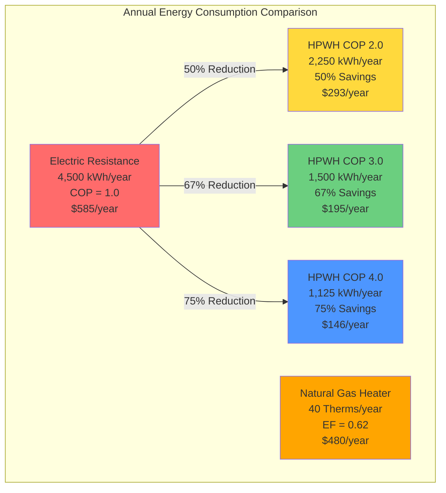

## Coefficient of Performance Range

Heat pump water heaters (HPWHs) operate within a coefficient of performance (COP) range of 2.0 to 4.0, representing 200-400% efficiency compared to electric resistance heating. This performance range depends on ambient temperature, water temperature setpoint, compressor technology, and heat exchanger design.

The COP quantifies the ratio of heat delivered to electrical energy consumed:

$$\text{COP} = \frac{Q_{\text{delivered}}}{W_{\text{input}}} = \frac{\dot{m} c_p (T_{\text{out}} - T_{\text{in}})}{P_{\text{compressor}} + P_{\text{fans}}}$$

Where:
- $Q_{\text{delivered}}$ = heat transferred to water (Btu/hr or kW)
- $W_{\text{input}}$ = total electrical input (kW)
- $\dot{m}$ = water mass flow rate
- $c_p$ = specific heat of water
- $T_{\text{out}}, T_{\text{in}}$ = outlet and inlet water temperatures

## Carnot Efficiency Limits

The theoretical maximum COP is bounded by Carnot cycle efficiency:

$$\text{COP}_{\text{Carnot}} = \frac{T_{\text{hot}}}{T_{\text{hot}} - T_{\text{cold}}}$$

For a typical HPWH scenario with 135°F (330 K) hot water and 70°F (294 K) ambient air:

$$\text{COP}_{\text{Carnot}} = \frac{330}{330 - 294} = \frac{330}{36} = 9.17$$

Real-world HPWHs achieve 25-45% of Carnot efficiency due to:
- Compressor inefficiencies (mechanical losses, motor losses)
- Heat exchanger temperature differences (approach and pinch point)
- Refrigerant pressure drops
- Defrost cycles in cold climates
- Control system power consumption

## COP Performance Ranges

| COP Range | Performance Category | Operating Conditions | Annual Energy Cost* |
|-----------|---------------------|----------------------|---------------------|
| 2.0-2.3 | Minimum Requirement | 50°F ambient, 140°F water | $165-$190 |
| 2.3-2.8 | Standard Performance | 67.5°F ambient, 135°F water | $130-$165 |
| 2.8-3.5 | Typical Performance | 70°F ambient, 120°F water | $105-$130 |
| 3.5-4.0 | High Efficiency | 75°F ambient, 120°F water | $90-$105 |
| 4.0+ | Premium Models | Optimal conditions, variable speed | $75-$90 |

*Based on 12,000 kWh/year baseline electric resistance heating at $0.13/kWh

## Unified Energy Factor (UEF) Correlation

The DOE transitioned from Energy Factor (EF) to Unified Energy Factor (UEF) in 2017 to provide standardized testing. UEF relates to COP through:

$$\text{UEF} = \frac{\text{COP} \times 3.412 \text{ Btu/Wh}}{3.412 \text{ Btu/Wh} + \text{Standby Loss}}$$

For well-insulated HPWHs with minimal standby loss:

$$\text{UEF} \approx \text{COP} \times 0.90 \text{ to } 0.95$$

This conversion accounts for:
- Tank standby heat loss
- Cycling losses at six predefined draw patterns
- First-hour rating impact
- Recovery efficiency

The DOE mandates minimum UEF values by tank size:
- 55 gallons: UEF ≥ 2.0 (COP ≈ 2.2)
- 80 gallons: UEF ≥ 2.2 (COP ≈ 2.4)

## Performance Degradation Factors

**Temperature Lift Impact**: COP decreases as the temperature difference between source and sink increases. For every 10°F increase in water setpoint temperature, COP typically drops 5-8%.

$$\text{COP}_{\text{adjusted}} = \text{COP}_{\text{rated}} \times \left(1 - 0.007 \Delta T_{\text{added}}\right)$$

**Ambient Temperature Sensitivity**: Performance degrades in cold ambient conditions. Below 50°F, compressor efficiency drops and defrost cycles increase energy consumption by 10-20%.

**Part-Load Performance**: Cycling losses reduce effective COP. Single-speed compressors experience 5-10% efficiency penalties at part-load compared to variable-speed models that modulate capacity.

## Efficiency Comparison

## Energy Savings Analysis

The energy cost savings compared to electric resistance heating:

$$\text{Annual Savings} = \frac{Q_{\text{annual}}}{3412} \left(\frac{1}{\text{COP}_{\text{resistance}}} - \frac{1}{\text{COP}_{\text{HPWH}}}\right) \times \text{Electric Rate}$$

For a typical household (12,000 kWh/year baseline):
- COP 2.0: 50% reduction = $292/year savings
- COP 3.0: 67% reduction = $390/year savings
- COP 4.0: 75% reduction = $439/year savings

Payback period ranges from 3-7 years depending on:
- Local electricity rates
- Climate zone (affects COP)
- Installation costs ($1,200-$2,500)
- Utility rebates ($300-$750 typical)

## Maximizing Real-World COP

**Installation Considerations**:
- Place unit in conditioned space (68-75°F) for optimal performance
- Provide minimum 700-1,000 cubic feet of air volume
- Install in mechanical room or basement where cooling byproduct is beneficial
- Avoid unconditioned garages in cold climates

**Operating Strategies**:
- Lower water setpoint to 120°F when possible (increases COP by 10-15%)
- Use vacation mode during extended absences
- Enable demand response programs during peak pricing
- Schedule heavy hot water use during warmer parts of day

**Maintenance Requirements**:
- Clean air filter every 3 months
- Check condensate drain annually
- Verify refrigerant charge every 2-3 years
- Inspect anode rod per manufacturer schedule

The COP 2-4 range represents the practical performance window for current HPWH technology, balancing thermodynamic constraints with economic viability. Variable-speed compressors and improved heat exchangers continue pushing toward the upper end of this range, with premium models exceeding COP 4.0 under optimal conditions.
