## Overview

Ducted configurations extend heat pump water heater (HPWH) capabilities beyond unducted installations by enabling strategic air sourcing and discharge. Ducting allows extraction of outdoor air in cold climates, utilization of conditioned space air without local cooling effects, exhaust air heat recovery, and noise isolation from occupied spaces.

The fundamental principle: HPWHs extract heat from source air at approximately 400-500 CFM, cooling the air by 15-25°F. Ducting manages where this cooling occurs and where discharge air goes.

## Ducted Configuration Types

### Exhaust-Only Ducting

Exhaust ducting removes cooled discharge air from the HPWH location while the unit draws intake air from the surrounding space. This configuration prevents local cooling accumulation in mechanical rooms or small spaces.

**Applications:**
- Mechanical rooms with adequate volume for intake air
- Basement installations where cooling effect is beneficial during cooling season
- Locations where noise control is secondary concern

**Design considerations:**
- Intake space must provide minimum 700-1000 ft³ volume
- Adequate makeup air path required (minimum 1 ft² free area per 100 CFM)
- Exhaust duct terminal should not create backdraft conditions

### Supply-Only Ducting

Supply ducting brings source air to the HPWH from a remote location while discharge air exhausts into the unit's immediate space.

**Applications:**
- Utilizing outdoor air as heat source
- Extracting air from specific zones (attics, garages)
- Warmer climates where discharge cooling is beneficial to occupied space

### Supply and Exhaust Ducting (Fully Ducted)

Both intake and discharge are ducted, providing maximum flexibility in air sourcing and discharge management.

**Applications:**
- Outdoor air sourcing with remote discharge
- Exhaust air heat recovery from ventilation systems
- Complete isolation from equipment location
- Cold climate installations requiring outdoor air tempering strategies

## Duct Sizing and Static Pressure

### Airflow Requirements

Standard residential HPWHs operate at:

$$Q = 400 \text{ to } 500 \, \text{CFM}$$

where $Q$ is volumetric airflow rate.

### Duct Sizing Calculation

Duct diameter for circular ducts at maximum velocity:

$$D = \sqrt{\frac{4Q}{\pi V}}$$

where:
- $D$ = duct diameter (ft)
- $Q$ = airflow rate (ft³/min)
- $V$ = air velocity (ft/min)

For HPWH applications, maintain velocity below 900 FPM to minimize pressure drop. At 450 CFM:

$$D = \sqrt{\frac{4 \times 450}{\pi \times 900}} = \sqrt{\frac{1800}{2827}} = 0.8 \, \text{ft} = 9.6 \, \text{inches}$$

Use 10-inch diameter or 8×10-inch rectangular duct minimum.

### Static Pressure Limitations

HPWHs have limited internal fan capacity. Maximum external static pressure typically ranges from 0.1 to 0.5 inches w.c. depending on manufacturer.

Total system pressure drop:

$$\Delta P_{total} = \Delta P_{duct} + \Delta P_{fittings} + \Delta P_{terminal}$$

#### Duct Friction Loss

For smooth sheet metal ducts:

$$\Delta P_{duct} = \frac{f \cdot L \cdot V^2}{2 \cdot D \cdot 4005}$$

where:
- $f$ = friction factor (dimensionless, typically 0.02-0.03 for metal ducts)
- $L$ = duct length (ft)
- $V$ = velocity (FPM)
- $D$ = duct diameter (ft)
- 4005 = conversion constant for units consistency

#### Fitting Losses

Each 90° elbow adds approximately 0.02-0.05 inches w.c. at 450 CFM in 10-inch duct.

**Design guideline:** Limit total equivalent length to 50-75 feet with maximum 3-4 elbows to maintain pressure drop below manufacturer limits.

## Outdoor Air Configurations

### Benefits

Outdoor air sourcing provides:
- Elimination of conditioned space cooling load
- Higher operating efficiency in moderate climates (50-85°F outdoor temperature)
- Humidity control improvement in cooling-dominated climates
- Reduced equipment runtime due to higher heat source availability

### Temperature Operating Range

Most HPWHs operate efficiently between:

$$T_{ambient} = 45°F \text{ to } 95°F$$

Below 45°F, defrost cycles increase and COP degrades significantly. Above 95°F, refrigerant discharge temperatures may limit operation.

### Cold Climate Strategies

**Outdoor air tempering:**
1. Mixed air approach: Blend outdoor air with indoor air using motorized dampers
2. Seasonal switchover: Manual or automated dampers selecting indoor air when $T_{outdoor} < 45°F$
3. Exhaust air heat recovery: Use building exhaust air (65-70°F) as primary source

**Temperature-based damper control:**

Proportion outdoor air mixing when:

$$T_{mixed} = X \cdot T_{outdoor} + (1-X) \cdot T_{indoor} \geq 50°F$$

where $X$ is the fraction of outdoor air (0 to 1).

## Ducted Configuration Comparison

| Configuration | Outdoor Air Benefits | Conditioned Space Impact | Complexity | Cold Climate Suitability | Typical Cost Premium |
|---------------|---------------------|--------------------------|------------|--------------------------|---------------------|
| **Unducted** | None | Direct cooling/dehumidification | Lowest | Poor (space overcooling) | Baseline |
| **Exhaust Only** | None | Cooling effect at unit | Low | Poor | +$150-300 |
| **Supply Only (Outdoor)** | Maximum | None | Medium | Good (with tempering) | +$400-700 |
| **Supply Only (Indoor)** | None | Remote cooling delivery | Medium | Fair | +$300-500 |
| **Full Duct (Outdoor)** | Maximum | None | High | Excellent (with controls) | +$600-1200 |
| **Full Duct (Exhaust Air)** | Moderate | Slight negative pressure | High | Excellent | +$800-1500 |

## Installation Best Practices

### Duct Material and Insulation

**Intake ducts:**
- Sheet metal preferred for outdoor air applications
- R-6 minimum insulation in unconditioned spaces to prevent condensation
- Vapor barrier on cold side of insulation

**Exhaust ducts:**
- Sheet metal or insulated flex duct acceptable
- Insulation required only if routed through conditioned space (prevent heat gain)
- Pitch toward unit drain to handle condensate formation in cold weather outdoor air applications

### Air Terminal Requirements

**Outdoor air intakes:**
- Minimum 12 inches above grade or anticipated snow depth
- Rain hood or weather cap required
- 1/2-inch mesh screen to exclude debris and pests
- Locate minimum 10 feet from exhaust discharge
- Face away from prevailing wind direction when possible

**Exhaust discharge:**
- Terminate minimum 3 feet from property lines, operable windows, air intakes
- Avoid discharge toward building surfaces (ice formation risk)
- Provide drain path for condensate in cold weather

### Manufacturer-Specific Requirements

Consult manufacturer installation manuals for:
- Maximum allowable static pressure (typically 0.1-0.5 inches w.c.)
- Maximum duct length and equivalent length restrictions
- Approved duct connection collar sizes
- Required clearances around unit for service access

**Example specifications from major manufacturers:**

| Manufacturer | Max Static Pressure | Max Duct Length | CFM Range |
|--------------|-------------------|-----------------|-----------|
| A.O. Smith | 0.5 in w.c. | 75 ft equiv. | 440-460 CFM |
| Rheem | 0.4 in w.c. | 50 ft equiv. | 400-450 CFM |
| Stiebel Eltron | 0.3 in w.c. | 100 ft equiv. | 500-530 CFM |

*(Values approximate; verify with current product literature)*

## Ducted HPWH Installation Configurations

```mermaid
graph TB
    subgraph "Configuration 1: Exhaust Only"
        A1[HPWH Unit<br/>in Mechanical Room] -->|Exhaust Duct| A2[Discharge to<br/>Outdoors/Remote Space]
        A3[Room Air<br/>Intake] -.->|Free Air| A1
    end

    subgraph "Configuration 2: Outdoor Air Supply"
        B3[Outdoor Air<br/>Intake Duct] -->|Supply Duct| B1[HPWH Unit]
        B1 -->|Local Discharge| B2[Equipment Room<br/>or Adjacent Space]
    end

    subgraph "Configuration 3: Fully Ducted - Outdoor Air"
        C3[Outdoor Air<br/>with Hood] -->|Insulated<br/>Supply Duct| C1[HPWH Unit]
        C1 -->|Insulated<br/>Exhaust Duct| C2[Outdoor Discharge<br/>or Remote Space]
    end

    subgraph "Configuration 4: Exhaust Air Heat Recovery"
        D3[Building Exhaust<br/>Air Stream] -->|Tapped Supply| D1[HPWH Unit]
        D1 -->|Cooled Air Return| D2[Main Exhaust<br/>or Outdoors]
    end

    style A1 fill:#e1f5ff
    style B1 fill:#e1f5ff
    style C1 fill:#e1f5ff
    style D1 fill:#e1f5ff
```

## Energy and Efficiency Considerations

### COP Impact of Air Source Temperature

HPWH coefficient of performance varies with source air temperature:

$$COP_{adjusted} = COP_{rated} + k(T_{source} - T_{rated})$$

where $k$ ≈ 0.02-0.03 per °F for most units.

Example: A unit rated COP 3.5 at 70°F operating on 85°F outdoor air:

$$COP_{85°F} = 3.5 + 0.025(85 - 70) = 3.5 + 0.375 = 3.875$$

Conversely, at 50°F source:

$$COP_{50°F} = 3.5 + 0.025(50 - 70) = 3.5 - 0.5 = 3.0$$

### Annual Energy Calculation Impact

For cooling-dominated climates using outdoor air during cooling season:

- Elimination of cooling load to condition HPWH source air
- Typical cooling season benefit: 200-400 kWh/year for family of 4
- Combined DHW and space cooling energy reduction: 15-25%

## Commissioning and Performance Verification

**Startup checklist:**
1. Measure static pressure at unit with manometer (should be ≤ manufacturer limit)
2. Verify airflow with anemometer at terminals (compare to rated CFM ±10%)
3. Measure supply and discharge air temperature differential (expect 15-25°F ΔT)
4. Confirm all duct connections sealed with mastic (not tape)
5. Verify condensate drain operation
6. Check outdoor damper operation through full temperature range (if automated)

**Performance indicators:**
- Supply-discharge ΔT in expected range confirms adequate airflow
- Static pressure within limits ensures fan not overloaded
- No frost formation on evaporator coil during normal operation
- Condensate production during humid weather confirms dehumidification function

## Summary

Ducted configurations multiply HPWH application flexibility but require careful attention to duct sizing, static pressure limits, and air source selection. Outdoor air sourcing provides significant energy benefits in appropriate climates with proper tempering strategies for cold weather operation. Full ducting with exhaust air heat recovery represents the optimal configuration for cold climates, while supply-only outdoor air ducting suits moderate and warm climates effectively.

Successful ducted installations demand adherence to manufacturer static pressure limits, proper duct insulation and sealing, appropriate air terminal selection, and commissioning verification of airflow and temperature performance.
