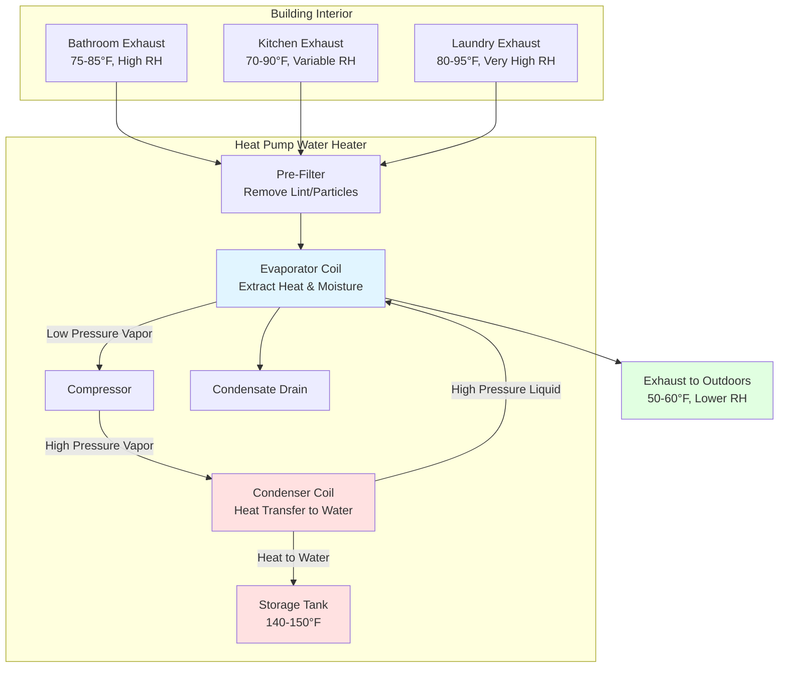

Exhaust air recovery heat pump water heaters extract thermal energy from building exhaust streams before venting them outdoors. This configuration provides consistent heat source availability while simultaneously handling required ventilation loads. The technology effectively converts a building's ventilation penalty into a water heating asset.

## Operating Principle

The HPWH evaporator coil intercepts building exhaust air that would otherwise be directly vented. Heat extracted from the 70-80°F exhaust stream pre-cools and partially dehumidifies this air before discharge. The recovered thermal energy drives the refrigeration cycle to heat domestic hot water.

Unlike ambient-sourced HPWHs that draw from conditioned space, exhaust-sourced units process air already designated for removal. This eliminates the space conditioning penalty inherent in other configurations.

## Heat Recovery Potential

The sensible heat available from an exhaust stream is:

$$Q_{\text{sensible}} = \dot{m} \cdot c_p \cdot (T_{\text{exhaust}} - T_{\text{evap}})$$

Where:
- $Q_{\text{sensible}}$ = sensible heat recovery rate (Btu/hr)
- $\dot{m}$ = mass flow rate of exhaust air (lb/hr)
- $c_p$ = specific heat of air (0.24 Btu/lb-°F)
- $T_{\text{exhaust}}$ = exhaust air temperature entering evaporator (°F)
- $T_{\text{evap}}$ = evaporator coil surface temperature (°F)

For humid exhaust streams (bathrooms, kitchens), latent heat recovery from condensation provides additional capacity:

$$Q_{\text{latent}} = \dot{m} \cdot (W_{\text{in}} - W_{\text{out}}) \cdot h_{fg}$$

Where:
- $Q_{\text{latent}}$ = latent heat recovery rate (Btu/hr)
- $W_{\text{in}}$ = inlet humidity ratio (lb water/lb dry air)
- $W_{\text{out}}$ = outlet humidity ratio (lb water/lb dry air)
- $h_{fg}$ = latent heat of vaporization (~1,060 Btu/lb at typical conditions)

Total heat recovery:

$$Q_{\text{total}} = Q_{\text{sensible}} + Q_{\text{latent}}$$

The coefficient of performance for the complete system:

$$\text{COP}_{\text{system}} = \frac{Q_{\text{DHW}}}{W_{\text{compressor}} + W_{\text{fan}}}$$

Where $Q_{\text{DHW}}$ is the heat delivered to domestic hot water and $W$ terms represent electrical input power.

## Exhaust Air Source Comparison

| Exhaust Source | Temperature Range | Moisture Content | Availability Pattern | Contaminant Concerns | Duct Distance |
|----------------|-------------------|------------------|----------------------|----------------------|---------------|
| Bathroom exhaust | 75-85°F | High (50-80% RH) | Intermittent (shower/bath cycles) | Minimal, lint from towels | Short, typically adjacent |
| Kitchen exhaust | 70-90°F | Moderate-High (variable) | Multiple daily periods | Grease, cooking particles require filtration | Moderate, central location |
| Laundry exhaust | 80-95°F | Very High (near saturation) | Intermittent (wash/dry cycles) | Significant lint requires pre-filtration | Variable, often remote |
| General ventilation | 70-78°F | Moderate (indoor RH) | Continuous or scheduled | Minimal, general dust | Long, from central return |
| Commercial spaces | 72-76°F | Low-Moderate | Continuous during occupancy | Depends on space type | Highly variable |

## System Configuration

## Condensation Management

Evaporator coil temperatures typically range from 40-55°F, well below the dew point of most building exhaust streams. This ensures consistent condensation.

Condensate production rate:

$$\dot{m}_{\text{condensate}} = \dot{V} \cdot \rho_{\text{air}} \cdot (W_{\text{in}} - W_{\text{out}}) \cdot 60$$

Where:
- $\dot{m}_{\text{condensate}}$ = condensate flow rate (lb/hr)
- $\dot{V}$ = volumetric exhaust flow rate (CFM)
- $\rho_{\text{air}}$ = density of air (~0.075 lb/ft³ at standard conditions)
- Factor of 60 converts CFM to ft³/hr

Critical condensate management requirements:

- **Drain pan design**: Minimum 1/4 inch per foot slope toward drain connection
- **Trap depth**: P-trap with adequate seal depth to overcome negative pressure (typically 2-3 inches minimum)
- **Drain line sizing**: 3/4 inch minimum diameter, avoid horizontal runs exceeding 8 feet without intermediate support
- **Freeze protection**: Insulate drain lines in unconditioned spaces, maintain positive slope throughout
- **Cleanout access**: Install accessible cleanouts at direction changes exceeding 45 degrees

## Duct Sizing and Design

Exhaust duct sizing follows standard friction loss principles but must account for the pressure drop through the evaporator coil assembly.

Total system pressure drop:

$$\Delta P_{\text{total}} = \Delta P_{\text{duct}} + \Delta P_{\text{filter}} + \Delta P_{\text{coil}} + \Delta P_{\text{fittings}}$$

Typical design parameters:

- **Duct velocity**: 600-900 FPM in residential applications, up to 1,200 FPM in commercial
- **Friction loss target**: 0.08-0.10 inches w.c. per 100 feet of duct
- **Evaporator coil pressure drop**: 0.15-0.40 inches w.c. (verify with manufacturer data at operating CFM)
- **Filter pressure drop**: 0.05-0.15 inches w.c. (clean), replace when exceeding 0.30 inches w.c.

For a required exhaust flow rate of $\dot{V}$ CFM through a round duct:

$$D = \sqrt{\frac{4 \cdot \dot{V}}{V_{\text{duct}} \cdot 60 \cdot \pi}}$$

Where:
- $D$ = duct diameter (feet)
- $V_{\text{duct}}$ = target duct velocity (FPM)

Convert to inches: $D_{\text{inches}} = D \cdot 12$

**Critical duct design considerations**:

- Use rigid metal ducting (galvanized steel or aluminum) for the exhaust stream to evaporator connection
- Minimize duct length and fittings between exhaust source and HPWH inlet
- Insulate exhaust ductwork in unconditioned spaces to prevent condensation on duct exterior
- Install balancing dampers at multiple exhaust source connections to proportion flow
- Provide access doors for filter replacement without disconnecting ductwork
- Maintain clearances per manufacturer specifications (typically 6-12 inches minimum at air inlet)

## Application Considerations

**Consistent heat source availability**: Exhaust-sourced HPWHs perform optimally when exhaust air availability aligns with hot water demand patterns. Continuous mechanical ventilation systems provide the most consistent operation.

**Ventilation integration**: The HPWH becomes an integral component of the building's mechanical ventilation system. Fan failure or unit shutdown must trigger alternative ventilation paths to maintain code-required air changes.

**Commercial applications**: High-volume continuous exhaust streams (restaurants, laundries, fitness facilities) provide excellent heat sources. Size HPWH capacity to match available exhaust flow, not total hot water load, supplementing with conventional heating as needed.

**Energy recovery hierarchy**: Compare exhaust air HPWH performance against alternative energy recovery technologies (heat recovery ventilators, dedicated outdoor air systems with energy recovery) for specific applications.

**Code compliance**: Verify that the HPWH exhaust discharge meets minimum separation distances from building openings, property lines, and air intakes per IMC Section 501.

## Performance Optimization

To maximize heat recovery efficiency:

1. **Prioritize high-temperature exhaust sources**: Laundry and kitchen exhausts provide greater temperature differentials
2. **Maximize exhaust air residence time**: Size evaporator coil for adequate contact area at design flow rates
3. **Control evaporator temperature**: Lower evaporator temperatures increase heat extraction but reduce compressor efficiency; optimize for total system COP
4. **Monitor filter pressure drop**: Maintain clean filters to ensure design airflow rates
5. **Balance multiple exhaust sources**: Use dampers to draw from the warmest available exhaust stream preferentially

The exhaust air recovery configuration transforms a required building system (mechanical ventilation) into an energy asset while providing consistent, predictable heat pump water heater performance independent of ambient conditions.

---

**Related Topics**: [Heat Pump Water Heater Fundamentals](../../), [Ducted Configurations](../ducted-configurations/), Energy Recovery Ventilation, [Commercial Service Water Heating](../../../commercial-applications/)
