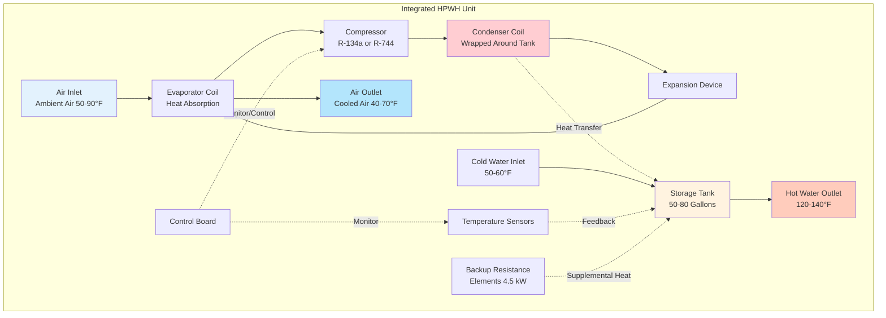

Integrated heat pump water heaters combine the vapor compression heat pump module and water storage tank into a single factory-assembled appliance. This configuration represents the dominant architecture in residential and light commercial applications, accounting for approximately 85% of the North American HPWH market. The integrated design prioritizes installation simplicity, reduced refrigerant handling requirements, and predictable performance characteristics through pre-engineered component matching.

## System Architecture and Component Integration

The integrated HPWH locates all vapor compression cycle components—evaporator, compressor, condenser, expansion valve, and controls—atop or alongside the insulated storage tank within a unified cabinet.

### Spatial Configuration and Footprint

The vertical stacking of heat pump components atop the storage tank yields a compact footprint but increases total height significantly compared to conventional electric resistance tanks.

**Dimensional comparison for 50-gallon capacity:**

| Unit Type | Diameter | Height | Floor Area | Clearance Required |
|-----------|----------|--------|------------|-------------------|
| Resistance Tank | 20–22 in | 58–62 in | 2.2–2.6 ft² | 6 in all sides |
| Integrated HPWH | 23–26 in | 72–82 in | 2.9–3.7 ft² | 12 in sides, 48 in top |

The increased height necessitates verification of ceiling clearance and door opening dimensions during retrofit installations. The minimum clearance envelope can be calculated as:

$$V_{clearance} = \pi r^2 (H + H_{top}) + 2\pi r w_{side} H$$

where $r$ is the unit radius, $H$ is the unit height, $H_{top}$ is the required top clearance (typically 48 in for service access), and $w_{side}$ is the lateral clearance (12 in minimum).

For a typical 24-inch diameter unit with 76-inch height:

$$V_{clearance} = \pi (1)^2 (76 + 48) + 2\pi (1)(1)(76) = 389 + 477 = 866 \text{ ft}^3$$

This clearance volume requirement influences mechanical room sizing and placement options in existing buildings.

## Installation Advantages of Integrated Configuration

### Single-Appliance Installation Process

The integrated design eliminates field refrigerant connections, reducing installation to mechanical, electrical, and plumbing connections only. Installation sequence:

1. **Position and level unit** (weight: 150–200 lb empty, 550–750 lb filled)
2. **Connect cold water supply** with required pressure relief valve and expansion tank
3. **Connect hot water outlet** with required mixing valve if setpoint >140°F
4. **Wire electrical supply** (typically 30A, 240V circuit)
5. **Configure condensate drain** (3/4 in connection, 1–2 gal/day production)
6. **Set up air pathways** (ducted or non-ducted configuration)

No refrigerant certification is required for installation, expanding the contractor base capable of performing installations compared to split systems requiring EPA 608 certification.

### Factory Testing and Quality Assurance

Integrated units undergo complete factory pressure testing, leak testing, refrigerant charging, and performance verification before shipping. This eliminates field commissioning variables that affect split system performance:

- **Refrigerant charge accuracy**: Factory charge optimized for condenser/evaporator pairing
- **Leak-free assembly**: Pressure tested to 450 psig minimum
- **Performance validation**: COP verified at standard rating conditions before shipment

Field failures related to refrigerant undercharge or overcharge—common in split systems—are eliminated entirely.

## Performance Characteristics and Efficiency

Integrated HPWHs achieve Uniform Energy Factor (UEF) ratings of 2.0–4.0 under the DOE test procedure, representing 2–4 times the efficiency of resistance heating.

**COP variation with ambient air temperature:**

$$COP(T_a) = COP_{rated} \times \left(1 - k \cdot (T_{rated} - T_a)\right)$$

where $k$ is the temperature coefficient (typically 0.015–0.025 per °F) and $T_{rated}$ is the nominal rating temperature (67.5°F per DOE test standard).

For a unit rated COP = 3.2 at 67.5°F operating at 55°F ambient:

$$COP(55°F) = 3.2 \times \left(1 - 0.02 \times (67.5 - 55)\right) = 3.2 \times 0.75 = 2.4$$

This temperature sensitivity necessitates consideration of installation location temperature profiles throughout the year.

## Major Manufacturer Comparison

| Manufacturer | Model Series | Tank Capacity | UEF | Rated COP | Max Recovery (gal/hr) | Height | Warranty Tank/Compressor | Retail Price* |
|--------------|--------------|---------------|-----|-----------|----------------------|---------|-------------------------|--------------|
| Rheem | ProTerra XE80 | 80 gal | 4.0 | 3.70 | 6.8 | 75.5 in | 10 yr / 10 yr | $1,800–$2,200 |
| A.O. Smith | Voltex 80 | 80 gal | 3.75 | 3.42 | 6.2 | 78.0 in | 10 yr / 6 yr | $1,700–$2,100 |
| Stiebel Eltron | Accelera 300 | 79 gal | 3.51 | 3.30 | 5.9 | 77.4 in | 10 yr / 5 yr | $2,300–$2,800 |
| GE | GeoSpring Pro | 65 gal | 3.40 | 3.15 | 5.5 | 73.5 in | 10 yr / 5 yr | $1,500–$1,900 |
| Bradford White | AeroTherm S80 | 80 gal | 3.42 | 3.20 | 5.8 | 76.8 in | 6 yr / 6 yr | $1,900–$2,300 |

*Prices reflect 2024 market averages before incentives or rebates

All listed models meet ENERGY STAR requirements (UEF ≥ 2.0) and qualify for federal tax credits under the Inflation Reduction Act (up to $2,000 for ENERGY STAR certified units installed 2023–2032).

## Maintenance Access and Serviceability

The integrated configuration simplifies routine maintenance by consolidating all serviceable components in the upper module accessible from above the unit.

**Routine maintenance requirements:**

- **Air filter cleaning/replacement**: Every 3–6 months (washable filters standard on most models)
- **Evaporator coil inspection**: Annually for dust accumulation and airflow restriction
- **Condensate drain verification**: Every 6 months to prevent overflow
- **Anode rod inspection**: Every 2–3 years (same as conventional tank maintenance)
- **Temperature/pressure relief valve test**: Annually per ASME requirements

The compressor, expansion valve, and sealed refrigerant circuit require no routine maintenance. Component replacement—when necessary—typically involves module-level replacement rather than individual component service, simplifying technician skill requirements.

## Air-Side Configuration Options

Integrated units accommodate three primary air handling configurations:

1. **Non-ducted operation**: Direct intake from and exhaust to installation space (requires minimum 1,000 ft³ room volume with adequate ventilation)

2. **Ducted intake**: Remote air source via flexible duct (6–8 in diameter, maximum 10 ft equivalent length to maintain airflow of 200–250 CFM)

3. **Ducted intake and exhaust**: Both intake and discharge ducted to prevent space temperature depression (requires static pressure <0.2 in w.c.)

The pressure drop across ductwork reduces evaporator airflow, degrading COP according to:

$$COP_{ducted} = COP_{free} \times \left(\frac{\dot{V}_{ducted}}{\dot{V}_{rated}}\right)^{0.6}$$

For 20% airflow reduction due to duct resistance:

$$COP_{ducted} = 3.2 \times (0.80)^{0.6} = 3.2 \times 0.87 = 2.78$$

This 13% efficiency penalty emphasizes the importance of minimizing duct length and restrictions.

## Application Guidelines and Suitability

**Ideal applications for integrated HPWHs:**

- **Residential retrofit**: Direct replacement for existing 50–80 gallon electric resistance tanks where height clearance permits
- **New residential construction**: Single-family and townhouse applications with basement or garage mechanical rooms
- **Light commercial**: Small office, retail, restaurant applications with <100 gallons/day hot water demand
- **Moderate climates**: Locations where mechanical room temperature remains 50–90°F year-round

**Less suitable applications:**

- **Limited ceiling height**: Spaces with <8 ft ceiling may not accommodate 75–80 in total unit height
- **High hot water demand**: Commercial applications requiring >80 gallons storage or >10 gal/hr continuous draw
- **Cold environments**: Unheated spaces with winter temperatures <45°F experience significant COP degradation
- **Noise-sensitive locations**: Installation in occupied spaces subject to 45–55 dBA compressor noise

## Acoustic Considerations

The integrated configuration locates the compressor within the occupied or semi-occupied space, requiring acoustic evaluation.

**Typical sound power levels:**

- **Compressor operation**: 50–55 dBA at 3 ft
- **Fan operation**: 45–50 dBA at 3 ft
- **Combined operating sound**: 52–58 dBA at 3 ft

Sound transmission to adjacent spaces follows the inverse square law:

$$L_2 = L_1 - 20 \log_{10}\left(\frac{r_2}{r_1}\right) - \alpha \cdot d$$

where $\alpha$ is the air absorption coefficient (typically 0.5 dB/ft for frequencies of 500–2000 Hz) and $d$ is the distance traveled through air.

At 15 ft through open air from a 55 dBA source:

$$L_{15ft} = 55 - 20 \log_{10}(5) - 0.5 \times 15 = 55 - 14 - 7.5 = 33.5 \text{ dBA}$$

Wall partitions with STC ratings of 50+ effectively isolate HPWH noise from occupied spaces when units are located in dedicated mechanical rooms.

---

**File**: `/Users/evgenygantman/Documents/github/gantmane/hvac/content/specialty-applications-testing/specialty-hvac-applications/service-water-heating-domestic-hot-water/heat-pump-water-heaters/integrated-vs-split/integrated-units/_index.md`
